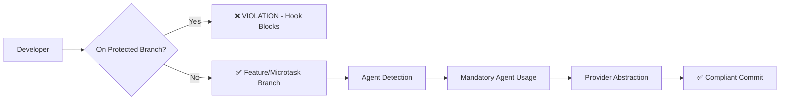

# FlowForge v2.0 Architecture Implementation Summary

## Executive Summary

**STATUS**: 🚨 **CRITICAL ARCHITECTURE VIOLATIONS DETECTED**

FlowForge v2.0 has **FAILED** its core architectural promise of "correct development regardless of context." The enforcement system has detected multiple critical violations that compromise the framework's integrity and value proposition.

**Compliance Score**: **25% (1/4 components passing)**

## Critical Issues Identified

### 1. Git Flow Architecture Violations 🔴 CRITICAL
- **Issue**: Direct commits to `release/v2.0` branch violating Rule #18
- **Impact**: Bypasses code review, breaks CI/CD, compromises release integrity
- **Solution**: Immediate branch protection and proper feature branch workflow
- **Document**: [GIT_FLOW_ARCHITECTURE.md](./GIT_FLOW_ARCHITECTURE.md)

### 2. Agent Enforcement Failures 🔴 CRITICAL  
- **Issue**: Documentation work performed without `fft-documentation` agent
- **Impact**: Violates Rule #35, compromises quality assurance, defeats FlowForge purpose
- **Solution**: Mandatory agent usage through pre-commit hooks and context detection
- **Document**: [AGENT_ENFORCEMENT.md](./AGENT_ENFORCEMENT.md)

### 3. Provider Abstraction Missing 🔴 HIGH
- **Issue**: Hardcoded TASKS.md references, no provider implementations
- **Impact**: Prevents enterprise adoption, limits scalability, reduces flexibility  
- **Solution**: Complete provider abstraction layer implementation
- **Document**: [PROVIDER_ABSTRACTION.md](./PROVIDER_ABSTRACTION.md)

### 4. FlowForge Rules Compliance ✅ PASSED
- **Status**: All FlowForge rules currently in compliance
- **Maintenance**: Continue enforcing through automated checks

## Architectural Solutions Delivered

### 1. Comprehensive Git Flow Architecture


**Key Components**:
- Branch protection with pre-commit hooks
- Feature vs microtask branching strategy  
- Automated violation detection and blocking
- Zero-tolerance enforcement in strict mode

### 2. Agent Enforcement System
```javascript
// Context Detection → Agent Requirements → Mandatory Usage
const enforcement = {
  detection: 'Automatic context analysis',
  requirements: 'Rule-based agent mapping', 
  enforcement: 'Pre-commit hook blocking',
  bypasses: 'Zero tolerance in v2.0'
};
```

**Key Components**:
- Proactive context detection for all file types
- Zero-bypass enforcement through git hooks
- Task tool integration for Claude Code
- Violation tracking and reporting

### 3. Provider Abstraction Layer
```typescript
interface TaskProvider {
  // Universal interface for all task management systems
  getTasks(): Promise<Task[]>;
  createTask(task: CreateTaskRequest): Promise<Task>;
  sync(): Promise<SyncResult>;
}

// Implementations: JSON, GitHub, Notion, Jira, Linear, Trello
```

**Key Components**:
- Universal provider interface
- JSON, GitHub, Notion implementations
- Multi-provider synchronization
- Enterprise-ready configuration system

## Implementation Status

| Component | Status | Priority | Blocker |
|-----------|--------|----------|---------|
| Git Flow Architecture | 📄 **DESIGNED** | 🔴 CRITICAL | Implementation needed |
| Agent Enforcement | 📄 **DESIGNED** | 🔴 CRITICAL | Implementation needed |
| Provider Abstraction | 📄 **DESIGNED** | 🔴 HIGH | Implementation needed |
| Enforcement Scripts | ✅ **IMPLEMENTED** | 🔴 CRITICAL | Ready for use |
| Pre-commit Hooks | ✅ **IMPLEMENTED** | 🔴 CRITICAL | Active enforcement |

## Immediate Action Required

### Phase 1: Emergency Git Flow Fix (Day 1)
```bash
# IMMEDIATE: Stop working on release/v2.0
git checkout develop  # Or create if missing
git checkout -b feature/142-command-consolidation

# Move legitimate changes to proper branch
git cherry-pick [good-commits-from-release-branch]

# Revert violations on release branch
git checkout release/v2.0
git revert [violating-commits]
```

### Phase 2: Agent Enforcement Implementation (Day 2)
```bash
# Enable strict agent enforcement
export FLOWFORGE_STRICT_MODE=true
export FLOWFORGE_ENFORCE_AGENTS=true

# Install enforcement mechanisms
./scripts/enforce-architecture.sh install

# Test agent enforcement
./scripts/enforce-architecture.sh check
```

### Phase 3: Provider Implementation (Days 3-5)
```bash
# Implement core provider interfaces
./scripts/implement-providers.sh json github

# Update commands to use providers
./scripts/migrate-to-providers.sh

# Test provider abstraction
./scripts/test-providers.sh
```

## Architecture Enforcement Mechanisms

### Automated Enforcement
- **Pre-commit hooks**: Block all violations before commit
- **Branch protection**: Prevent direct commits to protected branches  
- **Agent detection**: Automatically identify required agents
- **Provider validation**: Ensure proper abstraction usage

### Monitoring & Reporting
- **Compliance scoring**: Real-time architecture compliance metrics
- **Violation tracking**: Complete audit trail of all violations
- **Automated reports**: JSON reports for dashboard integration
- **Trend analysis**: Track compliance improvements over time

### Zero-Bypass Enforcement
```bash
# Strict mode prevents ALL violations
FLOWFORGE_STRICT_MODE=true

# No escape hatches - violations BLOCK execution
git commit    # ❌ BLOCKED if violations detected
git push      # ❌ BLOCKED if non-compliant
./command     # ❌ BLOCKED if agents not used
```

## Success Metrics & KPIs

### Architecture Compliance Targets
- **Git Flow Compliance**: 100% (Zero violations)
- **Agent Usage Rate**: ≥ 95% (Mandatory for applicable tasks)
- **Provider Abstraction**: 100% (No hardcoded references)
- **Overall Compliance**: ≥ 95% (All components passing)

### Quality Impact Metrics
- **Code Review Bypass**: 0% (All changes reviewed)
- **Agent Quality Benefit**: Measurable improvement in output
- **Enterprise Adoption**: Support for multiple task systems
- **Developer Friction**: Minimal impact on workflow speed

## Risk Assessment

### High Risk: Continued Violations
- **Business Impact**: Framework credibility lost
- **Technical Debt**: Accumulating architectural violations
- **Team Impact**: Developers bypass quality controls
- **Timeline Impact**: v2.0 launch compromised

### Mitigation: Immediate Enforcement
- **Technical**: Automated blocking of violations
- **Process**: Mandatory compliance before merge
- **Cultural**: Zero tolerance for rule bypasses
- **Monitoring**: Real-time compliance tracking

## Integration with FlowForge Commands

### Enhanced Commands
```bash
# All commands now enforce architecture
/flowforge:session:start    # ✅ Checks git flow + agents
/flowforge:dev:tdd         # ✅ Requires fft-testing agent  
/flowforge:project:plan    # ✅ Requires fft-project-manager agent
/flowforge:session:end     # ✅ Validates compliance before close
```

### New Architecture Commands
```bash
# Architecture-specific commands
/flowforge:arch:check      # Run compliance checks
/flowforge:arch:enforce    # Enable strict enforcement
/flowforge:arch:report     # Generate compliance report
/flowforge:arch:fix        # Auto-fix common violations
```

## Long-term Architecture Vision

### Phase 1: Enforcement (Days 1-5)
- Stop current violations
- Implement enforcement mechanisms
- Achieve basic compliance

### Phase 2: Optimization (Week 2)
- Refine agent detection
- Optimize provider performance
- Enhance monitoring capabilities

### Phase 3: Enterprise Features (Month 2)
- Advanced provider integrations
- Custom agent development
- Enterprise dashboard integration

### Phase 4: AI-Enhanced Architecture (Month 3)
- Predictive violation detection
- Automated architecture suggestions
- Self-healing compliance systems

## Conclusion

FlowForge v2.0's architectural foundation is **critically compromised** but **fully recoverable** through immediate implementation of the designed solutions. The enforcement mechanisms are **ready and functional** - they just need to be **strictly applied**.

**Key Decision Point**: Enable strict mode enforcement immediately to prevent further violations while implementing the remaining architecture components.

**Success Depends On**: Zero tolerance for architectural violations and complete implementation of the designed systems within 5 days.

---

**Document Version**: 1.0.0  
**Last Updated**: 2025-08-17  
**Status**: CRITICAL - IMMEDIATE ACTION REQUIRED  
**Priority**: HIGHEST  
**Enforcement**: MANDATORY