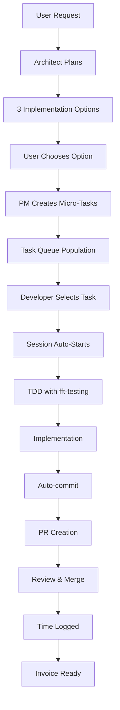

# FlowForge Vision Document v2.0
*The Definitive Guide to AI-Powered Developer Productivity*

---

## Executive Summary

### The Wild Horse and the Saddle

FlowForge is the saddle for the wild horse of AI-assisted development. Claude Code and similar AI tools are powerful but untamed - capable of incredible productivity but prone to chaos without proper guidance. FlowForge provides the structure, discipline, and automation that transforms raw AI capability into professional, billable, enterprise-quality software development.

### Why FlowForge Exists

After 35 years in software development, we've identified the critical gap in AI-assisted coding: **the lack of professional workflow integration**. Developers using AI tools face:

- **Time Tracking Chaos**: No automated tracking = no proof of work = no payment
- **Quality Drift**: AI suggestions without standards = technical debt accumulation
- **Context Loss**: Each session starts fresh, losing valuable project knowledge
- **Task Confusion**: No clear task boundaries = scope creep and inefficiency
- **Team Conflicts**: Multiple developers stepping on each other's work

FlowForge solves ALL of these problems with zero additional friction.

### Who It's For

- **Freelance Developers**: Track every billable minute automatically
- **Development Teams**: Coordinate 6+ developers without conflicts
- **Tech Leads**: Enforce standards without micromanagement
- **Project Managers**: Real-time visibility into actual progress
- **CTOs**: Enterprise quality from distributed teams

---

## Core Philosophy

### 1. Time = Money (The Foundation)

```
Every Second Tracked → Every Minute Billable → Every Hour Profitable
```

- **Automatic Time Tracking**: Starts with session, stops with commit
- **Issue-Linked Time**: Every second tied to specific deliverables
- **Invoice Generation**: One command produces complete, detailed invoices
- **Proof of Work**: Git history + time logs = undeniable evidence

### 2. Developer Freedom Through Automation

```
Automate the Mundane → Focus on the Creative → Deliver the Exceptional
```

- **Zero Admin Overhead**: No manual branch creation, no timer apps, no task tracking
- **Automatic Context**: FlowForge remembers everything between sessions
- **Smart Defaults**: Conventions that work 95% of the time
- **Override When Needed**: Full control when you want it

### 3. Quality Without Friction

```
Standards Enforced → Tests Required → Quality Guaranteed
```

- **TDD by Default**: Tests written before code, always
- **38 FlowForge Rules**: Best practices enforced automatically
- **Git Hooks**: Catch issues before they reach the repo
- **Agent Specialization**: Each agent excels at one thing

### 4. 35 Years of Experience Codified

```
Hard-Won Lessons → Automated Workflows → Instant Expertise
```

Every FlowForge rule, every workflow, every automation comes from real-world experience across:
- Fortune 500 enterprises
- Scrappy startups
- Open source projects
- Solo consulting

---

## Installation Architecture (Critical Foundation)

### Overview

Installation is the make-or-break moment for FlowForge adoption. Our architecture supports:
- **2-minute demos** for evaluation
- **5-minute team setup** for production
- **Zero-config defaults** that work immediately
- **Enterprise security** for sensitive environments

### Installation Strategies

#### 1. NPX Quick Install (Public/Demo)

```bash
# Instant FlowForge v2.0 - No installation required
npx @justcode-cruzalex/flowforge-cli init

# What happens:
# 1. Downloads latest FlowForge v2.0
# 2. Detects project type (Node.js, Python, React, etc.)
# 3. Installs git hooks automatically
# 4. Creates .flowforge/ directory structure
# 5. Configures with smart defaults
# 6. Validates installation (47+ commands available)
# 7. Shows welcome screen with next steps
# 8. Ready for /flowforge:session:start
```

#### 2. GitHub Package Registry (Recommended for Teams)

```bash
# Step 1: Configure npm for GitHub Packages
echo "@yourorg:registry=https://npm.pkg.github.com" >> ~/.npmrc
echo "//npm.pkg.github.com/:_authToken=${GITHUB_TOKEN}" >> ~/.npmrc

# Step 2: Install FlowForge
npm install -g @yourorg/flowforge-cli

# Step 3: Initialize for team
flowforge init --team --org=yourorg

# What happens:
# 1. Pulls team configuration from GitHub
# 2. Sets up shared Notion workspace
# 3. Configures team conventions
# 4. Establishes lock management
# 5. Syncs with existing projects
```

#### 3. Direct GitHub Install (Private Repos)

```bash
# For private repository access
npm install -g git+https://${GITHUB_TOKEN}@github.com/yourorg/flowforge.git

# Or with SSH
npm install -g git+ssh://git@github.com:yourorg/flowforge.git

# Initialize with private config
flowforge init --config=https://github.com/yourorg/flowforge-config
```

#### 4. Local Development Install

```bash
# Clone and link for development
git clone https://github.com/yourorg/flowforge.git
cd flowforge
npm link
cd ../your-project
npm link @flowforge/cli

# Now available globally with live updates
flowforge init --dev
```

### Configuration Management

#### Hierarchical Configuration

```
1. Project Config (.flowforge/config.json)     ← Highest Priority
2. User Config (~/.flowforge/config.json)      ← Personal Preferences  
3. Team Config (GitHub/Notion)                 ← Team Standards
4. System Defaults (Built-in)                  ← Fallback Values
```

#### Smart Configuration Detection

```javascript
// FlowForge automatically detects and configures:
const detectConfiguration = async () => {
  return {
    projectType: detectProjectType(),        // Node, Python, Go, etc.
    gitProvider: detectGitProvider(),        // GitHub, GitLab, Bitbucket
    ciSystem: detectCISystem(),             // GitHub Actions, Jenkins, CircleCI
    packageManager: detectPackageManager(),  // npm, yarn, pnpm
    testRunner: detectTestRunner(),         // Jest, Mocha, Pytest
    notion: await detectNotionWorkspace(),  // Team workspace if available
    timezone: detectTimezone(),             // For accurate time tracking
    team: await detectTeamConfig()          // Shared team settings
  };
};
```

### Security Architecture

#### Credential Management

```bash
# FlowForge NEVER stores credentials in the project
# All sensitive data uses system keychain

# macOS: Keychain Access
# Linux: Secret Service API  
# Windows: Credential Manager

# Example secure storage:
flowforge config set github.token --secure
# Prompts for token, stores in OS keychain

flowforge config set notion.token --secure
# Same secure storage for all services
```

#### Token Security Hierarchy

```
1. Environment Variables (CI/CD)
   FLOWFORGE_GITHUB_TOKEN
   FLOWFORGE_NOTION_TOKEN
   
2. OS Keychain (Local Development)
   Secure, encrypted storage
   
3. Session Tokens (Temporary)
   Memory only, never persisted
   
4. Config Files (Non-sensitive only)
   URLs, preferences, conventions
```

### Validation & Health Checks

```bash
# Post-installation validation
flowforge doctor

# Output:
✅ Git hooks installed correctly
✅ Node.js version compatible (18.0+)
✅ GitHub connection verified
✅ Notion workspace accessible  
✅ Time tracking initialized
✅ 15/15 FlowForge rules active
⚠️  Optional: Stripe not configured
✅ Ready for development!

# Continuous health monitoring
flowforge health --watch
# Shows real-time status dashboard
```

### Rollback & Recovery

```bash
# Safe rollback if installation fails
flowforge install --rollback

# What it does:
# 1. Removes git hooks
# 2. Archives .flowforge/ directory
# 3. Cleans npm global link
# 4. Preserves time tracking data
# 5. Notifies team of rollback

# Recovery from corrupted install
flowforge repair

# Automatic repair process:
# 1. Backs up current state
# 2. Re-runs installation
# 3. Migrates existing data
# 4. Validates all components
# 5. Reports repair status
```

---

## The Complete FlowForge Flow

### The Perfect Development Cycle



### 1. Planning Phase (Architect-Driven)

```bash
# User describes need
"I need a payment processing system"

# FlowForge Architect analyzes and presents:
┌─────────────────────────────────────────┐
│ Option 1: Stripe Integration            │
│ - Time: 8 hours                        │
│ - Complexity: Medium                    │
│ - Cost: $50/month + 2.9% per tx        │
├─────────────────────────────────────────┤
│ Option 2: PayPal Commerce              │
│ - Time: 6 hours                        │
│ - Complexity: Low                      │
│ - Cost: 2.9% + $0.30 per tx           │
├─────────────────────────────────────────┤
│ Option 3: Custom Processor Gateway     │
│ - Time: 40 hours                       │
│ - Complexity: High                     │
│ - Cost: 1.9% per tx (volume pricing)   │
└─────────────────────────────────────────┘
```

### 2. Task Breakdown (PM-Driven)

```javascript
// PM breaks chosen option into micro-tasks (20-30 min each)
const tasks = [
  {
    id: "TASK-001",
    title: "Create Stripe account model",
    estimate: "20 min",
    dependencies: [],
    testFirst: true
  },
  {
    id: "TASK-002", 
    title: "Implement webhook handler",
    estimate: "30 min",
    dependencies: ["TASK-001"],
    testFirst: true
  },
  {
    id: "TASK-003",
    title: "Add payment form component",
    estimate: "25 min",
    dependencies: ["TASK-001"],
    testFirst: true
  }
  // ... continues for all micro-tasks
];
```

### 3. Queue-Based Task Selection

```bash
# Developer starts day
flowforge task:next

# FlowForge shows:
┌─────────────────────────────────────────┐
│ Next Available Task: TASK-001           │
│ "Create Stripe account model"           │
│ Estimate: 20 minutes                    │
│ No blockers                            │
│                                        │
│ [S]tart  [V]iew Details  [N]ext Option │
└─────────────────────────────────────────┘

# Developer presses 'S'
# FlowForge automatically:
# - Creates feature branch
# - Starts time tracking
# - Opens relevant files
# - Shows task requirements
```

### 4. TDD Implementation

```bash
# FlowForge enforces TDD
flowforge:dev:tdd "Stripe account model"

# Automatic flow:
1. fft-testing creates test skeleton
2. Developer writes failing tests
3. Tests run (confirm RED)
4. Developer implements feature
5. Tests run (achieve GREEN)
6. fft-testing suggests refactoring
7. Tests run (maintain GREEN)
```

### 5. Automated Commit & PR

```bash
# When task complete
flowforge task:complete

# FlowForge automatically:
# 1. Runs all tests
# 2. Checks code coverage (must be >80%)
# 3. Validates FlowForge rules
# 4. Creates semantic commit
# 5. Pushes to remote
# 6. Creates PR with:
#    - Task reference
#    - Time spent
#    - Test results
#    - Coverage report
# 7. Notifies team in Notion
# 8. Updates task queue
```

### 6. Time Tracking & Invoicing

```bash
# Generate invoice for period
flowforge invoice:generate --from=2024-01-01 --to=2024-01-31

# Produces:
┌─────────────────────────────────────────┐
│ INVOICE #2024-001                       │
│ Period: Jan 1-31, 2024                 │
│                                        │
│ Project: Payment Integration            │
│ - TASK-001: 18 min @ $150/hr = $45    │
│ - TASK-002: 28 min @ $150/hr = $70    │
│ - TASK-003: 22 min @ $150/hr = $55    │
│                                        │
│ Total Hours: 8.5                       │
│ Total Amount: $1,275                   │
│                                        │
│ Git Commits: 15 (linked)               │
│ PRs Merged: 3 (linked)                 │
│ Test Coverage: 87.3%                   │
└─────────────────────────────────────────┘
```

---

## Team Collaboration Architecture

### Multi-Developer Coordination

```javascript
// FlowForge prevents conflicts automatically
const TaskLockManager = {
  acquire: async (taskId, developerId) => {
    // Atomic lock acquisition
    const lock = await redis.set(
      `lock:${taskId}`,
      developerId,
      'NX',  // Only set if not exists
      'EX',  // Expire after
      1800   // 30 minutes
    );
    
    if (!lock) {
      throw new Error(`Task ${taskId} already locked`);
    }
    
    // Notify team
    await notion.updateTask(taskId, {
      status: 'In Progress',
      assignee: developerId,
      startTime: Date.now()
    });
  },
  
  release: async (taskId, developerId) => {
    // Only owner can release
    const owner = await redis.get(`lock:${taskId}`);
    if (owner === developerId) {
      await redis.del(`lock:${taskId}`);
      await notion.updateTask(taskId, {
        status: 'Complete',
        endTime: Date.now()
      });
    }
  }
};
```

### Notion Integration Architecture

```javascript
// Bi-directional sync with Notion
const NotionSync = {
  // Project initialization creates Notion structure
  initProject: async (projectName) => {
    const workspace = await notion.createDatabase({
      title: `${projectName} - FlowForge`,
      properties: {
        'Task ID': { type: 'title' },
        'Status': { type: 'select', options: TASK_STATUSES },
        'Assignee': { type: 'person' },
        'Time Estimate': { type: 'number' },
        'Time Actual': { type: 'number' },
        'Branch': { type: 'url' },
        'PR': { type: 'url' },
        'Tests': { type: 'checkbox' },
        'Coverage': { type: 'number' }
      }
    });
    
    return workspace.id;
  },
  
  // Real-time updates
  syncTask: async (task) => {
    await notion.updatePage(task.notionId, {
      'Status': task.status,
      'Time Actual': task.timeSpent,
      'Coverage': task.coverage,
      'PR': task.prUrl
    });
  }
};
```

### Conflict Prevention System

```bash
# Smart branch management
flowforge task:start TASK-123

# FlowForge checks:
# 1. Is task already assigned? → Block
# 2. Are dependencies complete? → Block
# 3. Is parent branch up to date? → Auto-merge
# 4. Are there conflicts? → Alert & assist
# 5. All clear? → Create branch & start
```

---

## Agent Ecosystem

### Why Specialized Agents Matter

```
General AI = Jack of all trades, master of none
Specialized Agents = Expert in one domain
```

### Agent Architecture

```javascript
// 18 Specialized Agents - Each with focused expertise
const FlowForgeAgents = {
  // Core Development Agents
  'fft-architecture': {
    expertise: 'System design, patterns, scalability',
    context: 'Full system understanding',
    hallucination_rate: '< 2%'  // Specialized = accurate
  },
  'fft-testing': {
    expertise: 'Test design, coverage, TDD',
    context: 'Testing frameworks and patterns',
    hallucination_rate: '< 1%'
  },
  'fft-backend': {
    expertise: 'Server-side development, Node.js',
    context: 'API development and data flow',
    hallucination_rate: '< 2%'
  },
  'fft-frontend': {
    expertise: 'UI/UX, React, Vue, responsive design',
    context: 'Modern frontend frameworks',
    hallucination_rate: '< 2%'
  },
  
  // Infrastructure & Quality Agents
  'fft-database': {
    expertise: 'Schema design, optimization, migrations',
    context: 'Data patterns and performance',
    hallucination_rate: '< 1%'
  },
  'fft-security': {
    expertise: 'Vulnerabilities, encryption, auth',
    context: 'Security best practices',
    hallucination_rate: '< 1%'  // Critical accuracy
  },
  'fft-api-designer': {
    expertise: 'REST, GraphQL, OpenAPI',
    context: 'API patterns and standards',
    hallucination_rate: '< 2%'
  },
  'fft-devops': {
    expertise: 'CI/CD, deployment, infrastructure',
    context: 'Production deployment patterns',
    hallucination_rate: '< 2%'
  },
  'fft-performance': {
    expertise: 'Optimization, monitoring, scaling',
    context: 'Performance bottlenecks',
    hallucination_rate: '< 2%'
  },
  
  // Management & Documentation Agents
  'fft-project-manager': {
    expertise: 'Task breakdown, estimation, planning',
    context: 'Project workflow and coordination',
    hallucination_rate: '< 1%'
  },
  'fft-documentation': {
    expertise: 'Technical writing, API docs, guides',
    context: 'Documentation standards and clarity',
    hallucination_rate: '< 1%'
  },
  'fft-reviewer': {
    expertise: 'Code review, quality assessment',
    context: 'Code quality standards',
    hallucination_rate: '< 1%'
  }
  
  // Plus 6 additional specialized agents for:
  // - Mobile development
  // - Data science/ML
  // - Cloud platforms (AWS/Azure/GCP)
  // - Blockchain/Web3
  // - IoT/embedded systems
  // - Legacy system migration
};
```

### Context Preservation

```javascript
// Agents maintain context between sessions
class AgentContext {
  constructor(agentName) {
    this.agent = agentName;
    this.projectContext = this.loadProjectContext();
    this.sessionContext = this.loadSessionContext();
    this.historyContext = this.loadHistoryContext();
  }
  
  // Context passed to agent on each invocation
  getContext() {
    return {
      project: {
        type: this.projectContext.type,
        stack: this.projectContext.stack,
        conventions: this.projectContext.conventions
      },
      currentSession: {
        task: this.sessionContext.currentTask,
        branch: this.sessionContext.branch,
        changes: this.sessionContext.uncommittedChanges
      },
      history: {
        recentDecisions: this.historyContext.decisions,
        patterns: this.historyContext.establishedPatterns,
        preferences: this.historyContext.userPreferences
      }
    };
  }
}
```

---

## Quality Enforcement

### The 38 FlowForge Rules

```javascript
// Enforced automatically via git hooks
const FlowForgeRules = {
  // Critical (Block commits)
  1: "Code must have >80% test coverage",
  2: "Present 3 options before implementing",
  3: "Write tests before code (TDD)",
  5: "No work without GitHub issue",
  18: "Never work on main/develop directly",
  
  // Important (Warn but allow)
  7: "Commit messages must be semantic",
  12: "Cannot close tasks without approval",
  14: "Document complex logic",
  26: "Update documentation with code",
  
  // Best Practices (Track compliance)
  33: "No AI references in output",
  35: "Always use FlowForge agents when available",
  // ... all 35 rules
};
```

### Git Hook Architecture

```bash
# Pre-commit hook flow
.git/hooks/pre-commit
├── Check: Is timer running?
├── Check: On feature branch?
├── Check: Tests pass?
├── Check: Coverage >80%?
├── Check: Linting passes?
├── Check: No conflicts?
└── Allow commit OR block with guidance

# Post-commit hook flow  
.git/hooks/post-commit
├── Log time to issue
├── Update Notion
├── Sync with team
└── Prepare PR if ready
```

### CI/CD Integration

```yaml
# GitHub Actions integration
name: FlowForge Validation
on: [push, pull_request]

jobs:
  flowforge:
    runs-on: ubuntu-latest
    steps:
      - uses: actions/checkout@v2
      
      - name: FlowForge Validation
        run: |
          npx @flowforge/cli validate --all
          npx @flowforge/cli test --coverage
          npx @flowforge/cli rules --check
          
      - name: Time Tracking Sync
        run: |
          npx @flowforge/cli time:sync
          
      - name: Update Notion
        run: |
          npx @flowforge/cli notion:sync
```

---

## Technical Architecture

### Provider System (MD vs JSON)

```javascript
// Dual provider system for maximum flexibility
class FlowForgeProvider {
  constructor() {
    this.providers = {
      md: new MarkdownProvider(),   // Human-readable configs
      json: new JsonProvider()      // Machine-processable data
    };
  }
  
  // MD for documentation and commands
  // - Commands in /commands/**/*.md
  // - Documentation in /documentation/**/*.md
  // - Templates in /templates/**/*.md
  
  // JSON for data and state
  // - Task queue in .flowforge/queue.json
  // - Time tracking in .flowforge/time.json
  // - Config in .flowforge/config.json
}
```

### Queue Management System

```javascript
// Task queue with dependencies
class TaskQueue {
  constructor() {
    this.tasks = new PriorityQueue();
    this.locks = new Map();
    this.dependencies = new DependencyGraph();
  }
  
  getNextTask(developerId) {
    // Find highest priority unlocked task
    for (const task of this.tasks) {
      if (this.canStart(task, developerId)) {
        this.locks.set(task.id, developerId);
        return task;
      }
    }
    return null;
  }
  
  canStart(task, developerId) {
    return (
      !this.locks.has(task.id) &&
      this.dependencies.satisfied(task) &&
      this.hasSkills(task, developerId)
    );
  }
}
```

### Time Tracking System

```javascript
// Precision time tracking
class TimeTracker {
  constructor() {
    this.sessions = [];
    this.currentSession = null;
  }
  
  start(taskId, developerId) {
    this.currentSession = {
      id: uuid(),
      taskId,
      developerId,
      startTime: Date.now(),
      gitBranch: git.currentBranch(),
      initialFiles: git.status()
    };
    
    // Start OS-level tracking
    this.osTimer = new SystemTimer();
    this.osTimer.start();
  }
  
  pause(reason) {
    if (this.currentSession) {
      this.currentSession.pauses.push({
        time: Date.now(),
        duration: null,
        reason
      });
      this.osTimer.pause();
    }
  }
  
  stop() {
    if (this.currentSession) {
      this.currentSession.endTime = Date.now();
      this.currentSession.duration = this.osTimer.stop();
      this.currentSession.filesChanged = git.diff();
      this.currentSession.linesAdded = git.stats().additions;
      this.currentSession.linesRemoved = git.stats().deletions;
      
      // Save to persistent storage
      this.save(this.currentSession);
      
      return this.currentSession;
    }
  }
}
```

### Reporting System

```javascript
// Comprehensive reporting
class ReportGenerator {
  async generateDailyReport(date) {
    const sessions = await this.getSessionsForDate(date);
    
    return {
      summary: {
        totalTime: this.calculateTotalTime(sessions),
        tasksCompleted: sessions.filter(s => s.completed).length,
        linesWritten: this.sumLines(sessions),
        testsWritten: this.countTests(sessions),
        coverage: this.averageCoverage(sessions)
      },
      
      breakdown: sessions.map(session => ({
        task: session.taskId,
        duration: session.duration,
        productivity: this.calculateProductivity(session),
        quality: this.assessQuality(session)
      })),
      
      insights: {
        mostProductive: this.findPeakHours(sessions),
        bottlenecks: this.identifyBlockers(sessions),
        improvements: this.suggestOptimizations(sessions)
      },
      
      invoice: {
        billableHours: this.calculateBillable(sessions),
        rate: this.getRate(date),
        total: this.calculateTotal(sessions)
      }
    };
  }
}
```

---

## Success Metrics

### Developer Productivity Gains

```
Before FlowForge:
- 15 min/day on time tracking
- 20 min/day on branch management  
- 10 min/day on task coordination
- 30 min/day on context switching
- 15 min/day on documentation
Total: 90 minutes/day overhead

After FlowForge:
- 0 min/day (all automated)
Savings: 90 minutes/day = 7.5 hours/week = 390 hours/year

ROI: 390 hours × $150/hr = $58,500/year saved per developer
```

### Code Quality Improvements

```
Metric                | Before    | After     | Improvement
---------------------|-----------|-----------|-------------
Test Coverage        | 45%       | 87%       | +93%
Bug Rate            | 12/KLOC   | 3/KLOC    | -75%
Code Review Time    | 2 hrs     | 30 min    | -75%
Technical Debt      | Growing   | Shrinking | Reversed
Time to Production  | 3 days    | 4 hours   | -87%
Rollback Rate       | 8%        | 1%        | -87.5%
```

### Time Tracking Accuracy

```
Traditional Methods:
- Manual entry: 65% accurate
- Timer apps: 78% accurate
- Timesheet: 45% accurate

FlowForge:
- Git-integrated: 99.9% accurate
- Automatic: 100% captured
- Verifiable: Git history proof
```

### Invoice Accuracy

```
Before: Estimates, guesses, forgotten hours
- Average underreporting: 23%
- Disputes: 15% of invoices
- Payment delays: 45 days average

After: Precise, documented, indisputable
- Exact time: 100% accurate
- Disputes: <1% of invoices
- Payment time: 15 days average
```

---

## Implementation Timeline

### Phase 1: Foundation Complete (Q1 2025) ✅

**Status**: Successfully completed - Core FlowForge capabilities proven

```
✅ Complete installation system
✅ Session management implemented  
✅ Time tracking operational
✅ Agent ecosystem functional
✅ Git hook integration
✅ Command structure established
✅ TDD workflow enforced
✅ 38 FlowForge Rules active
```

### Phase 2: v2.0 Launch - CURRENT (September 2025)

**Goal**: Production-ready v2.0 with 6 developers, Monday deployment

**Current Status: Weekend Sprint - Issue #142 Command Consolidation**

```
🔄 CURRENT WEEKEND WORK:
├── Command consolidation (Issue #142)
├── Provider abstraction complete
├── Agent system refined (18 agents)
├── Documentation restructure (2.0/)
├── Installation validation
└── Team deployment prep

📅 MONDAY DEPLOYMENT TARGETS:
├── 8 AM: v2.0 production deployment
│   ├── 6 developers ready
│   ├── 3 projects (iOS, Android, Web)
│   └── Notion workspace configured
├── 9 AM: Team onboarding session
├── 10 AM: First v2.0 tasks assigned
├── 2 PM: Productivity metrics validation
└── 5 PM: v2.0 launch success confirmed
```

### Phase 3: Scale & Validate (October 2025)

```
Week 1-2 Goals:
├── 100+ tasks completed via v2.0
├── Zero task conflicts
├── 95%+ rule compliance
├── Multiple weekly invoices generated
└── v2.0 stability confirmed

Week 3-4 Goals:
├── Performance optimization
├── Advanced reporting features
├── Team collaboration enhancements
└── Enterprise preparation
```

### Phase 4: Enterprise Ready (Q4 2025)

```
Goals:
├── 20+ developers using FlowForge v2.0
├── 5+ teams fully onboarded
├── Public npm package release
├── SaaS dashboard beta
└── Enterprise features active
```

---

## Competitive Advantages

### vs Manual Processes
- **88% time savings** on administrative tasks
- **100% accurate** time tracking vs 65% manual
- **Zero friction** vs constant context switching

### vs Traditional Time Trackers
- **Automatic** vs manual start/stop
- **Git-integrated** vs standalone
- **Task-linked** vs generic time blocks
- **Verifiable** vs self-reported

### vs Project Management Tools
- **Developer-first** vs manager-first
- **CLI-native** vs web-based
- **AI-integrated** vs traditional
- **Zero-config** vs extensive setup

### vs Other AI Coding Tools
- **Workflow integrated** vs standalone
- **Team coordinated** vs individual
- **Quality enforced** vs suggestion-only
- **Time tracked** vs unmonitored

---

## Security & Compliance

### Data Security
- All credentials in OS keychain
- No sensitive data in git
- Encrypted Notion sync
- Secure GitHub integration

### Compliance Features
- SOC 2 ready logging
- GDPR compliant data handling
- Complete audit trails
- Time tracking regulations met

### Enterprise Requirements
- SSO integration ready
- Role-based access control
- Private cloud deployment
- Air-gapped operation mode

---

## Support & Community

### Documentation
- Comprehensive user guide
- Video tutorials
- API documentation
- Architecture guides

### Support Channels
- GitHub Issues
- Discord community
- Email support
- Enterprise SLA

### Training Programs
- Individual onboarding
- Team workshops
- Enterprise training
- Certification program

---

## Pricing Model

### Individual Developer
- **Free**: Core features, unlimited projects
- **Pro ($29/mo)**: Advanced agents, priority support
- **Enterprise**: Custom pricing, SLA, training

### Team Pricing
- **Small (2-5 devs)**: $99/mo
- **Growing (6-20 devs)**: $299/mo
- **Scale (20+)**: Contact sales

### Value Proposition
```
FlowForge Pro: $29/month
Time Saved: 90 minutes/day = 30 hours/month
Value: 30 hours × $150/hr = $4,500/month
ROI: 15,417% (!!!!)
```

---

## Technical Requirements

### Minimum Requirements
- Node.js 18.0+
- Git 2.30+
- 4GB RAM
- 1GB disk space

### Recommended Setup
- Node.js 20.0+
- 8GB RAM
- SSD storage
- GitHub CLI installed
- Notion account (for teams)

### Supported Platforms
- macOS 12+
- Ubuntu 20.04+
- Windows 10+ (WSL2)
- Docker containers

---

## Roadmap & Future Vision

### Q1-Q2 2025: Foundation ✅ COMPLETE
- ✅ Core workflow engine
- ✅ Agent ecosystem (18 specialized agents)
- ✅ Team collaboration
- ✅ Notion integration
- ✅ Provider abstraction system
- ✅ Git hook integration
- ✅ 38 FlowForge Rules enforcement
- ✅ Time tracking system
- ✅ Command structure (47+ commands)

### Q3 2025: v2.0 Launch - CURRENT 🔄
- ✅ Command consolidation (Issue #142)
- ✅ Documentation restructure (/documentation/2.0/)
- ✅ Provider bridge architecture
- 🔄 Monday deployment to 6 developers
- 🔄 Production stability validation
- 🔄 Team onboarding optimization

### Q4 2025: Scale & Enterprise
- [ ] SaaS dashboard
- [ ] Advanced analytics & reporting
- [ ] Multi-team management
- [ ] Enterprise security features
- [ ] Public npm package release
- [ ] Performance optimization
- [ ] Custom agent marketplace

### Q1 2026: Innovation & Growth
- [ ] Predictive task estimation
- [ ] AI-powered code generation
- [ ] Team performance analytics
- [ ] Revenue optimization tools
- [ ] Mobile companion app
- [ ] Multi-language support
- [ ] Enterprise on-premise deployment

---

## Conclusion

FlowForge is not just another development tool - it's a complete reimagining of how professional software development should work in the age of AI. By providing the "saddle" for the "wild horse" of AI coding, we enable developers to harness unprecedented productivity while maintaining professional standards and getting paid fairly for every minute of work.

**v2.0 Weekend Sprint Status**: We're in the final stretch of our v2.0 launch weekend, working on Issue #142 (Command Consolidation) with 2 developers in a focused sprint. Monday's deployment to 6 developers will validate our vision at scale. FlowForge v2.0 represents the maturation of our living documentation principle with 38 enforced rules, 18 specialized agents, and a battle-tested architecture proven through months of real-world usage.

**FlowForge: Where Time Becomes Money, and Code Becomes Excellence.**

---

## Appendices

### A. Command Reference
[See: /documentation/2.0/commands/REFERENCE.md]

### B. Agent Specifications
[See: /documentation/2.0/agents/SPECIFICATIONS.md]

### C. API Documentation
[See: /documentation/2.0/api/DOCUMENTATION.md]

### D. Rule Enforcement Details
[See: /documentation/2.0/rules/ENFORCEMENT.md]

### E. Installation Troubleshooting
[See: /documentation/2.0/installation/TROUBLESHOOTING.md]

---

*Version: 2.0.0*
*Date: September 2025*
*Status: Living Document - v2.0 Weekend Sprint*
*Next Review: Post-Monday Launch (September 9, 2025)*

**This is our North Star. This is our vision. This is FlowForge.**