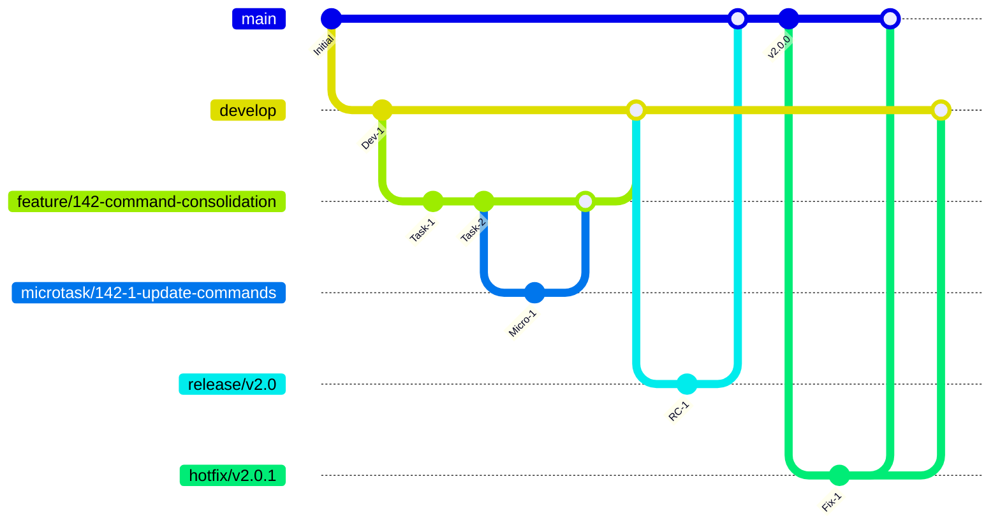

# FlowForge v2.0 Git Flow Architecture

## Executive Summary

**Critical Issue**: FlowForge v2.0 is violating its own git flow rules by committing directly to `release/v2.0` branch, breaking Rule #18 and compromising the entire development workflow integrity.

**Solution**: Implement strict Git Flow Architecture with automated enforcement, clear branch strategies for tasks vs microtasks, and zero-tolerance violations through pre-commit hooks.

## Current State Analysis

### Branch Structure Assessment
```
main                    # Production-ready code ✅
├── release/v2.0       # VIOLATION: Direct commits ❌
├── develop            # Missing integration branch ❌
└── feature/*          # 20+ stale feature branches ⚠️
```

### Critical Violations Detected
1. **Direct commits to release branch** - Bypassing code review
2. **No develop branch** - Missing integration layer
3. **Stale feature branches** - 20+ unmaintained branches
4. **No hotfix process** - Emergency fixes undefined
5. **Missing branch protection** - No enforcement rules

## Git Flow Architecture Design

### 1. Branch Hierarchy & Strategy



### 2. Branch Types & Conventions

#### Production Branches
```bash
# main - Production-ready code
- Always deployable
- Protected branch (no direct commits)
- Automated deployment triggers
- Tagged releases only

# develop - Integration branch
- Latest development changes
- All features merge here first
- Continuous integration testing
- Staging environment deployment
```

#### Supporting Branches

#### Feature Branches
```bash
# Pattern: feature/[issue-number]-[description]
feature/142-command-consolidation
feature/143-agent-enforcement
feature/144-provider-abstraction

# Lifecycle:
1. Branch from: develop
2. Merge to: develop
3. Naming: kebab-case, max 50 chars
4. Lifetime: 1-7 days maximum
5. Auto-cleanup after merge
```

#### Microtask Branches
```bash
# Pattern: microtask/[parent-issue]-[subtask]-[description]
microtask/142-1-update-commands
microtask/142-2-add-validation
microtask/142-3-update-docs

# Lifecycle:
1. Branch from: feature/[parent]
2. Merge to: feature/[parent]
3. Lifetime: 1-4 hours maximum
4. For atomic commits only
5. Immediate cleanup
```

#### Release Branches
```bash
# Pattern: release/v[major.minor.patch]
release/v2.0.0
release/v2.1.0

# Lifecycle:
1. Branch from: develop
2. Merge to: main AND develop
3. Version bumping only
4. Bug fixes only (no features)
5. Becomes production tag
```

#### Hotfix Branches
```bash
# Pattern: hotfix/v[major.minor.patch]
hotfix/v2.0.1
hotfix/v2.0.2

# Lifecycle:
1. Branch from: main
2. Merge to: main AND develop
3. Critical fixes only
4. Immediate deployment
5. Emergency process
```

## 3. Task vs Microtask Strategy

### When to Use Feature Branches
```javascript
// Feature Branch Criteria
const useFeatureBranch = {
  // GitHub Issues that are:
  complexity: 'medium-to-high',
  estimatedTime: '> 4 hours',
  components: 'multiple files/modules',
  testing: 'requires integration tests',
  documentation: 'needs updates',
  
  examples: [
    'feat: Implement agent enforcement system',
    'feat: Add provider abstraction layer',
    'feat: Create new command namespace',
    'refactor: Restructure project architecture'
  ]
};
```

### When to Use Microtask Branches
```javascript
// Microtask Branch Criteria  
const useMicrotaskBranch = {
  // Subtasks that are:
  complexity: 'low',
  estimatedTime: '< 4 hours', 
  components: 'single file/function',
  testing: 'unit tests only',
  scope: 'atomic change',
  
  examples: [
    'fix: Update command path in install script',
    'docs: Add example to README',
    'style: Fix linting errors',
    'test: Add unit test for utility function'
  ]
};
```

### Branch Decision Tree
```
Is this a GitHub Issue?
├── YES: Is estimated time > 4 hours?
│   ├── YES: Feature Branch (feature/[issue]-[desc])
│   └── NO: Microtask Branch (microtask/[issue]-[subtask]-[desc])
└── NO: STOP - Create GitHub issue first (Rule #5)
```

## 4. Enforcement Mechanisms

### Pre-Commit Hook Implementation
```bash
#!/bin/bash
# File: .git/hooks/pre-commit
# FlowForge Git Flow Enforcement

set -e

# Get current branch
CURRENT_BRANCH=$(git rev-parse --abbrev-ref HEAD)

# Check protected branches
if [[ "$CURRENT_BRANCH" == "main" || "$CURRENT_BRANCH" == "develop" ]]; then
    echo "❌ VIOLATION: Direct commits to $CURRENT_BRANCH are forbidden"
    echo "📖 Rule #18: Never work directly on main/develop"
    echo "🔧 Solution: Create feature branch: git checkout -b feature/[issue]-[description]"
    exit 1
fi

# Check release branch commits
if [[ "$CURRENT_BRANCH" == release/* ]]; then
    echo "❌ VIOLATION: Direct commits to release branch are forbidden"
    echo "📖 Release branches are for version bumping and bug fixes only"
    echo "🔧 Solution: Create hotfix branch: git checkout -b hotfix/v[version]"
    exit 1
fi

# Validate branch naming
if [[ ! "$CURRENT_BRANCH" =~ ^(feature|microtask|hotfix|chore)/.+ ]]; then
    echo "❌ VIOLATION: Invalid branch name: $CURRENT_BRANCH"
    echo "📖 Valid patterns: feature/*, microtask/*, hotfix/*, chore/*"
    echo "🔧 Solution: Rename branch: git branch -m [new-name]"
    exit 1
fi

# Check for GitHub issue reference
if [[ "$CURRENT_BRANCH" =~ ^(feature|microtask)/ ]]; then
    if [[ ! "$CURRENT_BRANCH" =~ ^(feature|microtask)/[0-9]+-.*$ ]]; then
        echo "❌ VIOLATION: Branch must reference GitHub issue number"
        echo "📖 Rule #5: All work must have GitHub issue"
        echo "🔧 Solution: Include issue number: feature/[issue]-[description]"
        exit 1
    fi
fi

echo "✅ Git Flow validation passed"
```

### Commit Message Validation
```bash
#!/bin/bash
# File: .git/hooks/commit-msg
# FlowForge Commit Message Enforcement

COMMIT_MSG_FILE=$1
COMMIT_MSG=$(cat $COMMIT_MSG_FILE)

# Check conventional commits format
if [[ ! "$COMMIT_MSG" =~ ^(feat|fix|docs|style|refactor|test|chore)(\(.+\))?: .{1,50} ]]; then
    echo "❌ VIOLATION: Invalid commit message format"
    echo "📖 Required: type(scope): description"
    echo "🔧 Examples:"
    echo "   feat(#142): Add command consolidation"
    echo "   fix(#143): Resolve agent loading issue"
    exit 1
fi

# Check for AI references (Rule #33)
if echo "$COMMIT_MSG" | grep -iE "(claude|ai|gpt|generated|assistant)" > /dev/null; then
    echo "❌ VIOLATION: AI references in commit message"
    echo "📖 Rule #33: No AI references in client-facing output"
    echo "🔧 Solution: Focus on business value and technical implementation"
    exit 1
fi

echo "✅ Commit message validation passed"
```

### Branch Protection Rules
```javascript
// GitHub Branch Protection Configuration
const branchProtection = {
  main: {
    protection: {
      required_status_checks: {
        strict: true,
        contexts: ['ci/tests', 'ci/lint', 'ci/security']
      },
      enforce_admins: true,
      required_pull_request_reviews: {
        required_approving_review_count: 2,
        dismiss_stale_reviews: true,
        require_code_owner_reviews: true
      },
      restrictions: {
        users: [],
        teams: ['lead-developers']
      }
    }
  },
  
  develop: {
    protection: {
      required_status_checks: {
        strict: true,
        contexts: ['ci/tests', 'ci/lint']
      },
      required_pull_request_reviews: {
        required_approving_review_count: 1,
        dismiss_stale_reviews: true
      }
    }
  },
  
  'release/*': {
    protection: {
      required_status_checks: {
        strict: true,
        contexts: ['ci/tests', 'ci/lint', 'ci/security', 'ci/e2e']
      },
      required_pull_request_reviews: {
        required_approving_review_count: 2,
        require_code_owner_reviews: true
      }
    }
  }
};
```

## 5. Workflow Automation

### Automated Branch Cleanup
```bash
#!/bin/bash
# File: scripts/cleanup-branches.sh
# FlowForge Branch Maintenance

set -e

echo "🧹 FlowForge Branch Cleanup"

# Clean merged feature branches
git branch --merged develop | grep "feature/" | xargs -n 1 git branch -d

# Clean merged microtask branches  
git branch --merged | grep "microtask/" | xargs -n 1 git branch -d

# Warn about stale branches (> 30 days)
git for-each-ref --format='%(refname:short) %(committerdate)' refs/heads | \
  while read branch date; do
    if [[ $(date -d "$date" +%s) -lt $(date -d "30 days ago" +%s) ]]; then
      echo "⚠️  Stale branch detected: $branch (last commit: $date)"
    fi
  done

echo "✅ Branch cleanup complete"
```

### Automatic PR Creation
```bash
#!/bin/bash
# File: scripts/auto-pr.sh
# FlowForge Automatic PR Creation

CURRENT_BRANCH=$(git rev-parse --abbrev-ref HEAD)
ISSUE_NUMBER=$(echo $CURRENT_BRANCH | grep -oE '[0-9]+' | head -1)

if [[ -z "$ISSUE_NUMBER" ]]; then
    echo "❌ Cannot create PR: No issue number in branch name"
    exit 1
fi

# Get issue details
ISSUE_TITLE=$(gh issue view $ISSUE_NUMBER --json title -q .title)
ISSUE_BODY=$(gh issue view $ISSUE_NUMBER --json body -q .body)

# Create PR
gh pr create \
  --title "feat(#$ISSUE_NUMBER): $ISSUE_TITLE" \
  --body "## Summary
Resolves #$ISSUE_NUMBER

$ISSUE_BODY

## Changes
- [x] Implementation complete
- [x] Tests added
- [x] Documentation updated

## Testing
- [ ] Unit tests pass
- [ ] Integration tests pass
- [ ] Manual testing complete" \
  --base develop \
  --assignee @me

echo "✅ PR created successfully"
```

## 6. Command Integration

### FlowForge Command Updates
```bash
# Enhanced session:start command
/flowforge:session:start [issue] --enforce-gitflow

# This will:
1. Validate current branch is not main/develop/release
2. Check for GitHub issue existence
3. Create proper feature/microtask branch
4. Install git hooks if missing
5. Start time tracking
6. Set up agent context
```

### Git Flow Commands
```bash
# New git flow management commands
/flowforge:git:flow:start [issue] [type]  # Start new branch
/flowforge:git:flow:finish              # Merge and cleanup
/flowforge:git:flow:status              # Check compliance
/flowforge:git:flow:release [version]   # Start release
/flowforge:git:flow:hotfix [version]    # Emergency fix
```

## 7. Migration Strategy

### Immediate Actions Required

#### Step 1: Stop Current Violations
```bash
# IMMEDIATE: Revert direct commits to release/v2.0
git checkout release/v2.0
git log --oneline -5  # Identify commits to revert
git revert [commit-hashes]  # Revert violations

# Create proper feature branch for issue #142
git checkout develop  # Or create if missing
git checkout -b feature/142-command-consolidation
git cherry-pick [good-commits]  # Move legitimate changes
```

#### Step 2: Install Enforcement
```bash
# Install git hooks
cp hooks/pre-commit .git/hooks/
cp hooks/commit-msg .git/hooks/
chmod +x .git/hooks/*

# Set up branch protection
node scripts/setup-branch-protection.js
```

#### Step 3: Clean Repository
```bash
# Remove stale branches
git branch | grep -E "(feature|microtask)/" | \
  grep -v "142\|143\|144" | \
  xargs git branch -D

# Update all commands to use git flow
./scripts/update-commands-gitflow.sh
```

### Rollout Timeline

| Day | Action | Owner | Validation |
|-----|--------|-------|------------|
| 1 | Fix current violations | Dev Team | Clean git log |
| 1 | Install hooks | Dev Team | Hook tests pass |
| 2 | Update documentation | fft-documentation | Docs updated |
| 2 | Train team on new flow | Project Lead | Team signoff |
| 3 | Enable branch protection | DevOps | Protection active |

## 8. Success Metrics

### Compliance KPIs
- **Zero direct commits** to main/develop/release
- **100% branch naming** compliance
- **All commits** reference GitHub issues
- **PR review rate** > 95%
- **Branch cleanup** within 24h of merge

### Quality Metrics  
- **Merge conflicts** < 5% of PRs
- **Failed CI builds** < 3%
- **Hotfix frequency** < 2 per month
- **Release cycle time** < 2 weeks

## 9. Emergency Procedures

### Git Flow Violation Recovery
```bash
# When someone commits to main accidentally
1. git revert [commit-hash]
2. git checkout -b hotfix/emergency-revert
3. Create proper PR process
4. Investigate how violation occurred
5. Strengthen enforcement
```

### Repository Corruption Recovery
```bash
# If git state becomes corrupted
1. git fsck --full  # Check integrity
2. git gc --aggressive  # Cleanup
3. Restore from backup if needed
4. Re-apply branch protection
5. Audit all recent commits
```

## Conclusion

This Git Flow Architecture ensures FlowForge v2.0 development follows professional standards while maintaining the zero-friction philosophy. The enforcement mechanisms prevent violations automatically, and the clear branching strategy supports both large features and quick microtasks.

**Key Takeaway**: Git Flow violations are not minor infractions - they compromise the entire development integrity and must be prevented at all costs through automated enforcement.

---

**Document Version**: 1.0.0  
**Last Updated**: 2025-08-17  
**Status**: Implementation Required  
**Priority**: CRITICAL