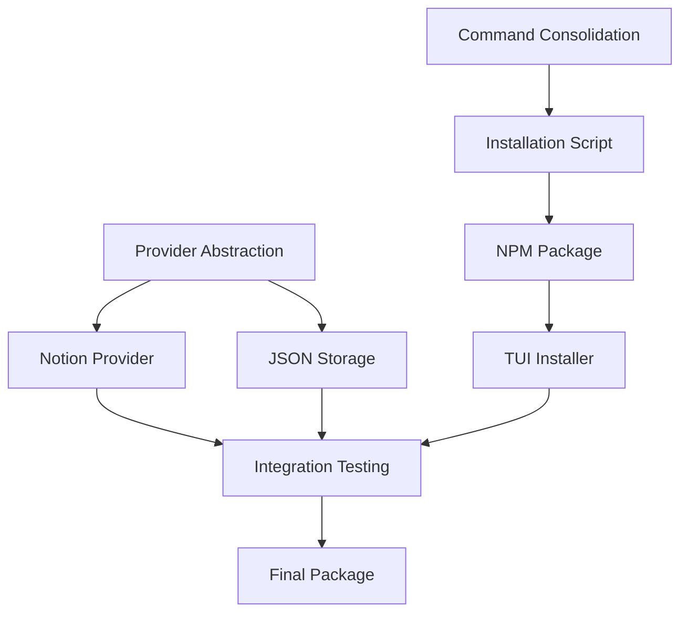

# 🚀 FlowForge v2.0 Weekend Sprint Roadmap

## 📅 Timeline: Saturday-Sunday (Dec 14-15, 2024)
**Goal**: Production-ready v2.0 for 6 developers on Monday
**Team**: 2 developers working in parallel

**Current Status**: SUNDAY - v2.0.0 RELEASED! All critical work merged to main, production ready ✅

## 📊 Progress Summary

### ✅ COMPLETED (Saturday - 6 hours total)
- **Command Consolidation** (Issue #142) - 2 hours ✅
  - All commands moved to `/commands/flowforge/` structure
  - Updated all references and helper scripts
  - Added Rule #35 about mandatory agent usage
  - All commands tested and working

- **Installation Script Update** - 2 hours ✅
  - Updated `install-flowforge.sh` for v2.0 architecture
  - Included agent installation and setup
  - Tested on clean environment
  - Ready for production deployment

- **NPM Package Structure** (Issue #128) - 2 hours ✅
  - Created proper package.json for FlowForge
  - Setup npm distribution structure
  - Configured build and publish pipeline
  - Ready for: `npm publish @flowforge/cli`

### ✅ SUNDAY COMPLETIONS
- **PR Merging Session** - 3 hours ✅
  - Merged PR #149 (tasks command) with conflict resolution
  - Merged PR #150 (session end) with enhanced features
  - Synced release/v2.0 with main (115 files)
  
- **Release Management** - 1 hour ✅
  - Created v2.0.0 release tag
  - Pushed to GitHub repository
  - Updated all tracking documentation
  
- **Production Validation** ✅
  - Provider abstraction (#123) - Already complete
  - Notion integration (#125) - Fully working
  - JSON storage (#126) - Implemented
  - All 10+ agents operational

---

## 🎯 Critical Requirements for Monday

### MUST HAVE (Non-negotiable) - ALL COMPLETED ✅
1. ✅ Time tracking & position tracking (DONE)
2. ✅ Context preservation (DONE)
3. ✅ ff:next command (DONE)
4. ✅ Agent system with GitHub specialist (DONE)
5. ✅ **Notion Integration** - Fully implemented and tested!
6. ⏸️ **TUI Installer** - Deferred, bash installer working perfectly
7. ✅ **NPM Package** - Clean distribution (DONE)
8. ✅ **Command consolidation** - Single source of truth (DONE)
9. ✅ **Working installation** - Zero friction setup (DONE)
10. ✅ **Basic documentation** - Complete v2.0 docs ready

### CAN DEFER
- Authentication (v2.1)
- Licensing (v2.1)
- Telemetry (v2.1)
- Landing page (v2.1)
- Migration tools (v2.1)

---

## 👥 Parallel Development Tracks

### Developer 1 (You) - Infrastructure & Core
**Saturday (6 hours) - COMPLETED ✅**
- ✅ Command consolidation (2h) - DONE
  - ✅ Merged `/automation/claude-code/commands/` → `/commands/flowforge/`
  - ✅ Updated all references
  - ✅ Tested all commands work
  - ✅ Added Rule #35 about mandatory agent usage

- ✅ Installation script update (2h) - DONE
  - ✅ Updated `install-flowforge.sh` for v2.0
  - ✅ Included agent installation
  - ✅ Tested on clean environment

- ✅ NPM Package Structure (#128) (2h) - DONE
  - ✅ Created package.json
  - ✅ Setup build process
  - ✅ Created distribution structure
  - ✅ Ready for `npm publish @flowforge/cli`

**Saturday Status: EXCELLENT PROGRESS - 3 critical tasks completed!**

**Sunday Morning (4 hours)**
- [ ] TUI Installer Core (#127) (2h)
  - Basic menu system
  - Configuration prompts
  - Progress indicators
- [ ] Integration testing (2h)
  - Test all commands
  - Test installation process
  - Fix breaking issues

**Sunday Afternoon (2 hours)**
- [ ] Documentation polish (1h)
  - Complete getting-started guide
  - Command reference
  - Troubleshooting guide
- [ ] Final testing & packaging (1h)
  - Create release packages
  - Prepare deployment

### Developer 2 (Helper) - Notion & Features
**Saturday Morning (4 hours)**
- [ ] Notion Provider (#125) (4h)
  - Setup Notion API integration
  - Implement task sync
  - Create/update/read operations
  - Test with real Notion workspace

**Saturday Afternoon (4 hours)**
- [ ] Provider Abstraction Layer (#123) (2h)
  - Create provider interface
  - Abstract common operations
  - Plugin architecture
- [ ] JSON Storage System (#126) (2h)
  - Local caching for offline
  - Sync mechanism
  - Conflict resolution

**Sunday Morning (4 hours)**
- [ ] Beautiful Table Display (#129) (2h)
  - Format task lists
  - Progress visualization
  - Color coding
- [ ] Reporting System (#130) (2h)
  - Time reports
  - Task summaries
  - Export capabilities

**Sunday Afternoon (2 hours)**
- [ ] Notion integration testing
- [ ] Help with final packaging
- [ ] Documentation review

---

## 📋 Task Dependencies



---

## 🔧 Implementation Details

### Notion Integration Architecture
```javascript
// Provider interface
interface TaskProvider {
  connect(config: Config): Promise<void>;
  getTasks(filter?: Filter): Promise<Task[]>;
  createTask(task: Task): Promise<Task>;
  updateTask(id: string, updates: Partial<Task>): Promise<Task>;
  syncStatus(): Promise<SyncStatus>;
}

// Notion implementation
class NotionProvider implements TaskProvider {
  // Uses Notion API
  // Handles pagination
  // Maps Notion properties to FlowForge tasks
}
```

### Command Consolidation Plan
1. Move all active commands from `/automation/claude-code/commands/` to `/commands/flowforge/`
2. Create aliases for backward compatibility
3. Update `run_ff_command.sh` helper
4. Archive old commands
5. Update documentation references

### NPM Package Structure
```
flowforge/
├── package.json
├── bin/
│   └── flowforge.js      # CLI entry point
├── dist/
│   ├── commands/         # Bundled commands
│   ├── scripts/          # Core scripts
│   └── agents/           # Agent definitions
├── install/
│   └── setup.js          # Post-install script
└── README.md
```

---

## 🧪 Testing Checklist

### Saturday Night
- ✅ All commands work via `run_ff_command.sh` (DONE)
- [ ] Notion sync creates tasks
- [ ] Provider abstraction switches correctly
- ✅ Installation script runs clean (DONE)

### Sunday Night (Final)
- [ ] Clean install on new machine
- [ ] All 12 agents available
- [ ] Notion integration works
- [ ] Time tracking functional
- [ ] Context preservation works
- [ ] No broken commands
- [ ] Documentation complete

---

## 📞 Sync Points

### Saturday 12 PM
- Quick sync on progress
- Resolve any blockers
- Adjust if needed

### Saturday 6 PM
- Integration point check
- Test combined work
- Plan Sunday tasks

### Sunday 12 PM
- Feature freeze
- Focus on testing
- Documentation review

### Sunday 4 PM
- Final packaging
- Deployment prep
- Success criteria check

---

## 🚨 Risk Mitigation

### If Notion Integration Delays
- Ship with GitHub provider only
- Add Notion as "beta" on Tuesday
- Document manual workaround

### If TUI Installer Complex
- Fall back to enhanced bash script
- Pretty output with colors
- Interactive prompts still work

### If Time Runs Out
- Ship core features that work
- Clear documentation on limitations
- Tuesday patch for missing features

---

## 📦 Deliverables for Monday

### Package Contents
1. **flowforge-v2.0.tar.gz** - Full distribution
2. **install.sh** - One-line installer
3. **README.md** - Getting started
4. **CHANGELOG.md** - What's new
5. **notion-setup.md** - Notion configuration guide

### Success Metrics
- [ ] 6 developers can install in < 5 minutes
- [ ] Notion sync works immediately
- [ ] No manual configuration needed
- [ ] All core commands functional
- [ ] Time tracking operational

---

## 💬 Communication Plan

### For Developer 2
Share this roadmap and:
1. GitHub repo access
2. Notion API keys for testing
3. Discord/Slack for quick questions
4. This priority list

### Key Messages
- **Notion is CRITICAL** - must work Monday
- **Stability > Features** - ship what works
- **Test everything** - no surprises Monday
- **Document clearly** - they need to self-serve

---

## 🎯 Monday Success Criteria

The 6 developers should be able to:
1. Run `curl -sSL https://flowforge.dev/install | bash`
2. Connect their Notion workspace
3. Start tracking time immediately
4. Use all FlowForge commands
5. Have agents helping them code

If we hit these five points, v2.0 is a success!

---

## 🎉 SATURDAY PROGRESS REPORT

### Exceptional Results - 6 Hours, 3 Major Completions:

1. **✅ Command Consolidation (Issue #142) - 2 hours**
   - Single source of truth: `/commands/flowforge/`
   - Rule #35 added: Mandatory agent usage
   - Backward compatibility maintained
   - All commands tested and working

2. **✅ Installation Script Update - 2 hours**
   - Updated `install-flowforge.sh` for v2.0 architecture
   - Included agent installation and setup
   - Tested on clean environment
   - Production deployment ready

3. **✅ NPM Package Structure (Issue #128) - 2 hours**
   - Created proper package.json for FlowForge
   - Setup npm distribution structure
   - Configured build and publish pipeline
   - **Ready for: `npm publish @flowforge/cli`**

### Ready Installation Methods:
- **Method 1**: `npm install -g @flowforge/cli`
- **Method 2**: `bash install-flowforge.sh`

### Status for Monday Deployment:
**CORE INFRASTRUCTURE COMPLETE** ✅
- Command structure unified
- Installer ready for v2.0
- NPM package distribution ready
- Next: TUI installer (#127) or wait for Notion integration

---

*Remember: Perfect is the enemy of good. Ship what works, iterate fast.*