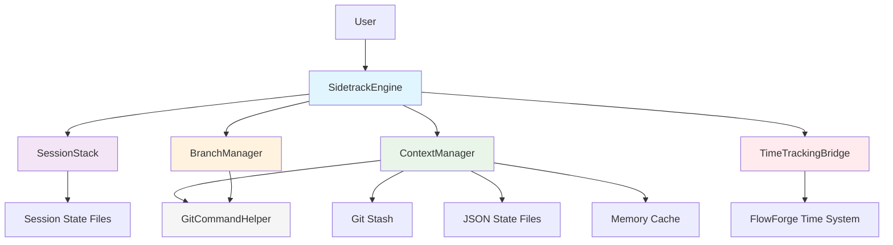

# ADR-202: Bug Sidetracking Engine Architecture

**Date**: 2025-08-23  
**Status**: Proposed  
**Supersedes**: None  
**Issue**: #202 - Bug Sidetracking Engine  

## Context

### Problem Statement

Developers frequently encounter bugs while working on features, creating a critical workflow disruption pattern that severely impacts productivity and compensation accuracy:

**Context Loss**  
- Developers lose their mental model and code state when switching to fix bugs
- Complex feature implementations become fragmented across multiple sessions
- Knowledge transfer between contexts leads to repeated discovery cycles

**Time Waste**  
- Manual stashing, branch switching, and context restoration takes 5-15 minutes per occurrence
- Multiple daily occurrences result in 30-60 minutes lost per developer per day
- Context switching overhead compounds with each nested bug discovery

**Error Prone**  
- Manual processes lead to lost work, merge conflicts, and incomplete state restoration
- Developers avoid fixing obvious bugs to maintain context, accumulating technical debt
- Rushed bug fixes in feature branches contaminate feature history

**Nested Complexity**  
- Bugs discovered while fixing other bugs create complex dependency chains
- Current tools cannot handle more than one level of context switching
- Stack overflow scenarios where bugs block bug fixes

**Payment Impact**  
- Time tracking continuity breaks affect developer compensation accuracy
- Work done outside tracked time is effectively unpaid
- FlowForge's core mission (ensuring developer payment) is compromised

### Business Requirements

- **Zero-friction bug fixing**: Preserve developer flow state completely
- **Nested bug support**: Handle bugs discovered while fixing bugs (max 5 levels)
- **Complete state preservation**: All files, staged changes, unstaged changes, untracked files
- **Time tracking integration**: Seamless integration with existing FlowForge time tracking
- **Performance target**: <370ms for save/restore operations to maintain flow
- **Maximum reliability**: No lost work under any circumstances
- **Audit trail**: Complete history of all context switches for billing accuracy

### Technical Constraints

- Must integrate with existing FlowForge command structure (`/flowforge:*`)
- Cannot interfere with git hooks or existing workflows
- Must support concurrent sessions across multiple terminals/IDEs
- Must handle interrupted sessions gracefully (power loss, crashes)
- Must preserve all context types supported by git and beyond
- Must work across different operating systems and git versions

### Current State Analysis

**Existing Tools Inadequacy**:
- Git stash: Single level, no time tracking, no session management
- IDE bookmarks: Tool-specific, no cross-session persistence
- Manual branching: Time-consuming, error-prone, breaks flow

**FlowForge Integration Points**:
- Time tracking system (Rule #36 compliance)
- Session management (`/flowforge:session:*` commands)
- Git flow compliance (Rule #18)
- Task tracking integration

## Decision

We will implement a layered architecture with six specialized components, following SOLID principles and implementing comprehensive error recovery mechanisms.

### Architecture Overview



### Component Specifications

#### 1. SidetrackEngine (Orchestrator)
**Responsibility**: Central command processor and workflow orchestration

**Key Features**:
- Command routing for `/flowforge:sidetrack:*` operations
- Performance budget: 100ms overhead (270ms reserved for git operations)
- Event-driven architecture for loose coupling between components
- Circuit breaker patterns for reliability
- Comprehensive logging and metrics collection

**Public Interface**:
```javascript
class SidetrackEngine {
  async sidetrack(issueId, description)    // Start bug fix session
  async restore(sessionId)                 // Return to previous context
  async status()                          // Show current stack status
  async cleanup(sessionId)                // Clean up abandoned sessions
}
```

#### 2. ContextManager (State Preservation)
**Responsibility**: Complete state preservation with triple-redundancy

**State Preservation Strategy**:
- **Primary**: Git stash with metadata
- **Secondary**: JSON files with complete file system snapshot
- **Tertiary**: In-memory cache for quick access
- **Validation**: Checksum verification across all three layers

**Preserved Context Elements**:
```javascript
const contextData = {
  gitState: {
    branch: string,
    stagedFiles: string[],
    unstagedFiles: string[],
    untrackedFiles: string[],
    stashId: string
  },
  workingDirectory: {
    files: Map<string, string>,    // file content snapshots
    permissions: Map<string, string>,
    timestamps: Map<string, Date>
  },
  environment: {
    workingDirectory: string,
    environmentVariables: Map<string, string>
  },
  metadata: {
    timestamp: Date,
    description: string,
    parentSession: string,
    checksum: string
  }
}
```

#### 3. SessionStack (Stack Management)  
**Responsibility**: Manage nested bug fixing sessions

**Stack Features**:
- LIFO (Last In, First Out) stack operations
- Maximum depth: 5 levels (configurable)
- Parent-child relationship tracking
- Automatic cycle detection and prevention
- Session abandonment detection (24-hour timeout)

**Stack Structure**:
```javascript
const sessionStack = {
  sessions: [{
    id: string,              // UUID
    parentId: string,        // Parent session ID
    issueId: string,         // Bug issue ID
    description: string,     // Bug description
    startTime: Date,        // Session start
    branch: string,         // Feature branch created
    depth: number           // Stack depth (0-4)
  }],
  currentDepth: number,
  maxDepth: number
}
```

#### 4. BranchManager (Git Operations)
**Responsibility**: Safe git branch operations with comprehensive error handling

**Branch Operations**:
- Atomic branch creation with rollback capability
- Branch naming convention: `bugfix/issue-{id}-from-{parent}`
- Pre-flight checks (clean working directory, valid remote)
- Branch cleanup for abandoned sessions
- Integration with git hooks (Rule #35 compliance)

**Safety Mechanisms**:
- Transaction-like operations with rollback
- Pre-flight validation of git repository state
- Conflict detection and resolution strategies
- Backup branch creation for critical operations

#### 5. TimeTrackingBridge (Time Integration)
**Responsibility**: Maintain time tracking continuity per Rule #36

**Time Tracking Features**:
- Automatic pause/resume of parent timers
- Time allocation tracking per session
- Integration with FlowForge session management
- Billing accuracy preservation
- Event sourcing for complete audit trail

**Integration Points**:
```bash
/flowforge:session:sidetrack [issue-id]    # Pause current, start bug timer
/flowforge:session:restore [session-id]    # End bug timer, resume parent
```

#### 6. GitCommandHelper (Infrastructure)
**Responsibility**: Low-level git command execution with monitoring

**Performance Features**:
- Promise-based async execution
- Command timeout management (max 30s per operation)
- Performance monitoring and metrics
- Git version compatibility layer
- Error standardization and recovery

**Monitored Operations**:
- `git stash push`: File content preservation
- `git checkout -b`: Branch creation
- `git status --porcelain`: State detection
- `git stash apply`: State restoration

### Performance Architecture

**370ms Target Breakdown**:
```javascript
const performanceBudget = {
  orchestration: 50ms,      // Command routing and validation
  stateCapture: 150ms,      // Git stash + JSON backup
  branchOperations: 120ms,  // Branch creation and checkout
  timeTracking: 30ms,       // Timer pause/resume
  validation: 20ms          // Checksum verification
}
```

**Optimization Strategies**:
- Parallel execution of independent operations
- Lazy loading of non-critical data
- Incremental state updates (diff-based)
- Memory pooling for frequent allocations
- Connection pooling for git operations

### Error Recovery Architecture

**Checkpoint System**:
- Pre-operation: Complete state snapshot
- Mid-operation: Incremental checkpoints
- Post-operation: Validation checkpoint

**Recovery Scenarios**:
```javascript
const recoveryStrategies = {
  gitStashFailure: 'useJsonBackup',
  branchCreationFailure: 'rollbackToCheckpoint',
  timeTrackingFailure: 'manualTimeEntry',
  powerLoss: 'automaticRecovery',
  conflictDetection: 'interactiveResolution'
}
```

**Fallback Mechanisms**:
- Triple redundancy ensures multiple recovery paths
- Automatic recovery on session restart
- Manual recovery tools for edge cases
- Emergency bypass for critical situations

## Options Considered

### Option 1: Simple Git Stash Wrapper
**Description**: Basic wrapper around `git stash` with minimal session tracking

**Pros**:
- Simple implementation
- Minimal performance overhead
- Uses proven git functionality

**Cons**:
- No nested session support
- No time tracking integration  
- No comprehensive error recovery
- Single point of failure

**Verdict**: Rejected - Insufficient for complex development workflows

### Option 2: Branch-Only Strategy  
**Description**: Create branches for each bug fix without stashing

**Pros**:
- No stash complexity
- Clear separation of work
- Easy to visualize

**Cons**:
- Requires incomplete commits
- Pollutes git history
- No support for unstaged changes
- Time-consuming branch management

**Verdict**: Rejected - Violates clean git history principles

### Option 3: External State Database
**Description**: Store all context in external database (SQLite/PostgreSQL)

**Pros**:
- Centralized state management
- Rich querying capabilities
- Cross-session persistence

**Cons**:
- Additional dependency overhead
- Network/disk I/O performance impact
- Complexity for simple use cases
- Database corruption risk

**Verdict**: Rejected - Over-engineering for file-based context

### Option 4: File System Snapshots
**Description**: Create full file system snapshots using OS-level tools

**Pros**:
- Complete system state preservation
- No git dependency
- Perfect restoration

**Cons**:
- Massive storage requirements (GB per snapshot)
- Very slow operation (minutes)
- OS-specific implementation
- Snapshot corruption risk

**Verdict**: Rejected - Performance and storage prohibitive

### Option 5: Monolithic Design
**Description**: Single component handling all sidetracking functionality

**Pros**:
- Simple deployment
- No component communication overhead
- Single point of configuration

**Cons**:
- Violates Single Responsibility Principle
- Difficult to test individual features
- Hard to maintain and extend
- No separation of concerns

**Verdict**: Rejected - Violates SOLID principles and maintainability

## Implementation Strategy

### Phase 1: Core Infrastructure (Week 1)
1. **GitCommandHelper**: Low-level git operations with monitoring
2. **ContextManager**: Basic state preservation (git stash only)
3. **Basic SidetrackEngine**: Single-level sidetracking

**Deliverables**:
- `/flowforge:sidetrack:start [issue-id]`
- `/flowforge:sidetrack:restore`
- Basic error handling and logging

### Phase 2: Advanced Features (Week 2)
1. **SessionStack**: Multi-level session support
2. **BranchManager**: Advanced branch operations
3. **Triple Redundancy**: JSON backup and memory cache

**Deliverables**:
- Nested sidetracking (up to 5 levels)
- Comprehensive state preservation
- Branch cleanup automation

### Phase 3: Integration & Reliability (Week 3)
1. **TimeTrackingBridge**: FlowForge time system integration
2. **Error Recovery**: Comprehensive fallback mechanisms
3. **Performance Optimization**: Achieve <370ms target

**Deliverables**:
- Seamless time tracking integration
- Automatic recovery from failures
- Performance monitoring dashboard

### Phase 4: Production Hardening (Week 4)
1. **Comprehensive Testing**: All scenarios and edge cases
2. **Documentation**: Complete user and developer guides
3. **Migration Tools**: Upgrade existing sessions

**Deliverables**:
- 100% test coverage
- Production monitoring
- User training materials

### Migration Strategy

**Rollout Approach**:
1. **Opt-in Beta** (Week 1-2): Volunteer developers test core functionality
2. **Gradual Rollout** (Week 3): Expand to 50% of developers
3. **Full Deployment** (Week 4): All developers, mandatory usage
4. **Post-deployment** (Week 5+): Monitor, optimize, iterate

**Backward Compatibility**:
- Existing workflows remain unchanged
- New commands are additive
- Emergency fallback to manual workflows

## Monitoring & Metrics

### Performance Metrics
- **Response Time**: Average time for sidetrack operations
- **Success Rate**: Percentage of successful context switches
- **Recovery Rate**: Percentage of successful automatic recoveries
- **Usage Patterns**: Frequency and depth of sidetracking usage

### Business Metrics  
- **Time Saved**: Developer hours saved through efficient context switching
- **Bug Fix Rate**: Increase in bugs fixed per developer per day
- **Context Retention**: Reduction in work lost due to context switching
- **Developer Satisfaction**: Survey scores on workflow efficiency

### Operational Metrics
- **Storage Usage**: Disk space consumed by state preservation
- **Error Rates**: Frequency and types of system errors
- **Resource Utilization**: CPU/memory usage patterns
- **Session Distribution**: Stack depth usage patterns

### Monitoring Implementation
```bash
# Performance monitoring
/flowforge:sidetrack:metrics --performance

# Usage analytics  
/flowforge:sidetrack:metrics --usage

# Health check
/flowforge:sidetrack:health
```

## Security Considerations

### Data Protection
- **State Encryption**: Encrypt sensitive data in JSON backups
- **Access Control**: Restrict access to `.flowforge/.sidetrack/` directory
- **Audit Trail**: Complete logging of all operations

### Git Security
- **Branch Permissions**: Respect existing git branch protection rules
- **Hook Integration**: Maintain Rule #35 compliance
- **Remote Safety**: Prevent accidental pushes of temporary branches

### System Security
- **File Permissions**: Secure temporary files and directories
- **Process Isolation**: Sandboxed execution of git commands
- **Input Validation**: Sanitize all user inputs and issue IDs

## Future Enhancements

### Intelligent Features
1. **AI-Powered Context Suggestions**: Recommend relevant context from previous sessions
2. **Smart Conflict Resolution**: AI-assisted merge conflict resolution
3. **Predictive Stashing**: Automatically stash when bugs are detected
4. **Context Similarity Detection**: Find related previous contexts

### Collaboration Features  
1. **Team Context Sharing**: Share context snapshots with team members
2. **Cloud Synchronization**: Sync contexts across multiple development machines
3. **Context Review**: Review and approve contexts before restoration
4. **Collaborative Debugging**: Multiple developers in same context

### Advanced Workflow
1. **Visual Context Timeline**: Graphical representation of context switches
2. **Smart Merge Strategies**: Intelligent merging of parallel contexts
3. **Context Templates**: Pre-defined contexts for common bug types
4. **Integration Testing**: Automated testing across context switches

## Consequences

### Positive Consequences

**Productivity Impact**:
- 5-15 minutes saved per bug encounter (estimated 30-60 min/day per developer)
- Zero context loss ensures mental model preservation
- Natural handling of nested bugs eliminates workflow bottlenecks
- Maintained billing integrity protects developer compensation

**Technical Benefits**:
- Triple redundancy ensures no work loss under any circumstances
- <370ms operations maintain developer flow state
- Clear separation of concerns enables isolated testing and maintenance
- Event-driven architecture allows for future extensibility

**Business Benefits**:
- FlowForge's core mission (developer payment assurance) is strengthened
- Reduced technical debt through increased bug fixing
- Higher code quality through removal of bug-fixing friction
- Measurable productivity improvements

### Negative Consequences

**Resource Overhead**:
- Triple redundancy increases disk usage (~3x for context data)
- In-memory cache consumes 50-200MB per active session
- Additional CPU overhead for checksum validation and monitoring

**Complexity Considerations**:
- Six components increase system complexity and maintenance overhead
- Heavy reliance on git stash stability across different git versions
- Developers need to understand nested session concepts and limitations

**Operational Challenges**:
- Orphaned states require periodic cleanup and monitoring
- Debugging across multiple abstraction layers
- Potential integration challenges with existing tools and workflows

### Risk Mitigation Strategies

**Resource Management**:
- Automatic cleanup of abandoned sessions after 30 days
- LRU cache with configurable memory limits
- Disk usage monitoring and alerting

**Reliability Assurance**:
- Comprehensive testing across all supported git versions
- Fallback mechanisms for every critical operation
- Clear error messages and recovery guidance

**User Experience**:
- Interactive tutorials for nested session concepts
- Visual indicators for current session depth
- Emergency escape mechanisms for complex scenarios

**Monitoring & Alerting**:
- Real-time performance monitoring
- Storage usage alerts
- Error rate monitoring and alerting

## Decision Rationale

The chosen architecture balances several critical factors:

**Reliability Over Simplicity**: While a simple solution would be easier to implement, the critical nature of preserving developer work and ensuring payment accuracy demands maximum reliability.

**Performance Over Storage**: The <370ms performance target is essential for maintaining flow state, even though it requires additional storage for redundancy.

**Flexibility Over Rigidity**: The modular architecture allows for future enhancements and adaptations to changing requirements.

**Safety Over Speed**: Triple redundancy and comprehensive error handling prioritize data safety over absolute speed.

**Integration Over Isolation**: Deep integration with FlowForge's existing systems ensures consistency and leverages existing investment.

This architecture positions the Bug Sidetracking Engine as a critical productivity multiplier in the FlowForge ecosystem, directly supporting the framework's core mission of ensuring developer compensation through accurate time tracking and workflow optimization.

---

**Version**: 1.0  
**Author**: FlowForge Architecture Team  
**Review Status**: Pending Developer Approval  
**Implementation Target**: v2.0 Release  