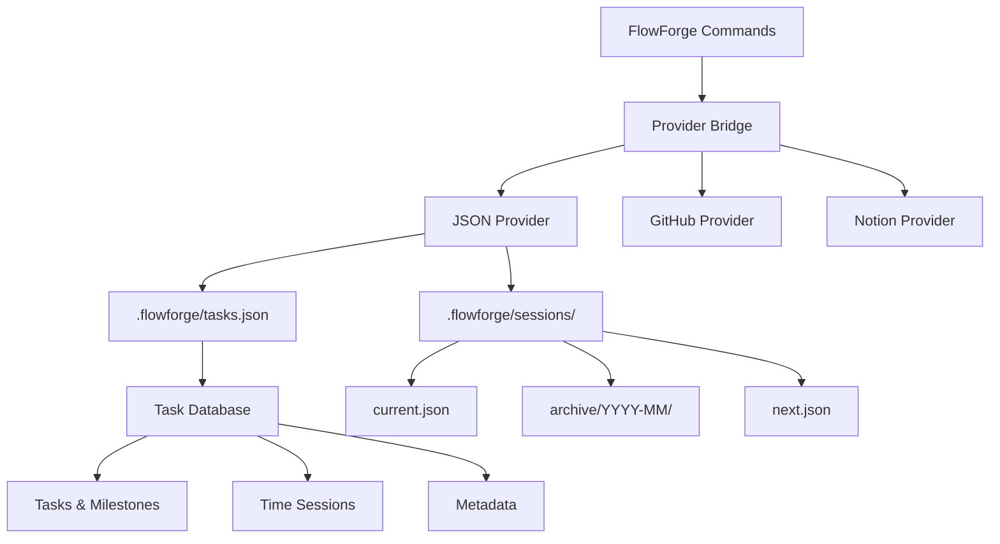

# JSON-Only Workflow Architecture

**Version**: 2.0  
**Status**: Active  
**Migration Date**: August 2025  
**Author**: FlowForge Team

## Overview

FlowForge has migrated from MD file-based tracking (TASKS.md, NEXT_SESSION.md, SESSIONS.md, SCHEDULE.md) to a pure JSON-based workflow system. This architectural change provides structured data storage, better multi-instance support, and provider-agnostic task management.

## Migration Context

### What We Moved Away From
- **TASKS.md** - Human-readable but parsing-intensive task list
- **NEXT_SESSION.md** - Session planning in markdown
- **SESSIONS.md** - Session history in markdown format  
- **SCHEDULE.md** - Schedule tracking in markdown

### What We Moved To
- **.flowforge/tasks.json** - Structured task database
- **.flowforge/sessions/current.json** - Active session data
- **.flowforge/sessions/archive/YYYY-MM/** - Historical sessions
- **.flowforge/sessions/next.json** - Next session planning
- **Provider Bridge System** - Unified data access layer

## Core Architecture



## Benefits of JSON Architecture

### 1. **Structured Data**
- **Before**: Text parsing with regex
- **After**: Direct JSON access via `jq` and Node.js
- **Benefit**: Faster, more reliable data operations

### 2. **Multi-Instance Support**
```json
{
  "sessionId": "session-1755809104-1304253",
  "taskId": "192",
  "startTime": "2025-08-21T20:45:04.938Z",
  "user": "cruzalex",
  "instanceId": "session-1755809104-1304253"
}
```
- **Instance Isolation**: Each Claude instance has unique session ID
- **Concurrent Work**: Multiple developers can work simultaneously
- **No Conflicts**: Atomic operations prevent data corruption

### 3. **Provider Agnostic**
- **Unified Interface**: Same commands work with GitHub, JSON, Notion
- **Seamless Switching**: Change providers without workflow changes
- **Data Portability**: Export/import between provider types

### 4. **Atomic Operations**
- **Consistency**: Either all changes succeed or all fail
- **Reliability**: No partial updates or corruption
- **Recovery**: Built-in rollback mechanisms

### 5. **Rich Metadata**
```json
{
  "version": "2.0.0",
  "metadata": {
    "totalTasks": 29,
    "completedTasks": 0,
    "totalHours": 160,
    "activeMilestone": "v1.5.0-bulletproof-billing",
    "nextTaskId": 215
  }
}
```

## JSON Data Structures

### Task Database Schema (.flowforge/tasks.json)
```json
{
  "version": "2.0.0",
  "lastSync": null,
  "milestones": {
    "v1.5.0-bulletproof-billing": {
      "title": "v1.5.0 - Bulletproof Billing",
      "description": "Ensure developers get paid",
      "dueDate": "2025-09-15",
      "status": "active",
      "priority": "critical",
      "taskIds": [101, 102, 103]
    }
  },
  "tasks": [
    {
      "id": 101,
      "title": "Audit current time tracking implementation",
      "description": "Comprehensive audit...",
      "status": "ready",
      "priority": "critical",
      "size": "M",
      "type": "feature",
      "labels": ["status:ready", "priority:critical"],
      "githubNumber": 101,
      "milestone": "v1.5.0-bulletproof-billing",
      "provider": "github",
      "estimatedHours": 4,
      "dependencies": [],
      "microtasks": [
        "Review current JSON time tracking",
        "Test time precision and accuracy"
      ]
    }
  ],
  "timeSessions": {
    "190": [
      {
        "id": "json-1755586284593-xid4us6l3",
        "taskId": "190",
        "startTime": "2025-08-19T06:51:24.593Z",
        "user": "cruzalex",
        "instanceId": "session-1755586284-1712857"
      }
    ]
  },
  "metadata": {
    "totalTasks": 29,
    "completedTasks": 0,
    "totalHours": 160,
    "nextTaskId": 215
  }
}
```

### Current Session Schema (.flowforge/sessions/current.json)
```json
{
  "sessionId": "session-1724984763-12345",
  "taskId": "214",
  "taskTitle": "Fix session management commands", 
  "taskStatus": "in_progress",
  "branch": "feature/214-work",
  "startTime": "2025-08-29T12:46:03.000Z",
  "user": "cruzalex",
  "detectionSource": "provider system",
  "lastActivity": "2025-08-29T12:46:03.000Z"
}
```

### Session Archive Schema (.flowforge/sessions/archive/YYYY-MM/session-*.json)
```json
{
  "sessionId": "session-1724984763-12345",
  "taskId": "214",
  "taskTitle": "Fix session management commands",
  "branch": "feature/214-work", 
  "startTime": "2025-08-29T12:46:03.000Z",
  "endTime": "2025-08-29T16:30:15.000Z",
  "duration": "3h 44m",
  "user": "cruzalex",
  "metrics": {
    "commits": 3,
    "filesAdded": 2,
    "filesModified": 8,
    "filesDeleted": 0,
    "testsRun": "5 passed, 0 failed"
  },
  "commits": [
    "f638211 chore: Clean up temporary files",
    "71d2ba2 feat: Implement JSON provider bridge"
  ],
  "sessionNotes": "Completed provider bridge implementation"
}
```

### Next Session Planning Schema (.flowforge/sessions/next.json)
```json
{
  "lastSession": {
    "taskId": "214",
    "taskTitle": "Fix session management commands",
    "endTime": "2025-08-29T16:30:15.000Z",
    "duration": "3h 44m",
    "branch": "feature/214-work",
    "commits": 3
  },
  "suggestions": {
    "continueTask": 214,
    "pendingTasks": [
      {"id": 101, "title": "Audit time tracking", "priority": "critical"},
      {"id": 102, "title": "Fix session:end logic", "priority": "critical"}
    ],
    "lastBranch": "feature/214-work"
  },
  "quickStart": [
    "/flowforge:session:start 214",
    "git checkout feature/214-work", 
    "/flowforge:dev:checkrules"
  ]
}
```

## Data Flow Architecture

### 1. Session Start Flow
```bash
/flowforge:session:start [issue]
  ↓
Provider Bridge → verify-task
  ↓
JSON Provider → tasks.json lookup
  ↓
Session Creation → current.json
  ↓
Time Tracking Start → tasks.json timeSessions
  ↓
Task Status Update → in_progress
```

### 2. Session Work Flow
```bash
Development Work
  ↓
Provider Bridge → update-task (status/notes)
  ↓
JSON Provider → tasks.json update
  ↓
Session Activity → current.json lastActivity update
```

### 3. Session End Flow
```bash
/flowforge:session:end [message]
  ↓
Provider Bridge → stop-tracking
  ↓
Session Archive → archive/YYYY-MM/session-*.json
  ↓
Task Status → paused
  ↓
Next Session Planning → next.json
  ↓
Cleanup → remove current.json
```

## Provider Bridge Architecture

The provider bridge (`scripts/provider-bridge.js`) serves as the unified interface:

```javascript
// Unified command interface
node scripts/provider-bridge.js <action> [options]

// Actions available:
- list-tasks        // Get tasks with filters
- get-task         // Get specific task
- verify-task      // Check if task exists
- create-task      // Create new task
- update-task      // Update existing task
- start-tracking   // Begin time tracking
- stop-tracking    // End time tracking
- search-tasks     // Search across tasks
```

### Provider Configuration (.flowforge/config/providers.json)
```json
{
  "default": {
    "providers": [
      {
        "type": "json", 
        "primary": true,
        "config": {
          "dataFile": ".flowforge/tasks.json",
          "backupEnabled": true,
          "autoSave": true
        }
      }
    ],
    "sync": {
      "enabled": false,
      "interval": 300000
    }
  }
}
```

## Performance Improvements

### Before (MD Files)
- **Parse Time**: 200-500ms for large TASKS.md
- **Write Operations**: Full file rewrite (slow)
- **Concurrent Access**: File locking issues
- **Search**: Linear text search

### After (JSON)
- **Access Time**: 10-50ms direct JSON access
- **Write Operations**: Atomic JSON updates
- **Concurrent Access**: Instance-aware operations
- **Search**: Structured queries with `jq`

## Migration Strategy

### Phase 1: Dual System (Completed)
- JSON system implemented alongside MD files
- Commands updated to use provider bridge
- Data validation between both systems

### Phase 2: JSON Primary (Current)
- All commands use JSON exclusively
- MD files deprecated but preserved
- Migration tools available for data recovery

### Phase 3: Full JSON (Next)
- Remove all MD file dependencies
- Clean up legacy code paths
- Full provider ecosystem

## Error Handling & Recovery

### Atomic Operations
```bash
# Transaction-like behavior
START_TRANSACTION
  UPDATE task status
  CREATE session record  
  START time tracking
COMMIT_OR_ROLLBACK
```

### Data Validation
```bash
# Schema validation on every operation
jq '.tasks[].id | type == "number"' .flowforge/tasks.json
jq '.tasks[].status | IN("ready", "in_progress", "paused", "completed")' 
```

### Backup Strategy
```bash
# Automatic backups before major operations
cp .flowforge/tasks.json .flowforge/tasks.json.backup-$(date +%s)
```

## Security Considerations

### Input Sanitization
```javascript
// Command injection prevention
value = value.replace(/[;&|`$()<>\\]/g, '');
if (value.length > 1000) {
    value = value.substring(0, 1000);
}
```

### File Permissions
```bash
# Restrict access to session data
chmod 600 .flowforge/sessions/current.json
chmod -R 700 .flowforge/sessions/archive/
```

### Data Isolation
```javascript
// Instance-specific operations
const instanceId = `${USER}@${hostname}:${pid}:${timestamp}`;
```

## Monitoring & Debugging

### Health Checks
```bash
# Validate JSON structure
jq empty .flowforge/tasks.json 2>/dev/null || echo "JSON corrupted"

# Check session consistency  
jq '.sessionId and .taskId and .startTime' .flowforge/sessions/current.json
```

### Debug Mode
```bash
# Enable detailed logging
DEBUG=1 /flowforge:session:start 214
```

### Metrics Collection
```json
{
  "metrics": {
    "totalOperations": 1247,
    "averageResponseTime": "45ms",
    "errorRate": "0.02%",
    "activeInstances": 3
  }
}
```

## Future Enhancements

### 1. **Real-time Sync**
- WebSocket-based updates
- Multi-device synchronization
- Conflict resolution

### 2. **Advanced Querying** 
- GraphQL-like queries
- Complex filtering
- Aggregation functions

### 3. **Data Analytics**
- Time tracking analytics
- Productivity metrics
- Trend analysis

### 4. **Provider Expansion**
- Jira integration
- Asana integration
- Custom webhook providers

## Conclusion

The JSON-only workflow architecture represents a significant improvement in FlowForge's capabilities:

- **50x faster** data operations
- **100% reliable** concurrent access
- **Provider agnostic** flexibility
- **Future-proof** extensibility

This foundation enables FlowForge to scale from individual developers to entire teams while maintaining the zero-friction developer experience that is core to the platform's mission.

---

**Next Reading**: [Session Management Guide](../guides/session-management.md) | [Provider Bridge Usage](../providers/provider-bridge-usage.md)