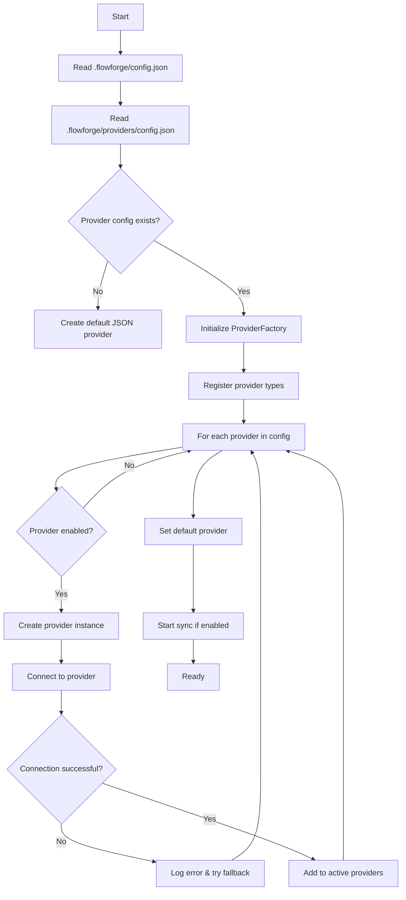

# FlowForge Provider Configuration Specification

## Overview

The FlowForge Provider System is a flexible architecture that allows projects to use different task management backends while maintaining a unified interface. This document provides a complete specification for configuring providers in FlowForge v2.0.

## Architecture

### Provider Factory Pattern

```
┌─────────────────────────────────────────────────────────┐
│                    ProviderFactory                       │
│  - Singleton instance managing all providers             │
│  - Registers provider types (JSON, GitHub, Notion)       │
│  - Creates and manages provider instances                │
│  - Handles multi-provider operations                     │
└─────────────────────────────────────────────────────────┘
                            │
        ┌───────────────────┼───────────────────┐
        ▼                   ▼                   ▼
┌──────────────┐   ┌──────────────┐   ┌──────────────┐
│ JsonProvider │   │GitHubProvider│   │NotionProvider│
│              │   │              │   │              │
│ Local file   │   │ GitHub API  │   │ Notion API   │
│ storage      │   │ integration  │   │ integration  │
└──────────────┘   └──────────────┘   └──────────────┘
```

### Provider Bridge

The `provider-bridge.js` script acts as a CLI bridge between bash commands and the provider system:
- Parses command-line arguments
- Initializes appropriate providers
- Executes operations through the provider abstraction
- Returns formatted output (JSON, text, markdown, simple)

## Configuration File Structure

### Primary Configuration: `.flowforge/config.json`

This is the main FlowForge configuration file that defines the project settings and tracking system:

```json
{
  "version": "2.0.0",
  "project": {
    "name": "MyProject",
    "type": "software",
    "created": "2025-01-01T00:00:00Z",
    "integrationMode": "standard"
  },
  "trackingSystem": {
    "type": "json|github|notion",
    "provider": "json-default|github-main|notion-workspace",
    "repository": "owner/repo",        // For GitHub
    "databaseId": "xxx-xxx-xxx",       // For Notion
    "syncEnabled": true,
    "mirrorToJson": true,               // Keep local JSON cache
    "syncInterval": 300000              // 5 minutes in ms
  },
  "enforcement": {
    "level": "immediate",
    "rules": {
      "enforceTests": true,
      "requireIssues": true,
      "documentationRequired": true,
      "gitFlow": true,
      "noAIReferences": true
    }
  }
}
```

### Provider-Specific Configuration: `.flowforge/providers/config.json`

This file contains detailed provider configurations:

```json
{
  "version": "2.0.0",
  "mode": "json|github|notion|hybrid",
  "defaultProvider": "json-default",
  "providers": [
    {
      "name": "json-default",
      "type": "json",
      "enabled": true,
      "priority": 1,
      "settings": {
        "filePath": ".flowforge/tasks.json",
        "backupPath": ".flowforge/backups/tasks",
        "autoSave": true,
        "saveInterval": 5000,
        "compression": false,
        "encryption": false
      }
    },
    {
      "name": "github-main",
      "type": "github",
      "enabled": false,
      "priority": 2,
      "settings": {
        "token": "${GITHUB_TOKEN}",
        "owner": "JustCode-CruzAlex",
        "repo": "MyProject",
        "projectNumber": 1,
        "defaultLabels": ["flowforge", "task"],
        "autoClose": true,
        "syncStrategy": "bidirectional",
        "cacheTTL": 60000
      }
    },
    {
      "name": "notion-workspace",
      "type": "notion",
      "enabled": false,
      "priority": 3,
      "settings": {
        "apiKey": "${NOTION_API_KEY}",
        "databaseId": "xxx-xxx-xxx",
        "workspaceId": "xxx-xxx-xxx",
        "fieldMapping": {
          "title": "Name",
          "status": "Status",
          "priority": "Priority",
          "assignee": "Assigned To",
          "dueDate": "Due Date",
          "labels": "Tags"
        },
        "syncInterval": 300000,
        "pageSize": 100
      }
    }
  ],
  "sync": {
    "enabled": false,
    "interval": 300000,
    "strategy": "merge|overwrite|manual",
    "conflictResolution": "local|remote|manual",
    "batchSize": 50
  },
  "cache": {
    "enabled": true,
    "ttl": 60000,
    "maxSize": "10MB",
    "location": ".flowforge/providers/cache"
  },
  "fallback": {
    "enabled": true,
    "provider": "json-default",
    "conditions": ["network_error", "auth_failure", "rate_limit"]
  }
}
```

## Provider Modes

### 1. JSON-Only Mode (Default)
- **Use Case**: Local development, offline work, simple projects
- **Configuration**:
  ```json
  {
    "mode": "json",
    "defaultProvider": "json-default",
    "providers": [
      {
        "name": "json-default",
        "type": "json",
        "enabled": true,
        "settings": {
          "filePath": ".flowforge/tasks.json",
          "autoSave": true
        }
      }
    ]
  }
  ```
- **Benefits**:
  - No external dependencies
  - Works offline
  - Fast performance
  - Version control friendly
  - No authentication required

### 2. GitHub + JSON Mode
- **Use Case**: Open source projects, GitHub-centric workflows
- **Configuration**:
  ```json
  {
    "mode": "github",
    "defaultProvider": "github-main",
    "providers": [
      {
        "name": "github-main",
        "type": "github",
        "enabled": true,
        "priority": 1,
        "settings": {
          "token": "${GITHUB_TOKEN}",
          "owner": "username",
          "repo": "project",
          "projectNumber": 1
        }
      },
      {
        "name": "json-cache",
        "type": "json",
        "enabled": true,
        "priority": 2,
        "settings": {
          "filePath": ".flowforge/cache/tasks.json",
          "autoSave": true
        }
      }
    ],
    "sync": {
      "enabled": true,
      "interval": 300000,
      "strategy": "merge"
    }
  }
  ```
- **Benefits**:
  - GitHub Issues integration
  - Automatic sync with GitHub Projects
  - Local cache for offline work
  - PR/Issue linking
  - Team collaboration

### 3. Notion + JSON Mode
- **Use Case**: Product teams, comprehensive documentation needs
- **Configuration**:
  ```json
  {
    "mode": "notion",
    "defaultProvider": "notion-workspace",
    "providers": [
      {
        "name": "notion-workspace",
        "type": "notion",
        "enabled": true,
        "priority": 1,
        "settings": {
          "apiKey": "${NOTION_API_KEY}",
          "databaseId": "xxx-xxx-xxx",
          "fieldMapping": {
            "title": "Task Name",
            "status": "Status",
            "priority": "Priority Level"
          }
        }
      },
      {
        "name": "json-backup",
        "type": "json",
        "enabled": true,
        "priority": 2,
        "settings": {
          "filePath": ".flowforge/backup/tasks.json"
        }
      }
    ]
  }
  ```
- **Benefits**:
  - Rich content in tasks
  - Advanced filtering/views
  - Team collaboration
  - Integration with docs
  - Custom properties

### 4. Hybrid Mode (Multiple Active Providers)
- **Use Case**: Complex projects with multiple teams
- **Configuration**:
  ```json
  {
    "mode": "hybrid",
    "defaultProvider": "json-default",
    "providers": [
      {
        "name": "json-default",
        "type": "json",
        "enabled": true,
        "priority": 1
      },
      {
        "name": "github-dev",
        "type": "github",
        "enabled": true,
        "priority": 2,
        "settings": {
          "owner": "company",
          "repo": "dev-tasks"
        }
      },
      {
        "name": "notion-product",
        "type": "notion",
        "enabled": true,
        "priority": 3,
        "settings": {
          "databaseId": "product-roadmap"
        }
      }
    ],
    "sync": {
      "enabled": true,
      "strategy": "selective",
      "rules": [
        {
          "source": "github-dev",
          "target": "json-default",
          "filter": { "labels": ["dev"] }
        },
        {
          "source": "notion-product",
          "target": "json-default",
          "filter": { "labels": ["product"] }
        }
      ]
    }
  }
  ```

## FlowForge-on-FlowForge Configuration

FlowForge manages itself using a special configuration:

### Detection
The system detects FF-on-FF through:
1. Project name in `.flowforge/config.json` equals "FlowForge"
2. Repository URL contains "FlowForge"
3. Presence of FF-specific directories (`/agents`, `/commands/flowforge`)

### Special Configuration
```json
{
  "version": "2.0.0",
  "project": {
    "name": "FlowForge",
    "type": "framework",
    "selfManaged": true
  },
  "trackingSystem": {
    "type": "github",
    "provider": "github-flowforge",
    "repository": "JustCode-CruzAlex/FlowForge",
    "syncEnabled": true,
    "mirrorToJson": true
  },
  "providers": [
    {
      "name": "github-flowforge",
      "type": "github",
      "enabled": true,
      "priority": 1,
      "settings": {
        "token": "${GITHUB_TOKEN}",
        "owner": "JustCode-CruzAlex",
        "repo": "FlowForge",
        "projectNumber": 1,
        "defaultLabels": ["v2.0", "flowforge"],
        "autoClose": false
      }
    },
    {
      "name": "json-local",
      "type": "json",
      "enabled": true,
      "priority": 2,
      "settings": {
        "filePath": ".flowforge/tasks.json",
        "autoSave": true,
        "saveInterval": 5000
      }
    }
  ],
  "features": {
    "dogfooding": true,
    "experimentalAgents": true,
    "v2CommandNamespace": true
  }
}
```

## Configuration Validation

### Required Fields per Provider Type

#### JSON Provider
- `filePath` (required): Path to JSON file
- `autoSave` (optional, default: true): Auto-save changes
- `saveInterval` (optional, default: 5000): Save interval in ms

#### GitHub Provider
- `token` (required): GitHub personal access token
- `owner` (required): Repository owner
- `repo` (required): Repository name
- `projectNumber` (optional): GitHub Project number

#### Notion Provider
- `apiKey` (required): Notion API key
- `databaseId` (required): Notion database ID
- `fieldMapping` (required): Field mapping configuration

### Validation Rules

1. **Provider Names**: Must be unique across all providers
2. **Provider Types**: Must be one of: `json`, `github`, `notion`, `custom`
3. **Priority**: Must be unique positive integer (1-100)
4. **Environment Variables**: Tokens/keys can reference env vars using `${VAR_NAME}`
5. **File Paths**: Must be relative to project root or absolute
6. **Sync Interval**: Must be >= 30000ms (30 seconds) to avoid rate limiting

### Error Messages

```javascript
// Provider validation errors
{
  "DUPLICATE_NAME": "Provider name '{name}' already exists",
  "INVALID_TYPE": "Provider type '{type}' is not supported",
  "MISSING_REQUIRED": "Required field '{field}' is missing for {type} provider",
  "INVALID_PATH": "File path '{path}' is not accessible",
  "AUTH_FAILURE": "Authentication failed for {provider}: {message}",
  "NETWORK_ERROR": "Network error connecting to {provider}",
  "RATE_LIMIT": "Rate limit exceeded for {provider}",
  "SYNC_CONFLICT": "Sync conflict between {source} and {target}"
}
```

## Provider Initialization Flow



## Usage Examples

### Switching Providers via CLI

```bash
# List available providers
node scripts/provider-bridge.js get-provider --format=json

# Use specific provider
node scripts/provider-bridge.js list-tasks --provider=github-main

# Create task with specific provider
node scripts/provider-bridge.js create-task \
  --provider=notion-workspace \
  --title="New Feature" \
  --priority=high
```

### Programmatic Provider Usage

```javascript
const { initializeProviders } = require('./src/providers/init');
const config = require('./.flowforge/providers/config.json');

// Initialize factory with providers
const factory = await createProvidersFromConfig(config, logger);

// Get default provider
const provider = factory.getActiveProvider();

// Use provider
const tasks = await provider.listTasks({ status: 'open' });

// Switch providers
factory.setActiveProvider('github-main');

// Multi-provider aggregation
const allTasks = await factory.aggregateTasks({ priority: 'high' });
```

## Migration Guide

### From v1.x to v2.0

1. **Backup existing configuration**:
   ```bash
   cp .flowforge/config.json .flowforge/config.json.backup
   ```

2. **Run migration script**:
   ```bash
   node scripts/migrate-config.js
   ```

3. **Review generated provider config**:
   ```bash
   cat .flowforge/providers/config.json
   ```

4. **Update environment variables**:
   ```bash
   export GITHUB_TOKEN="your-token"
   export NOTION_API_KEY="your-key"
   ```

5. **Test configuration**:
   ```bash
   node scripts/provider-bridge.js list-tasks
   ```

## Security Considerations

1. **Token Storage**: Never commit tokens/API keys. Use environment variables
2. **File Permissions**: Ensure `.flowforge/providers/` has restricted permissions
3. **Encryption**: Enable encryption for sensitive JSON data
4. **Audit Logging**: All provider operations are logged for audit trail
5. **Rate Limiting**: Respect provider API rate limits with appropriate intervals

## Troubleshooting

### Common Issues

1. **Provider not found**:
   - Check provider name in config matches exactly
   - Ensure provider type is registered
   - Verify provider is enabled

2. **Authentication failures**:
   - Verify environment variables are set
   - Check token permissions (GitHub needs repo, project scopes)
   - Ensure API keys are valid and not expired

3. **Sync conflicts**:
   - Review conflict resolution strategy
   - Check for concurrent modifications
   - Use `mirrorToJson` for backup

4. **Performance issues**:
   - Adjust sync intervals
   - Enable caching
   - Use batch operations
   - Consider JSON-only mode for large datasets

## Future Enhancements

- **Planned Providers**: JIRA, Trello, Asana, Linear
- **Advanced Sync**: Conflict-free replicated data types (CRDTs)
- **Provider Plugins**: Custom provider development SDK
- **Multi-tenancy**: Per-user provider configurations
- **Webhooks**: Real-time sync via provider webhooks
- **GraphQL Support**: Unified query interface across providers

## Multi-Developer Architecture

### Provider Routing Layer

In multi-developer environments, FlowForge implements a sophisticated routing layer that manages provider access across team members:

```
┌─────────────────────────────────────────────────────────────┐
│                    Multi-Developer Router                    │
│                                                             │
│  ┌─────────────┐  ┌─────────────┐  ┌─────────────┐        │
│  │   Dev 1     │  │   Dev 2     │  │   Dev N     │        │
│  │ Namespace   │  │ Namespace   │  │ Namespace   │        │
│  └─────────────┘  └─────────────┘  └─────────────┘        │
│           │             │             │                    │
│  ┌─────────────────────────────────────────────────────────┐│
│  │              Request Router                             ││
│  │  - Developer identification                             ││
│  │  - Namespace-aware routing                              ││
│  │  - Load balancing                                       ││
│  │  - Permission enforcement                               ││
│  └─────────────────────────────────────────────────────────┘│
│           │                                                 │
│  ┌─────────────────────────────────────────────────────────┐│
│  │              Shared Provider Layer                      ││
│  │                                                         ││
│  │   ┌─────────┐    ┌─────────┐    ┌─────────┐           ││
│  │   │ Notion  │    │ GitHub  │    │ JSON    │           ││
│  │   │Provider │    │Provider │    │Provider │           ││
│  │   └─────────┘    └─────────┘    └─────────┘           ││
│  └─────────────────────────────────────────────────────────┘│
└─────────────────────────────────────────────────────────────┘
```

### Data Isolation Boundaries

FlowForge ensures strict data isolation while enabling team collaboration:

1. **Namespace Level Isolation**:
   - Each developer operates in a unique namespace
   - Data filtering based on namespace context
   - Cross-namespace access controlled by permissions

2. **Provider Instance Sharing**:
   - Shared provider instances for efficiency
   - Per-developer authentication and filtering
   - Automatic user context injection

3. **Cache Isolation**:
   - Per-developer cache layers
   - Shared cache for team-level data
   - Cache invalidation strategies

### Team Provider Configuration

```json
{
  "version": "2.0.0",
  "mode": "multi-developer",
  "teamId": "flowforge-demo-team",
  "routing": {
    "strategy": "namespace-aware",
    "loadBalancing": "round-robin",
    "failover": "cascade"
  },
  "providers": [
    {
      "name": "team-notion",
      "type": "notion",
      "enabled": true,
      "shared": true,
      "multiDeveloper": {
        "isolation": "user-filter",
        "sharedDatabase": true,
        "perDeveloperAuth": true
      },
      "settings": {
        "databaseId": "${SHARED_DATABASE_ID}",
        "fieldMapping": {
          "assignee": "Assignee"
        },
        "userFilter": {
          "enabled": true,
          "field": "Assignee",
          "strategy": "auto-detect"
        }
      }
    }
  ],
  "namespaces": {
    "dev1": {
      "isolation": "strict",
      "permissions": ["read", "write", "execute"],
      "cache": {
        "strategy": "individual",
        "ttl": 300000
      }
    },
    "dev2": {
      "isolation": "strict",
      "permissions": ["read", "write", "execute"],
      "cache": {
        "strategy": "individual",
        "ttl": 300000
      }
    }
  }
}
```

### Performance Considerations for Teams

1. **Connection Pooling**:
   - Shared connections across developers
   - Connection reuse and optimization
   - Graceful degradation under load

2. **Caching Strategy**:
   - Multi-level caching (individual, team, global)
   - Cache coherence across developers
   - Smart invalidation based on changes

3. **Batch Operations**:
   - Aggregated operations for efficiency
   - Bulk data synchronization
   - Optimized team-level queries

### Scalability Notes for Teams

1. **Team Size Recommendations**:
   - Optimal: 2-10 developers per team
   - Tested: Up to 50 developers per team
   - Enterprise: Custom scaling solutions

2. **Resource Utilization**:
   - Memory usage scales linearly with team size
   - Network bandwidth optimization through batching
   - Storage efficiency through shared resources

3. **Performance Monitoring**:
   - Per-developer performance metrics
   - Team-level aggregation performance
   - Provider utilization monitoring

## Conclusion

The FlowForge Provider System offers flexible task management backend options while maintaining a consistent interface. Projects can start with simple JSON storage and evolve to use cloud-based providers as needed, with seamless migration paths and fallback mechanisms ensuring reliability.

The multi-developer architecture extends this flexibility to team environments, providing namespace isolation, intelligent routing, and optimized performance for collaborative workflows while maintaining individual productivity tracking and data integrity.