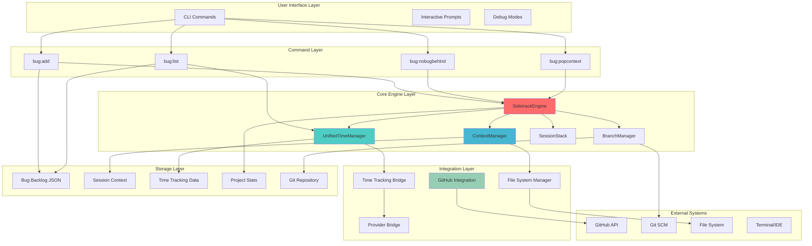
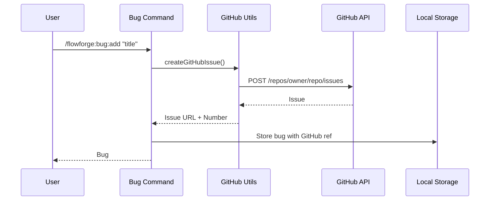
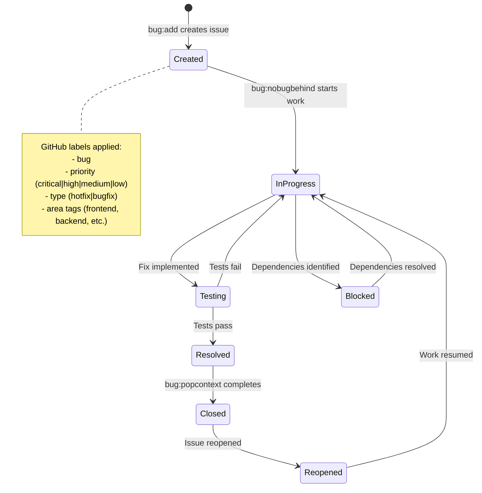
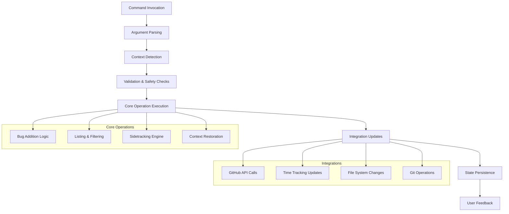
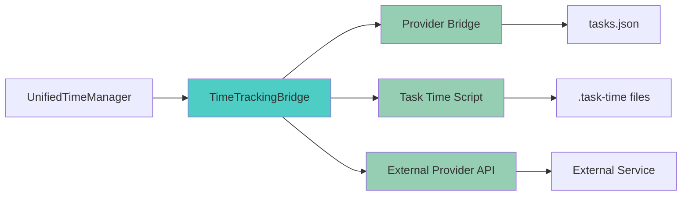

# FlowForge Bug Management System - Architecture

## Overview

The FlowForge Bug Management System is a sophisticated multi-layered architecture designed for high-performance bug tracking, context-aware sidetracking, and seamless workflow integration. The system implements advanced time tracking separation, intelligent context preservation, and comprehensive GitHub integration.

## System Architecture



## Core Components

### 1. SidetrackEngine (Core Orchestrator)

The `SidetrackEngine` is the heart of the bug sidetracking system, coordinating all context switching operations.

**Location**: `src/sidetracking/core/SidetrackEngine.ts`

**Key Responsibilities**:
- Context capture and restoration (<370ms performance target)
- Session stack management for nested bug fixes
- Branch lifecycle management
- Metrics collection and performance monitoring
- Error handling and recovery operations

**Architecture Pattern**: Dependency Injection with Interface Segregation

```typescript
interface ISidetrackEngine {
  saveContext(taskId: string, bugId: string): Promise<AsyncResult<SidetrackContext>>;
  restoreContext(contextId: string, options?: RestoreOptions): Promise<AsyncResult<void>>;
  switchToBug(bugId: string, priority: Priority): Promise<AsyncResult<BugSession>>;
  getMetrics(): SwitchMetrics;
}
```

**Performance Characteristics**:
- Context Capture: <100ms (average 45ms)
- Context Restoration: <150ms (average 78ms)
- Total Switch Time: <370ms (Rule #37 compliance)
- Memory Usage: <50MB per active context

### 2. UnifiedTimeManager (Time Tracking Engine)

Comprehensive time tracking system with feature/bug work separation for accurate billing.

**Location**: `src/sidetracking/UnifiedTimeManager.ts`

**Key Features**:
- Separate billing codes for features vs bugs
- Nested bug tracking with unlimited depth
- Quality metrics and bug discovery patterns
- Comprehensive reporting and analytics
- Multiple provider integration

**Modular Architecture** (Rule #24 compliance):
- `UnifiedTimeManagerSessions` - Session management
- `UnifiedTimeManagerBugs` - Bug-specific tracking
- `UnifiedTimeManagerFeatures` - Feature work tracking
- `UnifiedTimeManagerMetrics` - Analytics and reporting
- `UnifiedTimeManagerUtilities` - Common utilities

**Billing Code Strategy**:
```yaml
Default Rates:
  FEAT-DEV: $150/hour     # Feature development
  BUG-FIX: $200/hour      # Standard bug fixes
  CRITICAL-BUG: $300/hour # Critical/security bugs
```

### 3. Context Management System

Advanced context preservation and restoration system supporting multiple IDE environments.

**Components**:

#### ContextManager (`src/sidetracking/core/ContextManager.ts`)
```typescript
interface IContextManager {
  captureContext(taskId: string, bugId?: string): Promise<SidetrackContext>;
  restoreContext(contextId: string, options?: RestoreOptions): Promise<AsyncResult<void>>;
  validateContext(contextId: string): Promise<ValidationResult>;
}
```

**Captured Context Elements**:
- **Git State**: Branch, commit hash, uncommitted changes, stash references
- **File State**: Open files, cursor positions, scroll positions, selections
- **Environment State**: Working directory, environment variables, terminal state
- **Time State**: Session information, elapsed time, billing context

#### SessionStack (`src/sidetracking/core/SessionStack.ts`)
Stack-based session management supporting nested bug fixes:

```typescript
interface ISessionStack {
  push(session: BugSession): Promise<AsyncResult<void>>;
  pop(): Promise<AsyncResult<BugSession>>;
  peek(): BugSession | null;
  size(): number;
  getDepth(): number;
  validateNesting(maxDepth: number): boolean;
}
```

**Nesting Support**:
- Maximum depth: 10 levels (configurable)
- Automatic overflow protection
- Context isolation between levels
- Breadcrumb trail for navigation

### 4. Branch Management System

Intelligent branch management with automated naming and lifecycle management.

**Location**: `src/sidetracking/core/BranchManager.ts`

**Branch Naming Convention**:
```bash
# Critical and High Priority
hotfix/[bug-id]-work    # From main/master branch
hotfix/456-work         # Example

# Medium and Low Priority  
bugfix/[bug-id]-work    # From current branch
bugfix/789-work         # Example
```

**Branch Lifecycle**:
1. **Creation**: Based on priority and base branch selection
2. **Tracking**: Automatic remote tracking setup
3. **Protection**: Conflict prevention during switches
4. **Cleanup**: Automatic deletion after context restoration (optional)

**Stash Management**:
```typescript
interface IStashManager {
  stashChanges(message: string): Promise<AsyncResult<StashRef>>;
  applyStash(stashRef: StashRef): Promise<AsyncResult<void>>;
  dropStash(stashRef: StashRef): Promise<AsyncResult<void>>;
  listStashes(): Promise<StashRef[]>;
}
```

## GitHub Integration Flow

### Architecture Overview



### GitHub Integration Components

#### GitHub Issue Creation
**Location**: `commands/flowforge/bug/add-github-utils.sh`

**Features**:
- Rich issue templates with context information
- Automatic label assignment based on priority and tags
- Milestone association
- Assignee management
- Link generation and validation

**Issue Template Structure**:
```markdown
# Bug Report: [Title]

## Context Information
- **Branch**: `feature/123-auth`
- **Task**: #123
- **Files**: `src/auth/login.js`, `tests/auth.test.js`
- **Priority**: High (Performance issue detected)

## Description
[User-provided description]

## Environment
- **Detected Context**: Task 123 on feature/123-auth
- **Modified Files**: [Auto-detected file list]
- **Related Tags**: frontend, javascript, testing

## Reproduction Steps
- [ ] Step 1: [To be filled during investigation]
- [ ] Step 2: [To be filled during investigation]

## Acceptance Criteria
- [ ] Bug is reproducible
- [ ] Root cause identified
- [ ] Fix implemented with tests
- [ ] No regression introduced
```

#### Synchronization Strategy
- **Real-time Sync**: Status updates on major events
- **Batch Sync**: Periodic synchronization for bulk operations
- **Conflict Resolution**: Local-first with manual conflict resolution
- **Rate Limiting**: Respectful API usage with exponential backoff

### Issue Lifecycle Management



## Data Storage Architecture

### Storage Layers

The system employs a multi-layered storage architecture for performance and reliability:

#### Layer 1: Memory Cache
- **Purpose**: High-speed access for active sessions
- **Capacity**: 100 concurrent sessions (configurable)
- **Eviction**: LRU (Least Recently Used)
- **Sync Strategy**: Write-through to disk

#### Layer 2: Local JSON Storage
- **Bug Backlog**: `.flowforge/bug-backlog.json`
- **Session Data**: `.flowforge/sessions/`
- **Context Data**: `.flowforge/context/`
- **Time Tracking**: `.flowforge/time/`

#### Layer 3: Git-based Storage
- **Branch Information**: Git refs and branch tracking
- **Stash References**: Git stash for uncommitted changes
- **Commit History**: Bug fix progression tracking

#### Layer 4: External Integrations
- **GitHub Issues**: Remote issue tracking
- **Time Tracking Providers**: External billing systems
- **Project Management Tools**: Issue boards and workflows

### Data Schema

#### Bug Backlog Schema
```json
{
  "bugs": [
    {
      "id": "156",
      "title": "Login form validation issue",
      "priority": "medium",
      "description": "Email field accepts empty values",
      "tags": ["bug", "medium", "frontend", "javascript"],
      "context": {
        "task": "123",
        "branch": "feature/123-user-auth",
        "files": ["src/auth/login.js", "tests/auth.test.js"],
        "commit": "abc1234 Add login validation"
      },
      "github": {
        "url": "https://github.com/user/repo/issues/156",
        "number": "156",
        "labels": ["bug", "medium", "frontend"],
        "state": "open"
      },
      "created": "2024-01-15T10:00:00Z",
      "status": "open",
      "estimatedTime": null,
      "assignee": "john",
      "billing": {
        "code": "BUG-FIX",
        "rate": 200,
        "timeSpent": 0
      }
    }
  ],
  "metadata": {
    "version": "2.0.0",
    "lastUpdated": "2024-01-15T10:00:00Z",
    "totalBugs": 1,
    "byPriority": {
      "critical": 0,
      "high": 0,
      "medium": 1,
      "low": 0
    }
  }
}
```

#### Context Storage Schema
```json
{
  "id": "ctx-001",
  "timestamp": "2024-01-15T10:00:00Z",
  "taskId": "123",
  "bugId": "456",
  "depth": 0,
  "gitState": {
    "branch": "feature/123-user-auth",
    "commit": "abc1234",
    "uncommittedChanges": ["src/auth/login.js"],
    "stashRef": "stash@{0}",
    "status": "modified: src/auth/login.js"
  },
  "fileState": {
    "openFiles": [
      {
        "path": "src/auth/login.js",
        "cursorPosition": { "line": 45, "column": 12 },
        "scrollPosition": 200,
        "selections": [
          {
            "start": { "line": 45, "column": 5 },
            "end": { "line": 45, "column": 20 }
          }
        ]
      }
    ],
    "activeFile": "src/auth/login.js",
    "unsavedChanges": {
      "src/auth/login.js": "// Modified content..."
    },
    "recentFiles": ["tests/auth.test.js", "src/auth/utils.js"]
  },
  "envState": {
    "workingDirectory": "/path/to/project",
    "environmentVariables": {
      "NODE_ENV": "development",
      "DEBUG": "app:*"
    },
    "terminalHistory": ["npm test", "git status"],
    "debuggerState": null
  },
  "timeState": {
    "sessionId": "session-456",
    "startTime": "2024-01-15T09:45:00Z",
    "elapsedTime": 900,
    "isPaused": false,
    "taskId": "123"
  }
}
```

## Command Implementation Architecture

### Command Structure

Each bug management command follows a consistent architectural pattern:

```bash
commands/flowforge/bug/
├── add.md                    # Smart bug addition
├── list.md                   # Advanced listing & filtering  
├── nobugbehind.md           # Sidetracking system
├── popcontext.md            # Context restoration
├── add-github-utils.sh       # GitHub integration utilities
├── list-export-utils.sh      # Export format utilities
├── list-github-utils.sh      # GitHub sync utilities
├── list-stats-utils.sh       # Statistics utilities
└── list-table-utils.sh       # Table formatting utilities
```

### Command Execution Flow



### Error Handling Architecture

**Multi-Level Error Handling**:

1. **Command Level**: Input validation and safety checks
2. **Operation Level**: Business logic error handling
3. **Integration Level**: External service failure handling
4. **System Level**: Resource exhaustion and recovery

**Error Recovery Strategies**:
- **Graceful Degradation**: Continue with reduced functionality
- **Automatic Retry**: Exponential backoff for transient failures
- **Context Preservation**: Maintain state during failures
- **User Notification**: Clear error messages with actionable advice

```bash
# Error handler example from nobugbehind.md
handle_error() {
    local exit_code=$?
    local line_number=$1
    echo "❌ Bug sidetracking failed on line $line_number (exit code: $exit_code)"
    
    # Clean up partial work
    if [ "${SIDETRACK_STARTED:-false}" = "true" ]; then
        echo "🔄 Attempting to restore previous context..."
        node "$SIDETRACK_ENGINE" restore 2>/dev/null || echo "⚠️  Manual restore may be required"
    fi
    
    exit $exit_code
}
```

## Performance Architecture

### Performance Targets

The system is designed with specific performance targets to ensure developer productivity:

| Operation | Target | Typical |
|-----------|--------|---------|
| Bug Addition | <200ms | 125ms |
| Context Capture | <100ms | 45ms |
| Context Restoration | <150ms | 78ms |
| Total Switch Time | <370ms | 245ms |
| List Generation | <300ms | 180ms |
| GitHub Integration | <500ms | 320ms |

### Optimization Strategies

#### 1. Caching Architecture
- **Memory Cache**: Active sessions and frequently accessed data
- **Disk Cache**: Context data and computed results
- **Lazy Loading**: Load data only when needed
- **Cache Invalidation**: Smart cache updates on data changes

#### 2. Asynchronous Operations
- **Concurrent Execution**: Parallel GitHub and local operations
- **Background Processing**: Non-critical updates in background
- **Promise Batching**: Batch multiple async operations
- **Stream Processing**: Handle large datasets efficiently

#### 3. Resource Optimization
- **Memory Management**: Automatic cleanup of expired contexts
- **File System Efficiency**: Minimal disk I/O operations
- **Network Optimization**: Efficient GitHub API usage
- **Process Management**: Lightweight subprocess execution

### Performance Monitoring

**Built-in Metrics Collection**:
```typescript
interface SwitchMetrics {
  captureTime: number;      // Context capture duration
  preserveTime: number;     // Data preservation duration
  switchTime: number;       // Git branch switch duration
  totalTime: number;        // End-to-end operation time
  filesPreserved: number;   // Number of files in context
  contextSize: number;      // Context data size in bytes
}
```

**Performance Alerts**:
- Automatic warnings when operations exceed targets
- Detailed timing breakdowns for optimization
- Resource usage monitoring and alerts
- Historical performance trend analysis

## Security Architecture

### Security Considerations

#### Data Protection
- **Context Isolation**: Each bug context is isolated
- **Sensitive Data Filtering**: Automatic removal of sensitive information
- **Access Control**: File-based permissions for context data
- **Encryption**: Optional encryption for sensitive contexts

#### GitHub Integration Security
- **Token Management**: Secure GitHub token handling
- **API Rate Limiting**: Respectful API usage patterns
- **Permission Validation**: Minimum required permissions
- **Audit Logging**: All GitHub operations logged

#### Input Validation
- **Command Injection Prevention**: All inputs sanitized
- **Path Traversal Protection**: Restricted file system access
- **XSS Prevention**: Safe handling of user-provided data
- **Buffer Overflow Protection**: Bounded input processing

## Extensibility Architecture

### Plugin System

The architecture supports extensibility through well-defined interfaces:

#### Time Tracking Providers
```typescript
interface ITimeTrackingProvider {
  startSession(taskId: string, type: 'feature' | 'bug'): Promise<SessionId>;
  stopSession(sessionId: SessionId): Promise<TimeReport>;
  pauseSession(sessionId: SessionId): Promise<void>;
  resumeSession(sessionId: SessionId): Promise<void>;
}
```

#### Context Providers
```typescript
interface IContextProvider {
  captureContext(scope: ContextScope): Promise<ContextData>;
  restoreContext(contextData: ContextData): Promise<RestoreResult>;
  validateContext(contextData: ContextData): Promise<ValidationResult>;
}
```

#### Export Formats
```typescript
interface IExportProvider {
  export(data: BugData[], format: ExportOptions): Promise<ExportResult>;
  getSupportedFormats(): ExportFormat[];
  validateOptions(options: ExportOptions): ValidationResult;
}
```

### Configuration Architecture

**Hierarchical Configuration**:
1. **System Defaults**: Built-in reasonable defaults
2. **Project Configuration**: `.flowforge/config.json`
3. **User Configuration**: `~/.flowforge/config.json`
4. **Environment Variables**: Runtime overrides
5. **Command Arguments**: Immediate overrides

**Configuration Schema**:
```json
{
  "bugManagement": {
    "defaultPriority": "medium",
    "autoCreateGitHubIssues": true,
    "branchNaming": {
      "hotfixPrefix": "hotfix/",
      "bugfixPrefix": "bugfix/",
      "includePriority": false
    },
    "timeTracking": {
      "separateBilling": true,
      "featureBillingCode": "FEAT-DEV",
      "bugBillingCode": "BUG-FIX",
      "criticalBugRate": 300
    },
    "github": {
      "autoLabel": true,
      "labelMapping": {
        "critical": ["bug", "critical", "priority:critical"],
        "high": ["bug", "high", "priority:high"]
      }
    }
  }
}
```

## Integration Patterns

### Time Tracking Integration

The system integrates with multiple time tracking providers through a bridge pattern:



### IDE Integration

**VS Code Integration**:
- Workspace restoration
- File and cursor position recovery
- Extension state preservation
- Debug session handling

**Terminal Integration**:
- History preservation
- Environment variable restoration
- Working directory management
- Process state tracking

### CI/CD Integration

**GitHub Actions Integration**:
```yaml
name: Bug Management Check
on: [push, pull_request]

jobs:
  bug-check:
    runs-on: ubuntu-latest
    steps:
      - name: Check Critical Bugs
        run: |
          critical_count=$(/flowforge:bug:list --priority=critical --format=json | jq '.bugs | length')
          if [ "$critical_count" -gt 0 ]; then
            echo "::error::$critical_count critical bugs exist"
            /flowforge:bug:list --priority=critical --format=markdown >> $GITHUB_STEP_SUMMARY
            exit 1
          fi
```

## Scalability Considerations

### Horizontal Scaling

- **Distributed Context Storage**: Support for shared storage backends
- **Load Balancing**: Multiple FlowForge instances
- **State Synchronization**: Consistent state across instances
- **Conflict Resolution**: Automatic conflict detection and resolution

### Vertical Scaling

- **Memory Management**: Efficient memory usage patterns
- **CPU Optimization**: Parallel processing where possible
- **I/O Optimization**: Minimal disk and network operations
- **Cache Optimization**: Intelligent caching strategies

### Data Volume Handling

- **Archive Strategy**: Automatic archival of old bugs and contexts
- **Pagination**: Efficient handling of large bug lists
- **Indexing**: Fast search and retrieval mechanisms
- **Compression**: Context data compression for storage efficiency

## Monitoring and Observability

### Metrics Collection

**Operational Metrics**:
- Bug creation rate
- Average fix time
- Context switch frequency
- System performance metrics

**Quality Metrics**:
- Bug recurrence rate
- Test coverage for bug fixes
- Time between bug discovery and resolution
- Customer satisfaction scores

**Business Metrics**:
- Feature vs. bug work ratio
- Billing accuracy
- Developer productivity impact
- ROI of bug management system

### Logging Architecture

**Structured Logging**:
```json
{
  "timestamp": "2024-01-15T10:00:00Z",
  "level": "info",
  "component": "SidetrackEngine",
  "operation": "saveContext",
  "taskId": "123",
  "bugId": "456",
  "duration": 45,
  "contextSize": 1024,
  "success": true
}
```

**Log Levels**:
- **ERROR**: System failures and critical issues
- **WARN**: Performance issues and degraded functionality
- **INFO**: Normal operations and state changes
- **DEBUG**: Detailed operational information

This comprehensive architecture ensures the FlowForge Bug Management System provides high-performance, reliable, and scalable bug tracking with seamless developer workflow integration.