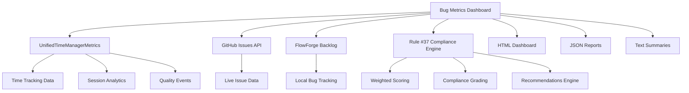

# Bug Metrics and Quality Dashboard

## System Overview

The Bug Metrics and Quality Dashboard is a comprehensive analytics system designed to provide actionable insights into bug management, developer productivity, and quality compliance. Built for FlowForge v2.0, it serves as the central hub for monitoring Rule #37 "No Bug Left Behind" compliance and facilitating continuous quality improvement.

### Purpose

- **Quality Assurance**: Monitor and improve software quality through comprehensive bug analytics
- **Rule #37 Compliance**: Ensure strict adherence to FlowForge's "No Bug Left Behind" policy
- **Developer Productivity**: Track and optimize development efficiency metrics
- **Strategic Decision Making**: Provide executives and team leads with actionable quality insights

### Key Stakeholders

- **Developers**: Individual productivity metrics and improvement recommendations
- **Team Leads**: Team performance analysis and resource allocation insights
- **Project Managers**: Quality trends, compliance reporting, and project health metrics
- **Executives**: High-level quality dashboards and strategic decision support

### Integration Architecture



## Core Components

### 1. BugMetricsDashboard Module

**Location**: `src/metrics/BugMetricsDashboard.ts`

The central orchestrator for bug analytics, compliance scoring, and dashboard generation.

#### Key Features

- **Rule #37 Compliance Calculation**: Weighted scoring system with letter grades
- **Developer Productivity Analysis**: Focus time, context switching, and bug rate metrics  
- **Quality Trend Tracking**: Daily, weekly, and monthly quality evolution
- **Multi-format Reporting**: HTML dashboards, JSON exports, and text summaries

#### Core Methods

```typescript
class BugMetricsDashboard {
  // Rule #37 compliance scoring with weighted components
  calculateRule37Compliance(
    patterns: BugDiscoveryPattern[],
    resolutions: BugResolutionMetrics
  ): Rule37ComplianceScore;
  
  // Developer productivity insights
  getDeveloperProductivityInsights(period: MetricsPeriod): DeveloperProductivityInsights;
  
  // Quality trend analysis
  getQualityTrends(): QualityTrends;
  
  // Bug pattern identification
  analyzeBugPatterns(discoveries: BugDiscoveryPattern[]): BugPattern[];
  
  // HTML dashboard generation
  generateHTMLDashboard(data: DashboardData): string;
}
```

### 2. Metrics Collection System

The system aggregates data from multiple sources to provide comprehensive analytics:

#### Data Sources

**UnifiedTimeManagerMetrics**
- Session duration and timing data
- Developer productivity metrics
- Context switching frequency
- Quality event tracking

**GitHub Issues Integration**
- Live issue data via GitHub API
- Issue state transitions
- Priority and label analysis
- Assignee and reporter tracking

**FlowForge Backlog**
- Local bug tracking data
- Custom metadata and tags
- Resolution workflow tracking
- Historical trend data

#### Collection Architecture

```typescript
interface MetricsSources {
  timeManager: UnifiedTimeManagerMetrics;
  github: GitHubIssuesAPI;
  localBacklog: FlowForgeBacklog;
  historicalData: HistoricalDataStore;
}
```

#### Data Retention Policy

- **Active Data**: 90 days for detailed analytics
- **Historical Summaries**: 1 year for trend analysis  
- **Compliance Records**: Permanent retention for audit trails
- **Raw Session Data**: Compressed after 30 days

## Rule #37 Compliance Scoring

### Scoring Algorithm

The Rule #37 compliance score uses a weighted algorithm with five core components:

```typescript
interface Rule37ComplianceScore {
  overallScore: number;        // 0-100 weighted total
  grade: ComplianceGrade;      // A, B, C, D, F letter grade
  discoverySpeed: number;      // Early bug detection (20% weight)
  resolutionTime: number;      // Fix speed efficiency (25% weight)  
  preventionRate: number;      // Bugs per feature ratio (25% weight)
  nestingControl: number;      // Bug complexity management (15% weight)
  contextSwitching: number;    // Focus efficiency (15% weight)
  recommendations: string[];   // Actionable improvement steps
}
```

### Component Scoring Details

#### 1. Discovery Speed (20% Weight)
- **Metric**: Time from bug introduction to detection
- **Calculation**: `100 - avgDiscoveryTime` (capped at 100)
- **Goal**: Early detection through automated testing and code review

#### 2. Resolution Time (25% Weight) 
- **Metric**: Average time from bug discovery to resolution
- **Calculation**: `100 - (averageResolutionTime / 5)` (5-minute scale)
- **Goal**: Rapid bug resolution to prevent accumulation

#### 3. Prevention Rate (25% Weight)
- **Metric**: Ratio of bugs prevented vs. bugs found
- **Calculation**: `preventionRate * 100` (direct percentage)
- **Goal**: Proactive quality practices and comprehensive testing

#### 4. Nesting Control (15% Weight)
- **Metric**: Average bug nesting depth (bugs causing other bugs)
- **Calculation**: `100 - (avgDepth * 20)` (penalize deep nesting)
- **Goal**: Simple, focused bug fixes without cascading issues

#### 5. Context Switching (15% Weight)
- **Metric**: Frequency of switching between different bug contexts
- **Calculation**: `100 - (uniqueContexts * 5)` (penalize context switching)
- **Goal**: Focused work sessions for efficient bug resolution

### Letter Grade System

| Grade | Score Range | Compliance Level | Action Required |
|-------|-------------|------------------|-----------------|
| A     | 90-100      | Excellent        | Maintain standards |
| B     | 80-89       | Good             | Monitor trends |
| C     | 70-79       | Acceptable       | Process improvements |
| D     | 60-69       | Needs Attention  | Immediate action |
| F     | 0-59        | Critical         | Emergency response |

## Metrics and Analytics

### 1. Core Bug Metrics

```typescript
interface MetricsSummary {
  totalBugsFound: number;      // All discovered bugs
  totalBugsFixed: number;      // Successfully resolved bugs  
  averageResolutionTime: number; // Mean resolution time (minutes)
  criticalBugs: number;        // High-priority issues
  preventionRate: number;      // Prevention effectiveness (0-1)
}
```

### 2. Bug Discovery Patterns

The system analyzes bug discovery to identify common patterns and hotspots:

```typescript
interface BugPattern {
  type: string;                // Pattern category
  frequency: number;           // Occurrence rate (0-1)
  description: string;         // Human-readable explanation
  severity: 'low' | 'medium' | 'high' | 'critical'; // Impact level
}
```

#### Pattern Types

**Time-Based Patterns**
- Peak discovery hours
- Day-of-week correlations
- Release cycle correlations

**Context-Based Patterns**  
- Component/module hotspots
- Developer/team correlations
- Technology stack vulnerabilities

**Depth-Based Patterns**
- Nesting complexity issues
- Cascade failure patterns
- Root cause analysis

### 3. Developer Productivity Insights

```typescript
interface DeveloperProductivityInsights {
  focusTimeMinutes: number;    // Total focused work time
  contextSwitches: number;     // Number of context changes
  bugsPerFeature: number;      // Bug ratio per feature
  productivityScore: number;   // Overall efficiency (0-100)
  peakHours: number[];         // Most productive hours
  recommendations: string[];   // Personalized improvement tips
}
```

#### Productivity Scoring

The productivity score combines three weighted factors:
- **Focus Score (40%)**: `min(100, (focusTime / 480) * 100)` (8-hour baseline)
- **Context Score (30%)**: `max(0, 100 - (contextSwitches * 5))` (penalize switching)
- **Bug Score (30%)**: `max(0, 100 - (bugsPerFeature * 40))` (quality factor)

### 4. Quality Trends Analysis

```typescript
interface QualityTrends {
  daily: TrendAnalysis;        // 24-hour quality evolution
  weekly: TrendAnalysis;       // 7-day quality patterns
  monthly: TrendAnalysis;      // 30-day quality trajectory
}

interface TrendAnalysis {
  trend: 'improving' | 'stable' | 'declining' | 'insufficient-data';
  percentageChange: number;    // Period-over-period change
  dataPoints: number;          // Sample size for analysis
}
```

#### Trend Calculation

Trends compare the first half vs. second half of data points:
- **Improving**: >10% reduction in bug rate
- **Declining**: >10% increase in bug rate  
- **Stable**: -10% to +10% change
- **Insufficient Data**: <2 data points

### 5. Bug Severity Distribution

The system tracks bug severity distribution to identify quality patterns:

```typescript
interface SeverityDistribution {
  critical: number;    // System-breaking issues
  high: number;        // Major functionality issues  
  medium: number;      // Minor functionality issues
  low: number;         // Cosmetic or edge cases
}
```

## Usage Guide

### Command-Line Interface

The dashboard is accessible via the FlowForge command system:

```bash
# Generate standard HTML dashboard
/flowforge:metrics:dashboard

# Export JSON data for integration
/flowforge:metrics:dashboard --format=json --output=metrics.json

# Focus on Rule #37 compliance only
/flowforge:metrics:dashboard --rule37-only --period=90d

# Developer-specific analysis
/flowforge:metrics:dashboard --developer=john --show-trends

# Executive summary report
/flowforge:metrics:dashboard --template=executive --period=1y
```

### Output Formats

#### 1. HTML Dashboard

**Features**:
- Interactive visualizations
- Responsive design for mobile/desktop
- Real-time data updates
- Drill-down capabilities
- Print-friendly layouts

**Sections**:
- Executive summary with key metrics
- Rule #37 compliance score with grade
- Quality trends with visual indicators
- Developer productivity rankings
- Bug pattern analysis
- Actionable recommendations

#### 2. JSON Export

**Structure**:
```json
{
  "dashboard": {
    "metadata": {
      "generated_at": "2024-01-15T10:30:00Z",
      "analysis_period": "30d",
      "format": "json"
    },
    "rule37_compliance": { "..." },
    "summary": { "..." },
    "discovery_patterns": { "..." },
    "developer_productivity": { "..." },
    "raw_data": { "..." }
  }
}
```

#### 3. Text Summary

**Format**: Command-line friendly with clear sections:
- Compliance score and grade
- Key metrics summary
- Priority recommendations
- Next steps

### Integration with CI/CD

The dashboard can be integrated into continuous integration workflows:

```yaml
# .github/workflows/quality-check.yml
- name: Generate Quality Dashboard
  run: |
    /flowforge:metrics:dashboard --format=json --output=quality-report.json
    
- name: Check Rule #37 Compliance
  run: |
    SCORE=$(jq '.dashboard.rule37_compliance.score' quality-report.json)
    if [ "$SCORE" -lt 70 ]; then
      echo "Quality gate failed: Rule #37 score $SCORE < 70"
      exit 1
    fi
```

### Best Practices for Metric Interpretation

#### 1. Rule #37 Compliance
- **Grade A-B**: Continue current practices, monitor for regression
- **Grade C**: Implement process improvements, increase testing
- **Grade D-F**: Immediate action required, possible feature freeze

#### 2. Bug Discovery Patterns
- **Time-based clusters**: Review development practices during peak hours
- **Component hotspots**: Focus refactoring efforts on problematic modules
- **High nesting depth**: Simplify bug fix approaches, improve testing

#### 3. Developer Productivity
- **Low focus time**: Reduce meeting overhead, minimize interruptions
- **High context switching**: Batch similar tasks, improve task management
- **High bug ratio**: Increase code review coverage, improve testing practices

## API Reference

### Core Interfaces

#### BugMetricsDashboard Class

```typescript
class BugMetricsDashboard {
  constructor(metrics: UnifiedTimeManagerMetrics);
  
  // Primary analysis methods
  calculateRule37Compliance(
    patterns: BugDiscoveryPattern[],
    resolutions: BugResolutionMetrics
  ): Rule37ComplianceScore;
  
  getDeveloperProductivityInsights(
    period: MetricsPeriod
  ): DeveloperProductivityInsights;
  
  getQualityTrends(): QualityTrends;
  
  analyzeBugPatterns(
    discoveries: BugDiscoveryPattern[]
  ): BugPattern[];
  
  // Report generation
  generateHTMLDashboard(data: DashboardData): string;
  getHistoricalMetrics(period: MetricsPeriod): HistoricalDataPoint[];
  
  // Utility methods
  generateRecommendations(score: Rule37ComplianceScore): string[];
}
```

#### Key Type Definitions

```typescript
// Compliance scoring
type ComplianceGrade = 'A' | 'B' | 'C' | 'D' | 'F';
type MetricsPeriod = 'daily' | 'weekly' | 'monthly';
type TrendDirection = 'improving' | 'stable' | 'declining' | 'insufficient-data';

// Data structures
interface DashboardData {
  metrics: MetricsSummary;
  patterns: BugPattern[];
  complianceScore: Rule37ComplianceScore;
  productivity: DeveloperProductivityInsights;
  trends: QualityTrends;
  timestamp: Date;
}

interface HistoricalDataPoint {
  date: Date;
  bugsFound: number;
  bugsFixed: number;
  avgResolutionTime: number;
}
```

### Extension Points

The dashboard system is designed for extensibility:

#### 1. Custom Metrics

```typescript
// Extend MetricsSummary for domain-specific metrics
interface ExtendedMetrics extends MetricsSummary {
  customMetric: number;
  domainSpecificData: any[];
}
```

#### 2. Custom Patterns

```typescript
// Add new bug pattern analysis
class CustomBugPatternAnalyzer {
  analyzeCustomPattern(discoveries: BugDiscoveryPattern[]): BugPattern {
    // Custom pattern logic
    return {
      type: 'custom-pattern',
      frequency: 0.3,
      description: 'Custom pattern description',
      severity: 'medium'
    };
  }
}
```

#### 3. Custom Dashboards

```typescript
// Extend dashboard generation
interface CustomDashboardOptions {
  theme: 'light' | 'dark' | 'company';
  customSections: DashboardSection[];
  brandingOptions: BrandingConfig;
}
```

## Configuration Options

### Dashboard Configuration

```typescript
interface DashboardConfig {
  // Data source configuration
  dataRetentionDays: number;          // Default: 90
  historicalAnalysisDays: number;     // Default: 365
  
  // Scoring configuration  
  rule37Weights: {
    discoverySpeed: number;           // Default: 0.20
    resolutionTime: number;           // Default: 0.25
    preventionRate: number;           // Default: 0.25
    nestingControl: number;           // Default: 0.15
    contextSwitching: number;         // Default: 0.15
  };
  
  // Trend analysis configuration
  trendAnalysisMinDataPoints: number; // Default: 5
  trendSignificanceThreshold: number; // Default: 0.10 (10%)
  
  // Performance configuration
  maxDataPointsAnalysis: number;      // Default: 10000
  cacheExpirationMinutes: number;     // Default: 15
}
```

### Environment Variables

```bash
# Data source configuration
FLOWFORGE_GITHUB_TOKEN=ghp_xxxx     # GitHub API access
FLOWFORGE_METRICS_PATH=/path/to/data # Custom data directory

# Dashboard configuration  
FLOWFORGE_RULE37_CRITICAL_THRESHOLD=60  # Critical compliance threshold
FLOWFORGE_TREND_ANALYSIS_DAYS=30        # Trend analysis window

# Performance tuning
FLOWFORGE_MAX_DASHBOARD_SESSIONS=1000    # Memory management
FLOWFORGE_CACHE_ENABLED=true             # Enable metric caching
```

## Troubleshooting Guide

### Common Issues

#### 1. No Data Available

**Symptoms**: Empty dashboard or "No data available" message

**Solutions**:
```bash
# Check data sources
ls -la .flowforge/metrics/
cat .flowforge/bug-backlog.json

# Verify GitHub integration
gh auth status
gh issue list --limit 5

# Check time tracking data
/flowforge:session:status
```

#### 2. Incorrect Rule #37 Scores

**Symptoms**: Unexpectedly low or high compliance scores

**Solutions**:
```bash
# Debug scoring components
/flowforge:metrics:dashboard --rule37-only --detailed

# Validate data integrity  
/flowforge:dev:checkrules

# Reset metrics cache
rm -rf .flowforge/metrics/cache/
```

#### 3. Performance Issues

**Symptoms**: Slow dashboard generation, timeouts

**Solutions**:
```bash
# Reduce analysis period
/flowforge:metrics:dashboard --period=7d

# Clear historical data
/flowforge:metrics:cleanup --older-than=30d

# Enable data compression
export FLOWFORGE_COMPRESS_DATA=true
```

### Error Codes

| Code | Description | Solution |
|------|-------------|----------|
| DASH_001 | Data source unavailable | Check file permissions and network access |
| DASH_002 | Invalid compliance score | Verify input data and scoring weights |
| DASH_003 | Trend analysis insufficient data | Increase data collection period |
| DASH_004 | Memory limit exceeded | Reduce analysis scope or increase resources |
| DASH_005 | Template generation failed | Check HTML template syntax |

### Debug Commands

```bash
# Enable debug mode
DEBUG=1 /flowforge:metrics:dashboard

# Validate dashboard data
/flowforge:metrics:validate --verbose

# Generate diagnostic report
/flowforge:metrics:diagnostics --output=debug.json

# Test individual components
/flowforge:metrics:test-scoring
/flowforge:metrics:test-trends
/flowforge:metrics:test-patterns
```

## Code Examples

### Basic Usage

```typescript
import { BugMetricsDashboard } from '../metrics/BugMetricsDashboard';
import { UnifiedTimeManagerMetrics } from '../sidetracking/UnifiedTimeManagerMetrics';

// Initialize dashboard
const metrics = new UnifiedTimeManagerMetrics('.flowforge/metrics/quality.json');
const dashboard = new BugMetricsDashboard(metrics);

// Generate compliance report
const discoveries = await loadBugDiscoveries();
const resolutions = await loadBugResolutions();
const compliance = dashboard.calculateRule37Compliance(discoveries, resolutions);

console.log(`Rule #37 Compliance: ${compliance.grade} (${compliance.overallScore}%)`);
compliance.recommendations.forEach(rec => console.log(`- ${rec}`));
```

### Custom Trend Analysis

```typescript
// Analyze custom time periods
const customTrends = await dashboard.getQualityTrends();

if (customTrends.weekly.trend === 'declining') {
  console.log('Weekly quality trend is declining');
  console.log(`Change: ${customTrends.weekly.percentageChange}%`);
  
  // Trigger alerts or notifications
  await notifyTeamLead(customTrends.weekly);
}
```

### Integration with Monitoring

```typescript
// Automated quality monitoring
class QualityMonitor {
  async checkCompliance(): Promise<void> {
    const dashboard = new BugMetricsDashboard(this.metrics);
    const data = await this.loadDashboardData();
    
    if (data.complianceScore.overallScore < 70) {
      await this.triggerQualityAlert(data.complianceScore);
      await this.scheduleQualityReview();
    }
  }
  
  async generateWeeklyReport(): Promise<void> {
    const htmlReport = dashboard.generateHTMLDashboard(await this.loadDashboardData());
    await this.emailReport(htmlReport, this.getStakeholders());
  }
}
```

---

## Summary

The Bug Metrics and Quality Dashboard provides comprehensive analytics for bug management and quality compliance in FlowForge v2.0. With its weighted Rule #37 compliance scoring, developer productivity insights, and trend analysis capabilities, it enables data-driven quality improvement and ensures adherence to FlowForge's "No Bug Left Behind" principle.

The system's multi-format reporting, extensive configuration options, and integration capabilities make it suitable for individual developers, team leads, and executive stakeholders, providing actionable insights at every level of the organization.

For additional information or support, refer to the FlowForge documentation at `/documentation/2.0/` or contact the development team through the standard FlowForge support channels.