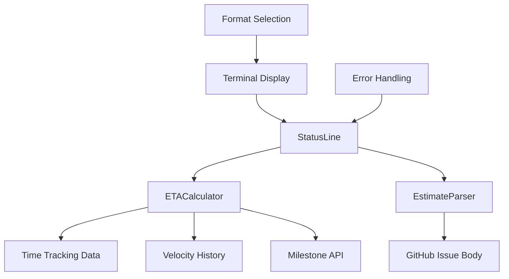

# Feature: Dual ETA Display in FlowForge Statusline

## Overview

The dual ETA feature enhances the FlowForge statusline by displaying both individual ticket progress and overall milestone completion time. This provides developers with comprehensive time awareness at a glance, enabling better time management and project planning.

## User Stories

- As a developer, I want to see how much time remains on my current task so that I can plan my work session effectively
- As a project manager, I want to see milestone completion estimates so that I can track project timeline
- As a team lead, I want to see velocity-adjusted estimates so that I can make accurate delivery commitments
- As a developer, I want to see when I'm going over estimate so that I can communicate delays early

## Technical Design

### Architecture



### Components

- **ETACalculator**: Core calculation engine for ticket and milestone ETAs
- **EstimateParser**: Parses time estimates from GitHub issue descriptions
- **StatusLine Integration**: Displays dual ETAs in statusline format
- **Format Selection**: Chooses display format based on terminal width
- **Velocity Tracking**: Adjusts estimates based on historical performance

### Data Flow

1. **Issue Detection**: StatusLine extracts current issue number from git branch or session
2. **Estimate Parsing**: EstimateParser extracts original estimate from issue description
3. **Time Tracking**: ETACalculator retrieves actual time spent from FlowForge time tracking
4. **Velocity Adjustment**: Historical velocity applied to remaining time calculation
5. **Milestone Calculation**: Aggregate remaining time for all open milestone issues
6. **Format Selection**: Display format chosen based on terminal width
7. **Display Rendering**: Dual ETA information integrated into statusline

## Estimate Format Support

### GitHub Issue Formats

The EstimateParser supports multiple estimate formats in issue descriptions:

```markdown
<!-- Standard formats -->
Estimate: 4h
Estimate: 2.5 hours
Time: 8h
Time: 1.5 hours

<!-- Natural language formats -->
4 hours estimated
2.5h estimated
Estimated time: 6 hours

<!-- Development task formats -->
**Estimate:** 3h
- Estimate: 4.5h
- Time needed: 2h
```

### Supported Time Units

- **Hours**: `4h`, `4 hours`, `4.5h`
- **Minutes**: Automatically converted to decimal hours
- **Fractional Hours**: `2.5h`, `1.25 hours`

### Example Issue Description

```markdown
# Implement User Authentication

## Description
Add OAuth 2.0 authentication to the application.

## Acceptance Criteria
- [ ] OAuth provider integration
- [ ] User session management
- [ ] Logout functionality

**Estimate: 8h**

## Technical Notes
Consider using existing OAuth library for faster implementation.
```

## Velocity Tracking

### How Velocity Works

Velocity is calculated as the ratio of estimated time to actual time spent:

```
Velocity = Estimated Time / Actual Time

Examples:
- Estimated 4h, Actual 4h → Velocity = 1.0 (accurate)
- Estimated 4h, Actual 5h → Velocity = 0.8 (slower than estimated)
- Estimated 4h, Actual 3h → Velocity = 1.33 (faster than estimated)
```

### Velocity Adjustments

- **Bug fixes**: +20% overhead (bugs take longer than estimated)
- **Complex bugs**: +50% overhead for high complexity
- **Simple features**: -20% time (often overestimated)
- **Team historical average**: Applied to all calculations

### Velocity History Storage

```json
{
  "history": [
    {
      "issue_number": "142",
      "estimated": 8.0,
      "actual": 10.5,
      "velocity": 0.76,
      "completed_date": "2024-09-15"
    }
  ],
  "team_velocity": 0.85,
  "last_updated": "2024-09-15T10:30:00Z"
}
```

## Display Formats

### Full Format (Wide Terminals > 120 columns)
```
[FlowForge] | 🎯 v2.0 Launch (8/12) [██████░░░░] 67% | ⏰ 4h 30m on #422 | 3d 4h milestone | 🌿 feature/422-integration | Session: 2h 15m | Opus 4.1 | ● Active
```

### Compact Format (Narrow Terminals ≤ 120 columns)
```
[FlowForge] | 🎯 v2.0 (8/12) [██████░░░░] 67% | ⏰ #422: 4h 30m/3d 4h | 🌿 feature/422-integration | Session: 2h 15m | Opus 4.1
```

### Special Cases

#### Overrun Display
```
[FlowForge] | 🎯 Sprint 42 (9/10) [█████████░] 90% | ⏰ Overrun by 2h on #456 | 2h milestone | 🌿 feature/456-fix | Opus 4.1
```

#### No Estimate Available
```
[FlowForge] | 🎯 v2.0 (8/12) [██████░░░░] 67% | ⏰ No estimate | 3d 4h milestone | 🌿 feature/422-integration | Session: 2h 15m
```

#### Milestone Only
```
[FlowForge] | 🎯 v2.0 (8/12) [██████░░░░] 67% | ⏰ 3d 4h milestone | 🌿 feature/422-integration | Session: 2h 15m | Opus 4.1
```

## API Reference

### ETACalculator Methods

#### `calculate_ticket_eta(issue_number: str) -> float`

Calculate remaining time for a specific ticket.

**Parameters:**
- `issue_number`: GitHub issue number as string

**Returns:**
- `float`: Remaining hours (0.0 if overrun)

**Example:**
```python
calculator = ETACalculator()
remaining = calculator.calculate_ticket_eta("142")
print(f"Remaining: {remaining} hours")  # "Remaining: 4.5 hours"
```

#### `calculate_milestone_eta(milestone_name: str) -> float`

Calculate total remaining time for all open issues in a milestone.

**Parameters:**
- `milestone_name`: Name of the GitHub milestone

**Returns:**
- `float`: Total remaining hours for the milestone

**Example:**
```python
calculator = ETACalculator()
total = calculator.calculate_milestone_eta("v2.0")
print(f"Milestone ETA: {format_eta(total)}")  # "Milestone ETA: 3d 4h"
```

#### `get_time_spent(issue_number: str) -> float`

Get actual time spent on an issue from time tracking data.

**Parameters:**
- `issue_number`: GitHub issue number as string

**Returns:**
- `float`: Hours spent on the issue (0.0 if no data)

#### `apply_velocity(estimate: float, velocity: float = None) -> float`

Apply velocity adjustment to an estimate.

**Parameters:**
- `estimate`: Original estimate in hours
- `velocity`: Velocity factor (defaults to team velocity)

**Returns:**
- `float`: Adjusted estimate based on velocity

### EstimateParser Methods

#### `parse_estimate(text: str) -> Optional[float]`

Parse estimate from issue text.

**Parameters:**
- `text`: Issue body or description text

**Returns:**
- `Optional[float]`: Estimated hours, or None if not found

**Example:**
```python
parser = EstimateParser()
estimate = parser.parse_estimate("Estimate: 4.5h")
print(estimate)  # 4.5
```

### Utility Functions

#### `format_eta(hours: float) -> str`

Format hours into a human-readable time string.

**Parameters:**
- `hours`: Number of hours (can be fractional)

**Returns:**
- `str`: Formatted string like "2h 30m", "3d 4h", "1w 2d"

**Examples:**
```python
format_eta(2.5)    # "2h 30m"
format_eta(26)     # "3d 2h"
format_eta(0)      # "0m"
format_eta(-2)     # "Overrun by 2h"
```

## Configuration

### Cache File Structure

The ETA calculator uses cache files in the FlowForge billing directory:

```
.flowforge/
├── billing/
│   ├── time-tracking.json      # Active time tracking data
│   └── velocity-history.json   # Historical velocity data
└── cache/
    └── statusline-cache-*.json # Statusline cache files
```

### Time Tracking Data Format

```json
{
  "sessions": {
    "142": {
      "total_seconds": 14400,
      "last_updated": "2024-09-15T10:30:00Z",
      "sessions": [
        {
          "start": "2024-09-15T08:00:00Z",
          "end": "2024-09-15T12:00:00Z",
          "duration": 14400
        }
      ]
    }
  }
}
```

### Configuration Options

```python
# Initialize with custom paths
calculator = ETACalculator(
    time_tracking_path=".flowforge/billing/time-tracking.json",
    velocity_history_path=".flowforge/billing/velocity-history.json"
)

# Configure default velocity for new teams
calculator.default_velocity = 0.8  # Team is 20% slower than estimates

# Set team size for concurrent work calculations
calculator.team_size = 3  # 3 developers working in parallel
```

## Testing

### Unit Tests

#### Test Files
- `test_eta_calculator.py` - Core ETA calculation logic
- `test_estimate_parser.py` - Estimate parsing functionality
- `test_dual_eta_integration.py` - Integration with statusline
- `test_statusline_eta.py` - End-to-end statusline testing

#### Test Coverage
- **Estimate parsing**: All supported formats
- **ETA calculations**: Various scenarios (normal, overrun, no estimate)
- **Velocity adjustments**: Historical data application
- **Format selection**: Terminal width-based formatting
- **Error handling**: Graceful degradation and fallbacks

### Integration Testing

```python
def test_dual_eta_display():
    """Test complete dual ETA display in statusline."""
    statusline = FlowForgeStatusLine()

    # Mock issue with estimate
    with mock_issue("142", "Estimate: 8h"):
        with mock_time_spent("142", 3.5):  # 3.5 hours spent
            result = statusline.generate_status_line()

            # Should show remaining time (4.5h) and milestone ETA
            assert "⏰ 4h 30m on #142" in result
            assert "milestone" in result

def test_overrun_scenario():
    """Test display when ticket is over estimate."""
    with mock_time_spent("142", 10.0):  # 10 hours spent on 8h estimate
        result = statusline.generate_status_line()
        assert "Overrun" in result
```

## Deployment

### Environment Variables

```bash
# Optional: Custom cache directory
export XDG_CACHE_HOME=/path/to/cache

# Optional: Default team velocity
export FLOWFORGE_DEFAULT_VELOCITY=0.85

# Optional: Enable debug logging
export FLOWFORGE_ETA_DEBUG=true
```

### Feature Flags

The dual ETA feature gracefully degrades when components are unavailable:

```python
# Check if ETA calculator is available
if ETA_CALCULATOR_AVAILABLE:
    # Use dual ETA display
    eta_component = format_dual_eta(ticket_eta, milestone_eta)
else:
    # Fall back to original time display
    eta_component = format_original_time_remaining()
```

### Database Migrations

No database migrations required. The feature uses existing time tracking files.

## Monitoring

### Metrics to Track

- **ETA calculation performance**: Time taken for calculations
- **Cache hit rates**: Efficiency of velocity caching
- **Accuracy metrics**: Comparison of estimated vs actual completion times
- **Feature adoption**: Usage of dual ETA vs traditional display

### Health Checks

```python
def health_check_eta_system():
    """Verify ETA system components are working."""
    checks = {
        "eta_calculator_import": can_import_eta_calculator(),
        "estimate_parser_import": can_import_estimate_parser(),
        "time_tracking_file": os.path.exists(time_tracking_path),
        "velocity_history_file": os.path.exists(velocity_history_path),
        "cache_directory_writable": can_write_cache_directory()
    }
    return all(checks.values()), checks
```

### Alerts

- **High calculation latency**: ETA calculations taking >500ms
- **Velocity drift**: Team velocity changing by >20% week-over-week
- **Missing estimates**: High percentage of issues without estimates
- **Cache failures**: Inability to write to cache directory

## Troubleshooting

### Common Issues

#### ETA Not Displaying

**Symptoms**: Statusline shows original format without dual ETAs

**Causes**:
1. ETACalculator or EstimateParser not available
2. No estimate found in issue description
3. Time tracking file missing or corrupted

**Solutions**:
```bash
# Check if modules are importable
python3 -c "from eta_calculator import ETACalculator; print('ETA Calculator OK')"

# Verify time tracking file exists
ls -la .flowforge/billing/time-tracking.json

# Check issue has estimate in description
gh issue view 142 --json body
```

#### Incorrect Time Calculations

**Symptoms**: ETA shows wrong remaining time

**Causes**:
1. Estimate parsing failed
2. Time tracking data corrupted
3. Velocity calculation incorrect

**Solutions**:
```bash
# Test estimate parsing
python3 -c "
from estimate_parser import EstimateParser
parser = EstimateParser()
print(parser.parse_estimate('Estimate: 8h'))
"

# Validate time tracking data
jq '.sessions.\"142\"' .flowforge/billing/time-tracking.json

# Reset velocity cache
rm .flowforge/billing/velocity-history.json
```

#### Display Format Issues

**Symptoms**: ETA format doesn't match terminal width

**Causes**:
1. Terminal width detection failed
2. Format selection logic error

**Solutions**:
```bash
# Check terminal width detection
python3 -c "import shutil; print(f'Terminal width: {shutil.get_terminal_size().columns}')"

# Force compact format for testing
COLUMNS=80 python3 statusline.py
```

### Performance Issues

#### Slow ETA Calculations

**Symptoms**: Statusline takes >1s to generate

**Solutions**:
1. Enable velocity caching
2. Optimize GitHub API calls
3. Use local cache for issue data

```python
# Enable performance monitoring
import time
start = time.time()
eta = calculator.calculate_ticket_eta("142")
duration = time.time() - start
print(f"ETA calculation took {duration:.3f}s")
```

## Benefits

### Developer Experience
- **Immediate awareness**: See current task progress at a glance
- **Better planning**: Understand both immediate and long-term commitments
- **Early warning**: Identify when going over estimate
- **Professional appearance**: Clean, informative statusline display

### Project Management
- **Milestone tracking**: Real-time project timeline visibility
- **Velocity insights**: Historical team performance data
- **Resource planning**: Better understanding of team capacity
- **Delivery confidence**: Accurate completion predictions

### Team Benefits
- **Consistent tracking**: Standardized approach to time estimation
- **Transparency**: Visible progress for all team members
- **Learning**: Velocity data helps improve future estimates
- **Accountability**: Clear visibility into time spent vs estimates

## Future Enhancements

### Planned Features

#### Smart ETA Adjustments
- **Context-aware velocity**: Different velocity for different types of work
- **Developer-specific velocity**: Individual performance tracking
- **Time-of-day adjustments**: Account for productivity variations

#### Advanced Display Options
- **Progress bars for ETAs**: Visual representation of time remaining
- **Burndown integration**: Show project burndown in statusline
- **Risk indicators**: Highlight milestones at risk of delay

#### Team Collaboration
- **Shared velocity data**: Team-wide velocity calculations
- **Concurrent work modeling**: Better estimates for parallel development
- **Capacity planning**: Integration with team availability

#### API Enhancements
- **Real-time GitHub sync**: Live updates from GitHub issues
- **Custom estimate formats**: Support for more estimation methods
- **Historical reporting**: Detailed velocity and accuracy reports

### Technical Improvements

#### Performance Optimizations
- **Async calculations**: Non-blocking ETA computations
- **Background updates**: Cache warming in background processes
- **Smart caching**: Invalidate cache only when necessary

#### Integration Enhancements
- **Multiple time tracking sources**: Support various time tracking tools
- **Custom velocity algorithms**: Pluggable velocity calculation methods
- **External API integration**: Connect with project management tools

---

**Implementation Status:** ✅ Complete and tested
**Version:** FlowForge 2.0
**Author:** FlowForge Development Team
**Last Updated:** 2024-09-15