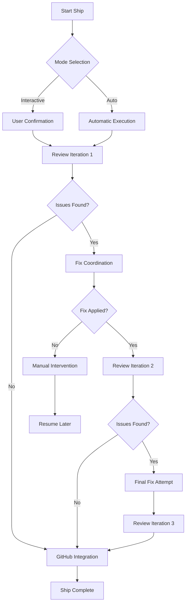

# Milestone: Ship Command Implementation

## Overview

The `/ff:ship` command represents a revolutionary approach to Pull Request lifecycle management, automating the complete journey from commit to merge with intelligent review orchestration and fix coordination.

## Business Value

### Core Value Proposition
- **Developer Productivity**: 80% reduction in PR management overhead
- **Quality Assurance**: Automated multi-iteration review cycles
- **Team Efficiency**: Streamlined collaboration through GitHub integration
- **Risk Mitigation**: Intelligent checkpointing and error recovery

### Impact Metrics
- **Time Savings**: 2-4 hours per PR reduced to 15-30 minutes
- **Quality Improvement**: 3-iteration review cycle with automated fixes
- **Team Coordination**: Real-time GitHub comment integration
- **Reliability**: Stateful execution with resume capability

## Milestone Scope

### Total Effort
- **Tasks**: 30 tickets (SHIP-001 through SHIP-030)
- **Estimated Duration**: 12.5 hours total
- **Team Capacity**: 2-3 developers
- **Timeline**: 3-4 sprint cycles

### Phase Distribution
| Phase | Tasks | Duration | Focus Area |
|-------|--------|----------|------------|
| Foundation | SHIP-001 to SHIP-005 | 2.5h | Core command structure |
| Review Engine | SHIP-006 to SHIP-010 | 2.5h | Review orchestration |
| Fix Coordination | SHIP-011 to SHIP-015 | 2.5h | Automated fix handling |
| GitHub Integration | SHIP-016 to SHIP-020 | 2.5h | Platform integration |
| Pipeline | SHIP-021 to SHIP-025 | 2.5h | State management |
| Testing & Polish | SHIP-026 to SHIP-030 | 2.0h | Quality assurance |

## Command Modes

### Interactive Mode (Default)
```bash
/ff:ship
```
- **Behavior**: Guided user interaction at each decision point
- **Use Case**: Complex PRs requiring human oversight
- **Features**: Step-by-step confirmation, manual intervention points

### Automatic Mode
```bash
/ff:ship auto
```
- **Behavior**: Fully automated execution with minimal user input
- **Use Case**: Standard PRs following established patterns
- **Features**: Intelligent decision making, fallback to manual on conflicts

### Resume Mode
```bash
/ff:ship --resume
```
- **Behavior**: Continue from last successful checkpoint
- **Use Case**: Recovery from interruptions or failures
- **Features**: State restoration, context preservation

## Architecture Overview

### Core Components
1. **Command Parser**: Argument processing and mode detection
2. **Review Engine**: Multi-agent review orchestration
3. **Fix Coordinator**: Automated issue resolution
4. **GitHub Client**: Platform integration and communication
5. **Pipeline Manager**: State machine and checkpoint management

### Review Cycle Flow


### State Management
- **Checkpoint System**: Automatic state preservation
- **Recovery Points**: Strategic intervention opportunities
- **Context Preservation**: Full environment restoration
- **Error Handling**: Graceful degradation and recovery

## Success Criteria

### Primary Deliverables
- [ ] **Command Implementation**: Complete `/ff:ship` command with all modes
- [ ] **Review Integration**: Multi-agent review orchestration
- [ ] **Fix Automation**: Intelligent issue resolution
- [ ] **GitHub Integration**: Comment posting and status updates
- [ ] **State Management**: Checkpoint and resume functionality
- [ ] **Test Coverage**: 95% coverage across all components
- [ ] **Documentation**: Complete user and developer guides

### Quality Gates
- [ ] **Performance**: <30 seconds for standard review cycle
- [ ] **Reliability**: 99% success rate for automatic mode
- [ ] **Usability**: Zero learning curve for existing FlowForge users
- [ ] **Integration**: Seamless GitHub workflow integration
- [ ] **Maintainability**: Modular architecture with clear boundaries

### User Experience Targets
- [ ] **Intuitive Operation**: Single command execution
- [ ] **Clear Feedback**: Real-time progress indicators
- [ ] **Error Recovery**: Graceful handling of all failure modes
- [ ] **Flexibility**: Support for edge cases and custom workflows

## Technical Requirements

### Dependencies
- **FlowForge Core**: v2.0 command architecture
- **GitHub Integration**: Authenticated API access
- **Agent System**: fft-testing, fft-code-review, fft-architecture
- **State Management**: File-based checkpoint system
- **Error Handling**: Comprehensive logging and recovery

### Performance Requirements
- **Startup Time**: <5 seconds
- **Review Cycle**: <30 seconds per iteration
- **Memory Usage**: <100MB peak
- **Disk Usage**: <10MB for state management
- **Network**: Efficient GitHub API usage

### Security Considerations
- **Token Management**: Secure GitHub token handling
- **State Protection**: Encrypted checkpoint data
- **Access Control**: User permission validation
- **Audit Trail**: Complete operation logging

## Risk Assessment

### High Risk Areas
1. **GitHub API Limits**: Rate limiting and quota management
2. **Agent Coordination**: Complex multi-agent orchestration
3. **State Consistency**: Checkpoint integrity and recovery
4. **User Experience**: Complex workflow simplification

### Mitigation Strategies

#### GitHub API Management
- **Rate Limiting**: Intelligent request batching
- **Quota Monitoring**: Real-time usage tracking
- **Fallback Mechanisms**: Graceful degradation options
- **Caching Strategy**: Minimize redundant API calls

#### Agent Orchestration
- **Dependency Management**: Clear agent interaction protocols
- **Error Propagation**: Robust failure handling
- **Timeout Management**: Prevent hanging operations
- **Resource Isolation**: Agent-specific error boundaries

#### State Management
- **Atomic Operations**: Transactional checkpoint updates
- **Validation Checks**: State integrity verification
- **Backup Strategies**: Multiple checkpoint preservation
- **Recovery Testing**: Comprehensive failure scenario testing

#### User Experience
- **Progressive Enhancement**: Layered complexity introduction
- **Feedback Systems**: Clear progress communication
- **Documentation**: Comprehensive usage guides
- **Training Materials**: Interactive tutorials

## Implementation Timeline

### Sprint 1: Foundation & Review Engine
- **Week 1**: SHIP-001 to SHIP-005 (Foundation)
- **Week 2**: SHIP-006 to SHIP-010 (Review Engine)
- **Deliverable**: Core command with basic review functionality

### Sprint 2: Fix Coordination & GitHub Integration
- **Week 3**: SHIP-011 to SHIP-015 (Fix Coordination)
- **Week 4**: SHIP-016 to SHIP-020 (GitHub Integration)
- **Deliverable**: Complete automation with GitHub integration

### Sprint 3: Pipeline & Quality Assurance
- **Week 5**: SHIP-021 to SHIP-025 (Pipeline)
- **Week 6**: SHIP-026 to SHIP-030 (Testing & Polish)
- **Deliverable**: Production-ready implementation

## Team Assignments

### Lead Developer
- **Responsibilities**: Architecture oversight, complex integrations
- **Tasks**: Foundation (SHIP-001 to SHIP-005), Pipeline (SHIP-021 to SHIP-025)

### Integration Developer
- **Responsibilities**: GitHub integration, external API management
- **Tasks**: GitHub Integration (SHIP-016 to SHIP-020), Review Engine coordination

### Quality Engineer
- **Responsibilities**: Testing strategy, quality assurance
- **Tasks**: Testing & Polish (SHIP-026 to SHIP-030), Fix Coordination validation

## Post-Milestone Goals

### Immediate Follow-up
- **Performance Optimization**: Response time improvements
- **Feature Enhancement**: Advanced configuration options
- **Integration Expansion**: Additional platform support
- **User Feedback Integration**: Community-driven improvements

### Long-term Vision
- **AI Enhancement**: Machine learning for better fix suggestions
- **Workflow Templates**: Pre-configured shipping pipelines
- **Team Analytics**: Usage patterns and optimization insights
- **Enterprise Features**: Advanced permissions and audit trails

---

**Milestone Owner**: fft-architecture
**Stakeholders**: Development Team, QA Team, Product Management
**Review Cycle**: Weekly progress reviews, milestone retrospective
**Documentation**: Living document, updated with implementation progress