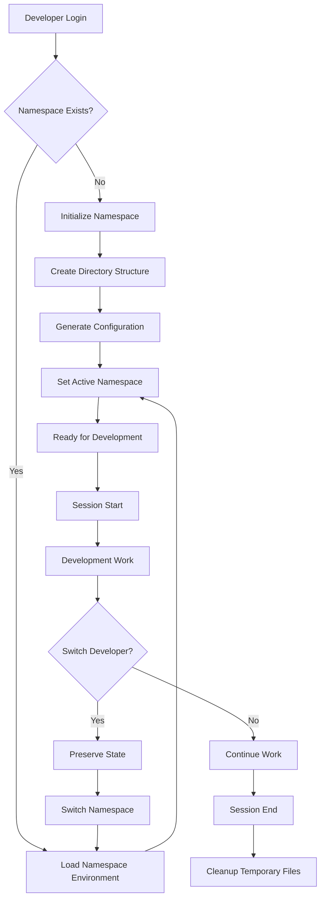
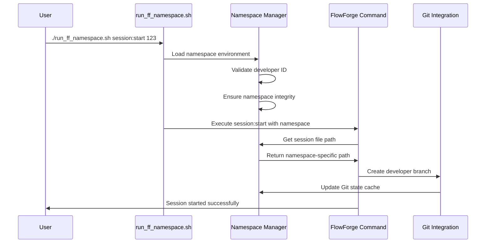

# FlowForge Namespace Architecture

## 🏗️ System Architecture Overview

FlowForge v2.0 implements a **Multi-Developer Namespace Architecture** that provides complete isolation between developers while maintaining team coordination through shared resources.

### Core Design Principles

1. **Complete Isolation**: Each developer operates in their own namespace
2. **Shared Coordination**: Team-level resources remain accessible
3. **Zero Conflicts**: No file system or session collisions
4. **Seamless Switching**: Instant context switching between developers
5. **Security First**: Path validation and input sanitization
6. **Performance Optimized**: Efficient file operations and caching

## 🏭 Directory Structure

```
.flowforge/
├── .namespace-env                      # Active namespace environment
├── team/                               # Shared team configuration
│   ├── config.json                     # Team member definitions
│   ├── active-developers.json          # Currently active developers
│   └── task-assignments.json           # Task coordination
├── shared/                             # Shared resources
│   ├── cache/                          # Shared cache data
│   ├── templates/                      # Shared templates
│   └── reports/                        # Team-wide reports
├── dev-{developer-id}/                 # ISOLATED NAMESPACES
│   ├── sessions/                       # Developer session state
│   │   ├── current.json                # Active session
│   │   ├── history/                    # Session history
│   │   └── backup/                     # Session backups
│   ├── cache/                          # Developer-specific cache
│   │   ├── git-status.json             # Git state cache
│   │   ├── task-data.json              # Task cache
│   │   └── provider-cache.json         # Provider data cache
│   ├── workspace/                      # Working files
│   │   ├── temp/                       # Temporary files
│   │   ├── drafts/                     # Draft documents
│   │   └── sandbox/                    # Sandbox environment
│   ├── logs/                           # Developer-specific logs
│   │   ├── session.log                 # Session activity
│   │   ├── errors.log                  # Error tracking
│   │   └── performance.log             # Performance metrics
│   ├── git/                            # Git state per developer
│   │   ├── branches.json               # Branch tracking
│   │   ├── commits.json                # Commit history
│   │   └── sync-state.json             # Sync status
│   └── config.json                     # Namespace configuration
└── logs/                               # System-wide logs
    ├── namespace-manager.log           # Namespace operations
    ├── team-coordination.log           # Team coordination events
    └── system.log                      # System-level events
```

## 🔧 Core Components

### 1. Namespace Manager (`scripts/namespace/manager.sh`)

**Purpose**: Central namespace orchestration and lifecycle management

**Key Functions**:
- `initialize_namespace(dev_id)` - Create new developer namespace
- `get_developer_id()` - Get currently active developer
- `ensure_namespace()` - Verify namespace integrity
- `cleanup_namespace()` - Clean temporary files
- `validate_namespace_path()` - Security validation

**Security Features**:
- Input sanitization with regex validation
- Path traversal protection
- Umask enforcement (077 - restrictive permissions)
- Command injection prevention

### 2. Session Integration (`scripts/namespace/session-integration.sh`)

**Purpose**: Namespace-aware session management

**Key Functions**:
- `get_session_file_with_namespace()` - Get namespace-specific session file
- `start_session_with_namespace()` - Start developer session
- `preserve_session_state()` - Maintain state across switches
- `migrate_legacy_session()` - Upgrade from v1.x sessions

### 3. Git Synchronization (`scripts/namespace/git-sync.sh`)

**Purpose**: Developer-aware Git operations

**Key Functions**:
- `sync_developer_branches()` - Sync developer-specific branches
- `create_developer_branch()` - Create namespace-aware branches
- `merge_namespace_changes()` - Coordinate cross-developer merges
- `backup_git_state()` - Preserve Git state per developer

### 4. Team Coordination (`scripts/namespace/team-reporting.sh`)

**Purpose**: Cross-namespace team coordination

**Key Functions**:
- `get_active_developers()` - List currently active developers
- `coordinate_task_assignments()` - Prevent task conflicts
- `generate_team_report()` - Team status overview
- `sync_team_state()` - Synchronize team coordination data

### 5. Command Wrapper (`run_ff_namespace.sh`)

**Purpose**: Namespace-aware command execution

**Features**:
- Automatic namespace environment loading
- Command routing based on namespace state
- Legacy mode fallback
- Error handling and recovery

## 🔄 Workflow Architecture

### Namespace Lifecycle



### Command Execution Flow



## 🛡️ Security Architecture

### Input Validation

```bash
# Example: Developer ID validation
validate_developer_id() {
    local dev_id="$1"

    # Length check
    if [[ ${#dev_id} -gt 50 ]]; then
        return 1
    fi

    # Character validation (alphanumeric, dash, underscore)
    if [[ ! "$dev_id" =~ ^[a-zA-Z0-9_-]+$ ]]; then
        return 1
    fi

    # Reserved names
    case "$dev_id" in
        "admin"|"root"|"system"|"shared")
            return 1
            ;;
    esac

    return 0
}
```

### Path Security

```bash
# Example: Path traversal prevention
validate_path() {
    local path="$1"
    local base_dir="$2"

    # Resolve absolute path
    local abs_path=$(realpath -m "$path")
    local abs_base=$(realpath -m "$base_dir")

    # Ensure path is within base directory
    if [[ "$abs_path" != "$abs_base"* ]]; then
        return 1
    fi

    echo "$abs_path"
    return 0
}
```

### File Permissions

- **Namespace directories**: 700 (owner only)
- **Configuration files**: 600 (owner read/write only)
- **Session files**: 600 (owner read/write only)
- **Log files**: 640 (owner read/write, group read)

## 🚀 Performance Optimizations

### Caching Strategy

1. **Session State Caching**: In-memory session state for rapid access
2. **Git Status Caching**: Cached Git status to avoid repeated operations
3. **Task Data Caching**: Provider data cached per developer
4. **Configuration Caching**: Namespace config loaded once per session

### File System Optimizations

1. **Lazy Directory Creation**: Directories created only when needed
2. **Atomic Operations**: Use temporary files and atomic moves
3. **Efficient Cleanup**: Background cleanup of temporary files
4. **Optimized Logging**: Buffered log writes with rotation

### Memory Management

1. **Variable Cleanup**: Unset variables after use
2. **Function Scoping**: Local variables in functions
3. **Process Isolation**: Subshells for isolated operations
4. **Resource Limits**: Ulimit enforcement where applicable

## 🔗 Integration Points

### Git Integration

- **Branch Naming**: `dev-{developer-id}/feature/{task-id}`
- **Commit Attribution**: Automatic developer attribution
- **Merge Coordination**: Cross-developer merge assistance
- **Conflict Resolution**: Namespace-aware conflict detection

### Provider Integration

- **GitHub**: Namespace-aware issue tracking
- **Notion**: Developer-specific task views
- **Linear**: Team coordination with individual execution
- **Custom**: Extensible provider framework

### Hook Integration

- **Pre-commit**: Namespace validation
- **Post-commit**: Team coordination updates
- **Pre-push**: Cross-developer conflict checks
- **Post-merge**: Namespace synchronization

## 📊 Monitoring & Observability

### Metrics Collection

```json
{
  "namespace_metrics": {
    "active_developers": 6,
    "total_sessions": 142,
    "average_session_duration": "2h 15m",
    "cache_hit_ratio": 0.87,
    "disk_usage_per_developer": "156MB",
    "git_operations_per_hour": 23
  }
}
```

### Health Checks

1. **Namespace Integrity**: Directory structure validation
2. **Configuration Validity**: Config file validation
3. **Resource Usage**: Disk and memory monitoring
4. **Performance Metrics**: Operation timing and throughput

### Alerting

- **High Resource Usage**: Namespace exceeding limits
- **Configuration Errors**: Invalid namespace configurations
- **Synchronization Issues**: Git sync failures
- **Security Violations**: Path traversal attempts

## 🔧 Configuration Management

### Team Configuration (`team/config.json`)

```json
{
  "team": {
    "name": "FlowForge Development Team",
    "max_developers": 10,
    "default_namespace_quota": "500MB",
    "session_timeout": "8h",
    "developers": {
      "dev1": {
        "name": "Alice Johnson",
        "email": "alice@example.com",
        "role": "fullstack",
        "timezone": "UTC-8",
        "preferences": {
          "auto_cleanup": true,
          "git_auto_push": false,
          "session_backup": true
        }
      }
    }
  },
  "security": {
    "require_team_membership": true,
    "max_concurrent_sessions": 1,
    "session_encryption": false,
    "audit_logging": true
  },
  "performance": {
    "cache_ttl": 3600,
    "cleanup_interval": "1h",
    "git_gc_interval": "24h",
    "log_rotation_size": "10MB"
  }
}
```

### Namespace Configuration (`dev-{id}/config.json`)

```json
{
  "developer": {
    "id": "dev1",
    "namespace_version": "2.0.0",
    "created_at": "2024-09-18T10:30:00Z",
    "last_active": "2024-09-18T14:15:30Z"
  },
  "settings": {
    "auto_cleanup": true,
    "session_timeout": "4h",
    "git_auto_push": false,
    "cache_size_limit": "200MB",
    "log_level": "INFO"
  },
  "state": {
    "active_session": null,
    "last_task_id": "TASK-142",
    "git_branch": "dev-dev1/feature/namespace-docs",
    "workspace_size": "156MB"
  }
}
```

## 🚀 Future Architecture Considerations

### Planned Enhancements

1. **Remote Namespaces**: Support for cloud-based namespaces
2. **Encrypted Storage**: Namespace-level encryption
3. **Resource Quotas**: Configurable resource limits per developer
4. **Backup & Restore**: Automated namespace backup/restore
5. **Performance Analytics**: Detailed performance profiling
6. **Plugin Architecture**: Extensible namespace plugins

### Scalability Roadmap

1. **Database Backend**: Replace JSON with database storage
2. **Microservices**: Split namespace management into services
3. **Container Support**: Docker-based namespace isolation
4. **Kubernetes Integration**: Cloud-native namespace management
5. **Multi-Project Support**: Cross-project namespace sharing

---

**Document Version**: 2.0.0
**Last Updated**: 2024-09-18
**Author**: FlowForge Documentation Team
**Review Status**: Production Ready