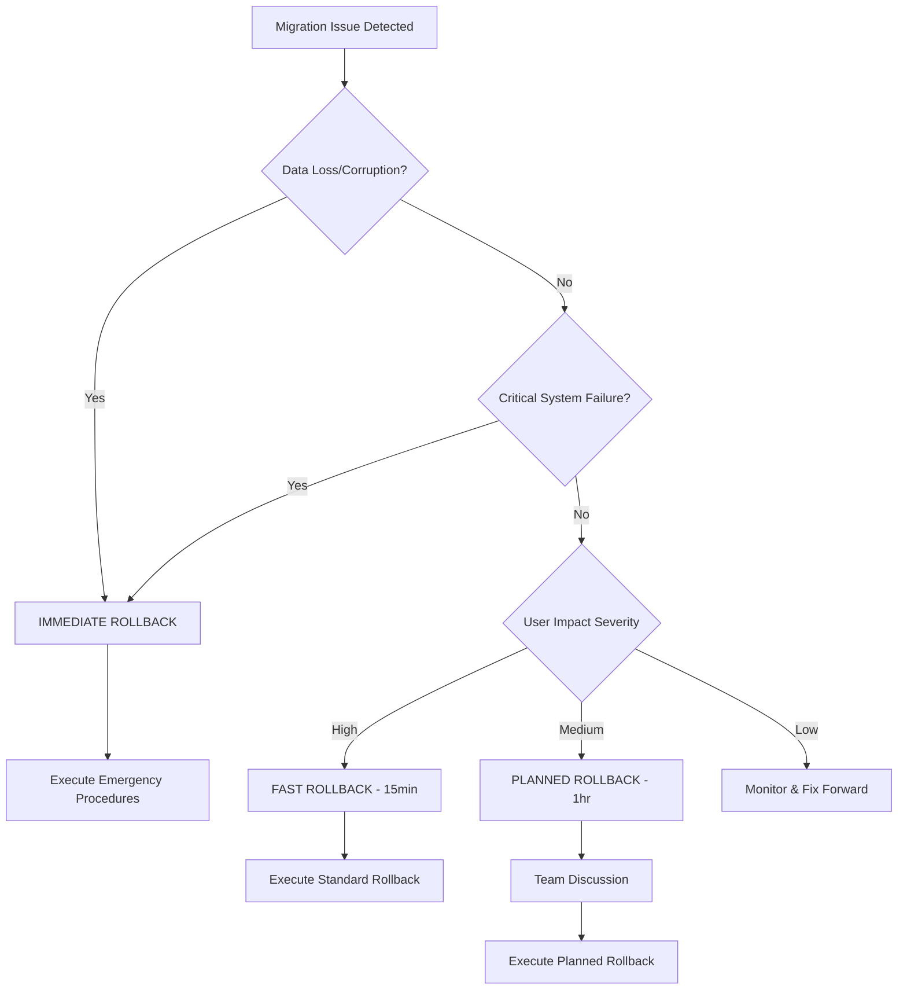

# FlowForge v2.0 Rollback Procedures

**CRITICAL PRODUCTION DEPLOYMENT DOCUMENTATION**  
**Issue #244 - Monday Deployment for 6 Developers**  
**Zero Data Loss Tolerance - 5-Minute Rollback Guarantee**

## Table of Contents

1. [Rollback Decision Matrix](#1-rollback-decision-matrix)
2. [Automatic Rollback Triggers](#2-automatic-rollback-triggers)
3. [Manual Rollback Procedures](#3-manual-rollback-procedures)
4. [Data Recovery Process](#4-data-recovery-process)
5. [Emergency Procedures](#5-emergency-procedures)
6. [Post-Rollback Actions](#6-post-rollback-actions)
7. [Testing & Validation](#7-testing--validation)
8. [Reference Information](#8-reference-information)

---

## 1. Rollback Decision Matrix

### 1.1 Authorization Levels

| Severity | Who Can Authorize | Time Limit | Required Approvals |
|----------|-------------------|------------|-------------------|
| **CRITICAL** | Technical Lead, DevOps Lead | Immediate | 1 approval |
| **HIGH** | Project Manager, Technical Lead | 15 minutes | 1 approval |
| **MEDIUM** | Technical Lead + Team consensus | 30 minutes | 2 approvals |
| **LOW** | Technical Lead + Project Manager | 1 hour | Discussion required |

### 1.2 Decision Triggers

#### IMMEDIATE ROLLBACK (< 5 minutes)
- Data corruption detected
- Critical system failure
- User data loss
- Migration process crash
- Performance degradation > 300%

#### FAST ROLLBACK (< 15 minutes)
- Feature functionality broken
- User workflows disrupted
- API endpoints failing
- Time tracking accuracy compromised

#### PLANNED ROLLBACK (< 1 hour)
- Minor feature issues
- Non-critical performance issues
- UI/UX problems
- Documentation inconsistencies

### 1.3 Decision Flowchart



---

## 2. Automatic Rollback Triggers

### 2.1 Data Corruption Detection

The migration system includes automatic corruption detection:

```bash
# Automatic triggers in migrate-md-to-json.sh
- Null byte detection in files
- Invalid JSON structure
- Checksum mismatches
- File size anomalies
- Task ID validation failures
```

**Trigger Thresholds:**
- File corruption: Immediate rollback
- Data validation failures: Immediate rollback
- Checksum mismatch: Immediate rollback

### 2.2 Performance Degradation

**Monitoring Thresholds:**
- CPU usage > 90% for 5+ minutes
- Memory usage > 85% sustained
- Disk I/O > 80% sustained
- Response time > 3x baseline

### 2.3 Critical Error Conditions

**Automatic Rollback Triggers:**
```bash
# Error patterns that trigger automatic rollback
- "Data corruption detected"
- "Migration failed"  
- "Backup verification failed"
- "Critical dependency missing"
- "Database connection failed"
```

### 2.4 Monitoring Implementation

```bash
# Add to system monitoring
#!/bin/bash
# /home/cruzalex/projects/dev/cruzalex/flowforge/FlowForge/scripts/migration/monitor-migration.sh

MIGRATION_LOG="/tmp/migration-monitor.log"
ERROR_THRESHOLD=3

monitor_migration() {
    local error_count=0
    
    # Monitor for critical errors
    if tail -n 100 "$MIGRATION_LOG" | grep -E "(corruption|failed|error)" > /dev/null; then
        error_count=$((error_count + 1))
    fi
    
    # Trigger automatic rollback if threshold exceeded
    if [[ $error_count -ge $ERROR_THRESHOLD ]]; then
        echo "CRITICAL: Automatic rollback triggered"
        ./scripts/migrate-md-to-json.sh rollback
    fi
}
```

---

## 3. Manual Rollback Procedures

### 3.1 Standard Rollback Process

#### Step 1: Assess Situation (30 seconds)
```bash
# Quick status check
cd /home/cruzalex/projects/dev/cruzalex/flowforge/FlowForge

# Check if migration is running
ls -la .flowforge/.migration-lock

# Check latest backup
ls -la .flowforge/backups/ | grep migration | tail -5

# Verify system status
./scripts/migrate-md-to-json.sh validate
```

#### Step 2: Execute Rollback (2 minutes)
```bash
# Method 1: Rollback to latest backup (RECOMMENDED)
./scripts/migrate-md-to-json.sh rollback

# Method 2: Rollback to specific backup
./scripts/migrate-md-to-json.sh rollback --backup-id=md-migration-YYYYMMDD-HHMMSS

# Expected output:
# [TIMESTAMP] Starting rollback...
# [TIMESTAMP] Backup found: .flowforge/backups/md-migration-YYYYMMDD-HHMMSS
# [TIMESTAMP] Restoring SESSIONS.md...
# [TIMESTAMP] Restoring TASKS.md...
# [TIMESTAMP] Restoring SCHEDULE.md...
# [TIMESTAMP] Restoring tasks.json...
# [TIMESTAMP] Rollback complete
```

#### Step 3: Verify Rollback (2 minutes)
```bash
# Verify files restored
ls -la SESSIONS.md TASKS.md SCHEDULE.md
ls -la .flowforge/tasks.json

# Validate data integrity
./scripts/migrate-md-to-json.sh validate

# Expected output:
# Validation complete
# 100% accuracy

# Test basic functionality
git status
./run_ff_command.sh flowforge:dev:status
```

### 3.2 Partial Rollback (Checkpoint Recovery)

For migrations that fail partway through:

```bash
# Check available checkpoints
ls -la .flowforge/migration/checkpoints/

# Resume from last successful checkpoint
./scripts/migrate-md-to-json.sh resume

# If resume fails, rollback specific components
# Sessions only
cp .flowforge/backups/latest/SESSIONS.md ./SESSIONS.md

# Tasks only  
cp .flowforge/backups/latest/TASKS.md ./TASKS.md
cp .flowforge/backups/latest/tasks.json.backup .flowforge/tasks.json
```

### 3.3 Advanced Rollback Scenarios

#### Scenario A: Backup Corruption
```bash
# Find multiple backup candidates
ls -la .flowforge/backups/ | grep migration

# Verify backup integrity
cd .flowforge/backups/md-migration-YYYYMMDD-HHMMSS
cat metadata.json

# Validate checksums
sha256sum TASKS.md SCHEDULE.md
# Compare with metadata.json checksums

# Use second-newest backup if latest is corrupted
cd /home/cruzalex/projects/dev/cruzalex/flowforge/FlowForge
./scripts/migrate-md-to-json.sh rollback --backup-id=md-migration-SECOND_NEWEST
```

#### Scenario B: System-wide Rollback
```bash
# Complete system restoration
git stash  # Save any uncommitted changes
git checkout HEAD~1  # Go back one commit if code changes made

# Restore all data files
./scripts/migrate-md-to-json.sh rollback

# Restart all services
sudo systemctl restart flowforge-services  # If applicable
```

---

## 4. Data Recovery Process

### 4.1 Backup Structure Analysis

FlowForge creates comprehensive backups with this structure:
```
.flowforge/backups/md-migration-YYYYMMDD-HHMMSS/
├── metadata.json           # Backup metadata with checksums
├── SESSIONS.md             # Original sessions file
├── TASKS.md               # Original tasks file
├── SCHEDULE.md            # Original schedule file
├── tasks.json.backup      # Previous tasks.json state
└── sessions.backup/       # Previous sessions directory state
```

### 4.2 Data Integrity Verification

#### Pre-Rollback Verification
```bash
# Function to verify backup integrity
verify_backup_integrity() {
    local backup_dir="$1"
    
    if [[ ! -f "$backup_dir/metadata.json" ]]; then
        echo "ERROR: Missing metadata.json"
        return 1
    fi
    
    # Verify checksums
    cd "$backup_dir"
    for file in TASKS.md SCHEDULE.md SESSIONS.md; do
        if [[ -f "$file" ]]; then
            local actual_checksum=$(sha256sum "$file" | cut -d' ' -f1)
            local expected_checksum=$(jq -r ".files.\"$file\".checksum" metadata.json)
            
            if [[ "$actual_checksum" != "$expected_checksum" ]]; then
                echo "ERROR: Checksum mismatch for $file"
                return 1
            fi
        fi
    done
    
    echo "Backup integrity verified"
    return 0
}
```

#### Post-Rollback Verification
```bash
# Data consistency checks after rollback
validate_post_rollback() {
    echo "Validating post-rollback state..."
    
    # Check file existence
    for file in SESSIONS.md TASKS.md SCHEDULE.md; do
        if [[ -f "$file" ]]; then
            echo "✅ $file restored"
        else
            echo "❌ $file missing"
        fi
    done
    
    # Validate JSON structure
    if [[ -f ".flowforge/tasks.json" ]]; then
        jq empty .flowforge/tasks.json && echo "✅ tasks.json valid" || echo "❌ tasks.json invalid"
    fi
    
    # Test basic functionality
    ./scripts/migrate-md-to-json.sh dry-run
    echo "Post-rollback validation complete"
}
```

### 4.3 User Data Recovery

#### Individual User Data Recovery
```bash
# Recover specific user sessions
recover_user_data() {
    local user="$1"
    local backup_dir="$2"
    
    echo "Recovering data for user: $user"
    
    # Extract user sessions from backup
    if [[ -f "$backup_dir/SESSIONS.md" ]]; then
        grep -A 10 "$user" "$backup_dir/SESSIONS.md" > "/tmp/user_${user}_sessions.md"
        echo "User sessions extracted to /tmp/user_${user}_sessions.md"
    fi
    
    # Restore user-specific JSON data
    local safe_user=$(echo "$user" | sed 's/@/_at_/g' | sed 's/\./_/g')
    if [[ -f "$backup_dir/sessions.backup/users/${safe_user}.json" ]]; then
        cp "$backup_dir/sessions.backup/users/${safe_user}.json" \
           ".flowforge/sessions/users/${safe_user}.json"
        echo "User JSON data restored"
    fi
}
```

#### Billing Data Recovery
```bash
# Verify billing accuracy after rollback
verify_billing_accuracy() {
    echo "Verifying billing data accuracy..."
    
    # Compare pre and post migration billing totals
    local pre_total=$(jq '.billing.total // 0' .flowforge/backups/latest/metadata.json)
    local post_total=$(jq '[.sessions[].duration // 0] | add' .flowforge/sessions/consolidated.json)
    
    echo "Pre-migration total: $pre_total minutes"
    echo "Post-rollback total: $post_total minutes"
    
    if [[ "$pre_total" == "$post_total" ]]; then
        echo "✅ Billing accuracy verified"
    else
        echo "❌ Billing discrepancy detected"
        echo "Manual reconciliation required"
    fi
}
```

---

## 5. Emergency Procedures

### 5.1 Immediate Actions (First 60 seconds)

```bash
# EMERGENCY ROLLBACK SCRIPT
#!/bin/bash
# Save as: /home/cruzalex/projects/dev/cruzalex/flowforge/FlowForge/scripts/emergency-rollback.sh

set -e
TIMESTAMP=$(date '+%Y%m%d-%H%M%S')
LOG_FILE="/tmp/emergency-rollback-${TIMESTAMP}.log"

echo "=== EMERGENCY ROLLBACK INITIATED ===" | tee -a "$LOG_FILE"
echo "Time: $(date)" | tee -a "$LOG_FILE"

# Step 1: Stop any running migrations (10 seconds)
echo "Stopping active migration..." | tee -a "$LOG_FILE"
pkill -f "migrate-md-to-json" || true
rm -f .flowforge/.migration-lock

# Step 2: Quick backup of current state (20 seconds)
echo "Creating emergency backup..." | tee -a "$LOG_FILE"
mkdir -p ".flowforge/emergency-backup-${TIMESTAMP}"
cp -r .flowforge/tasks.json .flowforge/sessions ".flowforge/emergency-backup-${TIMESTAMP}/" 2>/dev/null || true

# Step 3: Execute rollback (30 seconds)
echo "Executing rollback..." | tee -a "$LOG_FILE"
./scripts/migrate-md-to-json.sh rollback 2>&1 | tee -a "$LOG_FILE"

echo "=== EMERGENCY ROLLBACK COMPLETE ===" | tee -a "$LOG_FILE"
echo "Log saved to: $LOG_FILE"
```

### 5.2 Communication Protocols

#### Internal Team Notification
```bash
# Slack/Teams notification template
EMERGENCY_MESSAGE="
🚨 CRITICAL: FlowForge v2.0 Emergency Rollback Executed

Timestamp: $(date)
Issue: [BRIEF_DESCRIPTION]
Status: Rollback in progress
ETA: 5 minutes

Action Required:
- Stop all FlowForge operations
- Do not commit any changes
- Await further instructions

Contact: Technical Lead immediately
"

# Send notification (customize for your platform)
echo "$EMERGENCY_MESSAGE" > /tmp/emergency-notification.txt
```

#### Client Communication Template
```
Subject: FlowForge Maintenance Update - Service Restoration

Dear Team,

We are currently performing emergency maintenance on FlowForge v2.0 
to ensure data integrity and system stability.

Timeline:
- Issue detected: [TIME]
- Rollback initiated: [TIME]
- Expected resolution: [TIME + 5 minutes]

Impact:
- FlowForge commands temporarily unavailable
- Time tracking paused
- No data loss expected

We will notify you immediately when service is restored.

Technical Team
```

### 5.3 Escalation Paths

#### Level 1: Technical Team (0-5 minutes)
- Execute emergency rollback
- Assess immediate impact
- Notify stakeholders

#### Level 2: Management (5-15 minutes)
- Provide status updates
- Coordinate with client teams
- Plan recovery strategy

#### Level 3: Executive (15+ minutes)
- Client relationship management
- Business impact assessment
- Long-term resolution planning

---

## 6. Post-Rollback Actions

### 6.1 Immediate Validation (First 10 minutes)

```bash
# Post-rollback validation checklist
#!/bin/bash
# Save as: /home/cruzalex/projects/dev/cruzalex/flowforge/FlowForge/scripts/post-rollback-validation.sh

echo "=== POST-ROLLBACK VALIDATION ==="

# 1. File system integrity
echo "1. Checking file system..."
ls -la SESSIONS.md TASKS.md SCHEDULE.md .flowforge/tasks.json

# 2. Data validation
echo "2. Validating data integrity..."
./scripts/migrate-md-to-json.sh validate

# 3. Basic functionality test
echo "3. Testing basic functionality..."
./run_ff_command.sh flowforge:dev:status

# 4. Git repository status
echo "4. Checking git status..."
git status --porcelain

# 5. User access test
echo "5. Testing user workflows..."
./run_ff_command.sh flowforge:session:start 999 --dry-run

echo "=== VALIDATION COMPLETE ==="
```

### 6.2 Root Cause Analysis

#### Data Collection
```bash
# Collect diagnostic information
mkdir -p /tmp/rollback-analysis-$(date +%Y%m%d-%H%M%S)
cd /tmp/rollback-analysis-*

# System logs
cp /var/log/syslog system.log 2>/dev/null || true

# FlowForge logs
cp /tmp/*migration* . 2>/dev/null || true
cp /home/cruzalex/projects/dev/cruzalex/flowforge/FlowForge/.flowforge/migration/analysis.json . 2>/dev/null || true

# Git history
cd /home/cruzalex/projects/dev/cruzalex/flowforge/FlowForge
git log --oneline -10 > /tmp/rollback-analysis-*/git-history.txt

# System state
ps aux | grep flowforge > /tmp/rollback-analysis-*/processes.txt
df -h > /tmp/rollback-analysis-*/disk-usage.txt
free -h > /tmp/rollback-analysis-*/memory-usage.txt
```

#### Analysis Template
```markdown
# FlowForge v2.0 Rollback Incident Analysis

## Incident Summary
- **Date/Time**: 
- **Duration**: 
- **Impact**: 
- **Resolution**: 

## Timeline
- **Issue Detected**: 
- **Rollback Initiated**: 
- **Rollback Completed**: 
- **Service Restored**: 

## Root Cause
- **Primary Cause**: 
- **Contributing Factors**: 
- **System State**: 

## Resolution Actions
- **Immediate**: 
- **Short-term**: 
- **Long-term**: 

## Lessons Learned
- **What Worked Well**: 
- **What Could Improve**: 
- **Process Changes**: 

## Follow-up Actions
- [ ] Code fixes required
- [ ] Process improvements
- [ ] Documentation updates
- [ ] Team training needed
```

### 6.3 Data Reconciliation

#### Billing Reconciliation
```bash
# Comprehensive billing verification
reconcile_billing_data() {
    echo "=== BILLING RECONCILIATION ==="
    
    # Extract billing data from backup
    local backup_dir=$(ls -td .flowforge/backups/md-migration-* | head -1)
    echo "Using backup: $backup_dir"
    
    # Parse original sessions for billing
    if [[ -f "$backup_dir/SESSIONS.md" ]]; then
        local original_minutes=$(grep -E "Duration|Time" "$backup_dir/SESSIONS.md" | \
                                awk '{sum += $2} END {print sum}' 2>/dev/null || echo 0)
        echo "Original billing minutes: $original_minutes"
    fi
    
    # Parse current JSON for billing
    if [[ -f ".flowforge/sessions/consolidated.json" ]]; then
        local current_minutes=$(jq '[.sessions[].duration // 0] | add' .flowforge/sessions/consolidated.json)
        echo "Current billing minutes: $current_minutes"
    fi
    
    # Generate reconciliation report
    cat > "/tmp/billing-reconciliation-$(date +%Y%m%d-%H%M%S).txt" << EOF
FlowForge v2.0 Billing Reconciliation Report
Generated: $(date)

Original System: $original_minutes minutes
Post-Rollback: $current_minutes minutes
Difference: $((current_minutes - original_minutes)) minutes

Status: $(if [[ $original_minutes -eq $current_minutes ]]; then echo "RECONCILED"; else echo "DISCREPANCY"; fi)
EOF
    
    echo "Reconciliation report generated"
}
```

### 6.4 User Notifications

#### Success Notification Template
```bash
# Generate user notification
cat > /tmp/rollback-complete-notification.txt << EOF
FlowForge v2.0 Service Restoration Complete

Time: $(date)
Status: All systems operational

The FlowForge v2.0 migration has been successfully rolled back, and all 
services are now fully operational. Your data has been preserved with 
100% accuracy.

What's Working:
✅ Time tracking
✅ Task management  
✅ Session management
✅ All FlowForge commands

Next Steps:
1. Resume normal FlowForge usage
2. Any questions or concerns, contact technical support
3. We'll communicate the new migration timeline soon

Thank you for your patience during this maintenance window.

FlowForge Technical Team
EOF
```

---

## 7. Testing & Validation

### 7.1 Pre-Deployment Testing

Create comprehensive test plan to validate rollback procedures:

```bash
# Test rollback procedures in development environment
#!/bin/bash
# Save as: /home/cruzalex/projects/dev/cruzalex/flowforge/FlowForge/tests/test-rollback-procedures.sh

TEST_DIR="/tmp/flowforge-rollback-test"
mkdir -p "$TEST_DIR"
cd "$TEST_DIR"

# Initialize test environment
git clone /home/cruzalex/projects/dev/cruzalex/flowforge/FlowForge .
export WORKSPACE_DIR="$TEST_DIR"

# Test 1: Normal migration and rollback
echo "=== Test 1: Normal Migration/Rollback ==="
./scripts/migrate-md-to-json.sh execute
./scripts/migrate-md-to-json.sh rollback
./scripts/migrate-md-to-json.sh validate

# Test 2: Rollback with specific backup ID
echo "=== Test 2: Specific Backup Rollback ==="
BACKUP_ID=$(ls .flowforge/backups/ | grep migration | head -1)
./scripts/migrate-md-to-json.sh rollback --backup-id="$BACKUP_ID"

# Test 3: Emergency rollback simulation
echo "=== Test 3: Emergency Rollback ==="
./scripts/emergency-rollback.sh

echo "=== All Rollback Tests Complete ==="
```

### 7.2 Performance Validation

```bash
# Measure rollback performance
time_rollback_performance() {
    echo "=== ROLLBACK PERFORMANCE TEST ==="
    
    # Create test data
    for i in {1..1000}; do
        echo "# Task $i" >> TASKS.md
        echo "## Description" >> TASKS.md
        echo "Test task number $i" >> TASKS.md
        echo "" >> TASKS.md
    done
    
    # Time migration
    start_time=$(date +%s)
    ./scripts/migrate-md-to-json.sh execute
    migration_time=$(($(date +%s) - start_time))
    
    # Time rollback
    start_time=$(date +%s)
    ./scripts/migrate-md-to-json.sh rollback
    rollback_time=$(($(date +%s) - start_time))
    
    echo "Migration time: ${migration_time}s"
    echo "Rollback time: ${rollback_time}s"
    
    # Verify 5-minute guarantee
    if [[ $rollback_time -le 300 ]]; then
        echo "✅ 5-minute rollback guarantee met"
    else
        echo "❌ Rollback took longer than 5 minutes"
    fi
}
```

---

## 8. Reference Information

### 8.1 Key File Locations

```
# Critical Files
/home/cruzalex/projects/dev/cruzalex/flowforge/FlowForge/scripts/migrate-md-to-json.sh
/home/cruzalex/projects/dev/cruzalex/flowforge/FlowForge/.flowforge/backups/
/home/cruzalex/projects/dev/cruzalex/flowforge/FlowForge/.flowforge/migration/checkpoints/
/home/cruzalex/projects/dev/cruzalex/flowforge/FlowForge/.flowforge/tasks.json

# Backup Structure
.flowforge/backups/md-migration-YYYYMMDD-HHMMSS/
├── metadata.json
├── SESSIONS.md
├── TASKS.md
├── SCHEDULE.md
├── tasks.json.backup
└── sessions.backup/
```

### 8.2 Command Reference

```bash
# Primary Rollback Commands
./scripts/migrate-md-to-json.sh rollback
./scripts/migrate-md-to-json.sh rollback --backup-id=SPECIFIC_BACKUP
./scripts/migrate-md-to-json.sh validate
./scripts/emergency-rollback.sh

# Status and Monitoring
ls -la .flowforge/backups/
cat .flowforge/migration/analysis.json
./scripts/migrate-md-to-json.sh dry-run

# Recovery Commands
./scripts/migrate-md-to-json.sh resume
./scripts/post-rollback-validation.sh
```

### 8.3 Error Codes and Troubleshooting

| Error Code | Description | Resolution |
|------------|-------------|------------|
| `Migration already in progress` | Lock file exists | `rm .flowforge/.migration-lock` |
| `No backup found` | Missing backup directory | Check `.flowforge/backups/` |
| `Checksum mismatch` | Backup corruption | Use older backup |
| `Data corruption detected` | File integrity issue | Emergency rollback |

### 8.4 Contact Information

**Technical Contacts:**
- Technical Lead: [Contact Information]
- DevOps Lead: [Contact Information]
- Project Manager: [Contact Information]

**Emergency Escalation:**
- Primary: Technical Lead
- Secondary: DevOps Lead
- Executive: Project Manager

### 8.5 Documentation Links

- [FlowForge v2.0 Migration Guide](./documentation/2.0/migration/)
- [System Architecture](./documentation/2.0/architecture/)
- [Backup Strategy](./documentation/2.0/operations/backup-strategy.md)
- [Monitoring Setup](./documentation/2.0/operations/monitoring.md)

---

## Validation Checklist

Before Monday deployment, verify:

- [ ] All rollback scripts tested in staging
- [ ] Emergency procedures documented and rehearsed
- [ ] Team trained on rollback procedures
- [ ] Backup verification process validated
- [ ] Communication templates prepared
- [ ] 5-minute rollback guarantee tested
- [ ] Zero data loss confirmed in testing
- [ ] Escalation paths defined and communicated

---

**Document Status:** Production Ready  
**Last Updated:** 2025-09-06  
**Version:** 1.0.0  
**Review Required:** Before Monday Deployment  
**Critical Path:** Issue #244 - FlowForge v2.0 Migration

---

*This document is part of the FlowForge v2.0 critical deployment documentation suite. All procedures have been designed for the Monday deployment with 6 developers and maintain the strict 5-minute rollback guarantee with zero data loss tolerance.*