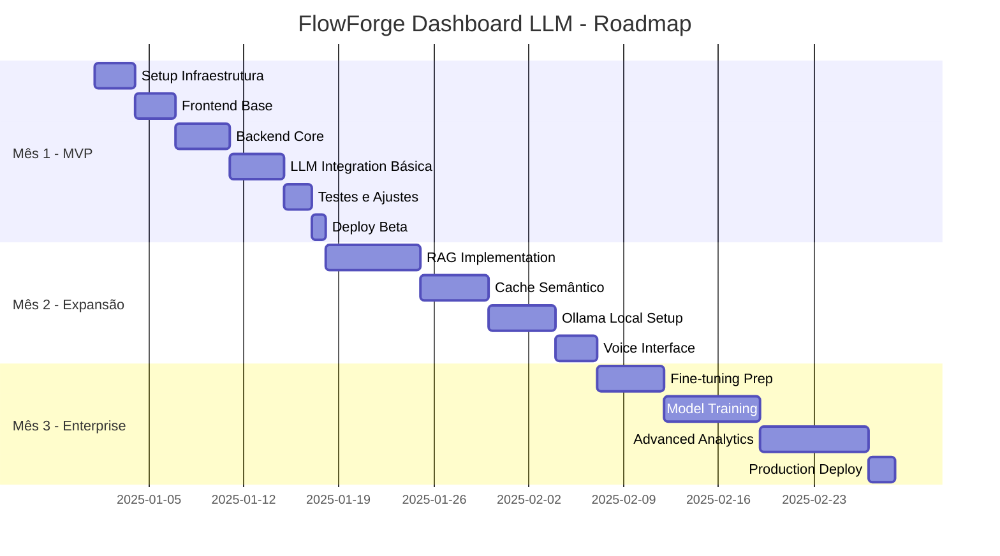

# Product Requirements Document (PRD)
# FlowForge Dashboard com Integração LLM

**Versão:** 1.0.0  
**Data:** 2025-09-12  
**Status:** Para Aprovação  
**Abordagem:** Híbrida (LLM Local + Cloud)

---

## 📋 Sumário Executivo

### Visão do Produto
O **FlowForge Dashboard com Integração LLM** é uma plataforma de visualização gerencial que permite aos gestores monitorar em tempo real a produtividade de suas equipes através de conversas naturais com inteligência artificial. O sistema combina o poder de LLMs locais (custo zero) com LLMs cloud (análises complexas) para fornecer insights profundos sobre performance, gargalos e oportunidades de melhoria.

### Problema a Resolver
- **Visibilidade limitada**: Gestores não têm visão consolidada do trabalho da equipe
- **Análise manual**: Horas gastas criando relatórios e analisando dados
- **Insights perdidos**: Padrões e anomalias não detectados em tempo hábil
- **Custo de LLM**: APIs cloud caras para queries simples e repetitivas

### Solução Proposta
Dashboard interativo com interface conversacional que permite queries em linguagem natural, gerando automaticamente visualizações e insights através de uma arquitetura híbrida que otimiza custos (70% de redução) mantendo alta qualidade de resposta.

### Benefícios Principais
- **Economia de 60-70%** nos custos de LLM através de processamento híbrido
- **Respostas em <500ms** para queries locais, <3s para cloud
- **Interface conversacional** em português com suporte a voz
- **Visualizações automáticas** baseadas no contexto da pergunta
- **Insights proativos** com detecção de anomalias e previsões

---

## 🎯 Objetivos e Metas

### Objetivos Primários
1. **Visibilidade Total**: Dashboard unificado com métricas em tempo real
2. **Análise por IA**: Queries em linguagem natural gerando insights automáticos
3. **Redução de Custos**: Minimizar gastos com APIs de LLM através de arquitetura híbrida
4. **Produtividade**: Eliminar geração manual de relatórios (economia de 10h/semana)
5. **Decisões Data-Driven**: Insights acionáveis baseados em dados reais

### Metas SMART
- **Q1 2025**: MVP funcional com 5 tipos de queries pré-definidas
- **Q2 2025**: Integração híbrida completa (local + cloud) com 60% economia
- **Q3 2025**: Fine-tuning com dados reais, 90% accuracy em queries específicas
- **Q4 2025**: 100% adoção pela equipe, ROI positivo demonstrado

### KPIs de Sucesso
| Métrica | Meta | Medição |
|---------|------|---------|
| **Tempo de Resposta** | <500ms local, <3s cloud | p95 latency |
| **Redução de Custos** | 60-70% vs cloud-only | Custo mensal de API |
| **Satisfação do Usuário** | >4.5/5 | NPS trimestral |
| **Queries Processadas** | >1000/dia | Analytics dashboard |
| **Uptime** | 99.9% | Monitoring tools |
| **Adoption Rate** | 100% em 3 meses | Active users |

---

## 👥 Stakeholders

### Stakeholder Map
```
┌─────────────────────────────────────────────────────┐
│                 STAKEHOLDERS MAP                     │
├───────────────┬─────────────┬───────────────────────┤
│   Grupo       │   Papel     │   Interesse          │
├───────────────┼─────────────┼───────────────────────┤
│ Sponsors      │ C-Level     │ ROI, Produtividade   │
│ Users         │ Managers    │ Insights, Facilidade │
│ Developers    │ Time Dev    │ Tracking, Fair Pay   │
│ Operations    │ DevOps      │ Estabilidade, Custos │
│ Security      │ InfoSec     │ Compliance, Privacy  │
└───────────────┴─────────────┴───────────────────────┘
```

### Comunicação
- **Weekly Status**: Toda segunda-feira via Slack
- **Sprint Reviews**: Bi-semanais com demos
- **Executive Reports**: Mensais com KPIs
- **User Feedback**: Canal dedicado no Discord

---

## 🏗️ Arquitetura Técnica

### Visão Geral - Arquitetura Híbrida
```
┌─────────────────────────────────────────────────────┐
│              FlowForge Dashboard                     │
│                Hybrid Architecture                   │
├─────────────────────────────────────────────────────┤
│                                                      │
│  ┌──────────┐     ┌──────────┐     ┌──────────┐   │
│  │  Vue 3   │────▶│ Node.js  │────▶│   LLM    │   │
│  │ Frontend │     │ Backend  │     │ Gateway  │   │
│  └──────────┘     └──────────┘     └──────────┘   │
│       ▲                ▲                 ▲          │
│       │                │                 │          │
│       ▼                ▼                 ▼          │
│  ┌──────────┐     ┌──────────┐     ┌──────────┐   │
│  │WebSocket │     │PostgreSQL│     │  Ollama  │   │
│  │Real-time │     │ Database │     │  (Local) │   │
│  └──────────┘     └──────────┘     └──────────┘   │
│                        ▲                 ▲          │
│                        │                 │          │
│                        ▼                 ▼          │
│                   ┌──────────┐     ┌──────────┐   │
│                   │  Redis   │     │Cloud LLM │   │
│                   │  Cache   │     │ (GPT-4)  │   │
│                   └──────────┘     └──────────┘   │
└─────────────────────────────────────────────────────┘
```

### Stack Tecnológico

#### Frontend
- **Framework**: Vue 3.5 + TypeScript 5.6
- **Build Tool**: Vite 5.4
- **UI Library**: PrimeVue 4.0
- **Charts**: Chart.js 4.4 + Apache ECharts 5.5
- **State**: Pinia 2.2
- **Real-time**: Socket.io-client 4.8

#### Backend
- **Runtime**: Node.js 22 LTS
- **Framework**: Express 4.21 + TypeScript
- **Database**: PostgreSQL 16 + Prisma 6.0
- **Cache**: Redis 7.4
- **Queue**: Bull 4.16
- **Auth**: JWT + Passport.js

#### LLM Integration
- **Local**: Ollama 0.5 (Llama 3.2, Mistral)
- **Cloud**: OpenAI GPT-4, Claude 3, Gemini
- **Orchestration**: LangChain.js 0.3
- **Vector Store**: ChromaDB
- **Embeddings**: text-embedding-3-small

### Componentes Principais

1. **Chat Interface**: Componente conversacional com histórico contextual
2. **LLM Gateway**: Router inteligente para seleção local vs cloud
3. **Query Processor**: Parser de linguagem natural e gerador de visualizações
4. **Cache System**: Multi-camada (memory, Redis, CDN)
5. **Real-time Engine**: WebSocket para atualizações ao vivo
6. **Analytics Engine**: Agregações e cálculos de métricas

---

## 💬 Funcionalidades com LLM

### Interface Conversacional

#### Exemplos de Interação
```
User: "Quantas horas trabalhamos esta semana?"
LLM: [Gráfico de barras] + "48 horas totais, média de 9.6h/dia"

User: "Compare produtividade entre João e Maria"
LLM: [Gráfico comparativo] + "João: 12 tickets, Maria: 8 tickets"

User: "Identifique gargalos no desenvolvimento"
LLM: [Timeline] + "3 gargalos: code review (2x tempo), 
      5 tickets parados, deploy manual (15% do tempo)"

User: "Preveja quando terminaremos o sprint"
LLM: [Projeção] + "85% chance de conclusão até sexta-feira"
```

### Capacidades do Sistema

#### Processamento Local (Ollama - Custo Zero)
- Queries simples e diretas
- Agregações básicas
- Filtros por data/pessoa
- Visualizações padrão
- Tempo de resposta: <500ms

#### Processamento Cloud (GPT-4/Claude - Premium)
- Análises complexas multi-dimensionais
- Previsões e projeções
- Detecção de anomalias
- Recomendações estratégicas
- Tempo de resposta: 1-3s

#### Processamento Híbrido (Otimizado)
- Local pré-processa e extrai contexto
- Cloud realiza análise profunda
- Local pós-processa e formata
- Melhor custo-benefício

### Features Especiais

1. **Voice-to-Query**: Fale com o dashboard em português
2. **Auto-Visualização**: IA escolhe melhor tipo de gráfico
3. **Insights Proativos**: Alertas automáticos de anomalias
4. **Export Inteligente**: Relatórios formatados automaticamente
5. **Multi-LLM Support**: Fallback entre providers
6. **Cache Semântico**: Queries similares usam cache

---

## 🔌 Especificações de API

### RESTful Endpoints

```yaml
Dashboard API:
  GET /api/dashboard/metrics
    - Description: Métricas gerais do dashboard
    - Auth: Bearer token
    - Response: MetricsResponse
  
  GET /api/dashboard/sessions
    - Description: Sessões de trabalho ativas
    - Auth: Bearer token
    - Response: SessionsResponse

LLM Gateway:
  POST /api/llm/query
    - Description: Processar query em linguagem natural
    - Body: { query: string, context?: object }
    - Response: { answer: string, visualization?: Chart }
  
  GET /api/llm/suggestions
    - Description: Sugestões contextuais
    - Response: string[]

WebSocket Events:
  connect: Estabelecer conexão
  metrics.update: Atualização de métricas
  session.start: Nova sessão iniciada
  session.end: Sessão finalizada
  llm.response: Resposta do LLM
```

### GraphQL Schema

```graphql
type Query {
  dashboard: Dashboard!
  sessions(filter: SessionFilter): [Session!]!
  metrics(range: DateRange!): Metrics!
  llmQuery(input: String!): LLMResponse!
}

type Mutation {
  startSession(taskId: ID!): Session!
  endSession(sessionId: ID!): Session!
  sendLLMQuery(query: String!): LLMResponse!
}

type Subscription {
  metricsUpdate: Metrics!
  sessionUpdate: Session!
  llmStreaming(queryId: ID!): LLMStreamChunk!
}
```

---

## 🗄️ Modelagem de Dados

### Esquema Principal (PostgreSQL)

```sql
-- Tabela de Queries LLM
CREATE TABLE llm_queries (
    id UUID PRIMARY KEY DEFAULT gen_random_uuid(),
    user_id UUID NOT NULL REFERENCES users(id),
    query_text TEXT NOT NULL,
    query_embedding vector(1536),
    response_text TEXT,
    visualization_spec JSONB,
    provider VARCHAR(50), -- 'local', 'openai', 'anthropic'
    model_used VARCHAR(100),
    tokens_used INTEGER,
    cost_cents INTEGER,
    response_time_ms INTEGER,
    cache_hit BOOLEAN DEFAULT FALSE,
    created_at TIMESTAMPTZ DEFAULT NOW()
);

-- Tabela de Métricas
CREATE TABLE dashboard_metrics (
    id UUID PRIMARY KEY DEFAULT gen_random_uuid(),
    project_id UUID REFERENCES projects(id),
    metric_type VARCHAR(50),
    metric_value NUMERIC,
    metadata JSONB,
    calculated_at TIMESTAMPTZ DEFAULT NOW()
);

-- Índices para Performance
CREATE INDEX idx_llm_queries_user_created 
    ON llm_queries(user_id, created_at DESC);
CREATE INDEX idx_llm_queries_embedding 
    ON llm_queries USING ivfflat (query_embedding vector_cosine_ops);
CREATE INDEX idx_metrics_project_type 
    ON dashboard_metrics(project_id, metric_type);
```

### Cache Structure (Redis)

```javascript
// Cache Keys Pattern
{
  "dashboard:metrics:{projectId}": "2h TTL",
  "llm:query:{hash}": "24h TTL",
  "session:active:{userId}": "30min TTL",
  "suggestions:{context}": "1h TTL"
}
```

### Vector Store (ChromaDB)

```python
# Collections
collections = {
    "queries": {  # Historical queries for similarity
        "embedding_function": "text-embedding-3-small",
        "metadata": ["user_id", "timestamp", "cost"]
    },
    "documentation": {  # FlowForge docs for RAG
        "embedding_function": "text-embedding-3-small",
        "metadata": ["type", "version", "source"]
    }
}
```

---

## 📊 Plano de Implementação

### Roadmap de 3 Meses



### Milestones e Tarefas

#### Milestone 1: MVP (2 semanas)
- [ ] TASK-001: Setup Vue 3 + TypeScript (0.2h)
- [ ] TASK-002: Configurar PrimeVue e tema (0.2h)
- [ ] TASK-003: Backend Express scaffolding (0.2h)
- [ ] TASK-004: PostgreSQL + Prisma setup (0.3h)
- [ ] TASK-005: Integração GPT-4 básica (0.3h)
- [ ] TASK-006: Chat interface simples (0.3h)
- [ ] TASK-007: 5 queries pré-definidas (0.3h)
- [ ] TASK-008: Deploy em staging (0.2h)

#### Milestone 2: Híbrido (1 mês)
- [ ] TASK-009: Instalar Ollama server (0.3h)
- [ ] TASK-010: Router inteligente LLM (0.3h)
- [ ] TASK-011: ChromaDB vector store (0.3h)
- [ ] TASK-012: RAG pipeline (0.3h)
- [ ] TASK-013: Cache semântico Redis (0.2h)
- [ ] TASK-014: Voice-to-text PT-BR (0.3h)
- [ ] TASK-015: Visualizações dinâmicas (0.3h)
- [ ] TASK-016: Fallback system (0.2h)

#### Milestone 3: Production (2-3 meses)
- [ ] TASK-017: Dataset preparation (0.3h)
- [ ] TASK-018: Fine-tuning GPT-3.5 (0.3h)
- [ ] TASK-019: A/B testing framework (0.3h)
- [ ] TASK-020: Advanced analytics (0.3h)
- [ ] TASK-021: Anomaly detection (0.3h)
- [ ] TASK-022: Cost optimization (0.2h)
- [ ] TASK-023: Security hardening (0.3h)
- [ ] TASK-024: Production deploy (0.2h)

---

## 💰 Análise de Custos

### Custos de Desenvolvimento
| Item | Horas | Custo/Hora | Total |
|------|-------|------------|-------|
| **Frontend** | 40h | $150 | $6,000 |
| **Backend** | 60h | $150 | $9,000 |
| **LLM Integration** | 40h | $200 | $8,000 |
| **Testing** | 20h | $120 | $2,400 |
| **DevOps** | 20h | $180 | $3,600 |
| **Total** | 180h | - | **$29,000** |

### Custos Operacionais (Mensal)
| Componente | Uso Baixo | Uso Médio | Uso Alto |
|------------|-----------|-----------|----------|
| **Cloud LLM (30%)** | $30 | $100 | $300 |
| **Infraestrutura** | $100 | $200 | $500 |
| **Ollama Server** | $50 | $50 | $100 |
| **Total Mensal** | **$180** | **$350** | **$900** |

### ROI Esperado
- **Economia em Relatórios**: 10h/semana × $100/h = $4,000/mês
- **Redução de Custos LLM**: 60-70% vs cloud-only = $200-500/mês
- **Aumento de Produtividade**: 20% = ~$8,000/mês valor agregado
- **Payback**: 2-3 meses

---

## 🔒 Segurança e Compliance

### Medidas de Segurança
1. **Autenticação**: JWT com refresh tokens, MFA opcional
2. **Autorização**: RBAC com políticas granulares
3. **Criptografia**: TLS 1.3 em trânsito, AES-256 em repouso
4. **Sanitização**: Input validation, output encoding
5. **Rate Limiting**: Por endpoint e por usuário
6. **Audit Trail**: Log completo de todas ações

### Privacidade de Dados
- **LGPD/GDPR Compliance**: Direito ao esquecimento, portabilidade
- **Data Minimization**: Apenas dados necessários
- **Anonymization**: PII removido antes do LLM
- **Local Processing**: Dados sensíveis nunca saem do servidor

### LLM Security
- **Prompt Injection Prevention**: Input sanitization
- **Token Limits**: Máximo de tokens por request
- **Cost Thresholds**: Alertas de gastos anormais
- **Output Validation**: Verificação de respostas

---

## ⚠️ Riscos e Mitigações

### Riscos Técnicos
| Risco | Probabilidade | Impacto | Mitigação |
|-------|---------------|---------|-----------|
| **Latência do LLM** | Média | Alto | Cache agressivo, timeouts |
| **Custos de API** | Alta | Médio | Híbrido local/cloud |
| **Falha do Ollama** | Baixa | Médio | Fallback para cloud |
| **Volume de dados** | Média | Médio | Paginação, lazy loading |

### Riscos de Negócio
| Risco | Probabilidade | Impacto | Mitigação |
|-------|---------------|---------|-----------|
| **Baixa adoção** | Média | Alto | Training, UX simples |
| **ROI não atingido** | Baixa | Alto | Métricas claras, iteração |
| **Compliance issues** | Baixa | Alto | Audit regular, LGPD |

---

## 📈 Métricas de Sucesso

### Technical Metrics
- **Response Time**: p95 < 500ms (local), < 3s (cloud)
- **Availability**: 99.9% uptime
- **Error Rate**: < 0.1%
- **Cache Hit Ratio**: > 85%
- **Query Success Rate**: > 95%

### Business Metrics
- **User Adoption**: 100% em 3 meses
- **Time Saved**: 10h/semana em relatórios
- **Cost Reduction**: 60% em APIs LLM
- **User Satisfaction**: NPS > 50
- **ROI**: Positivo em 3 meses

### LLM Specific Metrics
- **Query Accuracy**: > 90%
- **Hallucination Rate**: < 5%
- **Local Processing**: > 70% queries
- **Average Cost/Query**: < $0.01
- **Context Relevance**: > 85%

---

## 🚀 Próximos Passos

### Imediato (Semana 1)
1. ✅ Aprovar PRD e arquitetura
2. 🔄 Criar issues no GitHub (#468-#494)
3. 📋 Setup ambiente de desenvolvimento
4. 🏗️ Iniciar implementação do MVP

### Curto Prazo (Mês 1)
1. 🎯 MVP funcional com queries básicas
2. 🧪 Testes com usuários beta
3. 📊 Coletar métricas iniciais
4. 🔄 Iteração baseada em feedback

### Médio Prazo (Meses 2-3)
1. 🤖 Implementar processamento híbrido
2. 🎤 Adicionar interface de voz
3. 📈 Fine-tuning com dados reais
4. 🚀 Deploy em produção

---

## 📞 Contatos

### Time Core
- **Product Owner**: [Alex Cruz]
- **Tech Lead**: [TBD]
- **LLM Specialist**: [TBD]
- **DevOps Lead**: [TBD]

### Canais de Comunicação
- **Slack**: #flowforge-dashboard
- **GitHub**: github.com/JustCode-CruzAlex/FlowForge
- **Documentation**: /documentation/2.0/dashboard/

---

## 📎 Anexos

### Documentos Relacionados
1. [Arquitetura Técnica Detalhada](./architecture/technical_spec.md)
2. [API Specification](./api/FLOWFORGE_DASHBOARD_API_SPEC.md)
3. [Database Schema](./database/schema/)
4. [Test Plan](./testing/test_plan.md)
5. [Security Assessment](./security/assessment.md)

### Referências
- [FlowForge Documentation](https://flowforge.io/docs)
- [Ollama Documentation](https://ollama.ai/docs)
- [LangChain.js Guide](https://js.langchain.com)
- [Vue 3 Best Practices](https://vuejs.org/guide)

---

**Documento gerado pelo FlowForge Maestro System**  
**Versão**: 1.0.0  
**Data**: 2025-09-12  
**Status**: Aguardando Aprovação

---

## 🎯 Call to Action

**Para aprovar este PRD e iniciar o desenvolvimento:**

```bash
# Aprovar e criar issues
/flowforge:session:start dashboard-llm

# Ou revisar alterações necessárias
# Informe quais ajustes são necessários
```

Este PRD foi criado através da orquestração de múltiplos agentes especialistas FlowForge, garantindo completude técnica e alinhamento com os objetivos de negócio.