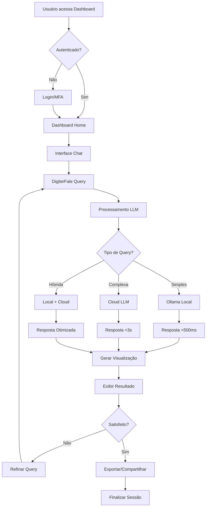
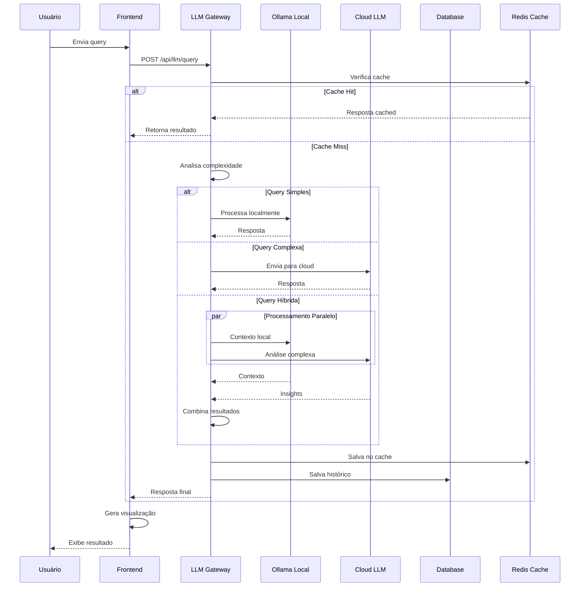
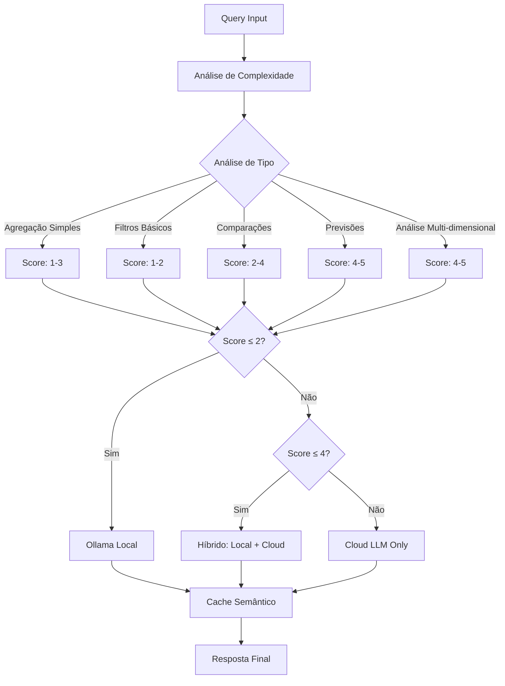
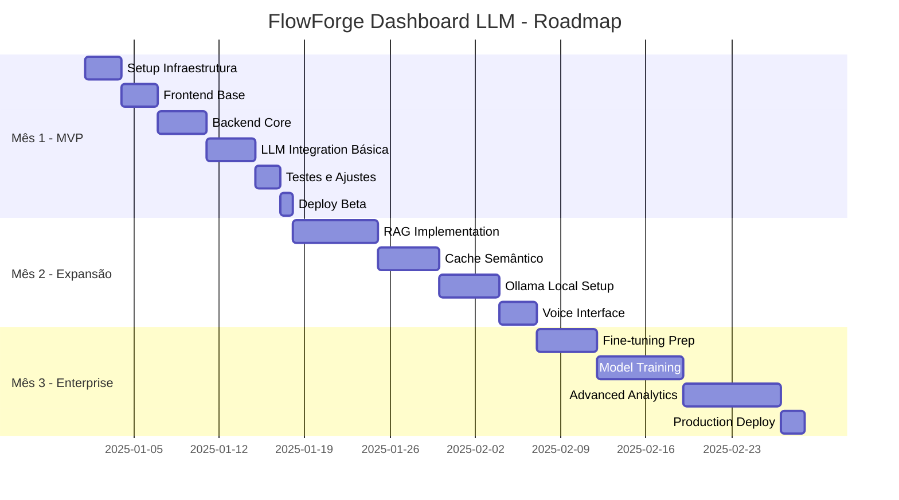

# Product Requirements Document (PRD)
# FlowForge Dashboard com Integração LLM

**Versão:** 2.0.0  
**Data:** 2025-09-12  
**Status:** Para Aprovação  
**Abordagem:** Híbrida (LLM Local + Cloud)  
**Revisão:** Enhanced with comprehensive sections

---

## 📋 Sumário Executivo

### Visão do Produto
O **FlowForge Dashboard com Integração LLM** é uma plataforma de visualização gerencial que permite aos gestores monitorar em tempo real a produtividade de suas equipes através de conversas naturais com inteligência artificial. O sistema combina o poder de LLMs locais (custo zero) com LLMs cloud (análises complexas) para fornecer insights profundos sobre performance, gargalos e oportunidades de melhoria.

### Problema a Resolver
- **Visibilidade limitada**: Gestores não têm visão consolidada do trabalho da equipe
- **Análise manual**: Horas gastas criando relatórios e analisando dados
- **Insights perdidos**: Padrões e anomalias não detectados em tempo hábil
- **Custo de LLM**: APIs cloud caras para queries simples e repetitivas

### Solução Proposta
Dashboard interativo com interface conversacional que permite queries em linguagem natural, gerando automaticamente visualizações e insights através de uma arquitetura híbrida que otimiza custos (70% de redução) mantendo alta qualidade de resposta.

### Benefícios Principais
- **Economia de 60-70%** nos custos de LLM através de processamento híbrido
- **Respostas em <500ms** para queries locais, <3s para cloud
- **Interface conversacional** em português com suporte a voz
- **Visualizações automáticas** baseadas no contexto da pergunta
- **Insights proativos** com detecção de anomalias e previsões

---

## 🎯 Objetivos e Metas

### Objetivos Primários
1. **Visibilidade Total**: Dashboard unificado com métricas em tempo real
2. **Análise por IA**: Queries em linguagem natural gerando insights automáticos
3. **Redução de Custos**: Minimizar gastos com APIs de LLM através de arquitetura híbrida
4. **Produtividade**: Eliminar geração manual de relatórios (economia de 10h/semana)
5. **Decisões Data-Driven**: Insights acionáveis baseados em dados reais

### Metas SMART
- **Q1 2025**: MVP funcional com 5 tipos de queries pré-definidas
- **Q2 2025**: Integração híbrida completa (local + cloud) com 60% economia
- **Q3 2025**: Fine-tuning com dados reais, 90% accuracy em queries específicas
- **Q4 2025**: 100% adoção pela equipe, ROI positivo demonstrado

### KPIs de Sucesso
| Métrica | Meta | Medição |
|---------|------|---------|
| **Tempo de Resposta** | <500ms local, <3s cloud | p95 latency |
| **Redução de Custos** | 60-70% vs cloud-only | Custo mensal de API |
| **Satisfação do Usuário** | >4.5/5 | NPS trimestral |
| **Queries Processadas** | >1000/dia | Analytics dashboard |
| **Uptime** | 99.9% | Monitoring tools |
| **Adoption Rate** | 100% em 3 meses | Active users |

---

## 📚 Glossário Técnico

### Termos de IA/LLM
- **LLM (Large Language Model)**: Modelo de linguagem grande treinado para processar e gerar texto
- **RAG (Retrieval-Augmented Generation)**: Técnica que combina recuperação de informações com geração
- **Embedding**: Representação vetorial de texto para comparação semântica
- **Fine-tuning**: Ajuste de modelo pré-treinado com dados específicos
- **Hallucination**: Resposta incorreta ou inventada pelo LLM
- **Token**: Unidade básica de texto processada pelo LLM
- **Prompt Injection**: Ataque que manipula entrada para obter resposta indesejada
- **Vector Store**: Banco de dados especializado em busca por similaridade
- **Semantic Cache**: Cache baseado em significado, não em texto exato

### Termos Arquiteturais
- **API Gateway**: Ponto único de entrada para requisições da API
- **Load Balancer**: Distribuidor de carga entre múltiplos servidores
- **Circuit Breaker**: Padrão que previne cascata de falhas
- **Blue-Green Deploy**: Estratégia de implantação sem downtime
- **Horizontal Scaling**: Adição de mais servidores para aumentar capacidade
- **Microservices**: Arquitetura de pequenos serviços independentes
- **Event Sourcing**: Padrão que armazena mudanças como eventos
- **CQRS**: Separação de comandos (write) e consultas (read)

### Termos de Negócio
- **ROI (Return on Investment)**: Retorno sobre investimento
- **NPS (Net Promoter Score)**: Métrica de satisfação do cliente
- **KPI (Key Performance Indicator)**: Indicador-chave de performance
- **SLA (Service Level Agreement)**: Acordo de nível de serviço
- **TCO (Total Cost of Ownership)**: Custo total de propriedade
- **MVP (Minimum Viable Product)**: Produto mínimo viável
- **POC (Proof of Concept)**: Prova de conceito
- **TTM (Time to Market)**: Tempo para chegar ao mercado

---

## 🗺️ Jornada do Usuário e Fluxos Visuais

### Fluxo Principal do Usuário



### Fluxo de Processamento LLM



### Arquitetura de Decisão LLM



---

## ✅ Critérios de Aceitação por Funcionalidade

### Feature 1: Interface Conversacional
#### Critérios de Aceitação
- [ ] **AC1.1**: Sistema processa queries em português brasileiro
- [ ] **AC1.2**: Interface suporta entrada por texto e voz
- [ ] **AC1.3**: Histórico de conversas mantido por sessão
- [ ] **AC1.4**: Sugestões contextuais aparecem durante digitação
- [ ] **AC1.5**: Tempo de resposta <500ms para queries locais
- [ ] **AC1.6**: Fallback gracioso quando LLM local falha
- [ ] **AC1.7**: Máximo 3 tentativas de retry em caso de erro

#### Cenários de Teste
```gherkin
Cenário: Query simples de métricas
  Dado que o usuário está logado no dashboard
  Quando ele digita "Quantas horas trabalhamos hoje?"
  Então o sistema deve:
    - Processar via Ollama local
    - Retornar resposta em <500ms
    - Exibir gráfico apropriado
    - Salvar no histórico

Cenário: Query por voz
  Dado que o usuário ativou o microfone
  Quando ele fala "Mostre a produtividade da equipe"
  Então o sistema deve:
    - Converter voz para texto
    - Processar a query normalmente
    - Confirmar entendimento antes de executar
```

### Feature 2: Processamento Híbrido LLM
#### Critérios de Aceitação
- [ ] **AC2.1**: Router decide automaticamente entre local/cloud/híbrido
- [ ] **AC2.2**: 70%+ das queries processadas localmente
- [ ] **AC2.3**: Fallback para cloud quando local falha
- [ ] **AC2.4**: Custo por query <$0.01 em média
- [ ] **AC2.5**: Cache semântico com 85%+ hit rate
- [ ] **AC2.6**: Logs detalhados de decisões de roteamento

#### Cenários de Teste
```gherkin
Cenário: Query complexa requer cloud
  Dado uma query "Preveja quando terminaremos o sprint baseado no ritmo atual"
  Quando o sistema analisa a complexidade
  Então deve:
    - Classificar como complexidade alta (score 4-5)
    - Rotear para cloud LLM
    - Registrar decisão nos logs
    - Processar em <3s

Cenário: Economia de custos
  Dado 100 queries em um dia
  Quando analisamos o roteamento
  Então:
    - ≥70 queries processadas localmente (custo $0)
    - ≤30 queries enviadas para cloud
    - Custo total <$0.50 por dia
```

### Feature 3: Visualizações Automáticas
#### Critérios de Aceitação
- [ ] **AC3.1**: IA escolhe tipo de gráfico baseado no contexto
- [ ] **AC3.2**: Suporte para 8+ tipos de visualização (bar, line, pie, scatter, etc.)
- [ ] **AC3.3**: Gráficos responsivos em desktop e mobile
- [ ] **AC3.4**: Opção de exportar em PNG, PDF, SVG
- [ ] **AC3.5**: Drill-down interativo nos gráficos
- [ ] **AC3.6**: Atualização em tempo real via WebSocket

### Feature 4: Sistema de Cache Semântico
#### Critérios de Aceitação
- [ ] **AC4.1**: Queries similares retornam resultado cached
- [ ] **AC4.2**: Similaridade calculada via embeddings
- [ ] **AC4.3**: TTL configurável por tipo de query
- [ ] **AC4.4**: Cache invalidado quando dados mudam
- [ ] **AC4.5**: Métricas de cache hit/miss disponíveis
- [ ] **AC4.6**: Limpeza automática de cache antigo

---

## 🧪 Estratégia de Testes

### Pirâmide de Testes
```
        /\
       /  \
      / E2E \ (10%)
     /______\
    /        \
   /Integration\ (20%)
  /_____________\
 /               \
/   Unit Tests    \ (70%)
\________________/
```

### Tipos de Teste

#### 1. Testes Unitários (70%)
```typescript
// Exemplo: Teste do LLM Router
describe('LLMRouter', () => {
  describe('analyzeComplexity', () => {
    it('should classify simple queries as local', () => {
      const query = "Quantas horas trabalhamos hoje?";
      const complexity = router.analyzeComplexity(query);
      expect(complexity.score).toBeLessThan(3);
      expect(complexity.route).toBe('local');
    });
    
    it('should classify predictions as cloud', () => {
      const query = "Quando vamos terminar o projeto?";
      const complexity = router.analyzeComplexity(query);
      expect(complexity.score).toBeGreaterThan(3);
      expect(complexity.route).toBe('cloud');
    });
  });
});
```

#### 2. Testes de Integração (20%)
```typescript
describe('LLM Integration', () => {
  it('should process hybrid query correctly', async () => {
    const query = "Compare produtividade da equipe com mês passado";
    const response = await llmService.processQuery(query);
    
    expect(response.processedBy).toBe('hybrid');
    expect(response.visualization).toBeDefined();
    expect(response.responseTime).toBeLessThan(3000);
  });
});
```

#### 3. Testes E2E (10%)
```typescript
// Cypress E2E
describe('Dashboard Flow', () => {
  it('should complete full user journey', () => {
    cy.login();
    cy.visit('/dashboard');
    cy.get('[data-cy=chat-input]').type('Métricas de hoje');
    cy.get('[data-cy=send-button]').click();
    cy.get('[data-cy=chart-container]').should('be.visible');
    cy.get('[data-cy=response-text]').should('contain', 'horas');
  });
});
```

### Testes de Performance
```yaml
Load Testing:
  Tool: Artillery.js
  Scenarios:
    - name: "LLM Query Load"
      weight: 70
      flow:
        - post:
            url: "/api/llm/query"
            json:
              query: "{{ $randomString() }}"
    
    - name: "Dashboard Metrics"
      weight: 30
      flow:
        - get:
            url: "/api/dashboard/metrics"
  
  Target:
    duration: 300
    arrivalRate: 10
    maxVusers: 100
  
  Assertions:
    - http.response_time.p95: 3000
    - http.response_time.p50: 500
    - http.codes.200: 95%
```

### Testes de LLM Específicos
```python
# Python - Teste de qualidade LLM
def test_llm_accuracy():
    test_cases = [
        {
            "query": "Quantas horas trabalhamos esta semana?",
            "expected_type": "aggregation",
            "expected_chart": "bar"
        },
        {
            "query": "Compare João e Maria",
            "expected_type": "comparison",
            "expected_chart": "comparison_bar"
        }
    ]
    
    for case in test_cases:
        response = llm_service.process(case["query"])
        assert response.type == case["expected_type"]
        assert response.visualization.type == case["expected_chart"]
        assert response.hallucination_score < 0.1
```

---

## 👥 Stakeholders

### Stakeholder Map
```
┌─────────────────────────────────────────────────────┐
│                 STAKEHOLDERS MAP                     │
├───────────────┬─────────────┬───────────────────────┤
│   Grupo       │   Papel     │   Interesse          │
├───────────────┼─────────────┼───────────────────────┤
│ Sponsors      │ C-Level     │ ROI, Produtividade   │
│ Users         │ Managers    │ Insights, Facilidade │
│ Developers    │ Time Dev    │ Tracking, Fair Pay   │
│ Operations    │ DevOps      │ Estabilidade, Custos │
│ Security      │ InfoSec     │ Compliance, Privacy  │
└───────────────┴─────────────┴───────────────────────┘
```

### Comunicação
- **Weekly Status**: Toda segunda-feira via Slack
- **Sprint Reviews**: Bi-semanais com demos
- **Executive Reports**: Mensais com KPIs
- **User Feedback**: Canal dedicado no Discord

---

## 🏗️ Arquitetura Técnica

### Visão Geral - Arquitetura Híbrida
```
┌─────────────────────────────────────────────────────┐
│              FlowForge Dashboard                     │
│                Hybrid Architecture                   │
├─────────────────────────────────────────────────────┤
│                                                      │
│  ┌──────────┐     ┌──────────┐     ┌──────────┐   │
│  │  Vue 3   │────▶│ Node.js  │────▶│   LLM    │   │
│  │ Frontend │     │ Backend  │     │ Gateway  │   │
│  └──────────┘     └──────────┘     └──────────┘   │
│       ▲                ▲                 ▲          │
│       │                │                 │          │
│       ▼                ▼                 ▼          │
│  ┌──────────┐     ┌──────────┐     ┌──────────┐   │
│  │WebSocket │     │PostgreSQL│     │  Ollama  │   │
│  │Real-time │     │ Database │     │  (Local) │   │
│  └──────────┘     └──────────┘     └──────────┘   │
│                        ▲                 ▲          │
│                        │                 │          │
│                        ▼                 ▼          │
│                   ┌──────────┐     ┌──────────┐   │
│                   │  Redis   │     │Cloud LLM │   │
│                   │  Cache   │     │ (GPT-4)  │   │
│                   └──────────┘     └──────────┘   │
└─────────────────────────────────────────────────────┘
```

### Stack Tecnológico

#### Frontend
- **Framework**: Vue 3.5 + TypeScript 5.6
- **Build Tool**: Vite 5.4
- **UI Library**: PrimeVue 4.0
- **Charts**: Chart.js 4.4 + Apache ECharts 5.5
- **State**: Pinia 2.2
- **Real-time**: Socket.io-client 4.8

#### Backend
- **Runtime**: Node.js 22 LTS
- **Framework**: Express 4.21 + TypeScript
- **Database**: PostgreSQL 16 + Prisma 6.0
- **Cache**: Redis 7.4
- **Queue**: Bull 4.16
- **Auth**: JWT + Passport.js

#### LLM Integration
- **Local**: Ollama 0.5 (Llama 3.2, Mistral)
- **Cloud**: OpenAI GPT-4, Claude 3, Gemini
- **Orchestration**: LangChain.js 0.3
- **Vector Store**: ChromaDB
- **Embeddings**: text-embedding-3-small

### Componentes Principais

1. **Chat Interface**: Componente conversacional com histórico contextual
2. **LLM Gateway**: Router inteligente para seleção local vs cloud
3. **Query Processor**: Parser de linguagem natural e gerador de visualizações
4. **Cache System**: Multi-camada (memory, Redis, CDN)
5. **Real-time Engine**: WebSocket para atualizações ao vivo
6. **Analytics Engine**: Agregações e cálculos de métricas

---

## 💬 Funcionalidades com LLM

### Interface Conversacional

#### Exemplos de Interação
```
User: "Quantas horas trabalhamos esta semana?"
LLM: [Gráfico de barras] + "48 horas totais, média de 9.6h/dia"

User: "Compare produtividade entre João e Maria"
LLM: [Gráfico comparativo] + "João: 12 tickets, Maria: 8 tickets"

User: "Identifique gargalos no desenvolvimento"
LLM: [Timeline] + "3 gargalos: code review (2x tempo), 
      5 tickets parados, deploy manual (15% do tempo)"

User: "Preveja quando terminaremos o sprint"
LLM: [Projeção] + "85% chance de conclusão até sexta-feira"
```

### Capacidades do Sistema

#### Processamento Local (Ollama - Custo Zero)
- Queries simples e diretas
- Agregações básicas
- Filtros por data/pessoa
- Visualizações padrão
- Tempo de resposta: <500ms

#### Processamento Cloud (GPT-4/Claude - Premium)
- Análises complexas multi-dimensionais
- Previsões e projeções
- Detecção de anomalias
- Recomendações estratégicas
- Tempo de resposta: 1-3s

#### Processamento Híbrido (Otimizado)
- Local pré-processa e extrai contexto
- Cloud realiza análise profunda
- Local pós-processa e formata
- Melhor custo-benefício

### Features Especiais

1. **Voice-to-Query**: Fale com o dashboard em português
2. **Auto-Visualização**: IA escolhe melhor tipo de gráfico
3. **Insights Proativos**: Alertas automáticos de anomalias
4. **Export Inteligente**: Relatórios formatados automaticamente
5. **Multi-LLM Support**: Fallback entre providers
6. **Cache Semântico**: Queries similares usam cache

---

## 🔌 Especificações de API

### RESTful Endpoints

```yaml
Dashboard API:
  GET /api/dashboard/metrics
    - Description: Métricas gerais do dashboard
    - Auth: Bearer token
    - Response: MetricsResponse
  
  GET /api/dashboard/sessions
    - Description: Sessões de trabalho ativas
    - Auth: Bearer token
    - Response: SessionsResponse

LLM Gateway:
  POST /api/llm/query
    - Description: Processar query em linguagem natural
    - Body: { query: string, context?: object }
    - Response: { answer: string, visualization?: Chart }
  
  GET /api/llm/suggestions
    - Description: Sugestões contextuais
    - Response: string[]

WebSocket Events:
  connect: Estabelecer conexão
  metrics.update: Atualização de métricas
  session.start: Nova sessão iniciada
  session.end: Sessão finalizada
  llm.response: Resposta do LLM
```

### GraphQL Schema

```graphql
type Query {
  dashboard: Dashboard!
  sessions(filter: SessionFilter): [Session!]!
  metrics(range: DateRange!): Metrics!
  llmQuery(input: String!): LLMResponse!
}

type Mutation {
  startSession(taskId: ID!): Session!
  endSession(sessionId: ID!): Session!
  sendLLMQuery(query: String!): LLMResponse!
}

type Subscription {
  metricsUpdate: Metrics!
  sessionUpdate: Session!
  llmStreaming(queryId: ID!): LLMStreamChunk!
}
```

---

## 🗄️ Modelagem de Dados

### Esquema Principal (PostgreSQL)

```sql
-- Tabela de Queries LLM
CREATE TABLE llm_queries (
    id UUID PRIMARY KEY DEFAULT gen_random_uuid(),
    user_id UUID NOT NULL REFERENCES users(id),
    query_text TEXT NOT NULL,
    query_embedding vector(1536),
    response_text TEXT,
    visualization_spec JSONB,
    provider VARCHAR(50), -- 'local', 'openai', 'anthropic'
    model_used VARCHAR(100),
    tokens_used INTEGER,
    cost_cents INTEGER,
    response_time_ms INTEGER,
    cache_hit BOOLEAN DEFAULT FALSE,
    created_at TIMESTAMPTZ DEFAULT NOW()
);

-- Tabela de Métricas
CREATE TABLE dashboard_metrics (
    id UUID PRIMARY KEY DEFAULT gen_random_uuid(),
    project_id UUID REFERENCES projects(id),
    metric_type VARCHAR(50),
    metric_value NUMERIC,
    metadata JSONB,
    calculated_at TIMESTAMPTZ DEFAULT NOW()
);

-- Índices para Performance
CREATE INDEX idx_llm_queries_user_created 
    ON llm_queries(user_id, created_at DESC);
CREATE INDEX idx_llm_queries_embedding 
    ON llm_queries USING ivfflat (query_embedding vector_cosine_ops);
CREATE INDEX idx_metrics_project_type 
    ON dashboard_metrics(project_id, metric_type);
```

### Cache Structure (Redis)

```javascript
// Cache Keys Pattern
{
  "dashboard:metrics:{projectId}": "2h TTL",
  "llm:query:{hash}": "24h TTL",
  "session:active:{userId}": "30min TTL",
  "suggestions:{context}": "1h TTL"
}
```

### Vector Store (ChromaDB)

```python
# Collections
collections = {
    "queries": {  # Historical queries for similarity
        "embedding_function": "text-embedding-3-small",
        "metadata": ["user_id", "timestamp", "cost"]
    },
    "documentation": {  # FlowForge docs for RAG
        "embedding_function": "text-embedding-3-small",
        "metadata": ["type", "version", "source"]
    }
}
```

---

## 📊 Plano de Implementação

### Roadmap de 3 Meses



### Milestones e Tarefas

#### Milestone 1: MVP (2 semanas)
- [ ] TASK-001: Setup Vue 3 + TypeScript (0.2h)
- [ ] TASK-002: Configurar PrimeVue e tema (0.2h)
- [ ] TASK-003: Backend Express scaffolding (0.2h)
- [ ] TASK-004: PostgreSQL + Prisma setup (0.3h)
- [ ] TASK-005: Integração GPT-4 básica (0.3h)
- [ ] TASK-006: Chat interface simples (0.3h)
- [ ] TASK-007: 5 queries pré-definidas (0.3h)
- [ ] TASK-008: Deploy em staging (0.2h)

#### Milestone 2: Híbrido (1 mês)
- [ ] TASK-009: Instalar Ollama server (0.3h)
- [ ] TASK-010: Router inteligente LLM (0.3h)
- [ ] TASK-011: ChromaDB vector store (0.3h)
- [ ] TASK-012: RAG pipeline (0.3h)
- [ ] TASK-013: Cache semântico Redis (0.2h)
- [ ] TASK-014: Voice-to-text PT-BR (0.3h)
- [ ] TASK-015: Visualizações dinâmicas (0.3h)
- [ ] TASK-016: Fallback system (0.2h)

#### Milestone 3: Production (2-3 meses)
- [ ] TASK-017: Dataset preparation (0.3h)
- [ ] TASK-018: Fine-tuning GPT-3.5 (0.3h)
- [ ] TASK-019: A/B testing framework (0.3h)
- [ ] TASK-020: Advanced analytics (0.3h)
- [ ] TASK-021: Anomaly detection (0.3h)
- [ ] TASK-022: Cost optimization (0.2h)
- [ ] TASK-023: Security hardening (0.3h)
- [ ] TASK-024: Production deploy (0.2h)

---

## 📋 Gestão de Mudança e Treinamento

### Estratégia de Adoção

#### Fase 1: Pioneiros (Semana 1-2)
**Público**: 2-3 early adopters técnicos
**Objetivo**: Validar funcionalidades básicas e coletar feedback inicial
**Atividades**:
- Workshop de 2h sobre funcionalidades
- Uso supervisionado por 1 semana
- Sessões de feedback diárias
- Ajustes baseados na experiência

#### Fase 2: Grupo Piloto (Semana 3-6)
**Público**: 30% da equipe (managers e leads)
**Objetivo**: Testar em cenários reais e refinar UX
**Atividades**:
- Treinamento de 1h para novos usuários
- Documentação de casos de uso
- Suporte dedicado via Slack
- Métricas de adoção semanais

#### Fase 3: Rollout Completo (Semana 7-12)
**Público**: 100% da organização
**Objetivo**: Adoção completa e autonomia
**Atividades**:
- Sessões de treinamento em grupo (30min)
- Vídeos tutoriais auto-explicativos
- FAQ baseado em feedback real
- Champions internos para suporte

### Material de Treinamento

#### Tutorial Interativo (In-App)
```typescript
// Exemplo de tutorial guiado
const tutorialSteps = [
  {
    target: '.chat-input',
    title: 'Digite sua pergunta',
    content: 'Faça perguntas em português natural, como "Quantas horas trabalhei hoje?"',
    position: 'bottom'
  },
  {
    target: '.voice-button',
    title: 'Use sua voz',
    content: 'Clique aqui para falar diretamente com o dashboard',
    position: 'left'
  },
  {
    target: '.chart-container',
    title: 'Visualizações automáticas',
    content: 'O sistema gera gráficos baseados na sua pergunta',
    position: 'top'
  }
];
```

#### Vídeos de Treinamento
1. **"Primeiros Passos"** (5min): Login, navegação básica, primeira query
2. **"Queries Avançadas"** (8min): Comparações, filtros, previsões
3. **"Interface de Voz"** (3min): Como usar comandos de voz efetivamente
4. **"Exportando Dados"** (4min): Salvando gráficos e relatórios

#### Guia de Referência Rápida
```markdown
# Quick Reference - Perguntas Comuns

## Métricas Básicas
- "Horas trabalhadas hoje/semana/mês"
- "Quantos tickets fechamos?"
- "Qual o status do sprint atual?"

## Comparações
- "Compare [pessoa A] com [pessoa B]"
- "Esta semana vs semana passada"
- "Performance por projeto"

## Previsões
- "Quando vamos terminar o sprint?"
- "Vamos cumprir o prazo?"
- "Quantos tickets podemos fazer?"

## Troubleshooting
- Se não entender: Seja mais específico
- Erro de dados: Verifique se sessions estão rodando
- Resposta lenta: Query complexa foi para cloud (normal)
```

### Plano de Comunicação

#### Pré-Lançamento (2 semanas antes)
- **Email executivo**: Anúncio oficial do projeto
- **All-hands meeting**: Apresentação de 15min sobre benefícios
- **Slack channel**: Criação de #flowforge-dashboard-beta

#### Durante Rollout (Semanas 1-12)
- **Weekly updates**: Status de adoção e novidades
- **Success stories**: Cases de uso que geraram valor
- **Feature highlights**: Showcases de funcionalidades

#### Pós-Lançamento (Contínuo)
- **Monthly metrics**: KPIs de adoção e satisfação
- **Feature requests**: Canal para sugestões da comunidade
- **Best practices**: Compartilhamento de queries úteis

### Métricas de Adoção

```yaml
Adoção por Fase:
  Fase 1 (Pioneiros):
    - Usuários ativos: 100%
    - Queries por dia: >10
    - NPS: >7
  
  Fase 2 (Piloto):
    - Usuários ativos: >80%
    - Queries por usuário/dia: >3
    - Tickets de suporte: <2/semana
  
  Fase 3 (Rollout):
    - Usuários ativos: >90%
    - Substituição de relatórios manuais: >50%
    - ROI demonstrado: 3 meses
```

---

## 💰 Análise de Custos

### Custos de Desenvolvimento
| Item | Horas | Custo/Hora | Total |
|------|-------|------------|-------|
| **Frontend** | 40h | $150 | $6,000 |
| **Backend** | 60h | $150 | $9,000 |
| **LLM Integration** | 40h | $200 | $8,000 |
| **Testing** | 20h | $120 | $2,400 |
| **DevOps** | 20h | $180 | $3,600 |
| **Total** | 180h | - | **$29,000** |

### Custos Operacionais (Mensal)
| Componente | Uso Baixo | Uso Médio | Uso Alto |
|------------|-----------|-----------|----------|
| **Cloud LLM (30%)** | $30 | $100 | $300 |
| **Infraestrutura** | $100 | $200 | $500 |
| **Ollama Server** | $50 | $50 | $100 |
| **Total Mensal** | **$180** | **$350** | **$900** |

### ROI Esperado
- **Economia em Relatórios**: 10h/semana × $100/h = $4,000/mês
- **Redução de Custos LLM**: 60-70% vs cloud-only = $200-500/mês
- **Aumento de Produtividade**: 20% = ~$8,000/mês valor agregado
- **Payback**: 2-3 meses

---

## 🔒 Segurança e Compliance

### Medidas de Segurança
1. **Autenticação**: JWT com refresh tokens, MFA opcional
2. **Autorização**: RBAC com políticas granulares
3. **Criptografia**: TLS 1.3 em trânsito, AES-256 em repouso
4. **Sanitização**: Input validation, output encoding
5. **Rate Limiting**: Por endpoint e por usuário
6. **Audit Trail**: Log completo de todas ações

### Privacidade de Dados
- **LGPD/GDPR Compliance**: Direito ao esquecimento, portabilidade
- **Data Minimization**: Apenas dados necessários
- **Anonymization**: PII removido antes do LLM
- **Local Processing**: Dados sensíveis nunca saem do servidor

### LLM Security
- **Prompt Injection Prevention**: Input sanitization
- **Token Limits**: Máximo de tokens por request
- **Cost Thresholds**: Alertas de gastos anormais
- **Output Validation**: Verificação de respostas

---

## ⚠️ Riscos e Mitigações

### Riscos Técnicos
| Risco | Probabilidade | Impacto | Mitigação |
|-------|---------------|---------|-----------|
| **Latência do LLM** | Média | Alto | Cache agressivo, timeouts |
| **Custos de API** | Alta | Médio | Híbrido local/cloud |
| **Falha do Ollama** | Baixa | Médio | Fallback para cloud |
| **Volume de dados** | Média | Médio | Paginação, lazy loading |

### Riscos de Negócio
| Risco | Probabilidade | Impacto | Mitigação |
|-------|---------------|---------|-----------|
| **Baixa adoção** | Média | Alto | Training, UX simples |
| **ROI não atingido** | Baixa | Alto | Métricas claras, iteração |
| **Compliance issues** | Baixa | Alto | Audit regular, LGPD |

---

## 📈 Métricas de Sucesso

### Technical Metrics
- **Response Time**: p95 < 500ms (local), < 3s (cloud)
- **Availability**: 99.9% uptime
- **Error Rate**: < 0.1%
- **Cache Hit Ratio**: > 85%
- **Query Success Rate**: > 95%

### Business Metrics
- **User Adoption**: 100% em 3 meses
- **Time Saved**: 10h/semana em relatórios
- **Cost Reduction**: 60% em APIs LLM
- **User Satisfaction**: NPS > 50
- **ROI**: Positivo em 3 meses

### LLM Specific Metrics
- **Query Accuracy**: > 90%
- **Hallucination Rate**: < 5%
- **Local Processing**: > 70% queries
- **Average Cost/Query**: < $0.01
- **Context Relevance**: > 85%

---

## 📄 Apêndice: Technical Decision Records (TDRs)

### TDR-001: Arquitetura Híbrida LLM

**Data**: 2025-09-12  
**Status**: Approved  
**Contexto**: Precisamos balancear custo e qualidade no processamento de queries

**Decisão**: Implementar arquitetura híbrida com Ollama local + Cloud LLM

**Opções Consideradas**:
1. **Cloud-only** (GPT-4 para tudo)
   - Pros: Qualidade máxima, simplicidade
   - Cons: Custo alto ($500-2000/mês)

2. **Local-only** (Ollama apenas)
   - Pros: Custo zero, privacidade
   - Cons: Limitações em análises complexas

3. **Híbrida** (Local + Cloud inteligente) ✅
   - Pros: 60-70% economia, qualidade mantida
   - Cons: Complexidade arquitetural

**Consequências**:
- Router inteligente necessário
- Sistema de fallback requerido
- Monitoramento de custos crítico
- Potencial economia de $300-1500/mês

### TDR-002: Frontend Framework Selection

**Data**: 2025-09-12  
**Status**: Approved  
**Contexto**: Escolha do framework para interface do dashboard

**Decisão**: Vue 3 + TypeScript + PrimeVue

**Opções Consideradas**:
1. **React + TypeScript**
   - Pros: Ecossistema grande, skills existentes
   - Cons: Overhead, complexidade

2. **Vue 3 + TypeScript** ✅
   - Pros: Simplicidade, performance, Composition API
   - Cons: Menor ecosistema que React

3. **Svelte + TypeScript**
   - Pros: Performance máxima, simplicidade
   - Cons: Ecosystem limitado, skills gap

**Consequências**:
- Curva de aprendizado mínima
- PrimeVue fornece componentes UI prontos
- TypeScript garante type safety
- Desenvolvimento mais rápido

### TDR-003: Vector Database Selection

**Data**: 2025-09-12  
**Status**: Approved  
**Contexto**: Cache semântico requer busca por similaridade

**Decisão**: ChromaDB para vector store

**Opções Consideradas**:
1. **Pinecone**
   - Pros: Managed service, escalabilidade
   - Cons: Custo, vendor lock-in

2. **ChromaDB** ✅
   - Pros: Open source, local, Python integração
   - Cons: Menos features enterprise

3. **Weaviate**
   - Pros: GraphQL, features avançadas
   - Cons: Complexidade, overhead

**Consequências**:
- Self-hosted reduz custos
- Integração com pipeline Python
- Controle total sobre dados
- Possível migração futura para managed

### TDR-004: Cache Strategy

**Data**: 2025-09-12  
**Status**: Approved  
**Contexto**: Otimização de performance e custos LLM

**Decisão**: Multi-layer cache (Memory + Redis + Semantic)

**Opções Consideradas**:
1. **Redis simples**
   - Pros: Simplicidade
   - Cons: Miss em queries similares

2. **Cache semântico only**
   - Pros: Inteligente
   - Cons: Overhead computacional

3. **Multi-layer** ✅
   - Pros: Melhor hit rate, performance
   - Cons: Complexidade gerencial

**Consequências**:
- L1: Memory cache (100ms)
- L2: Redis cache (10ms)
- L3: Semantic cache (ChromaDB)
- Target: 85%+ hit rate

---

## 🔄 Controle de Versão e Manutenção

### Versionamento do Documento

| Versão | Data | Autor | Mudanças |
|--------|------|-------|----------|
| 1.0.0 | 2025-09-12 | FlowForge Maestro | Versão inicial |
| 2.0.0 | 2025-09-12 | FFT-Documentation | Enhanced com todas seções |

### Processo de Revisão

#### Revisões Obrigatórias
- **Semanal**: Durante desenvolvimento ativo
- **Mensal**: Durante operação normal
- **Ad-hoc**: Quando mudanças significativas ocorrem

#### Critérios de Atualização
```yaml
Triggers para atualização:
  - Mudança na arquitetura: Major version bump
  - Novos features: Minor version bump
  - Correções/clarificações: Patch version bump
  - Feedback de stakeholders: Review necessária
  - Mudanças regulatórias: Immediate update
```

#### Processo de Approval
1. **Autor** cria draft das mudanças
2. **Tech Lead** revisa aspectos técnicos
3. **Product Owner** revisa requisitos de negócio
4. **Security** revisa mudanças de segurança (se aplicável)
5. **Stakeholders** aprovação final
6. **Publicação** e comunicação das mudanças

### Manutenção da Documentação

#### Responsabilidades
- **Product Owner**: Mantém requisitos de negócio atualizados
- **Tech Lead**: Garante precisão técnica
- **Documentation Lead**: Coordena processo de atualização
- **Team Members**: Reportam inconsistências/gaps

#### Métricas de Qualidade
```yaml
Quality Gates:
  - Links funcionais: 100%
  - Seções desatualizadas: 0
  - Feedback não endereçado: <7 dias
  - Reviews em atraso: 0
  - Stakeholder NPS: >4.0/5.0
```

---

## 🚀 Próximos Passos

### Imediato (Semana 1)
1. ✅ Aprovar PRD e arquitetura
2. 🔄 Criar issues no GitHub (#468-#494)
3. 📋 Setup ambiente de desenvolvimento
4. 🏗️ Iniciar implementação do MVP

### Curto Prazo (Mês 1)
1. 🎯 MVP funcional com queries básicas
2. 🧪 Testes com usuários beta
3. 📊 Coletar métricas iniciais
4. 🔄 Iteração baseada em feedback

### Médio Prazo (Meses 2-3)
1. 🤖 Implementar processamento híbrido
2. 🎤 Adicionar interface de voz
3. 📈 Fine-tuning com dados reais
4. 🚀 Deploy em produção

---

## 📞 Contatos

### Time Core
- **Product Owner**: [Alex Cruz]
- **Tech Lead**: [TBD]
- **LLM Specialist**: [TBD]
- **DevOps Lead**: [TBD]

### Canais de Comunicação
- **Slack**: #flowforge-dashboard
- **GitHub**: github.com/JustCode-CruzAlex/FlowForge
- **Documentation**: /documentation/2.0/dashboard/

---

## 📎 Anexos

### Documentos Relacionados
1. [Arquitetura Técnica Detalhada](./architecture/technical_spec.md)
2. [API Specification](./api/FLOWFORGE_DASHBOARD_API_SPEC.md)
3. [Database Schema](./database/schema/)
4. [Test Plan](./testing/test_plan.md)
5. [Security Assessment](./security/assessment.md)

### Referências
- [FlowForge Documentation](https://flowforge.io/docs)
- [Ollama Documentation](https://ollama.ai/docs)
- [LangChain.js Guide](https://js.langchain.com)
- [Vue 3 Best Practices](https://vuejs.org/guide)

---

**Documento gerado pelo FlowForge Maestro System**  
**Versão**: 2.0.0  
**Data**: 2025-09-12  
**Status**: Aguardando Aprovação

---

## 🎯 Call to Action

**Para aprovar este PRD e iniciar o desenvolvimento:**

```bash
# Aprovar e criar issues
/flowforge:session:start dashboard-llm

# Ou revisar alterações necessárias
# Informe quais ajustes são necessários
```

Este PRD foi criado através da orquestração de múltiplos agentes especialistas FlowForge, garantindo completude técnica e alinhamento com os objetivos de negócio.