# Ship Command Project Board

## Board Overview

The Ship Command project board provides comprehensive tracking and visualization for the complete `/ff:ship` command implementation milestone, organizing 30 tasks across 6 phases with clear dependencies and progress indicators.

## Board Structure

### Kanban Columns

#### 1. Backlog
- **Purpose**: Tasks ready for assignment and execution
- **Criteria**: Well-defined requirements, dependencies identified
- **Capacity**: No limit, organized by priority
- **Owner**: Project Manager

#### 2. In Progress
- **Purpose**: Active development tasks
- **Criteria**: Assigned developer, started work
- **Capacity**: 3-4 tasks maximum (team capacity)
- **Owner**: Assigned Developer

#### 3. Review
- **Purpose**: Tasks awaiting code review or validation
- **Criteria**: Implementation complete, ready for review
- **Capacity**: 5 tasks maximum (review throughput)
- **Owner**: Code Review Team

#### 4. Done
- **Purpose**: Completed and validated tasks
- **Criteria**: Code reviewed, tests passing, documented
- **Capacity**: Unlimited (milestone history)
- **Owner**: Quality Assurance

## Phase Organization

### Phase 1: Foundation (Week 1)
```
┌─────────────────────────────────────┐
│ SHIP-001: Command Structure         │ → SHIP-002
│ SHIP-002: Argument Parsing          │ → SHIP-003
│ SHIP-003: Mode Detection            │ → SHIP-004
│ SHIP-004: State Management          │ → SHIP-005
│ SHIP-005: Configuration System      │ → Phase 2
└─────────────────────────────────────┘
```

### Phase 2: Review Engine (Week 2)
```
┌─────────────────────────────────────┐
│ SHIP-006: Review Orchestration      │ ← SHIP-005
│ SHIP-007: QA Integration           │ ← SHIP-006
│ SHIP-008: Review Processing        │ ← SHIP-007
│ SHIP-009: Result Caching          │ ← SHIP-008
│ SHIP-010: Review Reports          │ ← SHIP-009
└─────────────────────────────────────┘
```

### Phase 3: Fix Coordination (Week 3)
```
┌─────────────────────────────────────┐
│ SHIP-011: Fix Coordinator          │ ← SHIP-010
│ SHIP-012: Agent Pool Management    │ ← SHIP-011
│ SHIP-013: Interactive Handler      │ ← SHIP-012
│ SHIP-014: Automatic Handler        │ ← SHIP-012
│ SHIP-015: Fix Application          │ ← SHIP-013,014
└─────────────────────────────────────┘
```

### Phase 4: GitHub Integration (Week 4)
```
┌─────────────────────────────────────┐
│ SHIP-016: GitHub Client            │ ← SHIP-015
│ SHIP-017: Comment Posting          │ ← SHIP-016
│ SHIP-018: Comment Formatting       │ ← SHIP-017
│ SHIP-019: Comment Threading        │ ← SHIP-018
│ SHIP-020: Status Synchronization   │ ← SHIP-019
└─────────────────────────────────────┘
```

### Phase 5: Pipeline (Week 5)
```
┌─────────────────────────────────────┐
│ SHIP-021: Pipeline Core             │ ← SHIP-020
│ SHIP-022: Iteration Control         │ ← SHIP-021
│ SHIP-023: State Tracking           │ ← SHIP-022
│ SHIP-024: Error Recovery           │ ← SHIP-023
│ SHIP-025: Resume Functionality     │ ← SHIP-024
└─────────────────────────────────────┘
```

### Phase 6: Testing & Polish (Week 6)
```
┌─────────────────────────────────────┐
│ SHIP-026: Unit Test Suite          │ ← SHIP-025
│ SHIP-027: Integration Tests        │ ← SHIP-026
│ SHIP-028: User Interface Polish    │ ← SHIP-027
│ SHIP-029: Documentation Completion │ ← SHIP-028
│ SHIP-030: Performance Optimization │ ← SHIP-029
└─────────────────────────────────────┘
```

## Dependency Visualization

### Critical Path Analysis

```mermaid
gantt
    title Ship Command Implementation Timeline
    dateFormat  X
    axisFormat %d
    
    section Foundation
    Command Structure      :a1, 0, 1d
    Argument Parsing      :a2, after a1, 1d
    Mode Detection        :a3, after a2, 1d
    State Management      :a4, after a3, 1d
    Configuration System  :a5, after a4, 1d
    
    section Review Engine
    Review Orchestration  :b1, after a5, 1d
    QA Integration       :b2, after b1, 1d
    Review Processing    :b3, after b2, 1d
    Result Caching       :b4, after b3, 1d
    Review Reports       :b5, after b4, 1d
    
    section Fix Coordination
    Fix Coordinator      :c1, after b5, 1d
    Agent Pool          :c2, after c1, 1d
    Interactive Handler :c3, after c2, 1d
    Automatic Handler   :c4, after c2, 1d
    Fix Application     :c5, after c3, 1d
    
    section GitHub Integration
    GitHub Client       :d1, after c5, 1d
    Comment Posting     :d2, after d1, 1d
    Comment Formatting  :d3, after d2, 1d
    Comment Threading   :d4, after d3, 1d
    Status Sync        :d5, after d4, 1d
    
    section Pipeline
    Pipeline Core       :e1, after d5, 1d
    Iteration Control   :e2, after e1, 1d
    State Tracking      :e3, after e2, 1d
    Error Recovery      :e4, after e3, 1d
    Resume Functionality:e5, after e4, 1d
    
    section Testing & Polish
    Unit Tests         :f1, after e5, 1d
    Integration Tests  :f2, after f1, 1d
    UI Polish         :f3, after f2, 1d
    Documentation     :f4, after f3, 1d
    Optimization      :f5, after f4, 1d
```


### Parallel Work Opportunities
- **SHIP-013 & SHIP-014**: Interactive and Automatic handlers can be developed in parallel
- **SHIP-017 & SHIP-018**: Comment posting and formatting can be worked on simultaneously
- **SHIP-026 & SHIP-027**: Unit and integration tests can be developed in parallel
- **SHIP-028 & SHIP-029**: UI polish and documentation can be concurrent

## Progress Tracking

### Sprint Velocity Metrics
```
┌─────────────────────────────────────┐
│ VELOCITY TRACKING                   │
├─────────────────────────────────────┤
│ Sprint 1: 10 tasks (5 hours)       │
│ Sprint 2: 10 tasks (5 hours)       │  
│ Sprint 3: 10 tasks (2.5 hours)     │
├─────────────────────────────────────┤
│ Total: 30 tasks (12.5 hours)       │
└─────────────────────────────────────┘
```

### Burndown Chart Template
```
Tasks
 30 ┐
    │ ╲
 25 ├─╲
    │  ╲
 20 ├───╲
    │    ╲
 15 ├─────╲
    │      ╲
 10 ├───────╲
    │        ╲
  5 ├─────────╲
    │          ╲
  0 └───────────╲───
    Week 1 2 3 4 5 6
```

### Completion Criteria Checklist

#### Phase Completion Gates
- [ ] **Phase 1**: All foundation components operational
- [ ] **Phase 2**: Review engine integrated with agents
- [ ] **Phase 3**: Fix coordination fully automated
- [ ] **Phase 4**: GitHub integration complete
- [ ] **Phase 5**: Pipeline with state management working
- [ ] **Phase 6**: All tests passing, documentation complete

#### Quality Gates
- [ ] **Code Coverage**: 95% minimum across all modules
- [ ] **Integration Tests**: All workflow scenarios covered
- [ ] **Performance Tests**: Sub-30 second review cycles
- [ ] **User Acceptance**: Interactive mode validated
- [ ] **Documentation**: Complete user and developer guides

## Team Assignment Guidelines

### Skill-Based Task Assignment

#### Foundation & Pipeline Specialist
```
Responsibilities:
- Core architecture and state management
- Complex algorithmic implementations
- Performance optimization

Assigned Tasks:
- SHIP-001 to SHIP-005 (Foundation)
- SHIP-021 to SHIP-025 (Pipeline)
- SHIP-030 (Performance Optimization)
```

#### Integration Specialist
```
Responsibilities:
- External API integrations
- GitHub platform expertise
- Review coordination

Assigned Tasks:
- SHIP-006 to SHIP-010 (Review Engine)
- SHIP-016 to SHIP-020 (GitHub Integration)
```

#### Quality Assurance Engineer
```
Responsibilities:
- Testing strategy and implementation
- Fix coordination validation
- User experience validation

Assigned Tasks:
- SHIP-011 to SHIP-015 (Fix Coordination)
- SHIP-026 to SHIP-029 (Testing & Polish)
```

### Load Balancing Strategy
- **Week 1-2**: All developers working in parallel
- **Week 3-4**: Cross-team collaboration for integration
- **Week 5-6**: Focus on quality and polish

## Risk Management Board

### Risk Tracking Columns

#### High Risk Tasks
```
┌─────────────────────────────────────┐
│ SHIP-007: QA Integration            │ Risk: Agent coordination complexity
│ SHIP-012: Agent Pool Management     │ Risk: Resource management
│ SHIP-017: Comment Posting          │ Risk: GitHub API limits
│ SHIP-024: Error Recovery           │ Risk: State consistency
└─────────────────────────────────────┘
```

#### Mitigation In Progress
```
┌─────────────────────────────────────┐
│ Agent Protocol Documentation       │ → SHIP-007 support
│ GitHub API Rate Limiting Research  │ → SHIP-017 support
│ State Management Testing           │ → SHIP-024 support
└─────────────────────────────────────┘
```

#### Risk Resolved
```
┌─────────────────────────────────────┐
│ Command Parser Architecture        │ → SHIP-002 completed
│ Configuration Schema Design        │ → SHIP-005 completed
└─────────────────────────────────────┘
```

## Communication Protocols

### Daily Standups
- **Time**: 9:00 AM daily
- **Duration**: 15 minutes maximum
- **Focus**: Progress, blockers, dependencies
- **Format**: Board walk-through

### Weekly Reviews
- **Scope**: Phase completion assessment
- **Stakeholders**: Team leads, project manager
- **Deliverables**: Progress report, risk assessment
- **Action Items**: Dependency resolution, resource reallocation

### Milestone Reviews
- **Frequency**: End of each phase
- **Participants**: Full team, stakeholders
- **Outcomes**: Quality gate validation, next phase planning
- **Documentation**: Phase retrospective, lessons learned

## Board Automation

### Automated Transitions
- **To In Progress**: When branch created and first commit made
- **To Review**: When pull request created
- **To Done**: When pull request merged and tests pass

### Notification Rules
- **Blocked Tasks**: Notify team lead immediately
- **Overdue Tasks**: Daily reminders after due date
- **Phase Completion**: Stakeholder notification
- **Risk Escalation**: Automated escalation after 24 hours

### Integration Points
- **GitHub**: PR status synchronization
- **FlowForge**: Time tracking integration
- **Slack**: Team notifications
- **Calendar**: Milestone and review scheduling

---

**Board Owner**: fft-project-manager
**Update Frequency**: Real-time via automation, manual review daily
**Access Control**: Team read/write, stakeholders read-only
**Archive Policy**: Completed milestones archived after 30 days