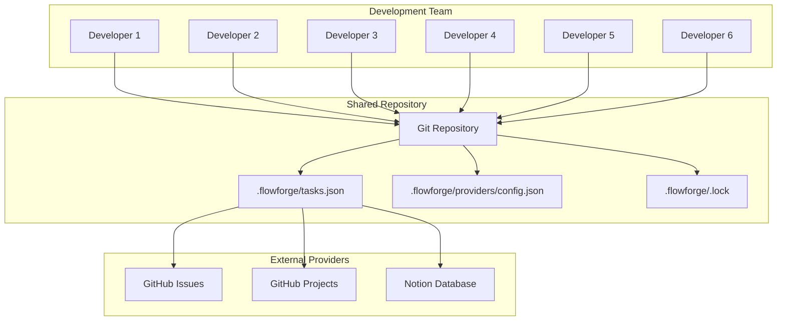

# FlowForge Team Configuration Guide

**Version**: 2.0.0
**Target**: 6+ Developer Teams
**Last Updated**: September 2025

---

## 🎯 Overview

This guide covers team-specific configuration for FlowForge v2.0 provider system, optimized for concurrent developer workflows, file locking, conflict resolution, and collaborative task management.

## 📊 Team Architecture

### Recommended Setup for 6 Developers



---

## 🔧 Core Team Configuration

### Primary Configuration File

Create `.flowforge/providers/config.json`:

```json
{
  "version": "2.0.0",
  "mode": "hybrid",
  "defaultProvider": "json-team",
  "team": {
    "name": "FlowForge Development Team",
    "maxConcurrentUsers": 6,
    "timezoneName": "UTC",
    "workingHours": {
      "start": "09:00",
      "end": "17:00",
      "timezone": "UTC"
    },
    "collaboration": {
      "lockingEnabled": true,
      "lockTimeout": 15000,
      "retryAttempts": 3,
      "conflictResolution": "prompt",
      "sessionSharing": true
    }
  },
  "providers": [
    {
      "name": "json-team",
      "type": "json",
      "enabled": true,
      "priority": 1,
      "settings": {
        "filePath": ".flowforge/tasks.json",
        "autoSave": true,
        "saveInterval": 2000,
        "fileLocking": true,
        "lockRetryAttempts": 5,
        "lockRetryDelay": 1000,
        "backupEnabled": true,
        "backupInterval": 300000,
        "conflictResolution": "merge",
        "atomicWrites": true
      }
    },
    {
      "name": "github-team",
      "type": "github",
      "enabled": true,
      "priority": 2,
      "settings": {
        "token": "${GITHUB_TOKEN}",
        "owner": "JustCode-CruzAlex",
        "repo": "FlowForge",
        "projectNumber": 1,
        "syncInterval": 300000,
        "rateLimitSafe": true,
        "batchSize": 10,
        "defaultLabels": ["v2.0", "team"]
      }
    }
  ],
  "sync": {
    "enabled": true,
    "interval": 180000,
    "strategy": "merge",
    "batchSize": 10,
    "conflictResolution": "local_wins",
    "syncOnSessionEnd": true
  },
  "performance": {
    "cacheEnabled": true,
    "cacheTTL": 60000,
    "maxCacheSize": "50MB",
    "batchOperations": true,
    "parallelRequests": 3
  },
  "monitoring": {
    "healthCheckInterval": 300000,
    "performanceLogging": true,
    "errorReporting": true,
    "usageAnalytics": false
  }
}
```

---

## 🔒 File Locking System

### How File Locking Works

1. **Lock Acquisition**: When a developer starts a session, FlowForge attempts to acquire a file lock
2. **Lock Information**: Lock file contains user, PID, timestamp, and operation type
3. **Lock Timeout**: Automatic release after 15 seconds of inactivity
4. **Stale Lock Detection**: Locks older than 5 minutes are considered stale
5. **Retry Logic**: Automatic retry with exponential backoff

### Lock File Structure

`.flowforge/.lock`:
```json
{
  "user": "developer1",
  "pid": 12345,
  "timestamp": "2025-09-16T10:30:00Z",
  "operation": "session_start",
  "sessionId": "session-abc123",
  "taskId": 214,
  "host": "dev-machine-01"
}
```

### Lock Management Commands

```bash
# Check current lock status
ls -la .flowforge/.lock

# View lock details
cat .flowforge/.lock | jq .

# Check lock age
LOCK_AGE=$(($(date +%s) - $(stat -c %Y .flowforge/.lock)))
echo "Lock age: ${LOCK_AGE} seconds"

# Remove stale lock (emergency only)
if [ $LOCK_AGE -gt 300 ]; then
  rm .flowforge/.lock
  echo "Removed stale lock"
fi
```

### Lock Configuration Options

```json
{
  "fileLocking": {
    "enabled": true,
    "lockFile": ".flowforge/.lock",
    "timeout": 15000,
    "retryInterval": 1000,
    "maxRetries": 5,
    "staleLockTimeout": 300000,
    "lockInfo": {
      "includeHost": true,
      "includePid": true,
      "includeUser": true,
      "includeOperation": true
    },
    "emergency": {
      "forceUnlockAfter": 600000,
      "allowAdminOverride": true
    }
  }
}
```

---

## 🤝 Conflict Resolution

### Conflict Types and Strategies

#### 1. Simultaneous Task Updates

**Scenario**: Two developers update the same task simultaneously

**Resolution Strategy**:
```json
{
  "conflictResolution": "merge",
  "mergeStrategy": {
    "timeTracking": "append",
    "status": "latest_wins",
    "title": "manual_prompt",
    "priority": "highest_wins",
    "assignee": "manual_prompt"
  }
}
```

#### 2. Session Overlap

**Scenario**: Developer starts session on task already being worked on

**Resolution Strategy**:
```json
{
  "sessionConflict": {
    "strategy": "prompt",
    "options": [
      "take_over",
      "collaborative_mode",
      "choose_different_task"
    ],
    "timeout": 30000,
    "fallback": "choose_different_task"
  }
}
```

#### 3. Provider Sync Conflicts

**Scenario**: Local JSON differs from GitHub Issues

**Resolution Strategy**:
```json
{
  "syncConflict": {
    "strategy": "three_way_merge",
    "priority": ["local", "remote", "base"],
    "autoResolve": {
      "status": "remote_wins",
      "timeTracking": "local_wins",
      "metadata": "merge"
    }
  }
}
```

### Manual Conflict Resolution

When automatic resolution fails:

```bash
# View conflict details
node scripts/provider-bridge.js get-conflicts --format=json

# Resolve specific conflict
node scripts/provider-bridge.js resolve-conflict \
  --conflict-id=abc123 \
  --strategy=take_local

# Force sync resolution
node scripts/provider-bridge.js force-sync \
  --strategy=merge \
  --backup=true
```

---

## 👥 User Management

### Per-User Configuration

Each developer can have personal overrides in `.flowforge/user/config.json`:

```json
{
  "user": {
    "name": "developer1",
    "email": "dev1@company.com",
    "timezone": "America/New_York",
    "preferences": {
      "defaultFormat": "text",
      "autoStartTracking": true,
      "notificationLevel": "minimal",
      "conflictStrategy": "prompt"
    },
    "providers": {
      "github": {
        "username": "dev1-github",
        "defaultAssignee": true
      },
      "notion": {
        "defaultAuthor": true
      }
    }
  }
}
```

### User Environment Setup

Each developer should configure:

```bash
# Personal GitHub token
export GITHUB_TOKEN="ghp_personal_token_here"

# User identification
export FLOWFORGE_USER="developer1"
export FLOWFORGE_EMAIL="dev1@company.com"

# Team settings
export FLOWFORGE_TEAM_MODE="true"
export FLOWFORGE_TEAM_SIZE="6"

# Add to shell profile
echo 'export GITHUB_TOKEN="ghp_your_token"' >> ~/.bashrc
echo 'export FLOWFORGE_USER="your_username"' >> ~/.bashrc
source ~/.bashrc
```

---

## 📅 Session Coordination

### Preventing Session Conflicts

#### Daily Team Sync

```bash
#!/bin/bash
# Save as: scripts/team-sync.sh

echo "👥 Team Sync - $(date)"
echo "===================="

# Check active sessions
if [ -f .flowforge/.lock ]; then
  ACTIVE_USER=$(jq -r '.user' .flowforge/.lock)
  ACTIVE_TASK=$(jq -r '.taskId' .flowforge/.lock)
  echo "🔒 Active session: $ACTIVE_USER working on #$ACTIVE_TASK"
else
  echo "🔓 No active sessions"
fi

# Show team task distribution
echo -e "\n📋 Task Distribution:"
node scripts/provider-bridge.js list-tasks --format=json | \
  jq -r '.[] | select(.status == "in_progress") | "  #\(.id): \(.title) - \(.assignee // "unassigned")"'

# Show ready tasks
echo -e "\n🚀 Ready Tasks:"
node scripts/provider-bridge.js list-tasks --status=ready --format=text | head -5

echo "===================="
```

#### Task Assignment Strategy

```json
{
  "teamWorkflow": {
    "taskAssignment": {
      "method": "pull",
      "autoAssign": false,
      "preventDuplicates": true,
      "maxTasksPerDeveloper": 3
    },
    "sessionManagement": {
      "maxSessionDuration": 28800000,
      "warningThreshold": 25200000,
      "autoEndAfter": 32400000
    }
  }
}
```

### Session Handoff Process

When one developer needs to hand off work to another:

```bash
# Developer 1: End session with handoff note
./run_ff_command.sh flowforge:session:end "Handoff to dev2: authentication module 80% complete"

# Developer 2: Start session on same task
./run_ff_command.sh flowforge:session:start 214

# System automatically logs handoff
```

---

## 🔄 Synchronization Strategy

### Multi-Provider Sync Rules

```json
{
  "sync": {
    "enabled": true,
    "interval": 180000,
    "rules": [
      {
        "name": "GitHub to Local",
        "source": "github-team",
        "target": "json-team",
        "direction": "bidirectional",
        "filter": {
          "labels": ["v2.0"],
          "state": ["open"]
        },
        "schedule": "*/5 * * * *"
      },
      {
        "name": "Team Status Sync",
        "source": "json-team",
        "target": "github-team",
        "direction": "one_way",
        "filter": {
          "status": ["in_progress", "completed"]
        },
        "immediate": true
      }
    ],
    "conflictResolution": {
      "defaultStrategy": "merge",
      "fieldStrategies": {
        "status": "remote_wins",
        "assignee": "local_wins",
        "timeTracking": "append"
      }
    }
  }
}
```

### Sync Monitoring

```bash
# Check sync status
node scripts/provider-bridge.js sync-status

# Force sync all providers
node scripts/provider-bridge.js sync-all --force=true

# View sync history
cat .flowforge/sync/history.json | jq '.[-5:]'
```

---

## 📊 Team Metrics and Monitoring

### Performance Metrics

```json
{
  "monitoring": {
    "metrics": {
      "lockContention": {
        "enabled": true,
        "threshold": 10,
        "alerting": true
      },
      "conflictRate": {
        "enabled": true,
        "threshold": 5,
        "period": "daily"
      },
      "providerResponseTime": {
        "enabled": true,
        "threshold": 2000,
        "samples": 100
      },
      "teamProductivity": {
        "enabled": true,
        "metrics": [
          "tasksCompleted",
          "sessionDuration",
          "switchingFrequency"
        ]
      }
    }
  }
}
```

### Team Dashboard Script

```bash
#!/bin/bash
# Save as: scripts/team-dashboard.sh

echo "📊 FlowForge Team Dashboard"
echo "=========================="
echo "Date: $(date)"
echo ""

# Active sessions
echo "🔒 Active Sessions:"
if [ -f .flowforge/.lock ]; then
  jq -r '"  " + .user + " → Task #" + (.taskId | tostring) + " (" + .operation + ")"' .flowforge/.lock
else
  echo "  None"
fi
echo ""

# Task status distribution
echo "📋 Task Status:"
node scripts/provider-bridge.js list-tasks --format=json | \
  jq -r 'group_by(.status) | .[] | "  " + (.[0].status | ascii_upcase) + ": " + (. | length | tostring)'
echo ""

# Recent activity (last 4 hours)
echo "⏰ Recent Activity:"
FOUR_HOURS_AGO=$(date -d '4 hours ago' '+%Y-%m-%dT%H:%M:%S')
node scripts/provider-bridge.js list-tasks --format=json | \
  jq --arg threshold "$FOUR_HOURS_AGO" \
  '.[] | select(.lastModified > $threshold) | "  #" + (.id | tostring) + ": " + .title + " [" + .status + "]"' -r | \
  head -10
echo ""

# Provider health
echo "🏥 Provider Health:"
RESPONSE_TIME=$(( $(date +%s%3N) ))
node scripts/provider-bridge.js get-provider > /dev/null 2>&1
RESPONSE_TIME=$(( $(date +%s%3N) - RESPONSE_TIME ))
echo "  Response time: ${RESPONSE_TIME}ms"

if [ $RESPONSE_TIME -lt 1000 ]; then
  echo "  Status: ✅ Healthy"
elif [ $RESPONSE_TIME -lt 3000 ]; then
  echo "  Status: ⚠️  Slow"
else
  echo "  Status: ❌ Poor"
fi

echo ""
echo "=========================="
```

---

## 🚨 Team Emergency Procedures

### Lock Recovery

```bash
#!/bin/bash
# Save as: scripts/emergency-unlock.sh

echo "🚨 Emergency Lock Recovery"
echo "========================="

if [ ! -f .flowforge/.lock ]; then
  echo "✅ No lock file found"
  exit 0
fi

# Show lock info
echo "🔒 Current lock:"
cat .flowforge/.lock | jq .

# Check if lock is stale
LOCK_TIME=$(jq -r '.timestamp' .flowforge/.lock)
LOCK_EPOCH=$(date -d "$LOCK_TIME" +%s)
CURRENT_EPOCH=$(date +%s)
LOCK_AGE=$((CURRENT_EPOCH - LOCK_EPOCH))

echo "Lock age: ${LOCK_AGE} seconds"

if [ $LOCK_AGE -gt 300 ]; then
  echo "⚠️  Lock is stale (>5 minutes)"
  read -p "Remove stale lock? (y/N): " -n 1 -r
  echo
  if [[ $REPLY =~ ^[Yy]$ ]]; then
    rm .flowforge/.lock
    echo "✅ Lock removed"
  else
    echo "Lock preserved"
  fi
else
  echo "🔒 Lock is recent, consider contacting the user first"
  LOCK_USER=$(jq -r '.user' .flowforge/.lock)
  echo "Contact: $LOCK_USER"
fi
```

### Data Recovery

```bash
#!/bin/bash
# Save as: scripts/data-recovery.sh

echo "🔄 Data Recovery"
echo "==============="

# Check JSON integrity
if ! jq empty .flowforge/tasks.json 2>/dev/null; then
  echo "❌ tasks.json is corrupted"

  # Find latest backup
  LATEST_BACKUP=$(ls -t .flowforge/backups/tasks*.json 2>/dev/null | head -1)

  if [ -n "$LATEST_BACKUP" ]; then
    echo "📄 Latest backup: $LATEST_BACKUP"
    cp "$LATEST_BACKUP" .flowforge/tasks.json
    echo "✅ Restored from backup"
  else
    echo "⚠️  No backups found, creating minimal structure"
    echo '{"version":"2.0.0","tasks":[],"metadata":{"created":"'$(date -Iseconds)'"}}' > .flowforge/tasks.json
  fi
fi

# Verify provider system
if node scripts/provider-bridge.js get-provider > /dev/null 2>&1; then
  echo "✅ Provider system operational"
else
  echo "❌ Provider system failed, resetting to default"
  rm -rf .flowforge/providers/
  node scripts/provider-bridge.js get-provider
fi

echo "==============="
```

### Team Communication Template

```markdown
## 🚨 FlowForge Team Alert

**Issue**: [Brief description]
**Impact**: [What's affected]
**Status**: [Investigating/Resolved/Ongoing]

### Current Situation
- [ ] All developers stop current sessions
- [ ] Emergency unlock completed: [Y/N]
- [ ] Data integrity verified: [Y/N]
- [ ] Provider system operational: [Y/N]

### Next Steps
1. [Step 1]
2. [Step 2]
3. [Step 3]

### When to Resume
- ✅ All systems green
- ✅ Data verified intact
- ✅ Team lead approval

**Updated**: [Timestamp]
**Reporter**: [Team member]
```

---

## 📋 Team Onboarding Checklist

### New Developer Setup

- [ ] **Repository Access**
  - [ ] Clone FlowForge repository
  - [ ] Verify branch access and permissions

- [ ] **Environment Setup**
  - [ ] Install Node.js and npm dependencies
  - [ ] Configure personal GitHub token
  - [ ] Set FLOWFORGE_USER environment variable

- [ ] **Provider Testing**
  - [ ] Run provider health check
  - [ ] Test basic task operations
  - [ ] Verify file locking works

- [ ] **Team Integration**
  - [ ] Add to team communication channels
  - [ ] Review team dashboard
  - [ ] Practice emergency procedures

- [ ] **First Session**
  - [ ] Start test session with mentor
  - [ ] Complete simple task assignment
  - [ ] Verify time tracking works

### Team Setup Verification

```bash
#!/bin/bash
# Save as: scripts/team-verification.sh

echo "👥 Team Setup Verification"
echo "=========================="

# Check all developers can access provider
echo "🔧 Provider Access Test:"
for user in developer1 developer2 developer3 developer4 developer5 developer6; do
  if FLOWFORGE_USER="$user" node scripts/provider-bridge.js get-provider > /dev/null 2>&1; then
    echo "  ✅ $user: OK"
  else
    echo "  ❌ $user: FAILED"
  fi
done

# Check concurrent access simulation
echo -e "\n🔒 Concurrent Access Test:"
# (Simplified test - in practice would spawn multiple processes)
echo "  Run manual concurrent session test"

# Check GitHub integration
echo -e "\n🐙 GitHub Integration:"
if node scripts/provider-bridge.js list-tasks --provider=github-team > /dev/null 2>&1; then
  echo "  ✅ GitHub provider: OK"
else
  echo "  ❌ GitHub provider: FAILED"
fi

echo "=========================="
```

---

**🎯 Key Takeaways for Team Success**:

1. **Clear Communication**: Use team dashboard and sync scripts daily
2. **Respect Locks**: Always check for active sessions before starting work
3. **Handle Conflicts**: Follow established resolution procedures
4. **Monitor Performance**: Watch for degradation in response times
5. **Emergency Preparedness**: Know recovery procedures and escalation paths

For additional team management features, see the [Provider Setup Guide](./PROVIDER_SETUP_GUIDE.md) and [Troubleshooting Guide](./TROUBLESHOOTING.md).