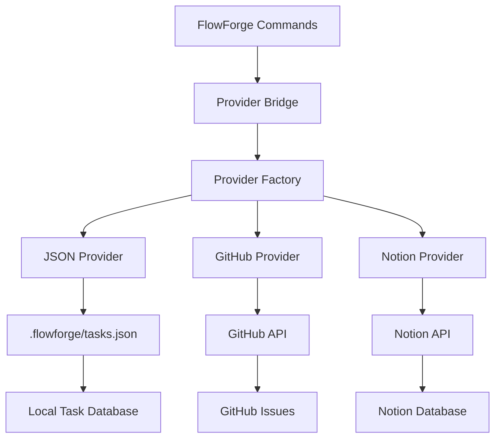

# Provider Bridge Usage Guide

**Version**: 2.0  
**Last Updated**: August 2025  
**Component**: `scripts/provider-bridge.js`

## Overview

The Provider Bridge is FlowForge's unified interface for task and session management across different providers (GitHub, JSON, Notion). It abstracts away provider-specific implementation details, providing a consistent command-line interface for all FlowForge operations.

## Architecture



## Basic Usage

### Command Structure
```bash
node scripts/provider-bridge.js <action> [options]
```

### Available Actions

| Action | Description | Example |
|--------|-------------|---------|
| `list-tasks` | List tasks with optional filters | `list-tasks --status=in_progress` |
| `get-task` | Get specific task by ID | `get-task --id=214` |
| `verify-task` | Check if task exists | `verify-task --id=214` |
| `create-task` | Create new task | `create-task --title="New feature"` |
| `update-task` | Update existing task | `update-task --id=214 --status=completed` |
| `start-tracking` | Start time tracking | `start-tracking --id=214` |
| `stop-tracking` | Stop time tracking | `stop-tracking --id=214 --session=abc123` |
| `search-tasks` | Search tasks | `search-tasks --query="authentication"` |
| `get-provider` | Get provider info | `get-provider` |
| `aggregate-tasks` | Get tasks from all providers | `aggregate-tasks --status=open` |

### Common Options

| Option | Description | Example |
|--------|-------------|---------|
| `--id=<id>` | Task ID | `--id=214` |
| `--status=<status>` | Filter by status | `--status=in_progress` |
| `--priority=<priority>` | Filter by priority | `--priority=critical` |
| `--format=<format>` | Output format | `--format=json` |
| `--provider=<name>` | Specific provider | `--provider=github` |
| `--debug` | Enable debug output | `--debug=true` |

## Detailed Command Reference

### Task Management Commands

#### `list-tasks` - List Tasks with Filtering
```bash
# Basic usage
node scripts/provider-bridge.js list-tasks

# Filter by status
node scripts/provider-bridge.js list-tasks --status=in_progress

# Filter by priority
node scripts/provider-bridge.js list-tasks --priority=critical

# Multiple filters
node scripts/provider-bridge.js list-tasks --status=ready --priority=high

# Different output formats
node scripts/provider-bridge.js list-tasks --format=text
node scripts/provider-bridge.js list-tasks --format=markdown
node scripts/provider-bridge.js list-tasks --format=simple
```

**Output Formats**:
- `json` (default): Full JSON structure
- `text`: `#214: Fix session management [in_progress]`
- `markdown`: `- [ ] #214: Fix session management [in_progress]`
- `simple`: Just task IDs, one per line

#### `get-task` - Retrieve Specific Task
```bash
# Get task details
node scripts/provider-bridge.js get-task --id=214

# Different format
node scripts/provider-bridge.js get-task --id=214 --format=markdown
```

**Example Output (JSON)**:
```json
{
  "id": 214,
  "title": "CRITICAL: Fix session management commands",
  "description": "Critical session management system breakdown...",
  "status": "ready",
  "priority": "critical",
  "size": "L",
  "type": "bug",
  "estimatedHours": 8,
  "milestone": "v1.5.0-bulletproof-billing",
  "microtasks": [
    "Remove MD file dependencies from session commands",
    "Implement proper JSON provider calls"
  ]
}
```

#### `verify-task` - Check Task Existence
```bash
# Verify task exists
node scripts/provider-bridge.js verify-task --id=214

# Success output: Task status (e.g., "ready", "in_progress")
# Failure output: "NOT_FOUND" (exit code 1)
```

**Usage in Scripts**:
```bash
if TASK_STATUS=$(node scripts/provider-bridge.js verify-task --id=214 2>/dev/null); then
    echo "Task exists with status: $TASK_STATUS"
else
    echo "Task not found"
    exit 1
fi
```

#### `create-task` - Create New Task
```bash
# Basic task creation
node scripts/provider-bridge.js create-task \
  --title="Implement user authentication" \
  --description="Add JWT-based authentication system"

# With additional properties
node scripts/provider-bridge.js create-task \
  --title="Fix critical bug" \
  --description="Memory leak in session handling" \
  --status=ready \
  --priority=critical \
  --labels=bug,urgent
```

#### `update-task` - Modify Existing Task
```bash
# Update status
node scripts/provider-bridge.js update-task --id=214 --status=in_progress

# Update multiple fields
node scripts/provider-bridge.js update-task \
  --id=214 \
  --status=in_progress \
  --priority=critical \
  --description="Updated requirements"

# Add labels
node scripts/provider-bridge.js update-task \
  --id=214 \
  --labels=bug,session,critical
```

### Time Tracking Commands

#### `start-tracking` - Begin Time Tracking
```bash
# Start tracking for task
node scripts/provider-bridge.js start-tracking --id=214

# With specific user and instance
node scripts/provider-bridge.js start-tracking \
  --id=214 \
  --user=cruzalex \
  --instance=session-123
```

**What Happens**:
1. Creates time session entry in `tasks.json`
2. Associates with current user and instance ID
3. Records start timestamp
4. Returns session information

#### `stop-tracking` - End Time Tracking
```bash
# Stop tracking (requires session ID)
node scripts/provider-bridge.js stop-tracking \
  --id=214 \
  --session=json-1755586284593-xid4us6l3
```

**What Happens**:
1. Finds active time session
2. Records end timestamp
3. Calculates total duration
4. Archives session data

### Search Commands

#### `search-tasks` - Search Across Tasks
```bash
# Basic search
node scripts/provider-bridge.js search-tasks --query="authentication"

# Search with filters
node scripts/provider-bridge.js search-tasks \
  --query="session management" \
  --status=open \
  --priority=high

# Search in specific provider
node scripts/provider-bridge.js search-tasks \
  --query="bug" \
  --provider=github
```

### Provider Management Commands

#### `get-provider` - Provider Information
```bash
# Get active provider info
node scripts/provider-bridge.js get-provider

# Get specific provider
node scripts/provider-bridge.js get-provider --provider=github
```

**Example Output**:
```json
{
  "name": "json-default",
  "type": "json",
  "capabilities": {
    "taskManagement": true,
    "timeTracking": true,
    "search": true,
    "labels": true
  },
  "enabled": true
}
```

#### `aggregate-tasks` - Multi-Provider Task List
```bash
# Get tasks from all enabled providers
node scripts/provider-bridge.js aggregate-tasks

# Filter across all providers
node scripts/provider-bridge.js aggregate-tasks --status=open --priority=high
```

## Integration with FlowForge Commands

The provider bridge is used throughout FlowForge commands:

### Session Start Integration
```bash
# In /flowforge:session:start
if [ -n "$PROVIDER_BRIDGE" ] && command -v node &> /dev/null; then
    # Verify task exists
    if TASK_STATUS=$(node "$PROVIDER_BRIDGE" verify-task --id="$ISSUE_NUMBER" 2>&1); then
        echo "✅ Task verified via provider system - Status: ${TASK_STATUS}"
        
        # Get task details
        TASK_INFO=$(node "$PROVIDER_BRIDGE" get-task --id="$ISSUE_NUMBER" --format=json)
        
        # Start time tracking
        node "$PROVIDER_BRIDGE" start-tracking --id="$ISSUE_NUMBER" --user="$USER"
        
        # Update status to in-progress
        node "$PROVIDER_BRIDGE" update-task --id="$ISSUE_NUMBER" --status=in_progress
    fi
fi
```

### Session End Integration
```bash
# In /flowforge:session:end
if [ -n "$ACTIVE_TASK" ] && [ -n "$PROVIDER_BRIDGE" ]; then
    # Stop time tracking
    node "$PROVIDER_BRIDGE" stop-tracking --id="$ACTIVE_TASK" --session="$SESSION_ID"
    
    # Update task status
    node "$PROVIDER_BRIDGE" update-task --id="$ACTIVE_TASK" --status=paused
fi
```

## Provider Configuration

### Default JSON Provider Configuration
Located in `.flowforge/config/providers.json`:

```json
{
  "default": {
    "providers": [
      {
        "type": "json",
        "primary": true,
        "config": {
          "dataFile": ".flowforge/tasks.json",
          "backupEnabled": true,
          "autoSave": true,
          "saveInterval": 5000
        }
      }
    ],
    "sync": {
      "enabled": false,
      "interval": 300000
    }
  }
}
```

### Auto-Provider Creation
If no providers are configured, the bridge automatically creates a default JSON provider:

```javascript
const jsonConfig = {
    name: 'json-default',
    type: 'json', 
    enabled: true,
    settings: {
        filePath: '.flowforge/tasks.json',
        autoSave: true,
        saveInterval: 5000
    }
};
```

## Error Handling

### Common Error Patterns

#### Task Not Found
```bash
$ node scripts/provider-bridge.js get-task --id=999
❌ Failed to get task: Task not found

# Exit code: 1
```

#### Invalid Parameters
```bash
$ node scripts/provider-bridge.js create-task
❌ Task title required (--title=<title>)

# Exit code: 1
```

#### Provider Unavailable
```bash
$ node scripts/provider-bridge.js list-tasks --provider=github
❌ Failed to get provider 'github': Provider not configured

# Exit code: 1
```

### Error Recovery
```bash
# Check provider status
node scripts/provider-bridge.js get-provider

# Verify JSON integrity
jq empty .flowforge/tasks.json

# Reset to default provider
rm .flowforge/config/providers.json
# (Will auto-create default JSON provider on next run)
```

## Advanced Usage

### Scripting with Provider Bridge

#### Batch Task Updates
```bash
#!/bin/bash
# Update all ready tasks to in_progress

READY_TASKS=$(node scripts/provider-bridge.js list-tasks --status=ready --format=simple)

for task_id in $READY_TASKS; do
    echo "Updating task #$task_id"
    node scripts/provider-bridge.js update-task --id="$task_id" --status=in_progress
done
```

#### Daily Task Summary
```bash
#!/bin/bash
# Generate daily task summary

echo "=== Daily Task Summary ==="
echo "In Progress:"
node scripts/provider-bridge.js list-tasks --status=in_progress --format=text

echo -e "\nReady to Start:"
node scripts/provider-bridge.js list-tasks --status=ready --format=text | head -5

echo -e "\nHigh Priority:"
node scripts/provider-bridge.js list-tasks --priority=critical --format=text
```

#### Time Tracking Report
```bash
#!/bin/bash
# Generate time tracking report for specific task

TASK_ID=$1
if [ -z "$TASK_ID" ]; then
    echo "Usage: $0 <task_id>"
    exit 1
fi

echo "=== Time Tracking Report for Task #$TASK_ID ==="
node scripts/provider-bridge.js get-task --id="$TASK_ID" --format=json | \
    jq '.title, .estimatedHours, .timeSessions'
```

### Custom Output Formatting

#### Custom JSON Processing
```bash
# Get task titles only
node scripts/provider-bridge.js list-tasks --format=json | \
    jq -r '.[] | "\(.id): \(.title)"'

# Get overdue tasks
node scripts/provider-bridge.js list-tasks --format=json | \
    jq -r '.[] | select(.dueDate < now) | .id'
```

#### Markdown Reports
```bash
# Generate markdown task report
echo "# Task Report - $(date)"
echo ""
echo "## In Progress"
node scripts/provider-bridge.js list-tasks --status=in_progress --format=markdown
echo ""
echo "## Ready"
node scripts/provider-bridge.js list-tasks --status=ready --format=markdown
```

## Security Considerations

### Input Sanitization
The provider bridge includes built-in security measures:

```javascript
// Remove dangerous shell characters
value = value.replace(/[;&|`$()<>\\]/g, '');

// Limit input length
if (value.length > 1000) {
    value = value.substring(0, 1000);
}
```

### Safe Command Construction
```bash
# ✅ Safe - Using proper options
node scripts/provider-bridge.js get-task --id="$TASK_ID"

# ❌ Unsafe - Direct interpolation
node scripts/provider-bridge.js get-task --id=$TASK_ID  # Could allow injection
```

### File Permissions
```bash
# Ensure proper permissions on task data
chmod 600 .flowforge/tasks.json
chmod 700 .flowforge/config/
```

## Performance Optimization

### Caching Strategies
```bash
# Cache provider info for session
PROVIDER_INFO=$(node scripts/provider-bridge.js get-provider --format=json)
PROVIDER_TYPE=$(echo "$PROVIDER_INFO" | jq -r '.type')

# Reuse throughout session without repeated calls
```

### Batch Operations
```bash
# ✅ Efficient - Single aggregated call
TASKS=$(node scripts/provider-bridge.js aggregate-tasks --status=open)

# ❌ Inefficient - Multiple individual calls
for id in 214 215 216; do
    node scripts/provider-bridge.js get-task --id="$id"
done
```

### Output Format Selection
```bash
# ✅ Efficient for scripts - Simple format
TASK_IDS=$(node scripts/provider-bridge.js list-tasks --format=simple)

# ❌ Wasteful for simple needs - Full JSON
node scripts/provider-bridge.js list-tasks --format=json | jq -r '.[].id'
```

## Debugging

### Debug Mode
```bash
# Enable debug output
node scripts/provider-bridge.js list-tasks --debug=true

# Shows:
# - Provider initialization
# - Query parameters
# - Internal operations
# - Performance metrics
```

### Logging
```bash
# Redirect debug output to file
node scripts/provider-bridge.js list-tasks --debug=true 2> debug.log

# Monitor provider bridge calls
tail -f debug.log | grep "provider-bridge"
```

### Manual Testing
```bash
# Test provider connection
node scripts/provider-bridge.js get-provider

# Test task operations
node scripts/provider-bridge.js verify-task --id=214
node scripts/provider-bridge.js get-task --id=214

# Test time tracking
node scripts/provider-bridge.js start-tracking --id=214
node scripts/provider-bridge.js stop-tracking --id=214 --session=test-session
```

## Migration from Legacy Systems

### Command Translation

| Legacy Command | Provider Bridge Equivalent |
|----------------|----------------------------|
| `grep "^214:" TASKS.md` | `node scripts/provider-bridge.js get-task --id=214` |
| `awk '/status:ready/ {print $1}' TASKS.md` | `node scripts/provider-bridge.js list-tasks --status=ready --format=simple` |
| Manual MD file editing | `node scripts/provider-bridge.js update-task --id=214 --status=completed` |

### Data Validation
```bash
# Compare legacy vs new system (during transition)
LEGACY_COUNT=$(grep -c "^[0-9]" TASKS.md || echo "0")
JSON_COUNT=$(node scripts/provider-bridge.js list-tasks --format=json | jq length)

echo "Legacy tasks: $LEGACY_COUNT"
echo "JSON tasks: $JSON_COUNT"
```

---

**Related Documentation**:
- [JSON Workflow Architecture](../architecture/json-workflow.md)
- [Session Management Guide](../guides/session-management.md)
- [Provider System Architecture](../architecture/provider-system.md)