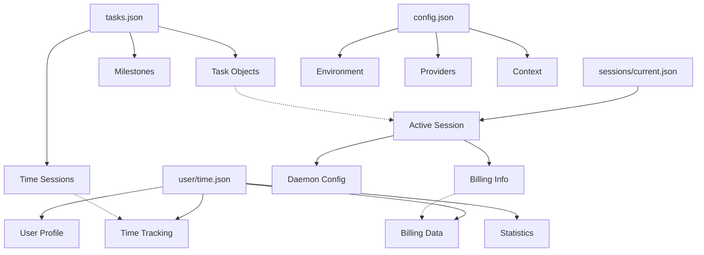

# FlowForge v2.0 JSON Schema Documentation

## Overview

This directory contains comprehensive JSON Schema v2.0 documentation for FlowForge's v2.2.0 Bulletproof Billing milestone. All schemas use JSON Schema draft-07 specification and include complete examples, validation rules, and constraints following FlowForge documentation standards.

## Schema Files

### Core Data Schemas

| Schema File | Description | Purpose |
|-------------|-------------|---------|
| [`tasks-schema.json`](./tasks-schema.json) | Complete schema for tasks.json structure | Validates task data, milestones, time sessions, and metadata |
| [`sessions-schema.json`](./sessions-schema.json) | Schema for sessions/current.json structure | Validates active session tracking and daemon configuration |
| [`user-data-schema.json`](./user-data-schema.json) | Schema for user-specific data files | Validates time tracking, billing, and privacy-protected information |
| [`config-schema.json`](./config-schema.json) | Schema for system configuration files | Validates environment settings, providers, and context tracking |

### Migration Documentation

| Document | Description | Purpose |
|----------|-------------|---------|
| [`migration-guide.md`](./migration-guide.md) | Complete v1.x to v2.0 migration guide | Step-by-step migration, rollback procedures, troubleshooting |

## Schema Validation

### Prerequisites

Install JSON Schema validator:

```bash
npm install -g ajv-cli
```

### Validate Data Files

```bash
# Validate tasks.json
ajv validate \
  -s documentation/2.0/schemas/tasks-schema.json \
  -d .flowforge/tasks.json

# Validate current session
ajv validate \
  -s documentation/2.0/schemas/sessions-schema.json \
  -d .flowforge/sessions/current.json

# Validate user data
ajv validate \
  -s documentation/2.0/schemas/user-data-schema.json \
  -d .flowforge/user/$(whoami)/time.json

# Validate configuration
ajv validate \
  -s documentation/2.0/schemas/config-schema.json \
  -d .flowforge/.config/context.json
```

### Batch Validation Script

```bash
#!/bin/bash
# validate-all-schemas.sh

set -e

SCHEMA_DIR="documentation/2.0/schemas"
DATA_DIR=".flowforge"

echo "🔍 Validating FlowForge v2.0 Data Schemas..."

# Validate tasks.json
if [[ -f "$DATA_DIR/tasks.json" ]]; then
    echo "✅ Validating tasks.json..."
    ajv validate -s "$SCHEMA_DIR/tasks-schema.json" -d "$DATA_DIR/tasks.json"
else
    echo "⚠️  tasks.json not found"
fi

# Validate current session
if [[ -f "$DATA_DIR/sessions/current.json" ]]; then
    echo "✅ Validating sessions/current.json..."
    ajv validate -s "$SCHEMA_DIR/sessions-schema.json" -d "$DATA_DIR/sessions/current.json"
else
    echo "⚠️  sessions/current.json not found"
fi

# Validate user data
USER_DATA="$DATA_DIR/user/$(whoami)/time.json"
if [[ -f "$USER_DATA" ]]; then
    echo "✅ Validating user data..."
    ajv validate -s "$SCHEMA_DIR/user-data-schema.json" -d "$USER_DATA"
else
    echo "⚠️  User data file not found"
fi

# Validate configuration
if [[ -f "$DATA_DIR/.config/context.json" ]]; then
    echo "✅ Validating configuration..."
    ajv validate -s "$SCHEMA_DIR/config-schema.json" -d "$DATA_DIR/.config/context.json"
else
    echo "⚠️  Configuration file not found"
fi

echo "🎉 Schema validation complete!"
```

## Data Structure Overview

### FlowForge v2.0 Data Architecture

```
.flowforge/
├── tasks.json              # Main tasks database (tasks-schema.json)
├── sessions/
│   ├── current.json        # Active session (sessions-schema.json)
│   └── all-sessions.json   # Historical sessions
├── user/
│   └── {username}/
│       └── time.json       # User time data (user-data-schema.json)
└── .config/
    ├── context.json        # Context tracking (config-schema.json)
    └── current-position.json
```

### Schema Relationships



## Key Schema Features

### Bulletproof Billing Support

All schemas include comprehensive billing fields:

- **Hourly Rates**: Per-task, per-project, per-user rates
- **Time Tracking**: Precise session duration and activity monitoring
- **Invoice Management**: Invoice status, payment tracking
- **Privacy Protection**: Encrypted sensitive data, user consent tracking
- **Audit Trails**: Complete billing history and approval workflows

### Data Integrity

- **Required Fields**: Minimal required data for functionality
- **Validation Rules**: Format, range, and constraint validation
- **Referential Integrity**: Task dependencies, session relationships
- **Version Tracking**: Schema and data version management

### Privacy & Security

- **Data Encryption**: Sensitive fields marked for encryption
- **User Consent**: Privacy policy version tracking
- **Data Retention**: Configurable retention policies
- **Export/Deletion**: GDPR-compliant data portability

## Schema Examples

Each schema file includes comprehensive examples showing:

1. **Minimal Valid Objects**: Required fields only
2. **Complete Objects**: All optional fields populated  
3. **Real-world Scenarios**: Typical usage patterns
4. **Edge Cases**: Boundary conditions and special cases

### Example Task Object

```json
{
  "id": 250,
  "title": "JSON Schema v2.0 Documentation",
  "status": "in_progress",
  "priority": "high",
  "assignee": "cruzalex",
  "estimatedHours": 8,
  "actualHours": 6.5,
  "tags": ["documentation", "v2.0", "billing"],
  "source": "github-issue",
  "githubIssue": 250,
  "createdAt": "2025-09-06T14:04:48.251Z",
  "updatedAt": "2025-09-06T16:30:00.000Z",
  "billing": {
    "billable": true,
    "rate": 85.0,
    "client": "FlowForge",
    "category": "documentation"
  },
  "microtasks": [],
  "dependencies": []
}
```

## Integration with FlowForge CLI

### Automatic Schema Validation

FlowForge v2.0 automatically validates data against schemas:

```bash
# Schema validation is built into all data operations
flowforge tasks:create "New task"  # Validates against tasks-schema.json
flowforge session:start 250       # Validates against sessions-schema.json  
flowforge config:set user.rate 85 # Validates against config-schema.json
```

### Schema-Driven Development

- **API Endpoints**: Generated from schemas
- **CLI Commands**: Parameter validation from schemas
- **Documentation**: Auto-generated from schema descriptions
- **Testing**: Schema-based test data generation

## Migration Support

The schemas support seamless migration from v1.x:

1. **Backward Compatibility**: v1.x data fields preserved where possible
2. **Migration Metadata**: `source` field tracks data origin
3. **Validation During Migration**: Ensures data integrity
4. **Rollback Support**: Original data preserved for rollback

See [`migration-guide.md`](./migration-guide.md) for complete migration procedures.

## Validation Best Practices

### Development Workflow

1. **Pre-commit Validation**: Validate data files before commits
2. **Automated Testing**: Include schema validation in test suites
3. **Documentation Updates**: Update schemas when data structures change
4. **Version Management**: Increment schema versions for breaking changes

### Error Handling

```javascript
// Example validation error handling
const Ajv = require('ajv');
const ajv = new Ajv({ allErrors: true });

try {
  const validate = ajv.compile(tasksSchema);
  const valid = validate(tasksData);
  
  if (!valid) {
    console.error('Validation errors:', validate.errors);
    // Handle specific error types
    for (const error of validate.errors) {
      switch (error.keyword) {
        case 'required':
          console.error(`Missing required field: ${error.params.missingProperty}`);
          break;
        case 'format':
          console.error(`Invalid format for ${error.instancePath}: ${error.message}`);
          break;
        // ... handle other error types
      }
    }
  }
} catch (error) {
  console.error('Schema compilation error:', error);
}
```

## Contributing to Schemas

### Schema Update Process

1. **Identify Changes**: Document required schema modifications
2. **Update Schema**: Modify JSON schema with new fields/constraints
3. **Update Examples**: Provide examples using new fields
4. **Update Migration**: Update migration scripts for new structure
5. **Version Bump**: Increment schema version if breaking changes
6. **Documentation**: Update this README and related docs
7. **Testing**: Validate existing data against updated schemas

### Schema Validation Rules

- Use JSON Schema draft-07 specification
- Include comprehensive examples
- Add clear descriptions for all fields
- Define appropriate constraints (min/max, patterns, enums)
- Mark sensitive fields for encryption
- Include version tracking
- Follow FlowForge naming conventions

## Troubleshooting

### Common Validation Errors

| Error Type | Description | Solution |
|------------|-------------|----------|
| `required` | Missing required field | Add the missing field with appropriate value |
| `format` | Invalid format (date, email, etc.) | Correct the format to match specification |
| `enum` | Value not in allowed list | Use one of the allowed enum values |
| `pattern` | String doesn't match regex | Adjust string to match required pattern |
| `minimum/maximum` | Number outside allowed range | Adjust number to be within constraints |

### Debugging Schema Issues

```bash
# Get detailed validation output
ajv validate \
  -s documentation/2.0/schemas/tasks-schema.json \
  -d .flowforge/tasks.json \
  --verbose \
  --all-errors

# Test specific schema sections
jq '.tasks[0]' .flowforge/tasks.json | \
  ajv validate -s documentation/2.0/schemas/tasks-schema.json#/definitions/Task
```

## Support

For questions or issues with schema validation:

1. **Check Migration Guide**: [`migration-guide.md`](./migration-guide.md)
2. **GitHub Issues**: Report schema bugs or request enhancements
3. **Documentation**: Full FlowForge v2.0 documentation at `/documentation/2.0/`
4. **Community**: FlowForge Discord server for real-time help

---

*This schema documentation is part of FlowForge v2.2.0 "Bulletproof Billing" milestone. All schemas are designed to ensure data integrity, support comprehensive billing features, and provide seamless migration from v1.x.*