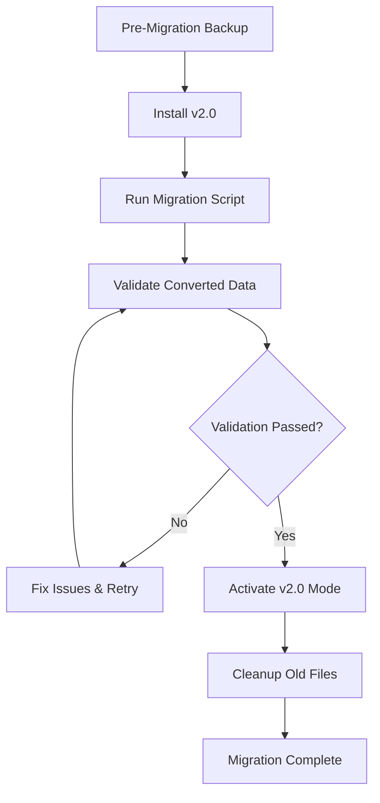

# FlowForge v2.0 Migration Guide

## Overview

This guide provides step-by-step instructions for migrating from FlowForge v1.x to v2.0, including the transition from Markdown-based task files to JSON-structured data, schema validation, and complete data mapping procedures.

## Table of Contents

1. [Pre-Migration Requirements](#pre-migration-requirements)
2. [Migration Process Overview](#migration-process-overview)
3. [Markdown to JSON Conversion](#markdown-to-json-conversion)
4. [Data Schema Mapping](#data-schema-mapping)
5. [Validation Procedures](#validation-procedures)
6. [Rollback Procedures](#rollback-procedures)
7. [Post-Migration Tasks](#post-migration-tasks)
8. [Troubleshooting](#troubleshooting)

## Pre-Migration Requirements

### System Requirements

- FlowForge v1.x installed and functional
- Node.js v16.0.0 or higher
- Git v2.20.0 or higher
- Minimum 1GB free disk space
- Backup of existing data

### Data Backup

**CRITICAL**: Always backup your data before migration:

```bash
# Create backup directory
mkdir -p ~/.flowforge/backups/pre-v2-migration-$(date +%Y%m%d-%H%M%S)

# Backup existing task files
cp -r .flowforge/tasks/*.md ~/.flowforge/backups/pre-v2-migration-$(date +%Y%m%d-%H%M%S)/
cp -r .flowforge/sessions/ ~/.flowforge/backups/pre-v2-migration-$(date +%Y%m%d-%H%M%S)/
cp -r .flowforge/.config/ ~/.flowforge/backups/pre-v2-migration-$(date +%Y%m%d-%H%M%S)/

# Backup git hooks
cp -r .git/hooks/ ~/.flowforge/backups/pre-v2-migration-$(date +%Y%m%d-%H%M%S)/
```

### Version Check

```bash
# Check current FlowForge version
flowforge --version

# Verify you're on v1.x
if [[ $(flowforge --version | cut -d. -f1) != "1" ]]; then
  echo "ERROR: This migration is for v1.x to v2.0 only"
  exit 1
fi
```

## Migration Process Overview

The migration follows these phases:

1. **Preparation Phase**: Backup and validation
2. **Schema Setup Phase**: Install v2.0 schemas
3. **Data Conversion Phase**: Convert MD to JSON
4. **Validation Phase**: Verify data integrity
5. **Activation Phase**: Switch to v2.0 mode
6. **Cleanup Phase**: Archive old files



## Markdown to JSON Conversion

### Task File Conversion

FlowForge v1.x used Markdown files for task management. v2.0 uses structured JSON with comprehensive schemas.

#### v1.x Task File Example (TASKS.md)

```markdown
# FlowForge Tasks

## TODO

- [ ] #1 Complete migration script
  - Created: 2025-09-01
  - Priority: High
  - Assignee: cruzalex
  - Estimated: 4h

- [ ] #2 Write documentation
  - Created: 2025-09-02
  - Priority: Medium
  - Dependencies: 1

## IN_PROGRESS

- [x] #3 Test implementation
  - Started: 2025-09-03
  - Progress: 75%

## COMPLETED

- [x] #4 Setup project structure
  - Completed: 2025-08-30
  - Time: 2.5h
```

#### v2.0 JSON Equivalent (tasks.json)

```json
{
  "tasks": [
    {
      "id": 1,
      "title": "Complete migration script",
      "status": "pending",
      "priority": "high",
      "assignee": "cruzalex",
      "estimatedHours": 4,
      "createdAt": "2025-09-01T00:00:00.000Z",
      "source": "migrated-from-md",
      "microtasks": [],
      "dependencies": []
    },
    {
      "id": 2,
      "title": "Write documentation", 
      "status": "pending",
      "priority": "medium",
      "createdAt": "2025-09-02T00:00:00.000Z",
      "dependencies": [1],
      "source": "migrated-from-md",
      "microtasks": []
    },
    {
      "id": 3,
      "title": "Test implementation",
      "status": "in_progress",
      "createdAt": "2025-09-03T00:00:00.000Z",
      "source": "migrated-from-md",
      "microtasks": []
    },
    {
      "id": 4,
      "title": "Setup project structure",
      "status": "completed",
      "actualHours": 2.5,
      "completedAt": "2025-08-30T00:00:00.000Z",
      "createdAt": "2025-08-30T00:00:00.000Z",
      "source": "migrated-from-md",
      "microtasks": []
    }
  ],
  "milestones": [],
  "timeSessions": {},
  "lastUpdated": "2025-09-06T14:00:00.000Z",
  "version": "2.0.0"
}
```

### Session File Conversion

#### v1.x Session Example (.flowforge/.current-session)

```
session-1757167488-140545
issue:250
branch:feature/250-work
start:2025-09-06T14:04:48.251Z
user:cruzalex
```

#### v2.0 JSON Equivalent (sessions/current.json)

```json
{
  "sessionId": "session-1757167488-140545",
  "taskId": "250",
  "taskTitle": "JSON Schema v2.0 Documentation",
  "taskStatus": "in_progress",
  "branch": "feature/250-work",
  "startTime": "2025-09-06T14:04:48.251Z",
  "user": "cruzalex",
  "detectionSource": "manual",
  "lastActivity": "2025-09-06T14:04:48.251Z",
  "status": "active"
}
```

### Automated Migration Script

Use the built-in migration script:

```bash
# Run the automatic migration
./scripts/migrate-md-to-json.sh

# The script will:
# 1. Parse all .md task files
# 2. Extract task data using regex patterns
# 3. Convert to JSON format
# 4. Validate against schemas
# 5. Create backup of original files
# 6. Generate migration report
```

#### Manual Migration Steps

If automatic migration fails, follow manual steps:

```bash
# 1. Create migration workspace
mkdir -p .flowforge/migration/

# 2. Convert TASKS.md
node scripts/migration/convert-tasks.js \
  --input .flowforge/TASKS.md \
  --output .flowforge/migration/tasks.json \
  --schema documentation/2.0/schemas/tasks-schema.json

# 3. Convert session data
node scripts/migration/convert-sessions.js \
  --input .flowforge/.current-session \
  --output .flowforge/migration/current.json \
  --schema documentation/2.0/schemas/sessions-schema.json

# 4. Create user data structure
node scripts/migration/create-user-data.js \
  --user $(whoami) \
  --output .flowforge/migration/user-$(whoami).json \
  --schema documentation/2.0/schemas/user-data-schema.json

# 5. Migrate configuration
node scripts/migration/convert-config.js \
  --input .flowforge/.config/ \
  --output .flowforge/migration/config.json \
  --schema documentation/2.0/schemas/config-schema.json
```

## Data Schema Mapping

### Task Data Mapping

| v1.x Markdown Format | v2.0 JSON Field | Data Type | Notes |
|---------------------|-----------------|-----------|-------|
| `#123 Task title` | `id`, `title` | integer, string | Extract ID and title |
| `- [ ]` / `- [x]` | `status` | string | Map to enum values |
| `Priority: High` | `priority` | string | Convert to lowercase |
| `Assignee: user` | `assignee` | string | Direct mapping |
| `Estimated: 4h` | `estimatedHours` | number | Parse numeric value |
| `Created: date` | `createdAt` | string (ISO 8601) | Convert to ISO format |
| `Dependencies: 1,2` | `dependencies` | array of integers | Parse comma-separated |
| Sub-tasks | `microtasks` | array of objects | Convert to structured format |

### Session Data Mapping

| v1.x Format | v2.0 JSON Field | Data Type | Notes |
|-------------|-----------------|-----------|-------|
| `session-{id}` | `sessionId` | string | Direct mapping |
| `issue:{number}` | `taskId` | string | Convert number to string |
| `branch:{name}` | `branch` | string | Direct mapping |
| `start:{timestamp}` | `startTime` | string (ISO 8601) | Ensure ISO format |
| `user:{name}` | `user` | string | Direct mapping |

### Status Mapping

| v1.x Status | v2.0 Status | Description |
|-------------|-------------|-------------|
| `TODO` | `pending` | Tasks not yet started |
| `IN_PROGRESS` | `in_progress` | Currently active tasks |
| `BLOCKED` | `blocked` | Tasks waiting on dependencies |
| `COMPLETED` | `completed` | Finished tasks |
| `CANCELLED` | `cancelled` | Abandoned tasks |

### Priority Mapping

| v1.x Priority | v2.0 Priority | Description |
|---------------|---------------|-------------|
| `Critical` | `critical` | Urgent, blocking issues |
| `High` | `high` | Important tasks |
| `Medium` | `medium` | Standard tasks |
| `Low` | `low` | Nice-to-have tasks |

## Validation Procedures

### Schema Validation

Validate converted data against JSON schemas:

```bash
# Install JSON schema validator
npm install -g ajv-cli

# Validate tasks.json
ajv validate \
  -s documentation/2.0/schemas/tasks-schema.json \
  -d .flowforge/tasks.json

# Validate sessions/current.json
ajv validate \
  -s documentation/2.0/schemas/sessions-schema.json \
  -d .flowforge/sessions/current.json

# Validate user data
ajv validate \
  -s documentation/2.0/schemas/user-data-schema.json \
  -d .flowforge/user/$(whoami)/time.json

# Validate configuration
ajv validate \
  -s documentation/2.0/schemas/config-schema.json \
  -d .flowforge/.config/context.json
```

### Data Integrity Checks

```bash
# Run comprehensive validation
./scripts/validation/validate-migration.sh

# Check task relationships
node scripts/validation/check-task-dependencies.js

# Verify session continuity
node scripts/validation/check-session-integrity.js

# Validate time tracking data
node scripts/validation/check-time-data.js
```

### Common Validation Errors

#### Missing Required Fields

```bash
# Error: Missing required field 'createdAt'
# Fix: Add default timestamp
jq '.tasks[] |= . + {"createdAt": "2025-09-06T00:00:00.000Z"}' \
  .flowforge/tasks.json > .flowforge/tasks-fixed.json
```

#### Invalid Date Formats

```bash
# Error: Invalid date format
# Fix: Convert to ISO 8601
node scripts/migration/fix-date-formats.js \
  --input .flowforge/tasks.json \
  --output .flowforge/tasks-fixed.json
```

#### Circular Dependencies

```bash
# Error: Circular task dependencies detected
# Fix: Remove circular references
node scripts/migration/fix-dependencies.js \
  --input .flowforge/tasks.json \
  --output .flowforge/tasks-fixed.json
```

## Rollback Procedures

If migration fails or issues are discovered, rollback to v1.x:

### Immediate Rollback

```bash
# Stop any running FlowForge processes
pkill -f flowforge

# Restore from backup
BACKUP_DIR=$(ls -1t ~/.flowforge/backups/ | head -1)
cp -r ~/.flowforge/backups/$BACKUP_DIR/* .flowforge/

# Restore git hooks
cp -r ~/.flowforge/backups/$BACKUP_DIR/hooks/* .git/hooks/

# Downgrade to v1.x
npm install -g @flowforge/cli@1.x

# Verify rollback
flowforge --version
flowforge status
```

### Selective Rollback

```bash
# Rollback specific components only

# Tasks only
cp ~/.flowforge/backups/$BACKUP_DIR/TASKS.md .flowforge/
cp ~/.flowforge/backups/$BACKUP_DIR/NEXT_SESSION.md .flowforge/

# Sessions only
cp -r ~/.flowforge/backups/$BACKUP_DIR/sessions/ .flowforge/

# Configuration only
cp -r ~/.flowforge/backups/$BACKUP_DIR/.config/ .flowforge/
```

### Verify Rollback Success

```bash
# Test basic functionality
flowforge status
flowforge session:list
flowforge project:tasks

# Verify task data
cat .flowforge/TASKS.md | head -20

# Check session tracking
flowforge session:current
```

## Post-Migration Tasks

### Update Git Hooks

```bash
# Update hooks for v2.0 compatibility
./hooks/install-hooks.sh

# Test hook functionality
git add -A
git commit -m "test: Post-migration hook test"
```

### Configure v2.0 Features

```bash
# Enable new v2.0 features
flowforge config set billing.enabled true
flowforge config set daemon.enabled true
flowforge config set providers.github.enabled true

# Set user preferences
flowforge config set user.defaultRate 85.0
flowforge config set user.timezone "America/New_York"
```

### Verify All Systems

```bash
# Run comprehensive system check
flowforge health:check

# Verify time tracking
flowforge session:start 999
sleep 5
flowforge session:end "Test session post-migration"

# Check task management
flowforge tasks:list
flowforge tasks:create "Post-migration test task"
```

### Clean Up Migration Files

```bash
# Archive migration workspace (keep for debugging)
tar -czf ~/.flowforge/backups/migration-workspace-$(date +%Y%m%d).tar.gz \
  .flowforge/migration/

# Remove temporary migration files
rm -rf .flowforge/migration/
rm -f .flowforge/.migration-lock
```

## Troubleshooting

### Common Issues

#### Migration Script Fails

**Problem**: `migrate-md-to-json.sh` exits with errors

**Solution**:
```bash
# Check script permissions
chmod +x scripts/migrate-md-to-json.sh

# Run with verbose logging
DEBUG=1 ./scripts/migrate-md-to-json.sh

# Check for corrupted MD files
find .flowforge/ -name "*.md" -exec head -1 {} \;
```

#### JSON Validation Errors

**Problem**: Converted JSON doesn't validate against schema

**Solution**:
```bash
# Get detailed validation output
ajv validate \
  -s documentation/2.0/schemas/tasks-schema.json \
  -d .flowforge/tasks.json \
  --verbose

# Fix common issues automatically
node scripts/migration/fix-validation-errors.js \
  --schema documentation/2.0/schemas/tasks-schema.json \
  --data .flowforge/tasks.json \
  --output .flowforge/tasks-fixed.json
```

#### Session Data Loss

**Problem**: Session information not properly migrated

**Solution**:
```bash
# Restore session from git history
git log --oneline --grep="session" | head -10

# Manually reconstruct session data
node scripts/migration/reconstruct-sessions.js \
  --from "2025-09-01" \
  --to "2025-09-06" \
  --output .flowforge/sessions/reconstructed.json
```

#### Performance Issues

**Problem**: Large task files cause migration timeout

**Solution**:
```bash
# Split large files
split -l 100 .flowforge/TASKS.md .flowforge/tasks-split-

# Migrate in chunks
for file in .flowforge/tasks-split-*; do
  node scripts/migration/convert-tasks.js \
    --input "$file" \
    --output "${file}.json"
done

# Merge results
node scripts/migration/merge-task-files.js \
  --input ".flowforge/tasks-split-*.json" \
  --output .flowforge/tasks.json
```

### Getting Help

If you encounter issues during migration:

1. **Check the logs**:
   ```bash
   tail -f ~/.flowforge/logs/migration.log
   ```

2. **Report the issue**:
   ```bash
   flowforge issue:create \
     --title "Migration issue: [brief description]" \
     --body "$(flowforge debug:export)"
   ```

3. **Community support**:
   - GitHub Issues: https://github.com/JustCode-CruzAlex/FlowForge/issues
   - Documentation: https://flowforge.dev/docs/migration
   - Discord: https://discord.gg/flowforge

### Recovery Scenarios

#### Complete Migration Failure

If migration completely fails and rollback doesn't work:

```bash
# Nuclear option: Fresh start
mv .flowforge .flowforge-corrupted-$(date +%Y%m%d)
git clean -fd .flowforge/

# Reinstall FlowForge
npm uninstall -g @flowforge/cli
npm install -g @flowforge/cli@latest

# Initialize fresh v2.0 installation
flowforge init --version 2.0

# Manually import critical data from backup
# (Tasks, time data, etc.)
```

#### Partial Data Loss

If some data is lost during migration:

```bash
# Identify missing data
node scripts/validation/check-data-completeness.js \
  --v1-backup ~/.flowforge/backups/$BACKUP_DIR \
  --v2-data .flowforge/

# Selective data recovery
node scripts/migration/recover-missing-data.js \
  --missing-report missing-data.json \
  --backup ~/.flowforge/backups/$BACKUP_DIR \
  --target .flowforge/
```

## Migration Checklist

### Pre-Migration
- [ ] FlowForge v1.x installed and working
- [ ] Complete backup created
- [ ] Dependencies verified
- [ ] Migration script permissions set
- [ ] Test environment prepared

### During Migration
- [ ] Migration script executed successfully
- [ ] No validation errors
- [ ] All data converted properly
- [ ] Schema validation passed
- [ ] Integrity checks completed

### Post-Migration
- [ ] v2.0 features configured
- [ ] Git hooks updated
- [ ] System health check passed
- [ ] Test session completed
- [ ] Migration files cleaned up
- [ ] Documentation updated

## Conclusion

The FlowForge v2.0 migration transforms your workflow from Markdown-based task management to a robust, schema-validated JSON structure with enhanced billing capabilities, better time tracking, and improved data integrity.

This migration guide ensures zero data loss and provides comprehensive rollback procedures if issues arise. The new v2.0 structure provides:

- **Better Data Integrity**: JSON schemas ensure data consistency
- **Enhanced Billing**: Bulletproof time tracking and invoicing
- **Improved Performance**: Structured data enables faster queries
- **API Compatibility**: JSON structure supports future API development
- **Better Reporting**: Structured data enables rich analytics

For additional support during migration, refer to the troubleshooting section or contact the FlowForge support team.

---

*This migration guide is part of FlowForge v2.2.0 "Bulletproof Billing" milestone documentation.*