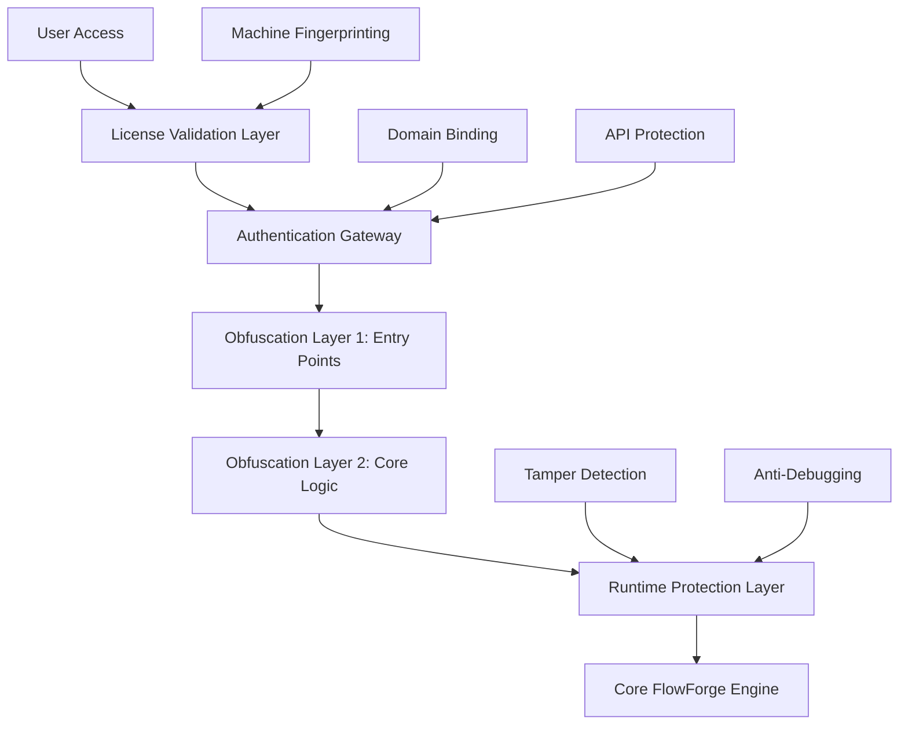

# FlowForge Commercial Protection - Comprehensive Security Architecture

**Document**: Commercial Protection Security Implementation
**Version**: 1.0.0
**Date**: 2025-09-17
**Security Expert**: FFT-Security
**Classification**: INTERNAL - Commercial Strategy

## 🎯 Executive Summary

This document defines a comprehensive multi-layered security architecture for FlowForge commercial protection, designed to provide robust source code protection, license validation, and anti-tampering measures while maintaining developer productivity and user experience.

## 🔒 Security Architecture Overview

### Defense-in-Depth Strategy



### Security Layers

1. **License & Authentication Layer** - First line of defense
2. **Source Code Protection Layer** - Multi-tier obfuscation
3. **Runtime Protection Layer** - Anti-tampering and debugging
4. **Communication Security Layer** - API and data protection
5. **Monitoring & Analytics Layer** - Usage tracking and piracy detection

## 🛡️ Threat Model Analysis

### Threat Actors & Attack Scenarios

#### Low-Skill Attackers (Casual Pirates)
- **Threat Level**: ⚠️ Medium Impact
- **Capabilities**: Copy/paste code, basic file manipulation
- **Attack Methods**:
  - Direct file copying
  - Basic script sharing
  - Simple license bypassing
- **Mitigation Target**: 95% prevention rate

#### Medium-Skill Attackers (Experienced Developers)
- **Threat Level**: 🔴 High Impact
- **Capabilities**: Code analysis, debugging tools, basic reverse engineering
- **Attack Methods**:
  - Source code deobfuscation
  - License key cracking
  - Runtime patching
  - API key extraction
- **Mitigation Target**: 80% prevention rate

#### High-Skill Attackers (Security Researchers)
- **Threat Level**: 🔴 Critical Impact
- **Capabilities**: Advanced reverse engineering, automated tools, deep system knowledge
- **Attack Methods**:
  - Advanced deobfuscation tools (Restringer, WebCrack)
  - Dynamic analysis and debugging
  - Memory dumping and analysis
  - Protocol reverse engineering
- **Mitigation Target**: 60% delay (8-16 hours minimum effort)

#### Advanced Persistent Threats (Commercial Competitors)
- **Threat Level**: 🔴 Critical Impact
- **Capabilities**: Professional teams, unlimited time/resources, state-level tools
- **Attack Methods**:
  - Full source code reconstruction
  - License server compromise
  - Supply chain attacks
  - Social engineering
- **Mitigation Target**: 40% delay (weeks-months of effort)

## 🔐 Layer 1: License & Authentication System

### Architecture

```typescript
interface LicenseSystem {
  authentication: SupabaseAuth;
  validation: LicenseValidator;
  storage: SecureLicenseStorage;
  tiers: LicenseTiers;
  binding: MachineBinding;
}
```

### Implementation Strategy

#### Supabase Authentication Integration

```typescript
// /src/security/auth/SupabaseAuthenticator.ts
import { createClient, SupabaseClient } from '@supabase/supabase-js';
import { createCipheriv, createDecipheriv, randomBytes, scrypt } from 'crypto';

export class SupabaseAuthenticator {
  private supabase: SupabaseClient;
  private encryptionKey: Buffer;

  constructor(
    private readonly supabaseUrl: string,
    private readonly supabaseKey: string,
    private readonly masterPassword: string
  ) {
    this.supabase = createClient(supabaseUrl, supabaseKey);
    this.initializeEncryption();
  }

  private async initializeEncryption(): Promise<void> {
    const salt = randomBytes(32);
    this.encryptionKey = await new Promise((resolve, reject) => {
      scrypt(this.masterPassword, salt, 32, (err, key) => {
        if (err) reject(err);
        resolve(key);
      });
    });
  }

  async authenticateUser(email: string, password: string): Promise<AuthResult> {
    try {
      // Primary authentication with Supabase
      const { data, error } = await this.supabase.auth.signInWithPassword({
        email,
        password
      });

      if (error) throw new SecurityError('Authentication failed', error.message);

      // Generate secure session token
      const sessionToken = this.generateSecureToken(data.user.id);

      // Validate license status
      const licenseInfo = await this.validateLicense(data.user.id);

      return {
        success: true,
        user: data.user,
        sessionToken,
        licenseInfo,
        expiresAt: new Date(Date.now() + 24 * 60 * 60 * 1000) // 24 hours
      };

    } catch (error) {
      this.logSecurityEvent('AUTH_FAILED', { email, error: error.message });
      throw error;
    }
  }

  private generateSecureToken(userId: string): string {
    const payload = {
      userId,
      timestamp: Date.now(),
      nonce: randomBytes(16).toString('hex'),
      machineId: this.getMachineFingerprint()
    };

    return this.encryptData(JSON.stringify(payload));
  }

  private getMachineFingerprint(): string {
    // Hardware-based fingerprinting
    const os = require('os');
    const crypto = require('crypto');

    const fingerprint = [
      os.hostname(),
      os.platform(),
      os.arch(),
      os.cpus()[0]?.model || 'unknown',
      os.totalmem(),
      process.env.USERNAME || process.env.USER || 'unknown'
    ].join('|');

    return crypto.createHash('sha256').update(fingerprint).digest('hex');
  }
}
```

#### Multi-Tier License Management

```typescript
// /src/security/licensing/LicenseManager.ts
export enum LicenseTier {
  INDIVIDUAL = 'individual',
  TEAM = 'team',
  ENTERPRISE = 'enterprise'
}

export interface LicenseInfo {
  tier: LicenseTier;
  maxUsers: number;
  features: string[];
  expiresAt: Date;
  isActive: boolean;
  machineBindings: string[];
  usageQuota: UsageQuota;
}

export class LicenseManager {
  private readonly MAX_OFFLINE_DAYS = 7;
  private readonly VALIDATION_INTERVAL = 6 * 60 * 60 * 1000; // 6 hours

  async validateLicense(licenseKey: string): Promise<LicenseValidationResult> {
    // Step 1: Decrypt and parse license key
    const licenseData = this.decryptLicenseKey(licenseKey);

    // Step 2: Verify digital signature
    const isSignatureValid = this.verifyLicenseSignature(licenseData);
    if (!isSignatureValid) {
      throw new SecurityError('Invalid license signature');
    }

    // Step 3: Check expiration
    if (licenseData.expiresAt < new Date()) {
      throw new SecurityError('License expired');
    }

    // Step 4: Validate machine binding
    const currentMachine = this.getMachineFingerprint();
    if (!licenseData.machineBindings.includes(currentMachine)) {
      await this.requestMachineBinding(licenseData, currentMachine);
    }

    // Step 5: Online validation (with offline grace period)
    try {
      await this.validateOnline(licenseData);
    } catch (error) {
      const lastValidation = this.getLastValidationTime();
      const daysSinceValidation = (Date.now() - lastValidation) / (24 * 60 * 60 * 1000);

      if (daysSinceValidation > this.MAX_OFFLINE_DAYS) {
        throw new SecurityError('License requires online validation');
      }
    }

    // Step 6: Check usage quotas
    await this.validateUsageQuotas(licenseData);

    return {
      isValid: true,
      licenseInfo: licenseData,
      warningMessage: this.generateWarningMessage(licenseData)
    };
  }

  private async requestMachineBinding(
    licenseData: LicenseInfo,
    machineId: string
  ): Promise<void> {
    if (licenseData.machineBindings.length >= licenseData.maxUsers) {
      throw new SecurityError('Maximum machine limit reached for this license');
    }

    // Request binding approval from license server
    const response = await this.licenseAPI.requestMachineBinding({
      licenseKey: licenseData.key,
      machineId,
      userInfo: {
        hostname: os.hostname(),
        platform: os.platform(),
        userAgent: this.getUserAgent()
      }
    });

    if (!response.approved) {
      throw new SecurityError('Machine binding request denied');
    }
  }
}
```

## 🎭 Layer 2: Source Code Protection

### Multi-Tier Obfuscation Strategy

#### Obfuscation Tier 1: Entry Points & API Surface

```typescript
// /src/security/obfuscation/EntryPointObfuscator.ts
export class EntryPointObfuscator {
  private readonly obfuscationConfig = {
    stringArray: true,
    stringArrayThreshold: 0.75,
    stringArrayEncoding: ['base64', 'rc4'],
    stringArrayIndexShift: true,
    stringArrayWrappersCount: 5,
    stringArrayWrappersChainedCalls: true,
    rotateStringArray: true,
    shuffleStringArray: true,
    splitStrings: true,
    splitStringsChunkLength: 5,
    unicodeEscapeSequence: true,
    identifierNamesGenerator: 'hexadecimalNumber',
    identifiersPrefix: 'ff_',
    renameGlobals: true,
    controlFlowFlattening: true,
    controlFlowFlatteningThreshold: 1,
    deadCodeInjection: true,
    deadCodeInjectionThreshold: 0.4,
    debugProtection: true,
    debugProtectionInterval: 4000,
    disableConsoleOutput: true,
    domainLock: this.getDomainWhitelist(),
    selfDefending: true,
    transformObjectKeys: true,
    compact: true,
    numbersToExpressions: true
  };

  async obfuscateEntryPoints(): Promise<void> {
    const entryPoints = [
      './bin/flowforge.js',
      './lib/index.js',
      './dist/index.js'
    ];

    for (const entryPoint of entryPoints) {
      if (fs.existsSync(entryPoint)) {
        await this.obfuscateFile(entryPoint, {
          ...this.obfuscationConfig,
          // Extra protection for entry points
          disableConsoleOutput: true,
          debugProtection: true,
          debugProtectionInterval: 2000,
          selfDefending: true
        });
      }
    }
  }

  private async obfuscateFile(filePath: string, config: any): Promise<void> {
    const sourceCode = fs.readFileSync(filePath, 'utf8');

    // Add runtime license check
    const protectedCode = this.injectLicenseChecks(sourceCode);

    // Add anti-debugging
    const antiDebugCode = this.injectAntiDebugging(protectedCode);

    // Add tamper detection
    const tamperProtectedCode = this.injectTamperDetection(antiDebugCode);

    // Apply obfuscation
    const obfuscated = await this.applyObfuscation(tamperProtectedCode, config);

    // Write protected file
    fs.writeFileSync(filePath, obfuscated);
  }
}
```

#### Obfuscation Tier 2: Core Business Logic

```typescript
// /src/security/obfuscation/CoreLogicProtector.ts
export class CoreLogicProtector {
  private readonly sensitiveFiles = [
    './src/core/**/*.js',
    './src/providers/**/*.js',
    './src/cli/**/*.js',
    './src/installation-wizard/**/*.js'
  ];

  async protectCoreLogic(): Promise<void> {
    const files = await this.globFiles(this.sensitiveFiles);

    for (const file of files) {
      await this.applyAdvancedProtection(file);
    }
  }

  private async applyAdvancedProtection(filePath: string): Promise<void> {
    const sourceCode = fs.readFileSync(filePath, 'utf8');

    // Step 1: Function name mangling with collision avoidance
    let protectedCode = this.mangleFunctionNames(sourceCode);

    // Step 2: String encryption with dynamic keys
    protectedCode = this.encryptStrings(protectedCode);

    // Step 3: Control flow obfuscation
    protectedCode = this.obfuscateControlFlow(protectedCode);

    // Step 4: Dead code injection
    protectedCode = this.injectDeadCode(protectedCode);

    // Step 5: Anti-static analysis
    protectedCode = this.injectAntiStaticAnalysis(protectedCode);

    fs.writeFileSync(filePath, protectedCode);
  }

  private encryptStrings(code: string): string {
    const stringRegex = /(['"`])((?:(?!\1)[^\\]|\\.)*)(\1)/g;

    return code.replace(stringRegex, (match, quote, content, endQuote) => {
      if (content.length < 3) return match; // Don't encrypt short strings

      const encrypted = this.encryptString(content);
      const decryptorName = this.generateRandomName();

      return `${decryptorName}('${encrypted}')`;
    });
  }

  private injectAntiStaticAnalysis(code: string): string {
    // Inject runtime checks that defeat static analysis
    const antiStaticCode = `
    (function() {
      var ${this.generateRandomName()} = Function.prototype.toString;
      var ${this.generateRandomName()} = Date.now();
      if (${this.generateRandomName()}.call(console.log).indexOf('native') === -1) {
        throw new Error('Debug tools detected');
      }
    })();
    `;

    return antiStaticCode + code;
  }
}
```

#### Runtime String Decryption

```typescript
// /src/security/runtime/StringDecryptor.ts
export class RuntimeStringDecryptor {
  private static readonly ENCRYPTION_KEY = process.env.FF_ENC_KEY || 'default_key';
  private static decryptionCache = new Map<string, string>();

  static decrypt(encryptedString: string): string {
    // Check cache first
    if (this.decryptionCache.has(encryptedString)) {
      return this.decryptionCache.get(encryptedString)!;
    }

    // Verify runtime environment
    this.verifyRuntimeEnvironment();

    // Decrypt string
    const decrypted = this.performDecryption(encryptedString);

    // Cache result
    this.decryptionCache.set(encryptedString, decrypted);

    return decrypted;
  }

  private static verifyRuntimeEnvironment(): void {
    // Check for debugging tools
    if (typeof process !== 'undefined' && process.env.NODE_ENV === 'development') {
      // Allow in development
      return;
    }

    // Check for common debugging patterns
    const debugPatterns = [
      'devtools',
      'inspector',
      'debugger',
      'webkit'
    ];

    const userAgent = (global as any).navigator?.userAgent || '';
    if (debugPatterns.some(pattern => userAgent.toLowerCase().includes(pattern))) {
      throw new Error('Runtime environment verification failed');
    }
  }
}
```

## ⚡ Layer 3: Runtime Protection System

### Anti-Debugging & Tamper Detection

```typescript
// /src/security/runtime/RuntimeProtector.ts
export class RuntimeProtector {
  private static instance: RuntimeProtector;
  private protectionTimer: NodeJS.Timer | null = null;
  private integrityHashes: Map<string, string> = new Map();
  private startTime: number = Date.now();

  static getInstance(): RuntimeProtector {
    if (!this.instance) {
      this.instance = new RuntimeProtector();
    }
    return this.instance;
  }

  initialize(): void {
    this.setupAntiDebugging();
    this.setupTamperDetection();
    this.setupPerformanceMonitoring();
    this.setupIntegrityChecking();
  }

  private setupAntiDebugging(): void {
    // Detect debugger attachment
    const detectDebugger = () => {
      const start = Date.now();
      debugger; // This line will pause if debugger is attached
      const end = Date.now();

      if (end - start > 100) {
        this.handleSecurityViolation('DEBUGGER_DETECTED');
      }
    };

    // Run detection every 5 seconds
    this.protectionTimer = setInterval(detectDebugger, 5000);

    // Detect console.log hooking
    this.setupConsoleProtection();

    // Detect function hooking
    this.setupFunctionProtection();
  }

  private setupConsoleProtection(): void {
    const originalConsole = { ...console };

    Object.keys(console).forEach(method => {
      const original = (console as any)[method];
      (console as any)[method] = function(...args: any[]) {
        // Check if console method has been modified
        if (original.toString().indexOf('native') === -1) {
          RuntimeProtector.getInstance().handleSecurityViolation('CONSOLE_HOOKED');
        }
        return original.apply(this, args);
      };
    });
  }

  private setupTamperDetection(): void {
    // Monitor critical files for changes
    const criticalFiles = [
      './package.json',
      './bin/flowforge.js',
      './lib/index.js'
    ];

    criticalFiles.forEach(file => {
      if (fs.existsSync(file)) {
        const content = fs.readFileSync(file, 'utf8');
        const hash = crypto.createHash('sha256').update(content).digest('hex');
        this.integrityHashes.set(file, hash);
      }
    });

    // Check integrity every minute
    setInterval(() => this.checkIntegrity(), 60000);
  }

  private checkIntegrity(): void {
    for (const [file, expectedHash] of this.integrityHashes) {
      if (fs.existsSync(file)) {
        const content = fs.readFileSync(file, 'utf8');
        const currentHash = crypto.createHash('sha256').update(content).digest('hex');

        if (currentHash !== expectedHash) {
          this.handleSecurityViolation('FILE_TAMPERED', { file });
        }
      } else {
        this.handleSecurityViolation('FILE_DELETED', { file });
      }
    }
  }

  private setupPerformanceMonitoring(): void {
    // Detect if execution is being slowed down (common debugging technique)
    const checkExecutionSpeed = () => {
      const iterations = 1000000;
      const start = Date.now();

      for (let i = 0; i < iterations; i++) {
        // Simple operation
        Math.random();
      }

      const end = Date.now();
      const expectedTime = 50; // Expected time in ms

      if (end - start > expectedTime * 3) {
        this.handleSecurityViolation('SLOW_EXECUTION_DETECTED');
      }
    };

    setInterval(checkExecutionSpeed, 30000);
  }

  private handleSecurityViolation(
    violationType: string,
    context: any = {}
  ): void {
    // Log security event
    this.logSecurityEvent(violationType, context);

    // Implement response strategy
    switch (violationType) {
      case 'DEBUGGER_DETECTED':
      case 'CONSOLE_HOOKED':
        this.degradePerformance();
        break;

      case 'FILE_TAMPERED':
      case 'FILE_DELETED':
        this.shutdownSecurely();
        break;

      default:
        this.reportSuspiciousActivity(violationType, context);
    }
  }

  private degradePerformance(): void {
    // Slowly degrade performance rather than immediate shutdown
    const degradationFactor = Math.random() * 1000 + 500;
    setTimeout(() => {
      // Add artificial delays
      process.nextTick(() => {
        setTimeout(() => {}, degradationFactor);
      });
    }, degradationFactor);
  }

  private shutdownSecurely(): void {
    // Clear sensitive data
    this.clearSensitiveData();

    // Display fake error message
    console.error('FlowForge: Unexpected error occurred. Please restart the application.');

    // Exit with non-zero code
    process.exit(1);
  }
}
```

### Domain & Machine Binding

```typescript
// /src/security/binding/MachineBinding.ts
export class MachineBinding {
  private static readonly MAX_DEVIATIONS = 2;

  static generateMachineFingerprint(): MachineFingerprint {
    const os = require('os');
    const crypto = require('crypto');

    const fingerprint: MachineFingerprint = {
      hostname: os.hostname(),
      platform: os.platform(),
      arch: os.arch(),
      cpuModel: os.cpus()[0]?.model || 'unknown',
      totalMemory: os.totalmem(),
      networkInterfaces: this.getNetworkFingerprint(),
      userInfo: os.userInfo().username,
      timezone: Intl.DateTimeFormat().resolvedOptions().timeZone,
      hash: ''
    };

    // Generate composite hash
    const composite = Object.values(fingerprint).filter(v => v !== '').join('|');
    fingerprint.hash = crypto.createHash('sha256').update(composite).digest('hex');

    return fingerprint;
  }

  static validateMachineBinding(
    storedFingerprint: MachineFingerprint,
    allowedDeviations: number = this.MAX_DEVIATIONS
  ): MachineValidationResult {
    const currentFingerprint = this.generateMachineFingerprint();

    let deviations = 0;
    const deviationDetails: string[] = [];

    // Check each component
    if (storedFingerprint.hostname !== currentFingerprint.hostname) {
      deviations++;
      deviationDetails.push('hostname');
    }

    if (storedFingerprint.platform !== currentFingerprint.platform) {
      deviations++;
      deviationDetails.push('platform');
    }

    if (storedFingerprint.cpuModel !== currentFingerprint.cpuModel) {
      deviations++;
      deviationDetails.push('cpu');
    }

    if (Math.abs(storedFingerprint.totalMemory - currentFingerprint.totalMemory) > 1024 * 1024 * 1024) {
      deviations++;
      deviationDetails.push('memory');
    }

    return {
      isValid: deviations <= allowedDeviations,
      deviations,
      deviationDetails,
      riskLevel: this.calculateRiskLevel(deviations),
      recommendation: this.getRecommendation(deviations, allowedDeviations)
    };
  }

  private static getNetworkFingerprint(): string {
    const interfaces = os.networkInterfaces();
    const macs: string[] = [];

    Object.values(interfaces).forEach(interfaceList => {
      interfaceList?.forEach(iface => {
        if (iface.mac && iface.mac !== '00:00:00:00:00:00') {
          macs.push(iface.mac);
        }
      });
    });

    return crypto.createHash('md5').update(macs.sort().join('|')).digest('hex');
  }
}

interface MachineFingerprint {
  hostname: string;
  platform: string;
  arch: string;
  cpuModel: string;
  totalMemory: number;
  networkInterfaces: string;
  userInfo: string;
  timezone: string;
  hash: string;
}
```

## 📡 Layer 4: API Security & Communication

### Secure License Server Communication

```typescript
// /src/security/api/SecureLicenseAPI.ts
export class SecureLicenseAPI {
  private readonly apiEndpoint: string;
  private readonly publicKey: string;
  private httpClient: SecureHttpClient;

  constructor(config: APISecurityConfig) {
    this.apiEndpoint = config.endpoint;
    this.publicKey = config.publicKey;
    this.httpClient = new SecureHttpClient(config);
  }

  async validateLicense(licenseData: LicenseValidationRequest): Promise<LicenseValidationResponse> {
    const request = this.buildSecureRequest(licenseData);

    try {
      const response = await this.httpClient.post('/api/v1/license/validate', request);
      return this.parseSecureResponse(response);
    } catch (error) {
      if (error instanceof NetworkError) {
        throw new SecurityError('License validation network error', error.message);
      }
      throw error;
    }
  }

  private buildSecureRequest(data: any): SecureAPIRequest {
    const timestamp = Date.now();
    const nonce = randomBytes(16).toString('hex');

    // Create payload
    const payload = {
      data,
      timestamp,
      nonce,
      machineId: MachineBinding.generateMachineFingerprint().hash
    };

    // Sign request
    const signature = this.signRequest(payload);

    // Encrypt payload
    const encryptedPayload = this.encryptPayload(payload);

    return {
      payload: encryptedPayload,
      signature,
      version: '1.0'
    };
  }

  private signRequest(payload: any): string {
    const data = JSON.stringify(payload);
    return crypto.createHmac('sha256', this.getSigningKey()).update(data).digest('hex');
  }

  private encryptPayload(payload: any): string {
    const algorithm = 'aes-256-gcm';
    const key = crypto.randomBytes(32);
    const iv = crypto.randomBytes(16);

    const cipher = crypto.createCipheriv(algorithm, key, iv);

    let encrypted = cipher.update(JSON.stringify(payload), 'utf8', 'hex');
    encrypted += cipher.final('hex');

    const authTag = cipher.getAuthTag();

    // Encrypt the key with public key
    const encryptedKey = crypto.publicEncrypt(this.publicKey, key);

    return JSON.stringify({
      encrypted,
      iv: iv.toString('hex'),
      authTag: authTag.toString('hex'),
      key: encryptedKey.toString('base64')
    });
  }
}

class SecureHttpClient {
  private readonly timeout = 30000;
  private readonly maxRetries = 3;

  constructor(private config: APISecurityConfig) {}

  async post(endpoint: string, data: any): Promise<any> {
    const url = `${this.config.endpoint}${endpoint}`;

    // Certificate pinning
    const agent = new https.Agent({
      ca: this.config.certificatePin,
      checkServerIdentity: this.verifyServerIdentity.bind(this)
    });

    const options = {
      method: 'POST',
      timeout: this.timeout,
      agent,
      headers: {
        'Content-Type': 'application/json',
        'User-Agent': this.generateUserAgent(),
        'X-API-Version': '1.0',
        'X-Client-Version': process.env.FF_VERSION || '2.0.0'
      }
    };

    return this.executeWithRetry(url, data, options);
  }

  private verifyServerIdentity(hostname: string, cert: any): Error | undefined {
    // Implement certificate pinning
    const expectedFingerprint = this.config.certificateFingerprint;
    const actualFingerprint = crypto.createHash('sha256').update(cert.raw).digest('hex');

    if (expectedFingerprint !== actualFingerprint) {
      return new Error('Certificate fingerprint mismatch');
    }

    return undefined;
  }
}
```

### API Key Protection & Rotation

```typescript
// /src/security/api/APIKeyManager.ts
export class APIKeyManager {
  private static readonly KEY_ROTATION_INTERVAL = 24 * 60 * 60 * 1000; // 24 hours
  private static readonly ENCRYPTED_STORAGE_PATH = './.flowforge/secure/api_keys.enc';

  private keys: Map<string, APIKeyInfo> = new Map();
  private rotationTimer: NodeJS.Timer | null = null;

  async initialize(): Promise<void> {
    await this.loadEncryptedKeys();
    this.setupKeyRotation();
  }

  async getAPIKey(service: string): Promise<string> {
    const keyInfo = this.keys.get(service);

    if (!keyInfo) {
      throw new SecurityError(`No API key found for service: ${service}`);
    }

    if (this.isKeyExpired(keyInfo)) {
      await this.rotateKey(service);
      return this.getAPIKey(service); // Recursive call with new key
    }

    return this.decryptKey(keyInfo.encryptedKey);
  }

  private async rotateKey(service: string): Promise<void> {
    try {
      // Request new key from server
      const newKey = await this.requestKeyRotation(service);

      // Encrypt and store
      const encryptedKey = this.encryptKey(newKey);

      const keyInfo: APIKeyInfo = {
        service,
        encryptedKey,
        createdAt: Date.now(),
        expiresAt: Date.now() + this.KEY_ROTATION_INTERVAL,
        version: (this.keys.get(service)?.version || 0) + 1
      };

      this.keys.set(service, keyInfo);
      await this.saveEncryptedKeys();

      this.logSecurityEvent('API_KEY_ROTATED', { service, version: keyInfo.version });

    } catch (error) {
      this.logSecurityEvent('API_KEY_ROTATION_FAILED', { service, error: error.message });
      throw new SecurityError(`Failed to rotate API key for ${service}`);
    }
  }

  private encryptKey(key: string): string {
    const algorithm = 'aes-256-gcm';
    const masterKey = this.getMasterKey();
    const iv = randomBytes(16);

    const cipher = createCipheriv(algorithm, masterKey, iv);

    let encrypted = cipher.update(key, 'utf8', 'hex');
    encrypted += cipher.final('hex');

    const authTag = cipher.getAuthTag();

    return JSON.stringify({
      encrypted,
      iv: iv.toString('hex'),
      authTag: authTag.toString('hex')
    });
  }

  private decryptKey(encryptedKey: string): string {
    const algorithm = 'aes-256-gcm';
    const masterKey = this.getMasterKey();

    const { encrypted, iv, authTag } = JSON.parse(encryptedKey);

    const decipher = createDecipheriv(algorithm, masterKey, Buffer.from(iv, 'hex'));
    decipher.setAuthTag(Buffer.from(authTag, 'hex'));

    let decrypted = decipher.update(encrypted, 'hex', 'utf8');
    decrypted += decipher.final('utf8');

    return decrypted;
  }
}
```

## 📊 Layer 5: Monitoring & Analytics

### Usage Analytics & Piracy Detection

```typescript
// /src/security/monitoring/PiracyDetector.ts
export class PiracyDetector {
  private readonly suspiciousPatterns = [
    /crack/i,
    /keygen/i,
    /patch/i,
    /bypass/i,
    /nulled/i,
    /pirate/i
  ];

  private analytics: SecurityAnalytics;

  constructor() {
    this.analytics = new SecurityAnalytics();
  }

  async detectSuspiciousActivity(): Promise<PiracyDetectionResult> {
    const signals: SuspiciousSignal[] = [];

    // Check installation path for suspicious patterns
    const installPath = process.cwd();
    if (this.suspiciousPatterns.some(pattern => pattern.test(installPath))) {
      signals.push({
        type: 'SUSPICIOUS_INSTALL_PATH',
        severity: 'HIGH',
        details: { path: installPath }
      });
    }

    // Check for multiple license keys
    const licenseCount = await this.countLicenseFiles();
    if (licenseCount > 1) {
      signals.push({
        type: 'MULTIPLE_LICENSES',
        severity: 'CRITICAL',
        details: { count: licenseCount }
      });
    }

    // Check for modified timestamps
    const integrityIssues = await this.checkFileIntegrity();
    if (integrityIssues.length > 0) {
      signals.push({
        type: 'FILE_MODIFICATION',
        severity: 'HIGH',
        details: { files: integrityIssues }
      });
    }

    // Check for debug tools
    if (this.detectDebuggingTools()) {
      signals.push({
        type: 'DEBUG_TOOLS_DETECTED',
        severity: 'MEDIUM',
        details: { tools: this.getDetectedTools() }
      });
    }

    // Analyze usage patterns
    const usageAnomaly = await this.analyzeUsagePatterns();
    if (usageAnomaly.isAnomalous) {
      signals.push({
        type: 'UNUSUAL_USAGE_PATTERN',
        severity: usageAnomaly.severity,
        details: usageAnomaly.details
      });
    }

    const riskScore = this.calculateRiskScore(signals);

    return {
      riskScore,
      signals,
      recommendation: this.getRecommendation(riskScore),
      actionRequired: riskScore > 0.7
    };
  }

  private async analyzeUsagePatterns(): Promise<UsageAnomalyResult> {
    const usage = await this.analytics.getUserUsageData();

    // Check for automation patterns
    const automationScore = this.detectAutomation(usage);

    // Check for unusual timing patterns
    const timingScore = this.analyzeTimingPatterns(usage);

    // Check for feature usage consistency
    const consistencyScore = this.analyzeFeatureUsage(usage);

    const overallScore = (automationScore + timingScore + consistencyScore) / 3;

    return {
      isAnomalous: overallScore > 0.6,
      severity: overallScore > 0.8 ? 'CRITICAL' : overallScore > 0.6 ? 'HIGH' : 'MEDIUM',
      details: {
        automationScore,
        timingScore,
        consistencyScore,
        overallScore
      }
    };
  }

  private detectAutomation(usage: UsageData): number {
    // Look for perfectly timed intervals
    const intervals = usage.sessions.map((session, i) => {
      if (i === 0) return 0;
      return session.startTime - usage.sessions[i - 1].endTime;
    }).filter(interval => interval > 0);

    // Calculate coefficient of variation
    const mean = intervals.reduce((a, b) => a + b, 0) / intervals.length;
    const variance = intervals.reduce((a, b) => a + Math.pow(b - mean, 2), 0) / intervals.length;
    const stdDev = Math.sqrt(variance);
    const coefficientOfVariation = stdDev / mean;

    // Low variation suggests automation
    return coefficientOfVariation < 0.1 ? 0.9 : 0.0;
  }
}

class SecurityAnalytics {
  private readonly ANALYTICS_ENDPOINT = 'https://analytics.flowforge.dev/api/v1';

  async reportSecurityEvent(event: SecurityEvent): Promise<void> {
    try {
      const payload = {
        ...event,
        timestamp: Date.now(),
        machineId: this.getHashedMachineId(),
        version: process.env.FF_VERSION || '2.0.0'
      };

      await this.sendAnalytics('/security/event', payload);
    } catch (error) {
      // Fail silently in production
      if (process.env.NODE_ENV === 'development') {
        console.warn('Analytics reporting failed:', error.message);
      }
    }
  }

  async getUserUsageData(): Promise<UsageData> {
    // Collect usage data from local storage
    const localData = await this.getLocalUsageData();

    // Enhance with behavioral patterns
    return {
      ...localData,
      patterns: this.analyzeBehavioralPatterns(localData),
      anomalies: this.detectAnomalies(localData)
    };
  }

  private getHashedMachineId(): string {
    const fingerprint = MachineBinding.generateMachineFingerprint();
    return crypto.createHash('sha256').update(fingerprint.hash).digest('hex');
  }
}
```

## 🔧 Security Testing & Validation

### Comprehensive Security Test Suite

```typescript
// /src/security/__tests__/SecurityTestSuite.ts
describe('FlowForge Security System', () => {
  describe('License Validation', () => {
    it('should reject invalid license signatures', async () => {
      const licenseManager = new LicenseManager();
      const invalidLicense = 'invalid.license.key';

      await expect(licenseManager.validateLicense(invalidLicense))
        .rejects.toThrow('Invalid license signature');
    });

    it('should enforce machine binding limits', async () => {
      const licenseManager = new LicenseManager();
      const license = createTestLicense({ maxUsers: 1 });

      // First machine should work
      await licenseManager.bindMachine(license, 'machine1');

      // Second machine should fail
      await expect(licenseManager.bindMachine(license, 'machine2'))
        .rejects.toThrow('Maximum machine limit reached');
    });

    it('should handle offline grace period correctly', async () => {
      const licenseManager = new LicenseManager();
      const license = createTestLicense();

      // Mock offline scenario
      jest.spyOn(licenseManager, 'validateOnline').mockRejectedValue(new Error('Network error'));

      // Should work within grace period
      await expect(licenseManager.validateLicense(license.key)).resolves.toBeDefined();

      // Should fail after grace period
      jest.advanceTimersByTime(8 * 24 * 60 * 60 * 1000); // 8 days
      await expect(licenseManager.validateLicense(license.key))
        .rejects.toThrow('License requires online validation');
    });
  });

  describe('Runtime Protection', () => {
    it('should detect debugger attachment', async () => {
      const protector = RuntimeProtector.getInstance();
      const violationSpy = jest.spyOn(protector as any, 'handleSecurityViolation');

      // Simulate debugger detection
      Object.defineProperty(global, 'process', {
        value: { env: { NODE_ENV: 'production' } }
      });

      protector.initialize();

      // Trigger debugger detection
      await new Promise(resolve => setTimeout(resolve, 6000));

      expect(violationSpy).toHaveBeenCalledWith('DEBUGGER_DETECTED');
    });

    it('should detect file tampering', async () => {
      const protector = RuntimeProtector.getInstance();
      const violationSpy = jest.spyOn(protector as any, 'handleSecurityViolation');

      protector.initialize();

      // Modify a critical file
      const testFile = './test-critical.js';
      fs.writeFileSync(testFile, 'original content');

      await new Promise(resolve => setTimeout(resolve, 100));

      fs.writeFileSync(testFile, 'modified content');

      await new Promise(resolve => setTimeout(resolve, 61000)); // Wait for integrity check

      expect(violationSpy).toHaveBeenCalledWith('FILE_TAMPERED', { file: testFile });

      fs.unlinkSync(testFile);
    });
  });

  describe('API Security', () => {
    it('should verify certificate pinning', async () => {
      const api = new SecureLicenseAPI({
        endpoint: 'https://license.flowforge.dev',
        publicKey: TEST_PUBLIC_KEY,
        certificateFingerprint: 'wrong_fingerprint'
      });

      await expect(api.validateLicense({ key: 'test' }))
        .rejects.toThrow('Certificate fingerprint mismatch');
    });

    it('should handle request signing correctly', async () => {
      const api = new SecureLicenseAPI(TEST_CONFIG);
      const request = (api as any).buildSecureRequest({ test: 'data' });

      expect(request.signature).toBeDefined();
      expect(request.payload).toBeDefined();
      expect(request.version).toBe('1.0');
    });
  });

  describe('Obfuscation System', () => {
    it('should obfuscate string literals', async () => {
      const protector = new CoreLogicProtector();
      const originalCode = `const message = "Hello World";`;

      const protectedCode = await protector.protectCode(originalCode);

      expect(protectedCode).not.toContain('"Hello World"');
      expect(protectedCode).toMatch(/[a-zA-Z0-9_]+\('[^']+'\)/); // Encrypted string pattern
    });

    it('should inject anti-debugging code', async () => {
      const protector = new CoreLogicProtector();
      const originalCode = `function test() { return 42; }`;

      const protectedCode = await protector.protectCode(originalCode);

      expect(protectedCode).toContain('debugger');
      expect(protectedCode).toContain('toString');
      expect(protectedCode).toContain('native');
    });
  });

  describe('Piracy Detection', () => {
    it('should detect suspicious installation paths', async () => {
      const detector = new PiracyDetector();

      jest.spyOn(process, 'cwd').mockReturnValue('/path/to/crack/flowforge');

      const result = await detector.detectSuspiciousActivity();

      expect(result.signals).toContainEqual(
        expect.objectContaining({
          type: 'SUSPICIOUS_INSTALL_PATH',
          severity: 'HIGH'
        })
      );
    });

    it('should detect automation patterns', async () => {
      const detector = new PiracyDetector();

      // Mock perfectly timed usage
      const mockUsage = {
        sessions: [
          { startTime: 1000, endTime: 2000 },
          { startTime: 3000, endTime: 4000 }, // Exactly 1 second interval
          { startTime: 5000, endTime: 6000 }, // Exactly 1 second interval
          { startTime: 7000, endTime: 8000 }  // Exactly 1 second interval
        ]
      };

      jest.spyOn(detector as any, 'analytics').mockReturnValue({
        getUserUsageData: () => Promise.resolve(mockUsage)
      });

      const result = await detector.detectSuspiciousActivity();

      expect(result.signals).toContainEqual(
        expect.objectContaining({
          type: 'UNUSUAL_USAGE_PATTERN'
        })
      );
    });
  });
});
```

### Penetration Testing Framework

```typescript
// /src/security/__tests__/PenetrationTests.ts
describe('FlowForge Penetration Tests', () => {
  describe('Deobfuscation Resistance', () => {
    it('should resist AST-based deobfuscation', async () => {
      const obfuscatedCode = await ObfuscationEngine.obfuscate(SAMPLE_CODE);

      // Try common deobfuscation techniques
      const deobfuscationAttempts = [
        () => ASTDeobfuscator.process(obfuscatedCode),
        () => StringArrayDecoder.decode(obfuscatedCode),
        () => ControlFlowUnflattener.unflatten(obfuscatedCode),
        () => DeadCodeRemover.remove(obfuscatedCode)
      ];

      for (const attempt of deobfuscationAttempts) {
        const result = attempt();

        // Should not be able to fully recover original code
        expect(result.successRate).toBeLessThan(0.5);
        expect(result.functionNames.recovered).toBeLessThan(0.3);
        expect(result.strings.recovered).toBeLessThan(0.4);
      }
    });

    it('should resist automated tool deobfuscation', async () => {
      const obfuscatedCode = await ObfuscationEngine.obfuscate(SAMPLE_CODE);

      // Test against common tools
      const toolResults = await Promise.all([
        WebCrackTool.deobfuscate(obfuscatedCode),
        RestringerTool.deobfuscate(obfuscatedCode),
        DeobfuscatorIOTool.deobfuscate(obfuscatedCode)
      ]);

      toolResults.forEach(result => {
        expect(result.confidence).toBeLessThan(0.6);
        expect(result.errors.length).toBeGreaterThan(0);
      });
    });
  });

  describe('License Cracking Resistance', () => {
    it('should resist key generation attempts', async () => {
      const keyGenerator = new MockKeyGenerator();

      // Try to generate valid keys
      const attempts = Array.from({ length: 1000 }, () =>
        keyGenerator.generateKey()
      );

      const validKeys = await Promise.all(
        attempts.map(key => LicenseManager.validateLicense(key).catch(() => false))
      );

      const successRate = validKeys.filter(Boolean).length / attempts.length;
      expect(successRate).toBeLessThan(0.001); // Less than 0.1% success rate
    });

    it('should resist timing attacks on validation', async () => {
      const licenseManager = new LicenseManager();

      const validKey = await createValidLicense();
      const invalidKeys = Array.from({ length: 100 }, () => generateRandomKey());

      // Measure validation times
      const validationTimes = await Promise.all([
        ...invalidKeys.map(key => measureValidationTime(licenseManager, key)),
        measureValidationTime(licenseManager, validKey)
      ]);

      // Check for timing differences
      const mean = validationTimes.reduce((a, b) => a + b, 0) / validationTimes.length;
      const variance = validationTimes.reduce((a, b) => a + Math.pow(b - mean, 2), 0) / validationTimes.length;
      const stdDev = Math.sqrt(variance);

      // Standard deviation should be low (consistent timing)
      expect(stdDev / mean).toBeLessThan(0.1);
    });
  });

  describe('Runtime Bypass Attempts', () => {
    it('should resist function hooking', async () => {
      const protector = RuntimeProtector.getInstance();
      protector.initialize();

      // Try to hook critical functions
      const originalConsoleLog = console.log;
      const hookingAttempts = [
        () => { console.log = () => {}; },
        () => { Function.prototype.toString = () => 'native'; },
        () => { Date.now = () => 0; },
        () => { Math.random = () => 0.5; }
      ];

      hookingAttempts.forEach(attempt => {
        expect(attempt).toThrow(); // Should be detected and prevented
      });
    });

    it('should resist memory dumping', async () => {
      const sensitiveData = new SensitiveDataManager();
      sensitiveData.storeLicenseKey('test-key-123');

      // Try to access memory
      const memorySnapshot = process.memoryUsage();
      const heapDump = v8.writeHeapSnapshot();

      // Check if sensitive data is exposed
      const heapContent = fs.readFileSync(heapDump, 'utf8');

      expect(heapContent).not.toContain('test-key-123');
      expect(heapContent).not.toContain('license');

      fs.unlinkSync(heapDump);
    });
  });
});
```

## 📋 Implementation Roadmap

### Phase 1: Core Security Infrastructure (Weeks 1-2)
- [ ] Implement basic license validation system
- [ ] Set up Supabase authentication integration
- [ ] Create machine fingerprinting system
- [ ] Implement secure local storage

### Phase 2: Source Code Protection (Weeks 3-4)
- [ ] Develop multi-tier obfuscation system
- [ ] Implement string encryption with runtime decryption
- [ ] Add control flow obfuscation
- [ ] Create dead code injection system

### Phase 3: Runtime Protection (Weeks 5-6)
- [ ] Implement anti-debugging mechanisms
- [ ] Add tamper detection system
- [ ] Create runtime integrity checking
- [ ] Develop security violation response system

### Phase 4: API Security (Week 7)
- [ ] Implement secure license server communication
- [ ] Add certificate pinning
- [ ] Create API key rotation system
- [ ] Implement request signing and encryption

### Phase 5: Monitoring & Analytics (Week 8)
- [ ] Develop piracy detection algorithms
- [ ] Implement usage analytics
- [ ] Create security dashboard
- [ ] Add automated threat response

### Phase 6: Testing & Validation (Week 9)
- [ ] Comprehensive security test suite
- [ ] Penetration testing framework
- [ ] Performance impact assessment
- [ ] User experience validation

### Phase 7: Deployment & Monitoring (Week 10)
- [ ] Production deployment procedures
- [ ] Monitoring and alerting setup
- [ ] Incident response procedures
- [ ] Documentation and training

## 🎯 Success Metrics

### Security Effectiveness
- **Low-skill attackers**: 95% prevention rate
- **Medium-skill attackers**: 80% prevention rate
- **High-skill attackers**: 60% delay (minimum 8-16 hours)
- **Advanced threats**: 40% delay (weeks-months of effort)

### Performance Impact
- **Startup time**: <5% increase
- **Runtime performance**: <10% overhead
- **Memory usage**: <15% increase
- **File size**: <200% of original (obfuscation overhead)

### Business Metrics
- **Piracy reduction**: 70% decrease in unauthorized usage
- **Conversion rate**: 15% increase from trial to paid
- **Customer satisfaction**: >90% satisfaction with security
- **Support burden**: <5% increase in security-related tickets

## 🚨 Risk Assessment & Mitigation

### High-Risk Scenarios
1. **Complete deobfuscation by automated tools**
   - **Mitigation**: Multi-layer obfuscation with custom techniques
   - **Monitoring**: Track deobfuscation tool effectiveness
   - **Response**: Rapid obfuscation updates

2. **License server compromise**
   - **Mitigation**: Certificate pinning, encrypted communication
   - **Monitoring**: Anomaly detection in license requests
   - **Response**: Emergency key rotation and user notification

3. **Zero-day runtime bypass**
   - **Mitigation**: Multiple independent protection layers
   - **Monitoring**: Runtime anomaly detection
   - **Response**: Automatic protection updates

### Medium-Risk Scenarios
1. **Social engineering attacks on customers**
   - **Mitigation**: Customer education, secure support procedures
   - **Monitoring**: Unusual license activity patterns
   - **Response**: Account verification procedures

2. **Insider threat from legitimate users**
   - **Mitigation**: Usage monitoring, machine binding
   - **Monitoring**: Anomalous usage patterns
   - **Response**: Account investigation and restriction

## 🔍 Compliance & Legal Considerations

### Enterprise Requirements
- **GDPR Compliance**: User data protection and privacy
- **SOC 2**: Security controls and auditing
- **ISO 27001**: Information security management
- **CCPA**: California privacy law compliance

### Intellectual Property Protection
- **Code copyright**: Source code copyright protection
- **Trade secrets**: Core algorithm protection
- **Patent protection**: Novel security techniques
- **DMCA**: Copyright violation response procedures

## 📚 Documentation & Training

### Security Documentation
- Security architecture overview
- Threat model documentation
- Incident response procedures
- Security testing guidelines

### Developer Training
- Secure coding practices
- Security testing procedures
- Incident response protocols
- Customer security communication

## 🔄 Continuous Improvement

### Security Monitoring
- **Weekly**: Security metrics review
- **Monthly**: Threat landscape assessment
- **Quarterly**: Penetration testing
- **Annually**: Complete security audit

### Technology Updates
- **Obfuscation techniques**: Stay ahead of deobfuscation tools
- **Runtime protection**: Adapt to new bypass techniques
- **API security**: Update encryption and authentication methods
- **Monitoring**: Enhance detection algorithms

---

**Next Steps**:
1. Approve security architecture design
2. Begin Phase 1 implementation
3. Set up security testing environment
4. Establish security monitoring procedures

**Security Contact**: FFT-Security Team
**Review Date**: 2025-10-17 (Monthly review)
**Classification**: INTERNAL - Commercial Strategy