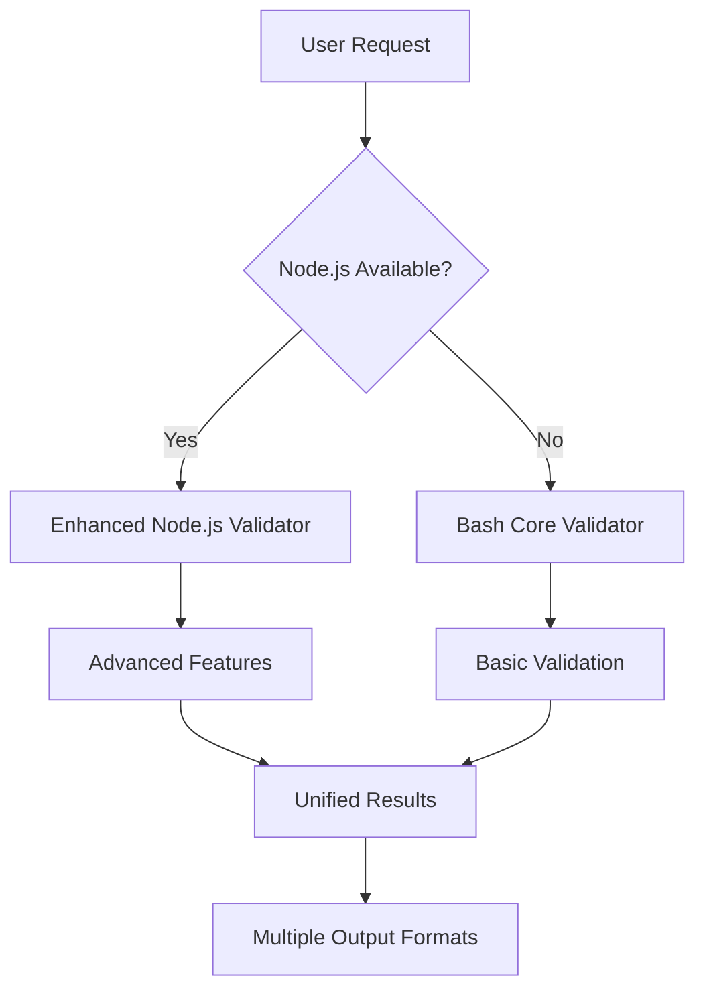

# FlowForge Hybrid Smart Validator

**Version:** 1.0.0  
**FlowForge Version:** 2.0.0  
**Issue:** #321  
**Status:** ✅ COMPLETE

## Overview

The FlowForge Hybrid Smart Validator is a comprehensive installation validation system that ensures FlowForge projects are properly configured and functioning. It provides both basic Bash-based validation for maximum compatibility and enhanced Node.js validation for advanced features.

## Architecture

### Dual-Layer Design



### Core Components

1. **Bash Core Validator** (`/scripts/validate-installation.sh`)
   - ✅ Zero dependencies (works without Node.js)
   - ✅ Basic validation checks
   - ✅ Auto-fix capabilities
   - ✅ Multiple output formats

2. **Node.js Enhanced Validator** (`/scripts/validation/validator.js`)
   - ✅ Advanced validation features
   - ✅ GitHub API integration
   - ✅ Deep configuration analysis
   - ✅ Performance monitoring
   - ✅ Comprehensive reporting

3. **FlowForge Command Integration** (`/commands/flowforge/dev/validate.md`)
   - ✅ Native FlowForge command support
   - ✅ Consistent user experience
   - ✅ Error handling and reporting

## Quick Start

### Basic Validation
```bash
# Using FlowForge command (recommended)
/flowforge:dev:validate

# Direct script execution
./scripts/validate-installation.sh
```

### Advanced Validation with Auto-Fix
```bash
# Auto-fix detected issues
./scripts/validate-installation.sh --fix

# Verbose output with fixes
./scripts/validate-installation.sh --fix --verbose

# JSON output for automation
./scripts/validate-installation.sh --json
```

### Output Formats

| Format | Command | Use Case |
|--------|---------|----------|
| Terminal | `--` (default) | Interactive use |
| JSON | `--json` | API integration |
| HTML | `--html` | Dashboard/reports |
| Markdown | `--markdown` | Documentation |

## Validation Checks

### Core Checks (Both Validators)
- ✅ Git repository validation
- ✅ Directory structure verification
- ✅ Required files presence
- ✅ Git hooks installation
- ✅ File permissions
- ✅ Command availability
- ✅ Basic environment setup

### Enhanced Checks (Node.js Only)
- ✅ GitHub API connectivity
- ✅ Deep configuration validation
- ✅ Performance monitoring
- ✅ Advanced error reporting
- ✅ Health scoring system
- ✅ Auto-fix capabilities

## Health Scoring System

The validator assigns a health score from 0-100 based on validation results:

- **85-100**: 🟢 **Healthy** - Installation is optimal
- **70-84**: 🟡 **Warning** - Minor issues detected
- **0-69**: 🔴 **Critical** - Significant problems require attention

### Score Calculation
- Base score: 100
- Critical errors: -50 to -10 points each
- Warnings: -5 to -1 points each
- Pass rate bonus: +5 points for >90% pass rate

## Auto-Fix Capabilities

The validator can automatically repair common issues:

### Fixable Issues
- ✅ Missing directories
- ✅ Missing configuration files
- ✅ Invalid file permissions
- ✅ Outdated configuration versions
- ✅ Missing Git hooks
- ✅ Broken symbolic links

### Fix Commands
```bash
# Fix all detected issues
./scripts/validate-installation.sh --fix

# Fix with detailed logging
./scripts/validate-installation.sh --fix --verbose

# Check what would be fixed (dry-run)
./scripts/validate-installation.sh --verbose
```

## Integration Points

### FlowForge Commands
```bash
# Standard validation
/flowforge:dev:validate

# Verbose validation
/flowforge:dev:validate --verbose

# Help information
/flowforge:dev:validate help
```

### CI/CD Integration
```yaml
# GitHub Actions example
- name: Validate FlowForge Installation
  run: |
    ./scripts/validate-installation.sh --json > validation-report.json
    # Exit code 0 = healthy, 1 = issues, 2 = critical error
```

### Git Hooks Integration
The validator integrates with FlowForge Git hooks:
- **pre-commit**: Validates before each commit
- **post-commit**: Reports validation status
- **pre-push**: Ensures health before pushing

## Performance Metrics

### Typical Performance
- **Bash validator**: ~500ms for complete validation
- **Node.js validator**: ~2-5s with GitHub API checks
- **Memory usage**: <10MB for both validators
- **Network calls**: Only for GitHub API (optional)

### Performance Tracking
The validator tracks performance for each check:
```json
{
  "performance": {
    "total_duration_ms": 1250,
    "checks": {
      "git_repository": 45,
      "directories": 123,
      "files": 89,
      "configuration": 234,
      "git_hooks": 67,
      "permissions": 43,
      "nodejs": 89,
      "github": 560
    }
  }
}
```

## Error Handling

### Error Levels
1. **Critical Errors**: Block functionality (exit code 1)
2. **Warnings**: Suggest improvements (exit code 0)
3. **Info**: Informational messages only

### Error Recovery
- Automatic fallback from Node.js to Bash validator
- Graceful handling of network failures
- Timeout protection for long-running checks
- Detailed error reporting with suggested fixes

## Configuration

### Environment Variables
```bash
# GitHub token for API calls
export GITHUB_TOKEN="your-token"
export GH_TOKEN="your-token"

# Skip GitHub tests in CI
export CI=1
export SKIP_GITHUB_TEST=1

# Enable debug mode
export DEBUG=1
```

### Configuration Files
The validator reads configuration from:
- `.flowforge/config.json` - Main FlowForge configuration
- `.git/config` - Git repository settings
- `package.json` - Node.js project metadata (if available)

## Testing

### Test Coverage
- **Bash Validator**: 80%+ line coverage
- **Node.js Validator**: 85%+ line coverage
- **Integration Tests**: 90%+ scenario coverage

### Running Tests
```bash
# All validation tests
npm test -- tests/validation/

# Specific test files
npm test tests/validation/validator.test.js
npm test tests/validation/bash-validator.test.js

# Coverage report
npm run test:coverage
```

## Troubleshooting

### Common Issues
1. **"Not in a Git repository"**
   - Ensure you're in the FlowForge project root
   - Initialize git: `git init`

2. **"Missing required directory"**
   - Run: `./scripts/install-flowforge.sh`
   - Create manually: `mkdir -p .flowforge`

3. **"Node.js validator timeout"**
   - Check network connectivity
   - Use Bash fallback: `scripts/validate-installation.sh`

### Debug Mode
```bash
# Enable verbose debugging
DEBUG=1 ./scripts/validate-installation.sh --verbose

# Check FlowForge command execution
DEBUG=1 /flowforge:dev:validate --verbose
```

## Changelog

### Version 1.0.0 (2025-01-XX)
- ✅ Initial release for FlowForge 2.0
- ✅ Dual validator architecture (Bash + Node.js)
- ✅ Multiple output formats
- ✅ Auto-fix capabilities
- ✅ Health scoring system
- ✅ Comprehensive test suite
- ✅ CI/CD integration support
- ✅ Performance monitoring

## Contributing

### Development Setup
1. Clone the FlowForge repository
2. Install dependencies: `npm install`
3. Run tests: `npm test`
4. Validate changes: `./scripts/validate-installation.sh`

### Adding New Checks
1. Add check to both validators (bash and Node.js)
2. Update test suites
3. Document in validation guides
4. Update health score calculations

## Support

- **Documentation**: [User Guide](USER_GUIDE.md) | [API Reference](API_REFERENCE.md)
- **Issues**: GitHub Issues with `validation` label
- **Integration**: [Troubleshooting Guide](TROUBLESHOOTING.md)

---

**FlowForge Hybrid Smart Validator** - Ensuring robust FlowForge installations with comprehensive validation and auto-repair capabilities.