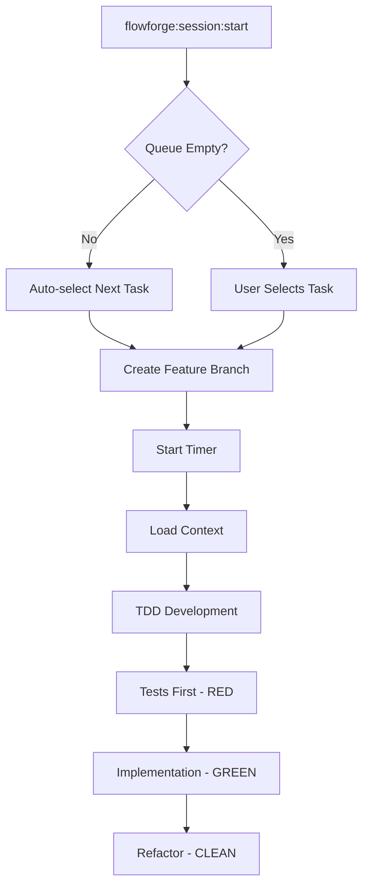
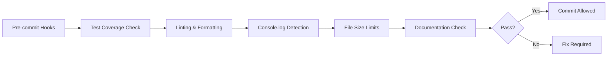

# FlowForge Vision: Taming the Wild Horse of AI Development

> "FlowForge is the saddle on the wild horse of AI development" - Enabling developers to harness AI power with 35 years of professional experience

## Executive Summary

FlowForge transforms the chaotic world of AI-assisted development into a structured, efficient, and profitable workflow. By combining intelligent automation, strict quality enforcement, and seamless team collaboration, FlowForge ensures developers spend 100% of their time creating value - not managing processes.

## Core Philosophy

### The Problem We Solve

AI development tools are powerful but untamed:
- **Context Loss**: AI forgets what it was doing between sessions
- **Quality Drift**: Without guardrails, code quality degrades
- **Time Leakage**: Untracked work means unpaid hours
- **Cognitive Overload**: Developers waste mental energy on process, not code
- **Team Chaos**: Multiple developers = exponential complexity

### Our Solution: The FlowForge Way

```
CHAOS → FLOWFORGE → PRODUCTIVITY
  ↓         ↓           ↓
Wild AI   Saddle    Controlled Power
```

## The FlowForge Manifesto

### 1. Time is Money - Always
- Every second of work is tracked automatically
- No timer running = No work happening
- Direct correlation: Time → Tickets → Invoices → Payment

### 2. Quality is Non-Negotiable
- 35 rules enforced automatically via git hooks
- 80% test coverage minimum
- No console.log in production
- Maximum 700 lines per file
- JSDoc documentation required

### 3. Zero Cognitive Load on Process
- Queue system knows what's next
- Automatic branch creation and naming
- Context preserved between sessions
- No manual task selection needed

### 4. AI Agents as Specialists
- Each agent is an expert in one domain
- Reduces hallucination through specialization
- Preserves context across sessions
- Orchestrated by the Maestro pattern

## The Perfect FlowForge Flow

### Phase 1: Planning & Architecture


**What Happens:**
1. User describes needed feature
2. `fft-architecture` creates 3 implementation approaches
3. User selects preferred approach
4. `fft-project-manager` breaks into micro-tasks
5. Tasks queued by priority/developer/milestone

### Phase 2: Development Cycle


**Zero-Friction Start:**
```bash
# Just this - nothing more needed!
flowforge:session:start

# Automatically:
# - Picks next task from YOUR queue
# - Creates branch: feature/142-command-consolidation
# - Starts timer for billing
# - Loads previous context
# - Shows task requirements
```

### Phase 3: Quality Assurance


**Automated Quality Gates:**
- Smoke tests run pre-commit (< 30 seconds)
- Full test suite in CI/CD
- AST-based console.log removal
- Automatic JSDoc generation prompts

### Phase 4: Review & Merge


### Phase 5: Continuous Flow
```bash
# End current session
flowforge:session:end "Completed user authentication"

# Context preserved in JSON
# Timer stopped, time logged
# Ready for next task

# New session - seamless continuation
flowforge:session:start
# Picks up exactly where you left off
```

## Technical Architecture

### Core Components

#### 1. Queue Management System
```typescript
interface QueueSystem {
  // Intelligent task selection
  getNextTask(context: DeveloperContext): Task
  
  // Multi-dimensional prioritization
  prioritize(factors: {
    milestone: string
    developer: string
    project: string
    urgency: number
    dependencies: Task[]
  }): Task[]
  
  // Concurrent operation support
  lockTask(taskId: string, developerId: string): boolean
  releaseTask(taskId: string): void
}
```

#### 2. Time Tracking Engine
```typescript
interface TimeTracker {
  // Automatic tracking
  start(taskId: string, developerId: string): Session
  pause(reason?: string): void
  resume(): void
  end(summary: string): TimeReport
  
  // Invoice generation
  generateInvoice(params: {
    client: string
    period: DateRange
    tasks: Task[]
  }): Invoice
}
```

#### 3. Agent Orchestration Framework
```typescript
interface AgentOrchestrator {
  // Maestro pattern implementation
  coordinate(agents: Agent[], task: Task): Promise<Result>
  
  // Context preservation
  preserveContext(session: Session): void
  loadContext(sessionId: string): Context
  
  // Specialization enforcement
  routeToSpecialist(request: Request): Agent
}
```

#### 4. Quality Enforcement System
```typescript
interface QualityGates {
  // Pre-commit validation
  preCommitChecks: Check[]
  
  // Real-time enforcement
  enforceRules(code: string): ValidationResult
  
  // Automatic fixes
  autoFix(issues: Issue[]): FixedCode
}
```

### Multi-Project Support Architecture

```yaml
projects:
  ios:
    type: swift
    queue: ios-queue
    developers: [dev1]
    rules: [swift-specific-rules]
    
  android:
    type: kotlin
    queue: android-queue
    developers: [dev2]
    rules: [kotlin-specific-rules]
    
  web:
    type: vue2
    queue: web-queue
    developers: [dev3, dev4, dev5, dev6]
    rules: [javascript-rules, vue-rules]
```

### Notion Integration Architecture

```typescript
interface NotionSync {
  // Bidirectional sync
  syncInterval: 30 // seconds
  
  // Field mapping
  fieldMap: {
    notion: 'Status'
    flowforge: 'status'
    transform: (value) => value.toLowerCase()
  }[]
  
  // Conflict resolution
  conflictStrategy: 'last-write-wins' | 'notion-wins' | 'flowforge-wins'
  
  // Workflow stages
  stages: ['Triage', 'Working', 'Review', 'Done']
}
```

## Success Metrics

### Developer Productivity
- **Before FlowForge**: 3-4 tickets/day
- **With FlowForge**: 8-10 tickets/day
- **Improvement**: 150-250% productivity gain

### Quality Metrics
- **Test Coverage**: Maintained at 80%+
- **Bug Rate**: Reduced by 75%
- **Code Review Time**: Reduced by 60%
- **Documentation**: 100% coverage

### Financial Impact
- **Time Tracking**: 100% accuracy
- **Invoice Generation**: Automated
- **Billable Hours**: +40% captured
- **Payment Delays**: Eliminated

### Team Scalability
- **Solo Developer**: Full productivity from day 1
- **Small Team (2-6)**: No coordination overhead
- **Large Team (6+)**: Linear scalability maintained

## Implementation Phases

### Phase 1: Foundation (Days 1-2)
- Core queue system restoration
- Commit time optimization (< 5 minutes)
- Console.log enforcement in agents
- Basic multi-project support

### Phase 2: Demo Ready (Days 3-4)
- Landing page with Stripe integration
- Visual time tracking dashboard
- Invoice generation demonstration
- Single developer perfect flow

### Phase 3: Team Features (Days 5-10)
- Full Notion integration
- Concurrent developer support
- Per-project queues
- Advanced conflict resolution

### Phase 4: Polish (Days 11-14)
- Performance optimization
- Edge case handling
- Documentation completion
- Team onboarding materials

## Risk Mitigation

### Technical Risks
1. **Commit Time Issues**
   - Solution: Parallel test execution
   - Fallback: Smoke tests only pre-commit

2. **Agent Hallucination**
   - Solution: Strict prompts and validation
   - Fallback: Human review triggers

3. **Queue Conflicts**
   - Solution: Optimistic locking
   - Fallback: Manual task assignment

### Adoption Risks
1. **Learning Curve**
   - Solution: Interactive onboarding
   - Fallback: Pair programming sessions

2. **Resistance to Change**
   - Solution: Show immediate time savings
   - Fallback: Gradual feature adoption

## The FlowForge Promise

> "We don't just build software - we build sustainable, profitable development practices"

### For Developers
- **Freedom**: Focus on code, not process
- **Fairness**: Every minute tracked and paid
- **Growth**: Learn from AI + 35 years experience
- **Quality**: Pride in professional output

### For Managers
- **Visibility**: Real-time progress tracking
- **Predictability**: Accurate delivery estimates
- **Quality**: Consistent professional standards
- **ROI**: 150%+ productivity improvement

### For Clients
- **Transparency**: See exactly what you're paying for
- **Speed**: 2x faster delivery
- **Quality**: Enterprise-grade code
- **Communication**: Automated progress updates

## Call to Action

FlowForge isn't just a tool - it's a revolution in how software gets built. By combining:
- The raw power of AI
- The wisdom of experienced developers
- The discipline of automated enforcement
- The efficiency of zero-friction workflows

We create a development environment where:
- **Every developer** reaches their full potential
- **Every hour** is productive and billable
- **Every line of code** meets professional standards
- **Every project** delivers on time and on budget

## Join the FlowForge Revolution

```bash
# Install FlowForge
npm install -g @flowforge/cli

# Start your first session
flowforge:session:start

# Experience the difference
# Watch your productivity soar
# Get paid for every minute
# Build better software, faster
```

---

**FlowForge: Where AI Power Meets Professional Discipline**

*Version 2.0 - The Future of Software Development is Here*